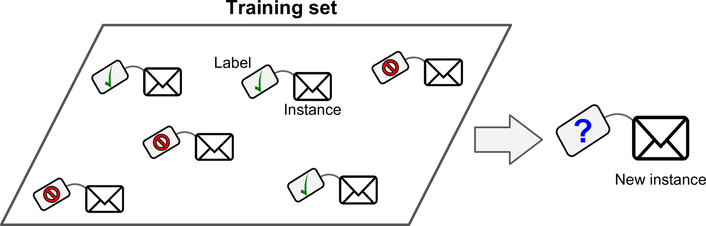
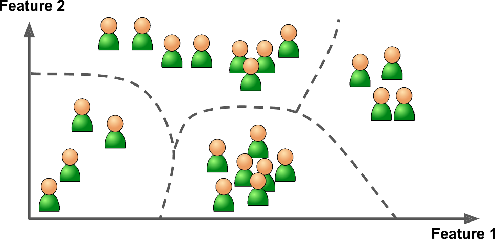
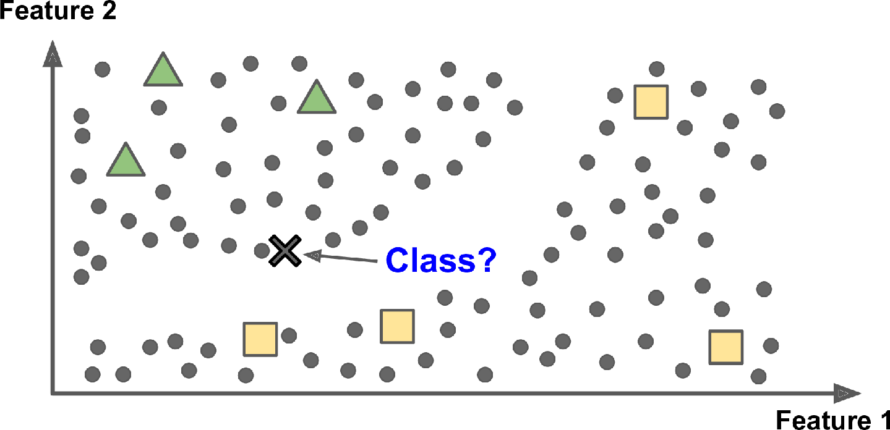
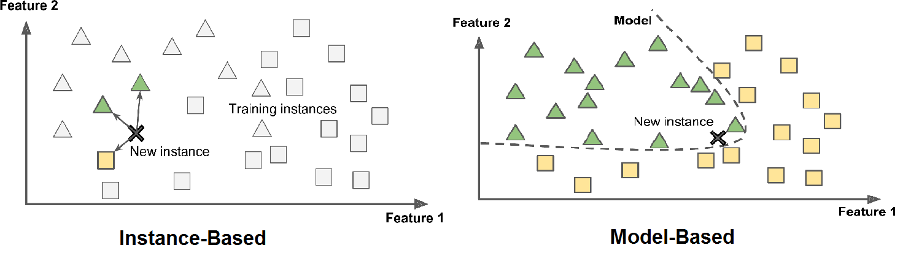

# Machine Learning

Machine learning has a wide range of applications in various industries, from healthcare to finance, and from natural language processing to computer vision. One of the primary advantages of machine learning is its ability to automatically learn and adapt to new data. This can make it a powerful tool for solving complex problems that are difficult or impossible to solve with traditional rule-based algorithms.

Unlike traditional rule-based algorithms, which rely on hand-crafted rules and heuristics, machine learning algorithms learn from data to automatically identify and extract patterns and relationships. This can make machine learning algorithms more accurate and robust, as they can adapt to new and changing data without the need for manual updates.

For example, in a fraud detection system, traditional rule-based algorithms might rely on a set of fixed rules and thresholds to flag suspicious activity. In contrast, a machine learning algorithm could learn from historical data to identify patterns and characteristics of fraudulent activity, and then use this knowledge to flag new instances of potential fraud.

Another example of the power of machine learning can be seen in natural language processing, where machine learning algorithms are used to extract meaning and sentiment from unstructured text data. Traditional rule-based approaches to natural language processing would require the development of a large set of rules and heuristics to account for the many nuances and variations in language. In contrast, machine learning algorithms can learn from large amounts of text data to automatically identify patterns and relationships, and make accurate predictions about sentiment or meaning.

Generally Machine Learning systems can be devided into some groups based on different criteria:
- Supervised Learning
- Unsupervised Learning
- Semi-supervised Learning
- Reinforcement Learning
- Batch Learning
- Online Learning
- Instance Based Learning
- Model Based Learning

__Supervised learning__ involves training a machine learning model using labeled data, where the desired output is already known. In supervised learning, the algorithm is trained on a set of input-output pairs, and the goal is to learn a general mapping from inputs to outputs, which can then be applied to new, unseen data. The algorithm can then be tested on a separate set of labeled data to evaluate its accuracy. Examples of supervised learning applications include image classification, speech recognition, and spam filtering.



__Unsupervised learning__, on the other hand, involves training a machine learning model on unlabeled data, where the desired output is not known. In unsupervised learning, the algorithm tries to find patterns and structure in the data without any prior knowledge of the output. The goal of unsupervised learning is to identify underlying relationships and structure in the data, which can then be used to make predictions or better understand the data. Examples of unsupervised learning applications include clustering, anomaly detection, and dimensionality reduction.

One key difference between supervised and unsupervised learning is the type of data that is used to train the model. In supervised learning, the algorithm is trained on labeled data, which requires the collection and labeling of a large amount of data. In contrast, unsupervised learning can be applied to unlabeled data, which is often more readily available.

Another difference between the two techniques is the type of problem that they are best suited for. Supervised learning is best suited for problems where there is a clear mapping between inputs and outputs, and where labeled data is available. In contrast, unsupervised learning is best suited for problems where the structure of the data is not well understood, or where there are no clear labels or categories.



__Semi-supervised__ learning is a machine learning technique that falls between supervised and unsupervised learning. It involves training a machine learning model on a small amount of labeled data and a large amount of unlabeled data. The goal of semi-supervised learning is to improve the performance of a model by leveraging the information contained in the unlabeled data, while still providing some labeled data for the model to learn from.

An example of semi-supervised learning is image classification, where the model is trained on a small number of labeled images, and a large number of unlabeled images. The labeled images provide some information about the different classes, while the unlabeled images provide additional information about the distribution of the data.

Compared to supervised learning, semi-supervised learning can be more efficient, as it requires less labeled data to achieve similar levels of performance. This is particularly useful in situations where labeled data is scarce or expensive to obtain.

Compared to unsupervised learning, semi-supervised learning can be more effective in tasks where the structure of the data is not well understood, as it leverages the information contained in the labeled data to guide the learning process.



__Reinforcement learning__ is a type of machine learning that focuses on training agents to make decisions by maximizing a reward signal. In this approach, the agent interacts with an environment and takes actions to maximize a reward signal, such as achieving a high score in a game or navigating a maze.

The agent learns through trial and error, as it receives feedback in the form of rewards or penalties based on its actions. Over time, the agent uses this feedback to update its strategy, with the goal of maximizing the long-term reward.

Reinforcement learning is used in a wide variety of applications, including robotics, game playing, and recommendation systems. For example, reinforcement learning can be used to train robots to navigate complex environments, or to optimize recommendations in an e-commerce system.

One of the key challenges in reinforcement learning is the exploration-exploitation trade-off. The agent must balance the need to explore new actions and learn from them, with the need to exploit its current knowledge to maximize the reward. This can be particularly challenging in complex environments with many possible actions.

Another challenge in reinforcement learning is the issue of credit assignment. The agent must determine which actions led to the reward signal, even if the reward is delayed or spread out over multiple actions. This requires sophisticated algorithms that can assign credit to actions based on their contribution to the overall reward.


__Batch learning__, also known as offline learning or batch processing, is a type of machine learning in which the algorithm processes a fixed dataset in a single pass, known as a batch. The model is trained on this dataset, and then deployed for use in making predictions or classifying new data.

In batch learning, the entire dataset is available for training, so the algorithm can take as much time as it needs to learn the relationships between the input features and the output variables. Once the model is trained, it is typically used to make predictions on new, unseen data.

One of the main advantages of batch learning is that it can be more accurate and precise than other types of machine learning, since it has access to the entire dataset. This can be particularly useful in applications where the dataset is relatively small, and the goal is to create the most accurate model possible.

However, batch learning can also be computationally expensive and time-consuming, especially for very large datasets. Additionally, since the model is trained on a fixed dataset, it may not be able to adapt to changes in the underlying data distribution over time.

__Online learning__, also known as incremental learning, is a type of machine learning in which the algorithm processes data instances one at a time, as they become available. The model is updated with each new data instance, allowing it to adapt to changes in the underlying data distribution over time.

In online learning, the model is typically trained using a stochastic gradient descent (SGD) algorithm, which updates the model's parameters based on the error between the predicted output and the true output. The algorithm is run on each new data instance, and the model is updated with the new parameters.

One of the main advantages of online learning is its ability to adapt to changes in the underlying data distribution over time. This can be particularly useful in applications where the data is changing rapidly or where it is impractical to retrain the model on the entire dataset.

Online learning is also generally faster and more computationally efficient than batch learning, since it processes data instances one at a time rather than in large batches.

However, online learning can also be more prone to overfitting, since the model is updated with each new data instance and may become too specialized to the training data. Additionally, online learning can be more sensitive to noise in the data, since it may update the model based on individual data instances that are not representative of the underlying data distribution.


__Instance-based learning__, also known as lazy learning, is a type of machine learning in which the model simply stores the training instances and classifies new instances based on their similarity to the training data.

In instance-based learning, the model does not try to learn a general rule or function that maps inputs to outputs. Instead, it simply memorizes the training data and uses it to classify new data points based on their similarity to the training data.

The main advantage of instance-based learning is its ability to handle complex, non-linear decision boundaries that may be difficult to capture with traditional rule-based or parametric models. Additionally, since the model does not make any assumptions about the underlying data distribution, it can be more robust to changes in the data or errors in the model specification.

However, instance-based learning can also be computationally expensive, since it requires storing and comparing each training instance to new data points. Additionally, since the model is based entirely on the training data, it can be more susceptible to overfitting and may not generalize well to new data.

__Model-based learning__ is a type of machine learning in which the model attempts to learn a general rule or function that maps inputs to outputs, rather than simply memorizing the training data as in instance-based learning.

In model-based learning, the model typically uses a pre-defined set of features or variables to represent the input data, and learns a function that relates those features to the target output. The model may be based on a particular parametric form (such as a linear regression model), or it may use a more flexible non-parametric approach (such as a decision tree or a neural network).

Compared to instance-based learning, model-based learning can be more computationally efficient, since the model only needs to learn a small set of parameters that represent the underlying relationships between the input and output variables. Additionally, because the model attempts to learn a general rule or function, it may be more interpretable and easier to understand than an instance-based model.

However, model-based learning may also be more susceptible to overfitting, particularly if the model is overly complex or the underlying data distribution is complex or poorly understood. Additionally, the model may be limited by the set of features or variables used to represent the input data, and may not be able to capture more complex or subtle relationships in the data.

In general, the choice between instance-based and model-based learning depends on the specific characteristics of the problem and the data. Instance-based learning may be more appropriate for complex, non-linear problems where the decision boundary is difficult to define, while model-based learning may be more appropriate for problems where the underlying relationships between the input and output variables are well understood and can be represented with a small set of features or parameters.



# Main challenges in Machine Learning

1. __Insufficient quantity__ of training data is a major challenge in machine learning, particularly for complex problems that require large amounts of data to learn the underlying patterns and relationships in the data. Without enough data, the model may be prone to overfitting, where it memorizes the training data rather than learning a generalizable rule or function. This can result in poor performance on new, unseen data. In some cases, it may be possible to augment the existing training data with synthetic data or transfer learning techniques, but in general, collecting more high-quality data is the most effective way to address this challenge. However, collecting and labeling large amounts of data can be time-consuming, expensive, and impractical in some domains, highlighting the need for efficient and effective data collection and labeling strategies.

2. __Poor quality__ data can be a significant challenge in machine learning, particularly when the data contains __outliers, missing values, or irrelevant features__. Outliers are values that are significantly different from other data points in the dataset, and they can skew the results of a machine learning model, causing it to learn patterns that do not generalize well to new data. Missing values can also be a problem, as they may prevent the model from learning important patterns in the data. Irrelevant features, on the other hand, can lead to overfitting, where the model learns to fit the noise in the data rather than the underlying patterns. To address these challenges, it is important to carefully preprocess the data, identifying and either removing or imputing missing values, removing outliers, and selecting only the most relevant features. Additionally, it is important to evaluate the performance of the model on new data and adjust the preprocessing and feature selection as needed to ensure that the model performs well on new data.

3. __Overfitting__ is a common challenge in machine learning where a model learns the noise or random fluctuations in the training data instead of the underlying patterns or relationships. This can lead to poor generalization performance, where the model performs well on the training data but poorly on new, unseen data. Overfitting can occur when the model is too complex relative to the amount of available training data or when the model is trained for too long. To prevent overfitting, various techniques can be employed, such as regularizing the model to reduce the number of parameters or using early stopping during training to prevent the model from learning the noise in the data. Cross-validation can also be used to evaluate the model's generalization performance and adjust the model as needed to prevent overfitting.

4. __Underfitting__ is another common challenge in machine learning where a model is too simple to capture the underlying patterns or relationships in the data. This can lead to poor performance on both the training data and new, unseen data. Underfitting can occur when the model is too simple relative to the complexity of the data or when the model is not trained for long enough. Compared to overfitting, underfitting occurs when the model is not able to capture enough of the underlying patterns in the data, whereas overfitting occurs when the model is too complex and captures noise in the data instead of the underlying patterns. Techniques to address underfitting include using a more complex model or increasing the training time or the amount of available training data.

# Developing Machine Learning Models

Testing and validating machine learning models is an important step in the development process to ensure that the model is performing well and making accurate predictions on new, unseen data. In general, the testing and validation workflow involves dividing the available data into training, validation, and testing sets. The training set is used to train the model, the validation set is used to optimize the hyperparameters of the model, and the testing set is used to evaluate the performance of the final, trained model.

The training set is used to fit the model to the data by adjusting the model parameters, such as the weights in a neural network, to minimize the error on the training data. However, using the training set alone to evaluate the model can lead to overfitting, where the model performs well on the training data but poorly on new, unseen data. This is why the validation set is used to fine-tune the model by adjusting the hyperparameters, such as the learning rate or regularization strength, to optimize the model's performance on the validation set.

Once the model has been trained and optimized using the validation set, it is evaluated on the testing set to estimate the model's performance on new, unseen data. The testing set is used to simulate the real-world scenario where the model is applied to new, previously unseen data. The testing set is also useful for comparing the performance of different models and selecting the best model for the task at hand.

To further ensure the reliability of the testing and validation results, it is important to ensure that the data is divided randomly into the training, validation, and testing sets. This ensures that the data in each set is representative of the underlying distribution of the data, and that the results are not biased by any systematic differences between the data in each set.

Moreover, hyperparameter tuning and model selection are important aspects of the machine learning workflow that involve finding the optimal set of hyperparameters and selecting the best model for a given task. Hyperparameters are parameters of the learning algorithm that are not learned from the data and must be set by the user. Examples of hyperparameters include the learning rate in neural networks, the number of trees in a random forest, and the penalty parameter in support vector machines.

Hyperparameter tuning involves selecting the optimal values of hyperparameters for a given model architecture. There are several approaches to hyperparameter tuning, including manual tuning, grid search, random search, and Bayesian optimization. In manual tuning, the user manually adjusts the hyperparameters based on trial and error. In grid search, the user specifies a grid of hyperparameters and the algorithm tests each combination of hyperparameters to find the best combination. In random search, the algorithm randomly selects a set of hyperparameters to test. In Bayesian optimization, the algorithm uses a probabilistic model to predict the performance of different sets of hyperparameters and selects the set with the highest predicted performance.

Model selection involves choosing the best model architecture for a given task. There are several approaches to model selection, including cross-validation, bootstrap aggregation, and ensemble methods. In cross-validation, the data is partitioned into several subsets, and each subset is used as a validation set to test the model. This process is repeated several times with different subsets used for validation, and the performance of the model is averaged over all the iterations. Bootstrap aggregation involves creating several bootstrap samples of the data and training a model on each sample. The predictions of each model are combined to produce a final prediction. Ensemble methods involve combining multiple models to produce a final prediction. Examples of ensemble methods include bagging, boosting, and stacking.

# Scikit-learn
Scikit-learn is a popular machine learning library in Python that provides efficient tools for data analysis and modeling. It is built on top of NumPy, SciPy, and matplotlib and is widely used for developing machine learning models in Python. Scikit-learn provides a range of supervised and unsupervised learning algorithms, including classification, regression, clustering, and dimensionality reduction. It also includes a range of tools for model selection, data preprocessing, and data visualization. Scikit-learn is designed to be simple and efficient, with a consistent API that makes it easy to use in a wide range of applications. It is widely used in academia, industry, and government, and has a large and active community of users and developers.


## Package Design
The package is built around the notion of *estimators*, which are objects that encapsulate the learning algorithms used in the various types of models. Estimators provide a consistent and standardized interface for fitting, predicting, and evaluating models. This design philosophy makes it easy to switch between different models and to experiment with different algorithms without having to change the code that uses them.

In addition to the core estimator objects, Scikit-learn also provides a number of utility classes and functions for data preprocessing, feature selection, cross-validation, and model evaluation. These building blocks can be combined into complex workflows using the package's pipeline object, which provides a way to chain together different preprocessing and modeling steps into a single object that can be fit and used in the same way as any other estimator. The pipeline object makes it easy to encapsulate the entire modeling process, from data preprocessing to model selection, in a single object that can be easily reused and shared.

- **Estimator** 

any object that can estimate some parameters based on a dataset. Estimators may fit data or transform data or do both. All estimators in scikit-learn implement the `fit()` method to learn from data. Some also have a `transform()` method to apply what they have learned to new data, and others have a `predict()` method to make predictions based on the learned model. Examples of estimators in scikit-learn include classifiers, regressors, clustering algorithms, and transformers.

- **Transformers** 

are objects that can preprocess data before it is fed to an estimator for training. They can perform a variety of tasks, such as imputing missing values, scaling data, encoding categorical variables, etc. Transformers in scikit-learn typically have a `fit` method, which learns any parameters needed for transformation, and a `transform` method, which applies the learned transformation to new data. In some cases, transformers may also have a `fit_transform` method, which combines the fit and `transform` steps into a single method call.

Transformers are an essential part of the scikit-learn API, and are often used in conjunction with other estimator objects (such as classifiers or regressors) to create complex data processing pipelines. By using transformers to preprocess data, it is possible to reduce the amount of code needed to prepare data for analysis and make it easier to build and iterate on machine learning models.

- **Predictors**

is a type of estimator that is capable of making predictions on new data using a `predict()` method. Predictors are typically models that have been fit on training data and are now used to make predictions on unseen test data. They are also known as predictive models.

Examples of predictors in scikit-learn include regression models, such as `LinearRegression, Ridge, and Lasso`, as well as classification models, such as `LogisticRegression, SVC, and RandomForestClassifier`.

To use a predictor in scikit-learn, you first need to train it on some training data using the `fit()` method, which estimates the model parameters from the training data. Once the model has been trained, you can use the `predict()` method to make predictions on new data. The `score()` method can also be used to evaluate the performance of the predictor on test data, using metrics such as accuracy, precision, and recall.

- **Inspection**

We can access to the estimator's hyperparameters via public instance variables. For example: `imputer.strategy`

All estimator's learned parameters are accessiable via public instance variables with an underscore suffix. For example: `imputer.statistics_`

## Splinting a dataset to train, validation, and test sets


```python
from sklearn.model_selection import train_test_split
import pandas as pd

# Load your dataset
dataset = pd.read_csv('path/to/dataset.csv')

# Split dataset into training and testing sets
X_train, X_test, y_train, y_test = train_test_split(
    dataset.drop('target_variable', axis=1), 
    dataset['target_variable'], 
    test_size=0.3, 
    random_state=42
)

# Split training set further into training and validation sets
X_train, X_val, y_train, y_val = train_test_split(
    X_train, 
    y_train, 
    test_size=0.2, 
    random_state=42
)
```

In this example, we first load our dataset into a pandas dataframe. Then we use train_test_split() function twice. The first time we use it to split the entire dataset into training and testing sets with a ratio of 70:30. Then, we use it a second time to split the training set into a new training set and a validation set with a ratio of 80:20. The arguments test_size and random_state specify the size of the testing set and the random seed for the randomization, respectively.

Once you have these splits, you can use the training set to fit your machine learning model, the validation set to tune hyperparameters and select the best model, and the testing set to evaluate the final performance of your model.

**Note**: Statistical analysis and exploratory data analysis (EDA) are important steps in the machine learning process, and they should be performed before data splitting to train and test sets.

After splitting the data into train and test sets, the data scientist can perform further statistical analysis and EDA on each set separately to gain a better understanding of the data and identify any issues that may arise during the modeling phase. This can help identify problems such as overfitting, underfitting, or bias in the data, which can be addressed through appropriate data preprocessing or modeling techniques.

**Note**: It is generally recommended to perform data cleaning and preprocessing before splitting the data into training and test sets in machine learning. This is because the goal of splitting the data is to evaluate how well the model generalizes to new, unseen data. If data cleaning and preprocessing is done after the split, information from the test set may leak into the training set and artificially inflate the model's performance.

Data cleaning involves identifying and correcting or removing any errors or inconsistencies in the data, such as missing values or outliers. Data preprocessing involves transforming the data into a format that is suitable for modeling. This can involve scaling, normalization, encoding categorical variables, and other transformations.

Performing these steps before the split ensures that the training and test sets are representative of the same underlying distribution of data. It is also important to perform the same data cleaning and preprocessing steps on both the training and test sets to ensure that the model is not biased towards one set.

## Data cleaning and preprocessing
Some of the most common data preprocessing steps are listed as follows. Some of them are discussed and illustrated how to perform them in previous lectures using Numpy and Pandas or identify them using visualization with matplotlib and seaborn. In the following notebooks, methods that are not discussed yet will be surveyed using scikit-learn package.

1. Removing duplicates: check for and remove any duplicate data points
2. Handling missing values: identify missing values and decide whether to impute or remove them
3. Handling outliers: identify outliers and decide whether to remove them or treat them as a separate group
4. Normalization/Scaling: scale the data to have equal variances and reduce the impact of large or small values
5. Encoding: convert categorical data to numerical data
6. Feature selection: identify and select the most relevant features for the model
7. Feature engineering: create new features that might help the model
8. Text preprocessing: convert raw text data into a format suitable for analysis (e.g. tokenization, stemming, and stop word removal)

### Imputing


```python
from sklearn.impute import SimpleImputer
import numpy as np

# Example dataset with missing values
X = np.array([[1, 2, np.nan], [3, np.nan, 5], [np.nan, 7, 8]])

# Create SimpleImputer object with mean imputation
imputer = SimpleImputer(strategy='mean')

# Fit the imputer object to the data
imputer.fit(X)

# Transform the data by imputing missing values
X_imputed = imputer.transform(X)

print(X_imputed)
```

    [[1.  2.  6.5]
     [3.  4.5 5. ]
     [2.  7.  8. ]]
    

In this example, the SimpleImputer object is created with a strategy parameter of 'mean', which means that it will impute missing values with the mean value of each feature. The fit() method is called to calculate the mean value for each feature, and then the transform() method is called to replace missing values with the corresponding mean values. The resulting X_imputed array contains the original data with the missing values replaced by the mean value of each feature. You can read more about imputation in [here](https://scikit-learn.org/stable/modules/impute.html).

### Encoding

- Ordinal Encoder: This encoder is used when the categorical features have an order (such as low, medium, high) and we want to preserve that order in the encoded features. It maps the categories to integer values ranging from 0 to n_categories-1.

- One Hot Encoder: This encoder is used when the categorical features do not have any order (such as red, green, blue) and we want to create binary features for each category. It creates a binary feature for each category and assigns a value of 1 to the corresponding feature for each data point, and 0 to all other features.

You can read more about encoding in [here](https://scikit-learn.org/stable/modules/classes.html#module-sklearn.preprocessing).


```python
import pandas as pd
from sklearn.preprocessing import OrdinalEncoder, OneHotEncoder

# Create a sample dataset
data = pd.DataFrame({'Color': ['Red', 'Blue', 'Green', 'Red', 'Green'], 'Size': ['S', 'L', 'M', 'XL', 'S']})

# Ordinal encoding for Size feature
size_encoder = OrdinalEncoder()
data['Size_ordinal'] = size_encoder.fit_transform(data[['Size']])

# One Hot encoding for Color feature
color_encoder = OneHotEncoder()
color_encoded = color_encoder.fit_transform(data[['Color']])
data[['Color_' + category for category in color_encoder.categories_[0]]] = color_encoded.toarray()

data
```


<div>
<style scoped>
    .dataframe tbody tr th:only-of-type {
        vertical-align: middle;
    }

    .dataframe tbody tr th {
        vertical-align: top;
    }

    .dataframe thead th {
        text-align: right;
    }
</style>
<table border="1" class="dataframe">
  <thead>
    <tr style="text-align: right;">
      <th></th>
      <th>Color</th>
      <th>Size</th>
      <th>Size_ordinal</th>
      <th>Color_Blue</th>
      <th>Color_Green</th>
      <th>Color_Red</th>
    </tr>
  </thead>
  <tbody>
    <tr>
      <th>0</th>
      <td>Red</td>
      <td>S</td>
      <td>2.0</td>
      <td>0.0</td>
      <td>0.0</td>
      <td>1.0</td>
    </tr>
    <tr>
      <th>1</th>
      <td>Blue</td>
      <td>L</td>
      <td>0.0</td>
      <td>1.0</td>
      <td>0.0</td>
      <td>0.0</td>
    </tr>
    <tr>
      <th>2</th>
      <td>Green</td>
      <td>M</td>
      <td>1.0</td>
      <td>0.0</td>
      <td>1.0</td>
      <td>0.0</td>
    </tr>
    <tr>
      <th>3</th>
      <td>Red</td>
      <td>XL</td>
      <td>3.0</td>
      <td>0.0</td>
      <td>0.0</td>
      <td>1.0</td>
    </tr>
    <tr>
      <th>4</th>
      <td>Green</td>
      <td>S</td>
      <td>2.0</td>
      <td>0.0</td>
      <td>1.0</td>
      <td>0.0</td>
    </tr>
  </tbody>
</table>
</div>


### Pipelines

In scikit-learn, a pipeline is a way to string together multiple processing steps, into a single unit, that can be treated as a scikit-learn estimator. It allows you to specify the data preparation and modeling pipeline with a sequence of data transformation steps followed by the final estimator.

In a typical machine learning workflow, data preprocessing can often include various steps, such as scaling, normalization, imputation, and feature engineering, among others. Similarly, the modeling part may also involve different algorithms, hyperparameters, and evaluation metrics. In such cases, pipelines provide a convenient way to organize these steps in a clear and modular way, while also making it easy to manage the different intermediate steps and ensure the consistency of the workflow.

The main advantage of using pipelines is that it allows for easier and more streamlined workflows. Rather than manually performing each step in the process and keeping track of the intermediate steps, pipelines allow you to automate the entire process in one go. Additionally, it allows you to optimize the entire workflow as a single unit, which can be more effective than optimizing individual steps separately. Overall, pipelines can help simplify your code, make your analysis more reproducible, and reduce the chances of data leakage, as well as making your code more modular and easier to maintain.


```python
from sklearn.pipeline import Pipeline
from sklearn.impute import SimpleImputer
from sklearn.preprocessing import StandardScaler
from sklearn.decomposition import PCA

# Define the custom pipeline
custom_pipeline = Pipeline([
    ('imputer', SimpleImputer(strategy='median')),
    ('scaler', StandardScaler()),
    ('pca', PCA(n_components=10)),
])

# Train the custom pipeline on the data
preprocessed_data = custom_pipeline.fit_transform(dataset)
```

### Column Transformers

It is a class that is used to selectively apply transformers to different columns or subsets of columns of a given dataset. It enables us to apply different transformations to different subsets of the input data, based on the column names or indices. This can be useful when working with datasets that have columns with different data types or units of measurement, and each subset requires a different kind of transformation.

Suppose we have a dataset that contains both numeric and categorical features. We want to apply different preprocessing to the numeric and categorical features before fitting a machine learning model. We can use ColumnTransformer to apply the appropriate transformations to each subset of features.


```python
from sklearn.compose import ColumnTransformer
from sklearn.pipeline import Pipeline
from sklearn.impute import SimpleImputer
from sklearn.preprocessing import StandardScaler, OneHotEncoder
from sklearn.ensemble import RandomForestClassifier

# Define numeric and categorical features
numeric_features = ['age', 'income']
categorical_features = ['gender', 'occupation']

# Define preprocessing steps for each subset of features
numeric_transformer = Pipeline(steps=[
    ('imputer', SimpleImputer(strategy='median')),
    ('scaler', StandardScaler())])

categorical_transformer = Pipeline(steps=[
    ('imputer', SimpleImputer(strategy='most_frequent')),
    ('onehot', OneHotEncoder(handle_unknown='ignore'))])

# Combine the preprocessing steps using ColumnTransformer
preprocessor = ColumnTransformer(transformers=[
    ('num', numeric_transformer, numeric_features),
    ('cat', categorical_transformer, categorical_features)])

# Define the machine learning model
clf = Pipeline(steps=[('preprocessor', preprocessor),
                      ('classifier', RandomForestClassifier())])

# Fit the model using the preprocessed data
X_train = ...
y_train = ...
clf.fit(X_train, y_train)

# Use the model to make predictions on new data
X_test = ...
y_pred = clf.predict(X_test)
```

# Refrences
- Hands on ML book by O'Reilly
