```python
import matplotlib.pyplot as plt
import numpy as np
import seaborn as sns
```


```python
# because the default is the line style '-', 
# nothing will be shown if we only pass in one point (3,2)
plt.plot(3, 2)
```


    [<matplotlib.lines.Line2D at 0x226149a1ac0>]


    
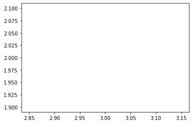
    


```python
# we can pass in '.' to plt.plot to indicate that we want
# the point (3,2) to be indicated with a marker '.'
plt.plot(3, 2, '.')
```


    [<matplotlib.lines.Line2D at 0x22614a18730>]


    

    


```python
# create a new figure
plt.figure()

# plot the point (3,2) using the circle marker
plt.plot(3, 2, 'o')

# get the current axes
ax = plt.gca()

# Set axis properties [xmin, xmax, ymin, ymax]
ax.axis([0,6,0,10])
```


    (0.0, 6.0, 0.0, 10.0)


    
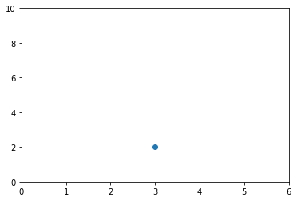
    


### Scatterplots


```python
import numpy as np

x = np.array([1,2,3,4,5,6,7,8])
y = x

plt.figure()
plt.scatter(x, y) # similar to plt.plot(x, y, '.'), but the underlying child objects in th
```


    <matplotlib.collections.PathCollection at 0x22614ae8cd0>


    
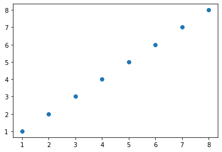
    


```python
import numpy as np

x = np.array([1,2,3,4,5,6,7,8])
y = x

# create a list of colors for each point to have
# ['green', 'green', 'green', 'green', 'green', 'green', 'green', 'red']
colors = ['green']*(len(x)-1)
colors.append('red')

plt.figure()

# plot the point with size 100 and chosen colors
plt.scatter(x, y, s=100, c=colors)
```


    <matplotlib.collections.PathCollection at 0x22614b5e9a0>


    

    


```python
zip_generator = zip([1,2,3,4,5], [6,7,8,9,10])
# let's turn the data back into 2 lists
x, y = zip(*zip_generator) # This is like calling zip((1, 6), (2, 7), (3, 8), (4, 9), (5, 10))
print(x)
print(y)

# plot a data series in red using the first two elements of x and y
plt.scatter(x[:2], y[:2], s=100, c='red', label='type 1')
# plot a second data series in blue using the last three elements of x and y 
plt.scatter(x[2:], y[2:], s=100, c='blue', label='type 2')


# add a label to the x axis
plt.xlabel('The number of times the child kicked a ball')
# add a label to the y axis
plt.ylabel('The grade of the student')
# add a title
plt.title('Relationship between ball kicking and grades')

# add the legend to loc=4 (the lower right hand corner), also gets rid of the frame and adds a title
plt.legend(loc=4, frameon=False, title='Legend')

```

    (1, 2, 3, 4, 5)
    (6, 7, 8, 9, 10)
    


    <matplotlib.legend.Legend at 0x22615b71f10>


    
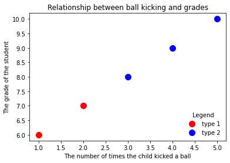
    


### Line plots


```python
import numpy as np

linear_data = np.array([1,2,3,4,5,6,7,8])
exponential_data = linear_data**2

plt.figure()
# plot the linear data and the exponential data
plt.plot(list(range(1,9)), linear_data, '-o', list(range(1,9)), exponential_data, '-o')
```


    [<matplotlib.lines.Line2D at 0x22615c05fa0>,
     <matplotlib.lines.Line2D at 0x22615c130a0>]


    
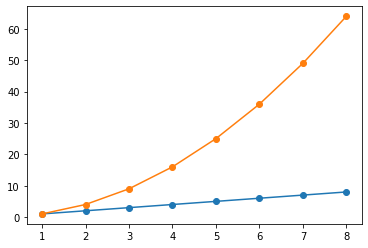
    


```python
# plot another series with a dashed red line
plt.plot([22,44,55], '--r')
```


    [<matplotlib.lines.Line2D at 0x22615c77400>]


    
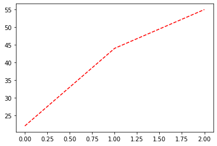
    


```python
plt.figure()
plt.plot(list(range(1,9)), linear_data, '-o', list(range(1,9)), exponential_data, '-o')

# fill the area between the linear data and exponential data
plt.gca().fill_between(range(1, len(linear_data) + 1), 
                       linear_data, exponential_data, 
                       facecolor='blue', 
                       alpha=0.5)
```


    <matplotlib.collections.PolyCollection at 0x22615cebb50>


    
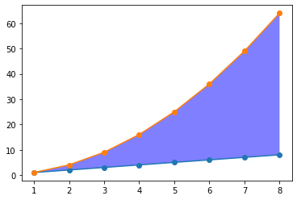
    


```python
import pandas as pd

plt.figure()
observation_dates = np.arange('2017-01-01', '2017-01-09', dtype='datetime64[D]')
observation_dates = list(map(pd.to_datetime, observation_dates)) # trying to plot a map will result in an error
plt.plot(observation_dates, linear_data, '-o',  observation_dates, exponential_data, '-o')

x = plt.gca().xaxis

# rotate the tick labels for the x axis
for item in x.get_ticklabels():
    item.set_rotation(45)

# adjust the subplot so the text doesn't run off the image
plt.subplots_adjust(bottom=0.25)

ax = plt.gca()
ax.set_xlabel('Date')
ax.set_ylabel('Units')
ax.set_title("Exponential ($x^2$) vs. Linear ($x$) performance")
```


    Text(0.5, 1.0, 'Exponential ($x^2$) vs. Linear ($x$) performance')


    
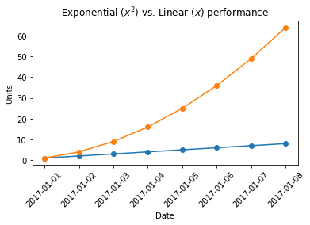
    


### Bar Charts


```python
plt.figure()
xvals = range(len(linear_data))
plt.bar(xvals, linear_data, width = 0.3)

new_xvals = []

# plot another set of bars, adjusting the new xvals to make up for the first set of bars plotted
for item in xvals:
    new_xvals.append(item+0.3)

plt.bar(new_xvals, exponential_data, width = 0.3 ,color='red')

from random import randint
linear_err = [randint(0,15) for x in range(len(linear_data))] 

# This will plot a new set of bars with errorbars using the list of random error values
plt.bar(xvals, linear_data, width = 0.3, yerr=linear_err)
```


    <BarContainer object of 8 artists>


    
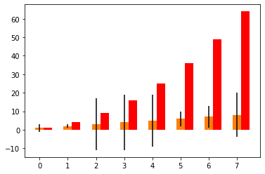
    


```python
# stacked bar charts are also possible
plt.figure()
xvals = range(len(linear_data))
plt.bar(xvals, linear_data, width = 0.3, color='b')
plt.bar(xvals, exponential_data, width = 0.3, bottom=linear_data, color='r')
```


    <BarContainer object of 8 artists>


    
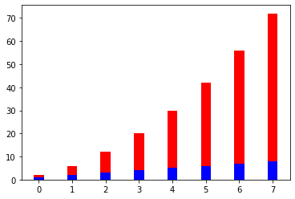
    


```python
# or use barh for horizontal bar charts
plt.figure()
xvals = range(len(linear_data))
plt.barh(xvals, linear_data, height = 0.3, color='b')
plt.barh(xvals, exponential_data, height = 0.3, left=linear_data, color='r')
```


    <BarContainer object of 8 artists>


    
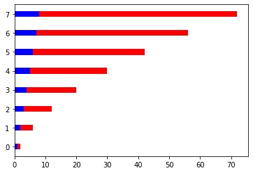
    


### Subplots


```python
plt.figure()
# subplot with 1 row, 2 columns, and current axis is 1st subplot axes
plt.subplot(1, 2, 2)

linear_data = np.array([1,2,3,4,5,6,7,8])

plt.plot(linear_data, '-o')

exponential_data = linear_data**3 

# subplot with 1 row, 2 columns, and current axis is 2nd subplot axes
plt.subplot(1, 2, 2)
plt.plot(exponential_data, '-o')

# plot exponential data on 1st subplot axes
plt.subplot(1, 2, 1)
plt.plot(exponential_data, '-x')
```


    [<matplotlib.lines.Line2D at 0x22615fdbeb0>]


    

    


```python
plt.figure()
ax1 = plt.subplot(1, 2, 1)
plt.plot(linear_data, '-o')
# pass sharey=ax1 to ensure the two subplots share the same y axis
ax2 = plt.subplot(1, 2, 2, sharey=ax1)
plt.plot(exponential_data, '-x')
```


    [<matplotlib.lines.Line2D at 0x22616092c10>]


    
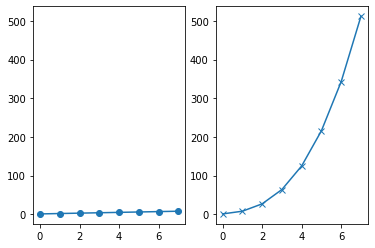
    


```python
plt.figure()
# the right hand side is equivalent shorthand syntax
plt.subplot(1,2,1) == plt.subplot(121)
```


    True


    
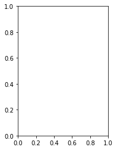
    


```python
# create a 3x3 grid of subplots
fig, ax = plt.subplots(3, 3, sharex=True, sharey=True)
# plot the linear_data on the 5th subplot axes 
ax[1][1].plot(linear_data, '-')
```


    [<matplotlib.lines.Line2D at 0x22616337430>]


    
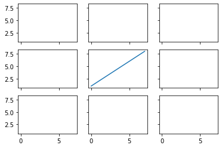
    


```python
x = np.linspace(0, 2, 100)

fig = plt.figure(figsize=(10, 8))
fig.suptitle('A figure with subplots', fontsize=16)

ax_1 = fig.add_axes([0, 0, 1, 0.4])
ax_2 = fig.add_axes([0, 0.5, 0.4, 0.4])
ax_3 = fig.add_axes([0.5, 0.5, 0.5, 0.4])

ax_1.plot(x, x, label='linear')
ax_2.plot(x, x**2, label='quadratic')
ax_3.plot(x, x**3, label='cubic')

ax_1.set_xlabel('x')
ax_2.set_ylabel('y')
ax_3.set_title('Comparison')

ax_2.legend(loc='best')
```


    <matplotlib.legend.Legend at 0x22616417100>


    
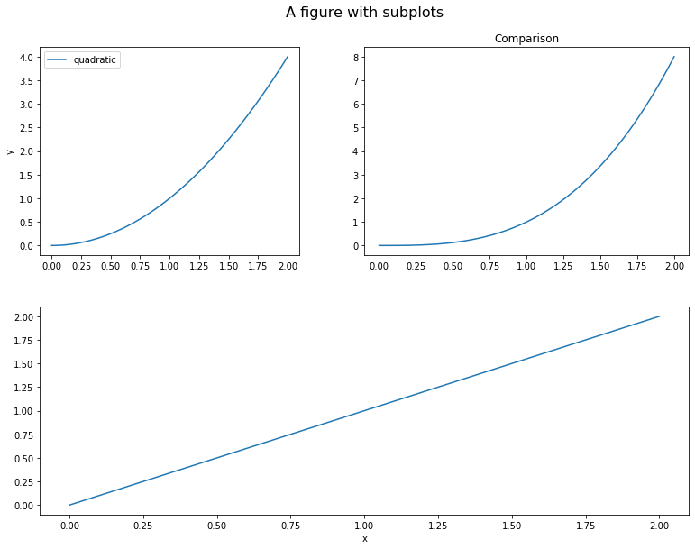
    


```python
x = np.linspace(0, 2, 100)

fig = plt.figure(figsize=(10, 8))

ax_1 = fig.add_axes([0, 0, 1, 1])
ax_2 = fig.add_axes([0.1, 0.5, 0.4, 0.4])

ax_1.plot(x, x**2, label='quadratic', color='orange', linestyle='dashed')
ax_1.text(1.3, 1.5, r"$y=x^2$", fontsize=20, color="orange")
ax_1.grid(True)

ax_2.plot(x, x, label='linear')
ax_2.plot(x, x**2, label='quadratic')
ax_2.plot(x, x**3, label='cubic')

ax_1.set_xlabel('x')
ax_1.set_ylabel('y')

ax_1.legend(loc='best')
ax_2.legend(loc='best')
```


    <matplotlib.legend.Legend at 0x2261493e280>


    
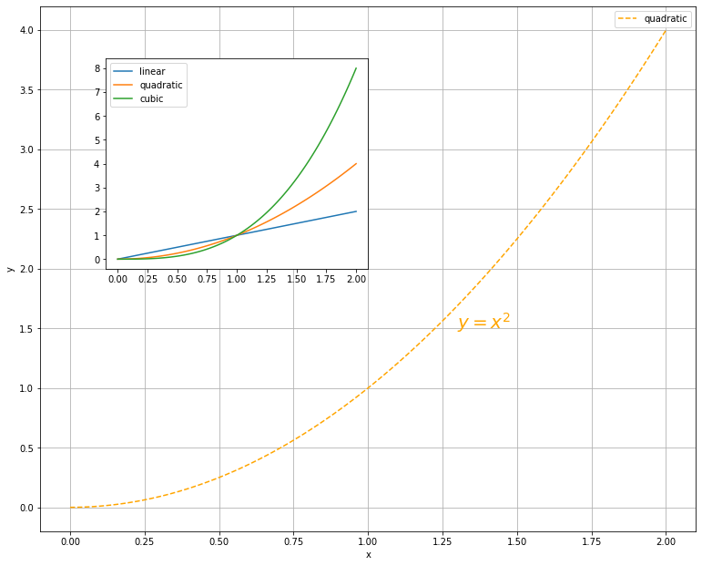
    


### Histograms


```python
# create 2x2 grid of axis subplots
fig, ((ax1, ax2), (ax3, ax4)) = plt.subplots(2, 2, sharex=True)
axs = [ax1,ax2,ax3,ax4]

# draw n = 10, 100, 1000, and 10000 samples from the normal distribution and plot corresponding histograms
for n in range(0,len(axs)):
    sample_size = 10**(n+1)
    sample = np.random.normal(loc=0.0, scale=1.0, size=sample_size)
    axs[n].hist(sample)
    axs[n].set_title('n={}'.format(sample_size))
```


    
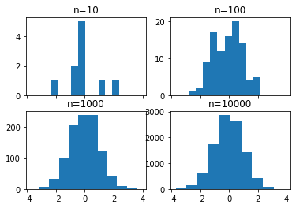
    


```python
# repeat with number of bins set to 100
fig, ((ax1, ax2), (ax3, ax4)) = plt.subplots(2, 2, sharex=True)
axs = [ax1,ax2,ax3,ax4]

for n in range(0,len(axs)):
    sample_size = 10**(n+1)
    sample = np.random.normal(loc=0.0, scale=1.0, size=sample_size)
    axs[n].hist(sample, bins=100)
    axs[n].set_title('n={}'.format(sample_size))
```


    
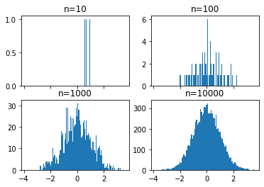
    


```python
plt.figure()
Y = np.random.normal(loc=0.0, scale=1.0, size=10000)
X = np.random.random(size=10000)
plt.scatter(X,Y)
```


    <matplotlib.collections.PathCollection at 0x226171d6f10>


    
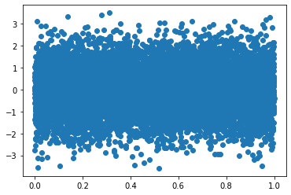
    


```python
# use gridspec to partition the figure into subplots
import matplotlib.gridspec as gridspec

plt.figure()
gspec = gridspec.GridSpec(3, 3)

top_histogram = plt.subplot(gspec[0, 1:])
side_histogram = plt.subplot(gspec[1:, 0])
lower_right = plt.subplot(gspec[1:, 1:])
```


    
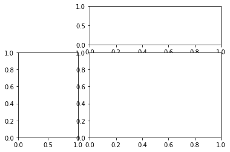
    


```python
plt.figure()
gspec = gridspec.GridSpec(3, 3)

top_histogram = plt.subplot(gspec[0, 1:])
side_histogram = plt.subplot(gspec[1:, 0])
lower_right = plt.subplot(gspec[1:, 1:])

Y = np.random.normal(loc=0.0, scale=1.0, size=10000)
X = np.random.random(size=10000)
lower_right.scatter(X, Y)
top_histogram.hist(X, bins=100)
s = side_histogram.hist(Y, bins=100, orientation='horizontal')
```


    
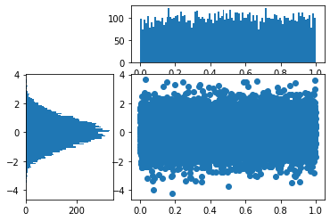
    


### Heatmaps


```python
plt.figure()

Y = np.random.normal(loc=0.0, scale=1.0, size=10000)
X = np.random.random(size=10000)
_ = plt.hist2d(X, Y, bins=25)
plt.colorbar()
```


    <matplotlib.colorbar.Colorbar at 0x22616902d30>


    
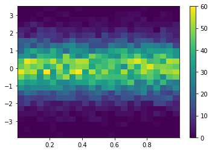
    


```python
plt.hist2d(X, Y, bins=100)
plt.colorbar()
plt.show()
```


    
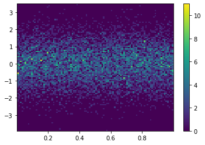
    


### Pandas Visualization


```python
plt.style.use('seaborn-colorblind')
```


```python
np.random.seed(123)

df = pd.DataFrame({'A': np.random.randn(365).cumsum(0), 
                   'B': np.random.randn(365).cumsum(0) + 20,
                   'C': np.random.randn(365).cumsum(0) - 20}, 
                  index=pd.date_range('1/1/2017', periods=365))
df.head()
```


<div>
<style scoped>
    .dataframe tbody tr th:only-of-type {
        vertical-align: middle;
    }

    .dataframe tbody tr th {
        vertical-align: top;
    }

    .dataframe thead th {
        text-align: right;
    }
</style>
<table border="1" class="dataframe">
  <thead>
    <tr style="text-align: right;">
      <th></th>
      <th>A</th>
      <th>B</th>
      <th>C</th>
    </tr>
  </thead>
  <tbody>
    <tr>
      <th>2017-01-01</th>
      <td>-1.085631</td>
      <td>20.059291</td>
      <td>-20.230904</td>
    </tr>
    <tr>
      <th>2017-01-02</th>
      <td>-0.088285</td>
      <td>21.803332</td>
      <td>-16.659325</td>
    </tr>
    <tr>
      <th>2017-01-03</th>
      <td>0.194693</td>
      <td>20.835588</td>
      <td>-17.055481</td>
    </tr>
    <tr>
      <th>2017-01-04</th>
      <td>-1.311601</td>
      <td>21.255156</td>
      <td>-17.093802</td>
    </tr>
    <tr>
      <th>2017-01-05</th>
      <td>-1.890202</td>
      <td>21.462083</td>
      <td>-19.518638</td>
    </tr>
  </tbody>
</table>
</div>


```python
df.plot(); # add a semi-colon to the end of the plotting call to suppress unwanted output
```


    
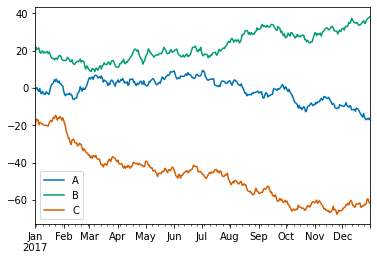
    


```python
df.plot('A','B', kind = 'scatter');
```


    
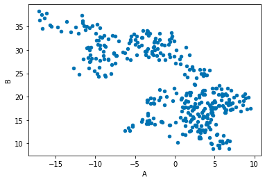
    


You can also choose the plot kind by using the `DataFrame.plot.kind` methods instead of providing the `kind` keyword argument.

`kind` :
- `'line'` : line plot (default)
- `'bar'` : vertical bar plot
- `'barh'` : horizontal bar plot
- `'hist'` : histogram
- `'box'` : boxplot
- `'kde'` : Kernel Density Estimation plot
- `'density'` : same as 'kde'
- `'area'` : area plot
- `'pie'` : pie plot
- `'scatter'` : scatter plot
- `'hexbin'` : hexbin plot


```python
df.plot.scatter('A', 'C', c='B', s=df['B'], colormap='viridis')
```


    <AxesSubplot:xlabel='A', ylabel='C'>


    
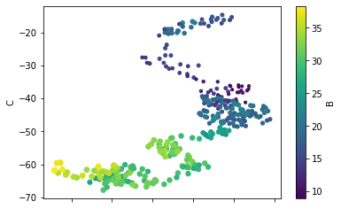
    


```python
df.plot.box();
```


    
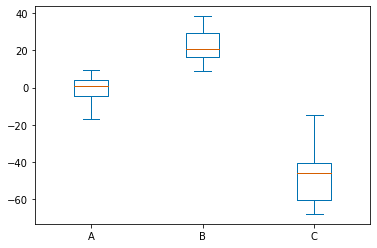
    


```python
df.plot.hist(alpha=0.7);
```


    
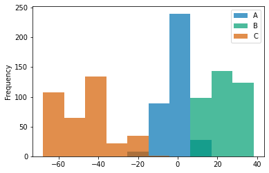
    


[Kernel density estimation plots](https://en.wikipedia.org/wiki/Kernel_density_estimation) are useful for deriving a smooth continuous function from a given sample.


```python
df.plot.kde()
```


    <AxesSubplot:ylabel='Density'>


    
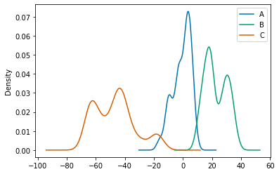
    


### Seaborn


```python
import seaborn as sns
```


```python
np.random.seed(1234)

v1 = pd.Series(np.random.normal(0,10,1000), name='v1')
v2 = pd.Series(2*v1 + np.random.normal(60,15,1000), name='v2')
```


```python
# plot a kernel density estimation over a stacked barchart
plt.figure()
sns.histplot([v1, v2]);
v3 = np.concatenate((v1,v2))
sns.kdeplot(v3);

#! ???? why kde does not showing
```


    
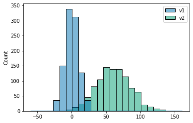
    


```python
sns.distplot(v3, hist_kws={'color': 'Teal'}, kde_kws={'color': 'Navy'});
```

    c:\Users\LENOVO\AppData\Local\Programs\Python\Python39\lib\site-packages\seaborn\distributions.py:2619: FutureWarning: `distplot` is a deprecated function and will be removed in a future version. Please adapt your code to use either `displot` (a figure-level function with similar flexibility) or `histplot` (an axes-level function for histograms).
      warnings.warn(msg, FutureWarning)
    


    
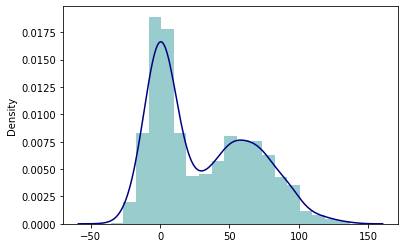
    


```python
sns.jointplot(v1, v2, alpha=0.4);
```

    c:\Users\LENOVO\AppData\Local\Programs\Python\Python39\lib\site-packages\seaborn\_decorators.py:36: FutureWarning: Pass the following variables as keyword args: x, y. From version 0.12, the only valid positional argument will be `data`, and passing other arguments without an explicit keyword will result in an error or misinterpretation.
      warnings.warn(
    


    
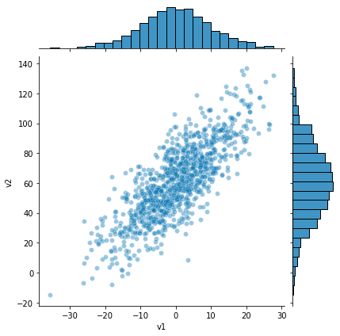
    


```python
sns.jointplot(v1, v2, kind='hex');
```

    c:\Users\LENOVO\AppData\Local\Programs\Python\Python39\lib\site-packages\seaborn\_decorators.py:36: FutureWarning: Pass the following variables as keyword args: x, y. From version 0.12, the only valid positional argument will be `data`, and passing other arguments without an explicit keyword will result in an error or misinterpretation.
      warnings.warn(
    


    
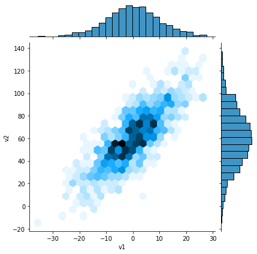
    


```python
sns.set_style('white')

sns.jointplot(v1, v2, kind='kde', space=0);
```

    c:\Users\LENOVO\AppData\Local\Programs\Python\Python39\lib\site-packages\seaborn\_decorators.py:36: FutureWarning: Pass the following variables as keyword args: x, y. From version 0.12, the only valid positional argument will be `data`, and passing other arguments without an explicit keyword will result in an error or misinterpretation.
      warnings.warn(
    


    
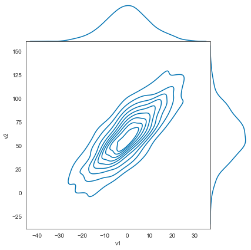
    


```python
iris = pd.read_csv('iris.csv')
iris.head()
```


<div>
<style scoped>
    .dataframe tbody tr th:only-of-type {
        vertical-align: middle;
    }

    .dataframe tbody tr th {
        vertical-align: top;
    }

    .dataframe thead th {
        text-align: right;
    }
</style>
<table border="1" class="dataframe">
  <thead>
    <tr style="text-align: right;">
      <th></th>
      <th>sepal.length</th>
      <th>sepal.width</th>
      <th>petal.length</th>
      <th>petal.width</th>
      <th>variety</th>
    </tr>
  </thead>
  <tbody>
    <tr>
      <th>0</th>
      <td>5.1</td>
      <td>3.5</td>
      <td>1.4</td>
      <td>0.2</td>
      <td>Setosa</td>
    </tr>
    <tr>
      <th>1</th>
      <td>4.9</td>
      <td>3.0</td>
      <td>1.4</td>
      <td>0.2</td>
      <td>Setosa</td>
    </tr>
    <tr>
      <th>2</th>
      <td>4.7</td>
      <td>3.2</td>
      <td>1.3</td>
      <td>0.2</td>
      <td>Setosa</td>
    </tr>
    <tr>
      <th>3</th>
      <td>4.6</td>
      <td>3.1</td>
      <td>1.5</td>
      <td>0.2</td>
      <td>Setosa</td>
    </tr>
    <tr>
      <th>4</th>
      <td>5.0</td>
      <td>3.6</td>
      <td>1.4</td>
      <td>0.2</td>
      <td>Setosa</td>
    </tr>
  </tbody>
</table>
</div>


```python
sns.pairplot(iris, hue='variety', diag_kind='kde', size=2);
```

    c:\Users\LENOVO\AppData\Local\Programs\Python\Python39\lib\site-packages\seaborn\axisgrid.py:2076: UserWarning: The `size` parameter has been renamed to `height`; please update your code.
      warnings.warn(msg, UserWarning)
    


    
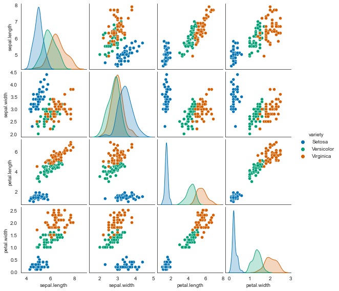
    


```python
plt.figure(figsize=(8,6))
plt.subplot(121)
sns.swarmplot('variety', 'petal.length', data=iris);
plt.subplot(122)
sns.violinplot('variety', 'petal.length', data=iris);
```

    c:\Users\LENOVO\AppData\Local\Programs\Python\Python39\lib\site-packages\seaborn\_decorators.py:36: FutureWarning: Pass the following variables as keyword args: x, y. From version 0.12, the only valid positional argument will be `data`, and passing other arguments without an explicit keyword will result in an error or misinterpretation.
      warnings.warn(
    c:\Users\LENOVO\AppData\Local\Programs\Python\Python39\lib\site-packages\seaborn\categorical.py:1296: UserWarning: 8.0% of the points cannot be placed; you may want to decrease the size of the markers or use stripplot.
      warnings.warn(msg, UserWarning)
    c:\Users\LENOVO\AppData\Local\Programs\Python\Python39\lib\site-packages\seaborn\_decorators.py:36: FutureWarning: Pass the following variables as keyword args: x, y. From version 0.12, the only valid positional argument will be `data`, and passing other arguments without an explicit keyword will result in an error or misinterpretation.
      warnings.warn(
    


    
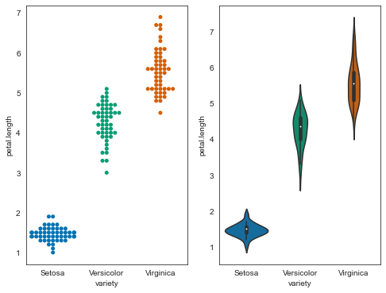
    


```python
tips = sns.load_dataset('tips')
```


```python
sns.barplot(x='sex', y='total_bill', data=tips)
```


    <AxesSubplot:xlabel='sex', ylabel='total_bill'>


    
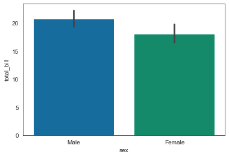
    


```python
sns.boxplot(x='time', y='total_bill', data=tips)
```


    <AxesSubplot:xlabel='time', ylabel='total_bill'>


    
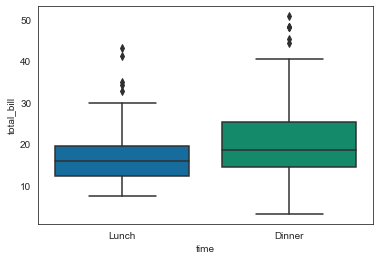
    


```python
sns.violinplot(x='time', y='total_bill', data=tips, hue='sex', split=True)
```


    <AxesSubplot:xlabel='time', ylabel='total_bill'>


    
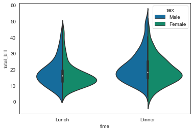
    


```python
sns.lmplot(x='total_bill', y='tip', data=tips, hue='sex', height=8, aspect=1)
```


    <seaborn.axisgrid.FacetGrid at 0x226167563d0>


    
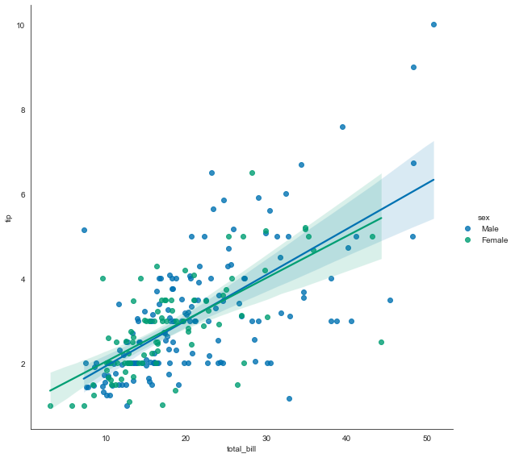
    


```python
sns.relplot(data=tips, x="total_bill", y="tip", hue="day", col="time", row="sex")
```


    <seaborn.axisgrid.FacetGrid at 0x2261c488370>


    
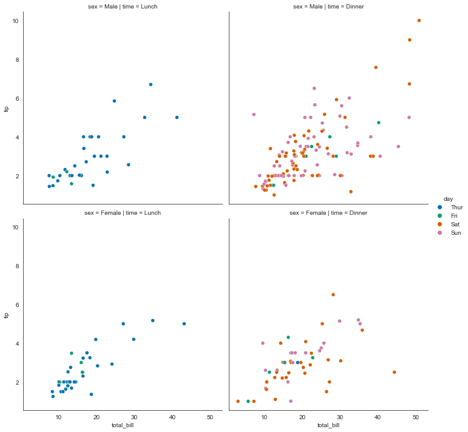
    


```python
tips_mean = tips.total_bill.mean()
tips_sd = tips.total_bill.std()

ax = sns.displot(data=tips, x="total_bill", kde=True, height=8)

plt.axvline(x=tips_mean, color='black', linestyle='dashed')

plt.axvline(x=tips_mean + tips_sd, color='red', linestyle='dotted')
plt.axvline(x=tips_mean - tips_sd, color='red', linestyle='dotted')

plt.title('$\mu = {}$ | $\sigma = {}$'.format(round(tips_mean, 2), round(tips_sd, 2)))
```


    Text(0.5, 1.0, '$\\mu = 19.79$ | $\\sigma = 8.9$')


    
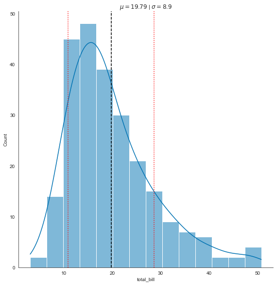
    


```python
sns.jointplot(x=tips['total_bill'], y=tips['tip'], height=10)
```


    <seaborn.axisgrid.JointGrid at 0x2261c61d6d0>


    
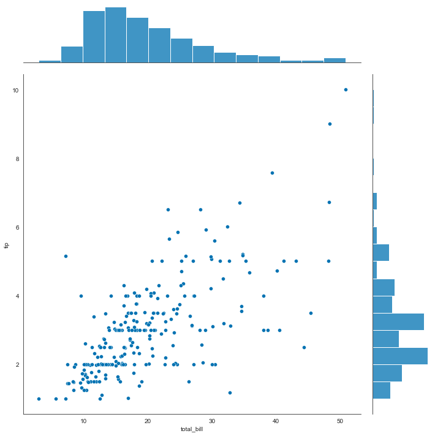
    


```python
sns.pairplot(tips, hue='sex', height=3)
```


    <seaborn.axisgrid.PairGrid at 0x2261c748bb0>


    
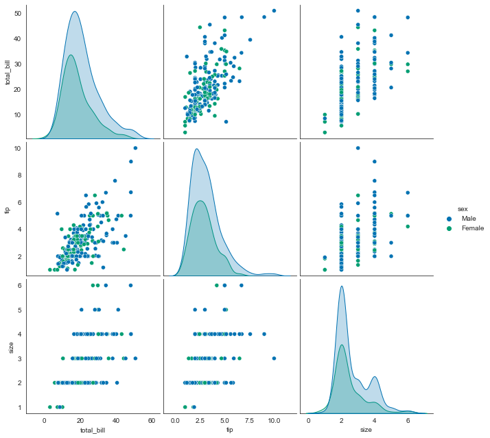
    


### Bad Visualization

1. inconsistent scale


```python
x_1 = np.linspace(0, 1, 80, endpoint=False)
x_2 = np.linspace(1, 2, 20)
x = np.concatenate((x_1, x_2))
plt.figure(figsize=(10, 8), dpi=80)
plt.plot(x, label='linear')
plt.plot(x**2, label='quadratic')
plt.plot(x**3, label='cubic')
plt.xlabel('x label')
plt.xticks([0, 20, 40, 60, 80, 90, 100], [0, 0.25, 0.5, 0.75, 1, 1.5, 2])
plt.ylabel('y label')
plt.title("Simple Plot")
plt.grid(True)
plt.legend()
```


    <matplotlib.legend.Legend at 0x2261aaf5d60>


    
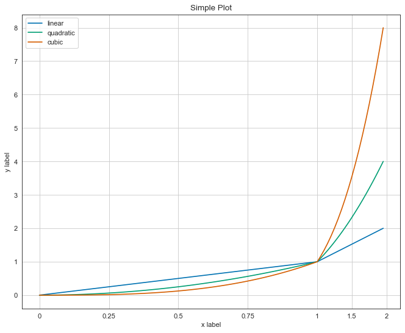
    


This is broken. in this plot the range from 1 to 2 on the x-axis is denser than the same range from 0 to 1. this easily leads you to misinterpretation.

Don’t get it wrong, it is advised to use other scales rather than linear space when it’s beneficial. just be consistent and declare that the plot isn’t drawn on linear space.


```python
x = np.linspace(0, 5, 100)
fig, axes = plt.subplots(1, 2, figsize=(10,5))
      
axes[0].plot(x, x, label='linear')
axes[0].plot(x, x**2, label='quadratic')
axes[0].plot(x, x**3, label='cubic')
axes[0].plot(x, np.exp(x), label='cubic')
axes[0].set_title("Normal scale")
axes[0].grid(True)

axes[1].plot(x, x, label='linear')
axes[1].plot(x, x**2, label='quadratic')
axes[1].plot(x, x**3, label='cubic')
axes[1].plot(x, np.exp(x), label='cubic')
axes[1].set_yscale("log")
axes[1].set_title("Logarithmic scale")
axes[1].grid(True)

axes[1].legend(loc='best')
```


    <matplotlib.legend.Legend at 0x2261acd2040>


    
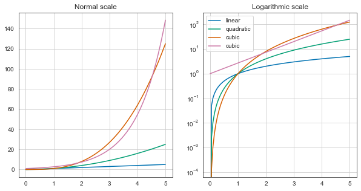
    


2. Too many variables


```python
diamonds = sns.load_dataset("diamonds")
```


```python
fig = plt.figure(figsize=(10,8))
ax = diamonds.color.value_counts().plot(kind='pie')
```


    
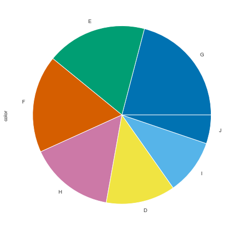
    


Too many variables, especially in the pie chart make it useless. use other categories or bar charts.

3. Wrong type of chart


```python
flights = sns.load_dataset("flights")
flights_1957 = flights[flights.year == 1957]
```


```python
fig, axe = plt.subplots(1, figsize=(10,5))
axe.scatter(list(flights_1957.month), list(flights_1957.passengers), color='orange')
axe.plot(list(flights_1957.month), list(flights_1957.passengers), linestyle='dashed')
```


    [<matplotlib.lines.Line2D at 0x2261be13d00>]


    
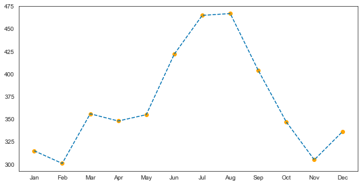
    


Data is not continuous. so we’re not allowed to draw a line between two consecutive months.


```python

```

### References
- datatoviz website
- Applied data science with python by Michigan university, Coursera
- Python for data analysis book by O'Reilly
- Pandas Bootcamp by Udemy
- https://sk7w4tch3r.github.io/CS-SBU-DataScience/
