```python
import numpy as np
import pandas as pd
pd.plotting.register_matplotlib_converters()
import matplotlib.pyplot as plt
%matplotlib inline
import seaborn as sns
sns.set_style("dark")
sns.set(rc={'figure.figsize':(12,8)})
```

## Line Plot

A line chart or line graph displays the evolution of one or several numeric variables. Data points are connected by straight line segments. It is similar to a scatter plot except that the measurement points are ordered (typically by their x-axis value) and joined with straight line segments. A line chart is often used to visualize a trend in data over intervals of time – a time series – thus the line is often drawn chronologically.

Line chart can be used to show the evolution of one or several variables. Note that this works well for a low number of group to display. With more than a few, the graphic get cluttered and becomes unreadable. This is called a spaghetti chart and you can read more about it [here](https://www.data-to-viz.com/caveat/spaghetti.html).

If the number of data points is low, it is advised to represent each individual observation with a dot. It allows to understand when exactly the observation have been made


```python
# create data
values=np.cumsum(np.random.randn(1000,1))

# use the plot function
plt.plot(values)
```


    [<matplotlib.lines.Line2D at 0x22c9a3f8310>]


    

    


## Scatter Plot

A scatterplot displays the relationship between 2 numeric variables. For each data point, the value of its first variable is represented on the X axis, the second on the Y axis.

A scatterplot is made to study the relationship between 2 variables. Thus it is often accompanied by a correlation coefficient calculation, that usually tries to measure the linear relationship.However other types of relationship can be detected using scatterplots, and a common task consists to fit a model explaining Y in function of X.

Scatterplot are sometimes supported by marginal distributions. It indeed adds insight to the graphic, revealing the distribution of both variables

Overplotting is the most common mistake when sample size is high. [This post](https://www.data-to-viz.com/caveat/overplotting.html) describes about 10 different workarounds to fix this issue.

Don’t forget to show subgroups if you have some. Indeed it can reveal important hidden patterns in your data, like in the case of the Simpson paradox.


```python
# library & dataset
df = sns.load_dataset('iris')

# use the function regplot to make a scatterplot
sns.regplot(x=df["sepal_length"], y=df["sepal_width"]) # fit_reg=False
```


    <AxesSubplot:xlabel='sepal_length', ylabel='sepal_width'>


    
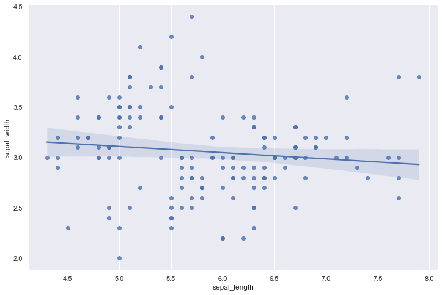
    


#### Strip plot
Draw a categorical scatterplot using jitter to reduce overplotting.

A strip plot can be drawn on its own, but it is also a good complement to a box or violin plot in cases where you want to show all observations along with some representation of the underlying distribution.


```python
tips = sns.load_dataset("tips")
sns.stripplot(data=tips, x="total_bill", y="day")
```


    <AxesSubplot:xlabel='total_bill', ylabel='day'>


    

    


```python
sns.stripplot(data=tips, x="total_bill", y="day", hue="sex")
```


    <AxesSubplot:xlabel='total_bill', ylabel='day'>


    
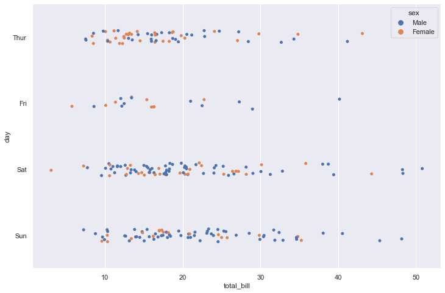
    


#### Swarmplot

Draw a categorical scatterplot with points adjusted to be non-overlapping.

This function is similar to stripplot(), but the points are adjusted (only along the categorical axis) so that they don’t overlap. This gives a better representation of the distribution of values, but it does not scale well to large numbers of observations. This style of plot is sometimes called a “beeswarm”.

A swarm plot can be drawn on its own, but it is also a good complement to a box or violin plot in cases where you want to show all observations along with some representation of the underlying distribution.


```python
sns.swarmplot(data=tips, x="total_bill")
```


    <AxesSubplot:xlabel='total_bill'>


    
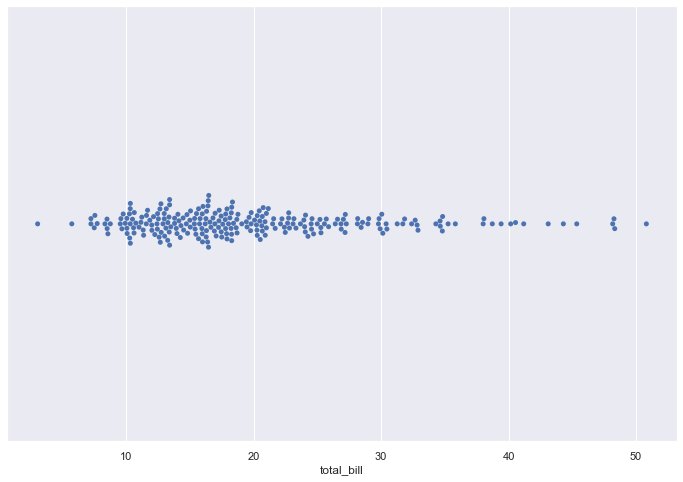
    


```python
sns.swarmplot(data=tips, x="total_bill", y="day")
```


    <AxesSubplot:xlabel='total_bill', ylabel='day'>


    
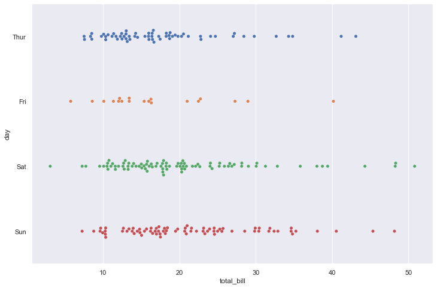
    


```python
sns.swarmplot(data=tips, x="total_bill", y="day", hue="sex")
```


    <AxesSubplot:xlabel='total_bill', ylabel='day'>


    
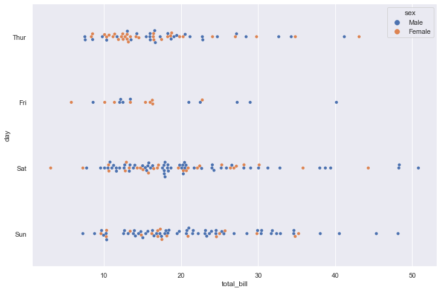
    


## BAR PLOT

A barplot (or barchart) is one of the most common types of graphic. It shows the relationship between a numeric and a categoric variable. Each entity of the categoric variable is represented as a bar. The size of the bar represents its numeric value.

A barplot shows the relationship between a numeric and a categoric variable. In the previous graphic, each country is a level of the categoric variable, and the quantity of weapon sold is the numeric variable. An ordered barplot is a very good choice here since it displays both the ranking of countries and their specific value.

A barplot can also display values for several levels of grouping

Barplot is sometimes described as a boring way to visualize information, despite its incredible efficiency. There are a few variations that allows to create more eye-catching figures without loosing any of the barplot accuracy. My favorite variation is the lollipop plot that replaces the bars with a segment and a dot.

Circular barplot can also be considered if you have many groups. The group comparison is less accurate, thus this option must be selected if there is an obvious pattern to show in the data.

Do not confound barchart with histogram. A histogram has only a numeric variable as input and shows its distribution.

Order your bars. If the levels of your categoric variable have no obvious order, order the bars following their values.

Several values per group? Don’t use a barplot. Even with error bars, it hides information and other type of graphic like boxplot or violin are much more appropriate.


```python
height = [3, 12, 5, 18, 45]
bars = ('A', 'B', 'C', 'D', 'E')
y_pos = np.arange(len(bars))

# Create bars
plt.bar(y_pos, height)

# Create names on the x-axis
plt.xticks(y_pos, bars)

# Show graphic
plt.show()
```


    
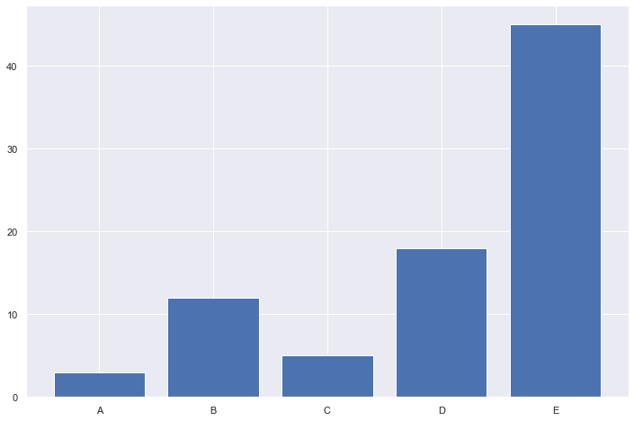
    


```python
barWidth = 0.9
bars1 = [3, 3, 1]
bars2 = [4, 2, 3]
bars3 = [4, 6, 7, 10, 4, 4]
bars4 = bars1 + bars2 + bars3
 
# The X position of bars
r1 = [1,5,9]
r2 = [2,6,10]
r3 = [3,4,7,8,11,12]
r4 = r1 + r2 + r3
 
# Create barplot
plt.bar(r1, bars1, width = barWidth, color = (0.3,0.1,0.4,0.6), label='Alone')
plt.bar(r2, bars2, width = barWidth, color = (0.3,0.5,0.4,0.6), label='With Himself')
plt.bar(r3, bars3, width = barWidth, color = (0.3,0.9,0.4,0.6), label='With other genotype')
# Note: the barplot could be created easily. See the barplot section for other examples.
 
# Create legend
plt.legend()
 
# Text below each barplot with a rotation at 90°
plt.xticks([r + barWidth for r in range(len(r4))], ['DD', 'with himself', 'with DC', 'with Silur', 'DC', 'with himself', 'with DD', 'with Silur', 'Silur', 'with himself', 'with DD', 'with DC'], rotation=90)
 
# Create labels
label = ['n = 6', 'n = 25', 'n = 13', 'n = 36', 'n = 30', 'n = 11', 'n = 16', 'n = 37', 'n = 14', 'n = 4', 'n = 31', 'n = 34']
 
# Text on the top of each bar
for i in range(len(r4)):
    plt.text(x = r4[i]-0.5 , y = bars4[i]+0.1, s = label[i], size = 6)

# Adjust the margins
plt.subplots_adjust(bottom= 0.2, top = 0.98)
 
# Show graphic
plt.show()
```


    
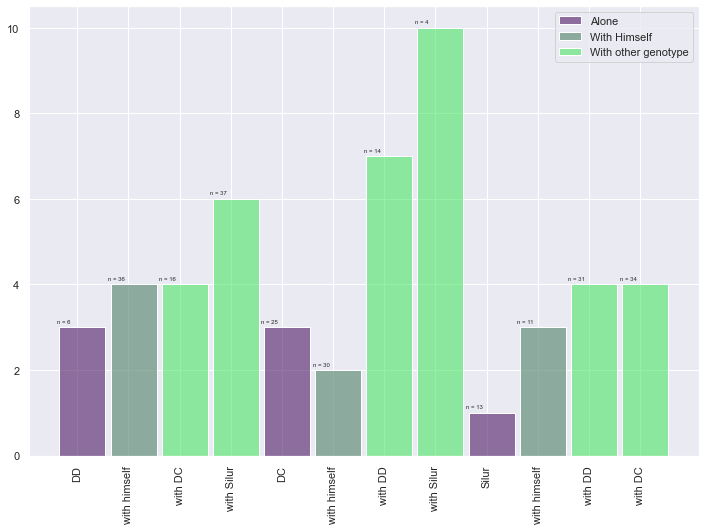
    


#### Count plot

Show the counts of observations in each categorical bin using bars.

A count plot can be thought of as a histogram across a categorical, instead of quantitative, variable. The basic API and options are identical to those for barplot(), so you can compare counts across nested variables.


```python
df = sns.load_dataset("titanic")
sns.countplot(x=df["class"])
```


    <AxesSubplot:xlabel='class', ylabel='count'>


    
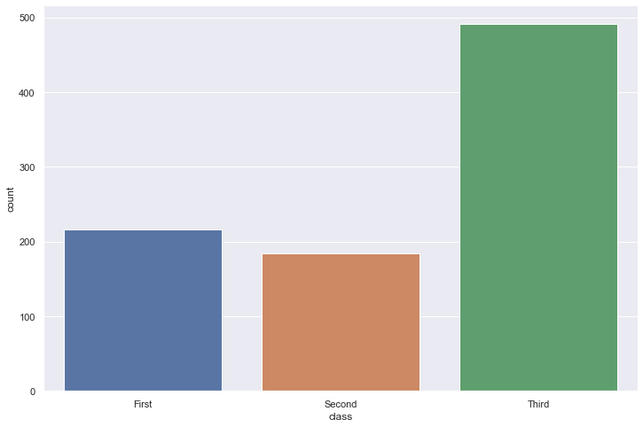
    


```python
sns.countplot(data=df, x="class", hue="alive")
```


    <AxesSubplot:xlabel='class', ylabel='count'>


    
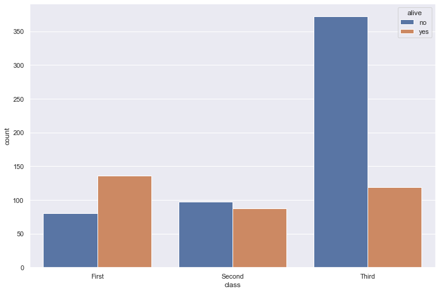
    


## Pie Chart

A pie chart is a circle divided into sectors that each represent a proportion of the whole. It is often used to show percentage, where the sum of the sectors equals 100%.

The problem is that humans are pretty bad at reading angles. In the adjacent pie chart, try to figure out which group is the biggest one and try to order them by value. You will probably struggle to do so and this is why pie charts must be avoided.

Alternatives: Bar plot, tree map


```python
# create data: an array of values
size_of_groups=[12,11,3,30]

# Create a pieplot
plt.pie(size_of_groups)
plt.show()
```


    
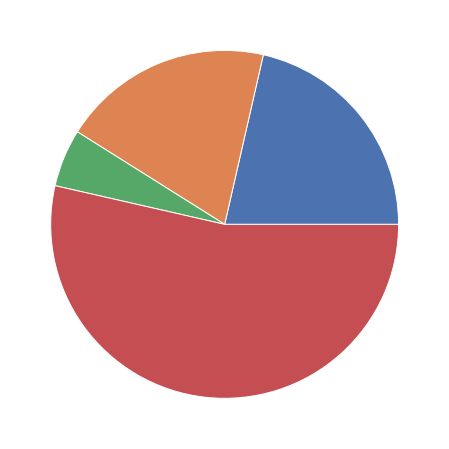
    


## Histogram

A histogram is an accurate graphical representation of the distribution of a numeric variable. It takes as input numeric variables only. The variable is cut into several bins, and the number of observation per bin is represented by the height of the bar.

Histogram are used to study the distribution of one or a few variables. Checking the distribution of your variables one by one is probably the first task you should do when you get a new dataset. It delivers a good quantity of information.

As a second step, histogram allow to compare the distribution of a few variables. Don’t compare more than 3 or 4, it would make the figure cluttered and unreadable. This comparison can be done showing the 2 variables on the same graphic and using transparency.

A common variation of the histogram is the mirror histogram: it puts face to face 2 histograms to compare their distribution.

Try several bin size, it can lead to very different conclusions.
Don’t use weird color sheme. It does not give any more insight.
Don’t confound it with a barplot. A barplot gives a value for each group of a categoric variable. Here, we have only a numeric variable and we chack its distribution.
Don’t compare more than ~3 groups in the same histogram. The graphic gets cluttered and hardly understandable. Instead use a violin plot, a boxplot, a ridgeline plot or use small multiple.
Using unequal bin widths


```python
df = sns.load_dataset('iris')

# Plot the histogram thanks to the distplot function
sns.distplot( a=df["sepal_length"], hist=True, kde=False, rug=False )
```

    c:\Users\LENOVO\AppData\Local\Programs\Python\Python39\lib\site-packages\seaborn\distributions.py:2619: FutureWarning: `distplot` is a deprecated function and will be removed in a future version. Please adapt your code to use either `displot` (a figure-level function with similar flexibility) or `histplot` (an axes-level function for histograms).
      warnings.warn(msg, FutureWarning)
    


    <AxesSubplot:xlabel='sepal_length'>


    
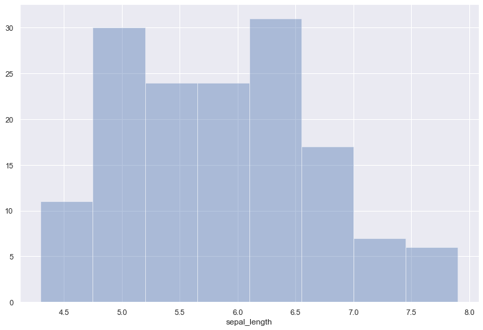
    


```python
sns.set(style="darkgrid")
df = sns.load_dataset("iris")

sns.histplot(data=df, x="sepal_length", color="skyblue", label="Sepal Length", kde=True)
sns.histplot(data=df, x="sepal_width", color="red", label="Sepal Width", kde=True)

plt.legend() 
plt.show()
```


    
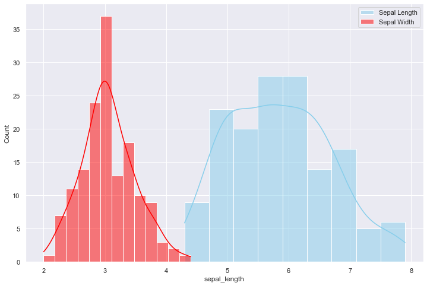
    


```python
sns.set(style="darkgrid")
df = sns.load_dataset("iris")

fig, axs = plt.subplots(2, 2, figsize=(7, 7))

sns.histplot(data=df, x="sepal_length", kde=True, color="skyblue", ax=axs[0, 0])
sns.histplot(data=df, x="sepal_width", kde=True, color="olive", ax=axs[0, 1])
sns.histplot(data=df, x="petal_length", kde=True, color="gold", ax=axs[1, 0])
sns.histplot(data=df, x="petal_width", kde=True, color="teal", ax=axs[1, 1])

plt.show()
```


    
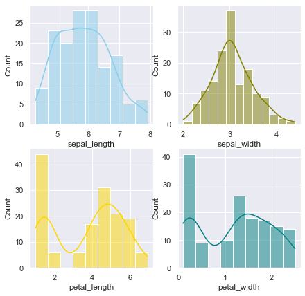
    


```python
sns.set(style="darkgrid")
df = sns.load_dataset("iris")
 
# creating a figure composed of two matplotlib.Axes objects (ax_box and ax_hist)
f, (ax_box, ax_hist) = plt.subplots(2, sharex=True, gridspec_kw={"height_ratios": (.15, .85)})
 
# assigning a graph to each ax
sns.boxplot(df["sepal_length"], ax=ax_box)
sns.histplot(data=df, x="sepal_length", ax=ax_hist)
 
# Remove x axis name for the boxplot
ax_box.set(xlabel='')
plt.show()
```

    c:\Users\LENOVO\AppData\Local\Programs\Python\Python39\lib\site-packages\seaborn\_decorators.py:36: FutureWarning: Pass the following variable as a keyword arg: x. From version 0.12, the only valid positional argument will be `data`, and passing other arguments without an explicit keyword will result in an error or misinterpretation.
      warnings.warn(
    


    
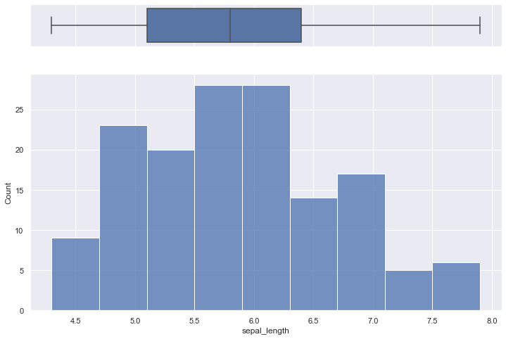
    


## Box Plot
A boxplot gives a nice summary of one or more numeric variables. A boxplot is composed of several elements:

The line that divides the box into 2 parts represents the median of the data. If the median is 10, it means that there are the same number of data points below and above 10.
The ends of the box shows the upper (Q3) and lower (Q1) quartiles. If the third quartile is 15, it means that 75% of the observation are lower than 15.
The difference between Quartiles 1 and 3 is called the interquartile range (IQR)
The extreme line shows Q3+1.5xIQR to Q1-1.5xIQR (the highest and lowest value excluding outliers).
Dots (or other markers) beyond the extreme line shows potntial outliers.

A boxplot can summarize the distribution of a numeric variable for several groups. The problem is that summarizing also means losing information, and that can be a pitfall. For example, we cannot see the underlying distribution of dots in each group or their number of observations.

If the amount of data you are working with is not too large, adding jitter on top of your boxplot can make the graphic more insightful.

If you have a large sample size, using jitter is not an option anymore since dots will overlap, making the figure uninterpretable. A alternative is the violin plot, which describes the distribution of the data for each group:


```python
df = sns.load_dataset('iris')

sns.boxplot( x=df["species"], y=df["sepal_length"] )
```


    <AxesSubplot:xlabel='species', ylabel='sepal_length'>


    
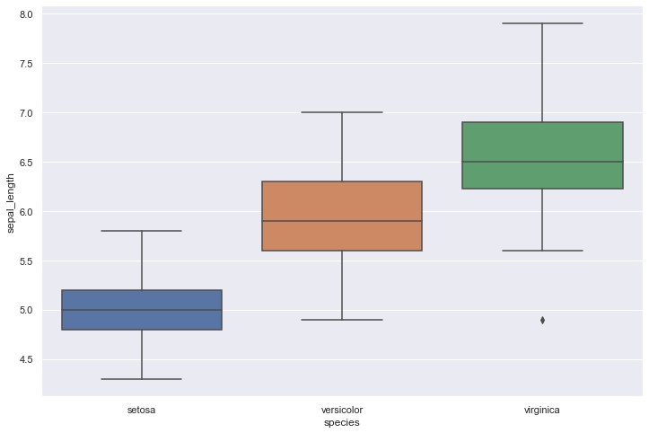
    


adding jitter:


```python
# Dataset:
a = pd.DataFrame({ 'group' : np.repeat('A',500), 'value': np.random.normal(10, 5, 500) })
b = pd.DataFrame({ 'group' : np.repeat('B',500), 'value': np.random.normal(13, 1.2, 500) })
c = pd.DataFrame({ 'group' : np.repeat('B',500), 'value': np.random.normal(18, 1.2, 500) })
d = pd.DataFrame({ 'group' : np.repeat('C',20), 'value': np.random.normal(25, 4, 20) })
e = pd.DataFrame({ 'group' : np.repeat('D',100), 'value': np.random.uniform(12, size=100) })
df=a.append(b).append(c).append(d).append(e)

# boxplot
ax = sns.boxplot(x='group', y='value', data=df)
# add stripplot
ax = sns.stripplot(x='group', y='value', data=df, color="orange", jitter=0.2, size=2.5)

# add title
plt.title("Boxplot with jitter", loc="left")

# show the graph
plt.show()
```


    

    


```python
sns.set(style="darkgrid")
df = sns.load_dataset('tips')

sns.boxplot(x="day", y="total_bill", hue="smoker", data=df, palette="Set1", width=0.5)
plt.show()
```


    
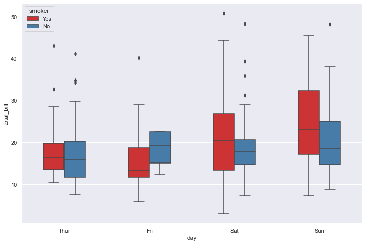
    


## Violin plot

Violin plot allows to visualize the distribution of a numeric variable for one or several groups. Each ‘violin’ represents a group or a variable. The shape represents the density estimate of the variable: the more data points in a specific range, the larger the violin is for that range. It is really close to a boxplot, but allows a deeper understanding of the distribution.

Violin plot is a powerful data visualization technique since it allows to compare both the ranking of several groups and their distribution. Surprisingly, it is less used than boxplot, even if it provides more information in my opinion.

Violins are particularly adapted when the amount of data is huge and showing individual observations gets impossible. For small datasets, a boxplot with jitter is probably a better option since it really shows all the information.

Violin plot are made vertically most of the time. If you have long labels, building an horizontal version like above make the labels more readable.

It is possible to display a boxplot in the violin: it allows to assess the median and quartiles in a glimpse. 

If your variable are grouped, you can build a grouped violin as you would do for a boxplot.

If you compare groups with very different sample size, show it.
Ordering groups by median value makes the chart more insightful.
If you have just a few groups, you are probably interested by ridgeline charts. 


```python
df = sns.load_dataset('iris')

# plot
sns.violinplot(x=df["species"], y=df["sepal_length"])
```


    <AxesSubplot:xlabel='species', ylabel='sepal_length'>


    
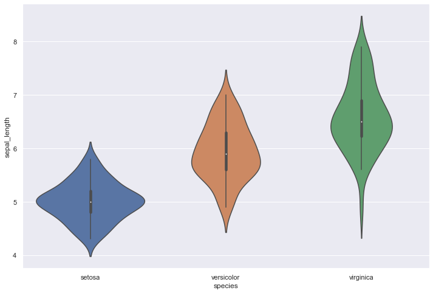
    


```python
sns.set(style="darkgrid")
df = sns.load_dataset('tips')
 
# Grouped violinplot
sns.violinplot(x="day", y="total_bill", hue="smoker", data=df, palette="Pastel1")
plt.show()
```


    
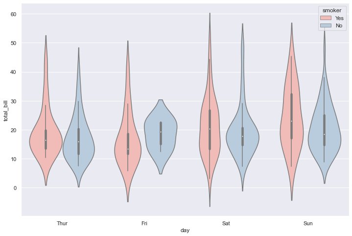
    


## Heatmap

A heatmap is a graphical representation of data where the individual values contained in a matrix are represented as colors. It is a bit like looking a data table from above.

Heatmap is really useful to display a general view of numerical data, not to extract specific data point. In the graphic above, the huge population size of China and India pops out for example.

Heatmap is also useful to display the result of hierarchical clustering. Basically, clustering checks what countries tend to have the same features on their numeric variables, what countries are similar. The usual way to represent the result is to use dendrogram. This type of chart can be drawn on top of the heatmap.

We’ve seen in the previous section that heatmap is often used to display the result of a clustering algorithm. A common task is to compare the result with expectations. For instance, we can check if the countries are clustering according to their continent using a color bar.

For static heatmap, a common practice is to display the exact value of each cell in numbers. Indeed, it is hard to translate a color in a precise number.

Heatmaps can also be used for time series where there is a regular pattern in time.

Heatmaps can be applied to adjacency matrix.

Often need to normalize your data
Use cluster analysis and thus permute the rows and the columns of the matrix to place similar values near each other according to the clustering
Color palette is important


```python
df = pd.DataFrame(np.random.random((5,5)), columns=["a","b","c","d","e"])

# Default heatmap
p1 = sns.heatmap(df)
```


    
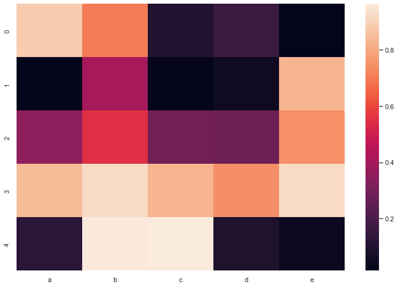
    


```python
df = pd.DataFrame(np.random.random((10,10)), columns=["a","b","c","d","e","f","g","h","i","j"])

# plot a heatmap with annotation
sns.heatmap(df, annot=True, annot_kws={"size": 7})
```


    <AxesSubplot:>


    
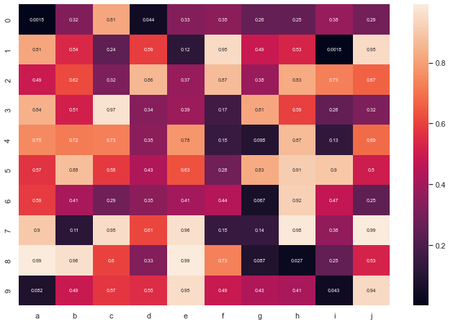
    


```python
df = pd.DataFrame(np.random.random((100,5)), columns=["a","b","c","d","e"])

# Calculate correlation between each pair of variable
corr_matrix=df.corr()
 
# Can be great to plot only a half matrix
# Generate a mask for the upper triangle
mask = np.zeros_like(corr_matrix)
mask[np.triu_indices_from(mask)] = True

# Draw the heatmap with the mask
sns.heatmap(corr_matrix, mask=mask, square=True)
```


    <AxesSubplot:>


    
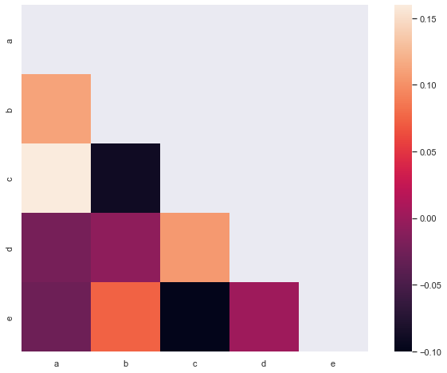
    


```python
url = 'https://raw.githubusercontent.com/holtzy/The-Python-Graph-Gallery/master/static/data/mtcars.csv'
df = pd.read_csv(url)
df = df.set_index('model')
 
# Prepare a vector of color mapped to the 'cyl' column
my_palette = dict(zip(df.cyl.unique(), ["orange","yellow","brown"]))
row_colors = df.cyl.map(my_palette)
 
# plot
sns.clustermap(df, metric="correlation", method="single", cmap="Blues", standard_scale=1, row_colors=row_colors)
plt.show()
```


    
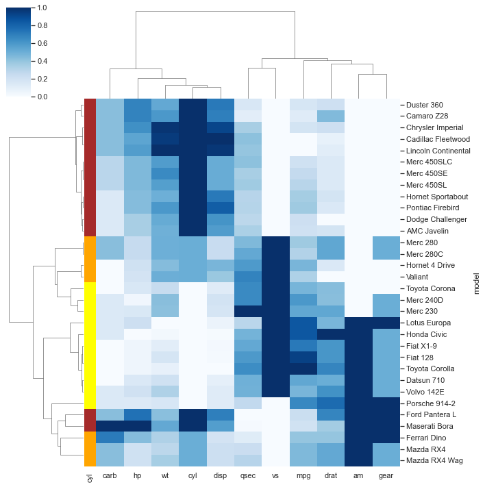
    

