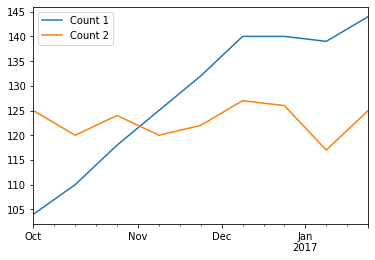

# Pandas

It contains high-level data structures and manipulation tools designed to make data analysis fast and easy in Python. pandas is built on top of NumP and makes it easy to use in NumPy-centric applications.

- Data structures with labeled axes supporting automatic or explicit data alignment. This prevents common errors resulting from misaligned data and working with differently-indexed data coming from different sources.
- Integrated time series functionality.
- The same data structures handle both time series data and non-time series data.
- Arithmetic operations and reductions (like summing across an axis) would pass on the metadata (axis labels).
- Flexible handling of missing data.
- Merge and other relational operations found in popular database databases (SQLbased, for example).


```python
import pandas as pd
```

### The Series Data Structure


```python
number = [1, 2, 3]
pd.Series(number)
```


    0    1
    1    2
    2    3
    dtype: int64


```python
animals = ['Tiger', 'Bear', None]
pd.Series(animals)
```


    0    Tiger
    1     Bear
    2     None
    dtype: object


```python
import numpy as np
np.nan == None
```


    False


```python
np.nan == np.nan
```


    False


```python
np.isnan(np.nan)
```


    True


```python
sports = {'Archery': 'Bhutan',
          'Golf': 'Scotland',
          'Sumo': 'Japan',
          'Taekwondo': 'South Korea'}
s = pd.Series(sports)
s
```


    Archery           Bhutan
    Golf            Scotland
    Sumo               Japan
    Taekwondo    South Korea
    dtype: object


```python
s.index

```


    Index(['Archery', 'Golf', 'Sumo', 'Taekwondo'], dtype='object')


```python
s = pd.Series(['Tiger', 'Bear', 'Moose'], index=['India', 'America', 'Canada'])
s
```


    India      Tiger
    America     Bear
    Canada     Moose
    dtype: object


```python
sports = {'Archery': 'Bhutan',
          'Golf': 'Scotland',
          'Sumo': 'Japan',
          'Taekwondo': 'South Korea'}
s = pd.Series(sports, index=['Golf', 'Sumo', 'Hockey'])
s
```


    Golf      Scotland
    Sumo         Japan
    Hockey         NaN
    dtype: object


### Querying a Series


```python
sports = {'Archery': 'Bhutan',
          'Golf': 'Scotland',
          'Sumo': 'Japan',
          'Taekwondo': 'South Korea'}
s = pd.Series(sports)
s
```


    Archery           Bhutan
    Golf            Scotland
    Sumo               Japan
    Taekwondo    South Korea
    dtype: object


```python
s.iloc[3]
```


    'South Korea'


```python
s.loc['Sumo']
```


    'Japan'


```python
s[3]
```


    'South Korea'


```python
s['Golf']
```


    'Scotland'


```python
sports = {99: 'Bhutan',
          100: 'Scotland',
          101: 'Japan',
          102: 'South Korea'}
s = pd.Series(sports)
```


```python
s[0] #This won't call s.iloc[0] as one might expect, it generates an error instead
```


    ---------------------------------------------------------------------------

    KeyError                                  Traceback (most recent call last)

    c:\Users\LENOVO\AppData\Local\Programs\Python\Python39\lib\site-packages\pandas\core\indexes\base.py in get_loc(self, key, method, tolerance)
       3360             try:
    -> 3361                 return self._engine.get_loc(casted_key)
       3362             except KeyError as err:
    

    c:\Users\LENOVO\AppData\Local\Programs\Python\Python39\lib\site-packages\pandas\_libs\index.pyx in pandas._libs.index.IndexEngine.get_loc()
    

    c:\Users\LENOVO\AppData\Local\Programs\Python\Python39\lib\site-packages\pandas\_libs\index.pyx in pandas._libs.index.IndexEngine.get_loc()
    

    pandas\_libs\hashtable_class_helper.pxi in pandas._libs.hashtable.Int64HashTable.get_item()
    

    pandas\_libs\hashtable_class_helper.pxi in pandas._libs.hashtable.Int64HashTable.get_item()
    

    KeyError: 0

    
    The above exception was the direct cause of the following exception:
    

    KeyError                                  Traceback (most recent call last)

    ~\AppData\Local\Temp/ipykernel_7512/4087325533.py in <module>
    ----> 1 s[0] #This won't call s.iloc[0] as one might expect, it generates an error instead
    

    c:\Users\LENOVO\AppData\Local\Programs\Python\Python39\lib\site-packages\pandas\core\series.py in __getitem__(self, key)
        940 
        941         elif key_is_scalar:
    --> 942             return self._get_value(key)
        943 
        944         if is_hashable(key):
    

    c:\Users\LENOVO\AppData\Local\Programs\Python\Python39\lib\site-packages\pandas\core\series.py in _get_value(self, label, takeable)
       1049 
       1050         # Similar to Index.get_value, but we do not fall back to positional
    -> 1051         loc = self.index.get_loc(label)
       1052         return self.index._get_values_for_loc(self, loc, label)
       1053 
    

    c:\Users\LENOVO\AppData\Local\Programs\Python\Python39\lib\site-packages\pandas\core\indexes\base.py in get_loc(self, key, method, tolerance)
       3361                 return self._engine.get_loc(casted_key)
       3362             except KeyError as err:
    -> 3363                 raise KeyError(key) from err
       3364 
       3365         if is_scalar(key) and isna(key) and not self.hasnans:
    

    KeyError: 0


```python
s = pd.Series([100.00, 120.00, 101.00, 3.00])
np.sum(s)
```


    324.0


```python
s.head(n=3)
```


    0    100.0
    1    120.0
    2    101.0
    dtype: float64


```python
s = pd.Series([1, 2, 3])
s.loc['Animal'] = 'Bears'
s
```


    0             1
    1             2
    2             3
    Animal    Bears
    dtype: object


```python
original_sports = pd.Series({'Archery': 'Bhutan',
                             'Golf': 'Scotland',
                             'Sumo': 'Japan',
                             'Taekwondo': 'South Korea'})
cricket_loving_countries = pd.Series(['Australia',
                                      'Barbados',
                                      'Pakistan',
                                      'England'], 
                                   index=['Cricket',
                                          'Cricket',
                                          'Cricket',
                                          'Cricket'])
all_countries = original_sports.append(cricket_loving_countries)
```


```python
original_sports
```


    Archery           Bhutan
    Golf            Scotland
    Sumo               Japan
    Taekwondo    South Korea
    dtype: object


```python
cricket_loving_countries
```


    Cricket    Australia
    Cricket     Barbados
    Cricket     Pakistan
    Cricket      England
    dtype: object


```python
all_countries
```


    Archery           Bhutan
    Golf            Scotland
    Sumo               Japan
    Taekwondo    South Korea
    Cricket        Australia
    Cricket         Barbados
    Cricket         Pakistan
    Cricket          England
    dtype: object


```python
all_countries.loc['Cricket']
```


    Cricket    Australia
    Cricket     Barbados
    Cricket     Pakistan
    Cricket      England
    dtype: object


### The DataFrame Data Structure


```python
purchase_1 = pd.Series({'Name': 'Chris',
                        'Item Purchased': 'Dog Food',
                        'Cost': 22.50})
purchase_2 = pd.Series({'Name': 'Kevyn',
                        'Item Purchased': 'Kitty Litter',
                        'Cost': 2.50})
purchase_3 = pd.Series({'Name': 'Vinod',
                        'Item Purchased': 'Bird Seed',
                        'Cost': 5.00})
df = pd.DataFrame([purchase_1, purchase_2, purchase_3], index=['Store 1', 'Store 1', 'Store 2'])
df.head()
```


<div>
<style scoped>
    .dataframe tbody tr th:only-of-type {
        vertical-align: middle;
    }

    .dataframe tbody tr th {
        vertical-align: top;
    }

    .dataframe thead th {
        text-align: right;
    }
</style>
<table border="1" class="dataframe">
  <thead>
    <tr style="text-align: right;">
      <th></th>
      <th>Name</th>
      <th>Item Purchased</th>
      <th>Cost</th>
    </tr>
  </thead>
  <tbody>
    <tr>
      <th>Store 1</th>
      <td>Chris</td>
      <td>Dog Food</td>
      <td>22.5</td>
    </tr>
    <tr>
      <th>Store 1</th>
      <td>Kevyn</td>
      <td>Kitty Litter</td>
      <td>2.5</td>
    </tr>
    <tr>
      <th>Store 2</th>
      <td>Vinod</td>
      <td>Bird Seed</td>
      <td>5.0</td>
    </tr>
  </tbody>
</table>
</div>


```python
df.loc['Store 2']
```


    Name                  Vinod
    Item Purchased    Bird Seed
    Cost                    5.0
    Name: Store 2, dtype: object


```python
type(df.loc['Store 2'])
```


    pandas.core.series.Series


```python
df.loc['Store 1']
```


<div>
<style scoped>
    .dataframe tbody tr th:only-of-type {
        vertical-align: middle;
    }

    .dataframe tbody tr th {
        vertical-align: top;
    }

    .dataframe thead th {
        text-align: right;
    }
</style>
<table border="1" class="dataframe">
  <thead>
    <tr style="text-align: right;">
      <th></th>
      <th>Name</th>
      <th>Item Purchased</th>
      <th>Cost</th>
    </tr>
  </thead>
  <tbody>
    <tr>
      <th>Store 1</th>
      <td>Chris</td>
      <td>Dog Food</td>
      <td>22.5</td>
    </tr>
    <tr>
      <th>Store 1</th>
      <td>Kevyn</td>
      <td>Kitty Litter</td>
      <td>2.5</td>
    </tr>
  </tbody>
</table>
</div>


```python
df.loc['Store 1', 'Cost']
```


    Store 1    22.5
    Store 1     2.5
    Name: Cost, dtype: float64


```python
df.T
```


<div>
<style scoped>
    .dataframe tbody tr th:only-of-type {
        vertical-align: middle;
    }

    .dataframe tbody tr th {
        vertical-align: top;
    }

    .dataframe thead th {
        text-align: right;
    }
</style>
<table border="1" class="dataframe">
  <thead>
    <tr style="text-align: right;">
      <th></th>
      <th>Store 1</th>
      <th>Store 1</th>
      <th>Store 2</th>
    </tr>
  </thead>
  <tbody>
    <tr>
      <th>Name</th>
      <td>Chris</td>
      <td>Kevyn</td>
      <td>Vinod</td>
    </tr>
    <tr>
      <th>Item Purchased</th>
      <td>Dog Food</td>
      <td>Kitty Litter</td>
      <td>Bird Seed</td>
    </tr>
    <tr>
      <th>Cost</th>
      <td>22.5</td>
      <td>2.5</td>
      <td>5.0</td>
    </tr>
  </tbody>
</table>
</div>


```python
df.T.loc['Cost']
```


    Store 1    22.5
    Store 1     2.5
    Store 2     5.0
    Name: Cost, dtype: object


```python
df['Cost']
```


    Store 1    22.5
    Store 1     2.5
    Store 2     5.0
    Name: Cost, dtype: float64


```python
df.loc['Store 1']['Cost']
```


    Store 1    22.5
    Store 1     2.5
    Name: Cost, dtype: float64


```python
df.loc[:,['Name', 'Cost']]
```


<div>
<style scoped>
    .dataframe tbody tr th:only-of-type {
        vertical-align: middle;
    }

    .dataframe tbody tr th {
        vertical-align: top;
    }

    .dataframe thead th {
        text-align: right;
    }
</style>
<table border="1" class="dataframe">
  <thead>
    <tr style="text-align: right;">
      <th></th>
      <th>Name</th>
      <th>Cost</th>
    </tr>
  </thead>
  <tbody>
    <tr>
      <th>Store 1</th>
      <td>Chris</td>
      <td>22.5</td>
    </tr>
    <tr>
      <th>Store 1</th>
      <td>Kevyn</td>
      <td>2.5</td>
    </tr>
    <tr>
      <th>Store 2</th>
      <td>Vinod</td>
      <td>5.0</td>
    </tr>
  </tbody>
</table>
</div>


```python
df.drop('Store 1')
```


```python
df
```


<div>
<style scoped>
    .dataframe tbody tr th:only-of-type {
        vertical-align: middle;
    }

    .dataframe tbody tr th {
        vertical-align: top;
    }

    .dataframe thead th {
        text-align: right;
    }
</style>
<table border="1" class="dataframe">
  <thead>
    <tr style="text-align: right;">
      <th></th>
      <th>Name</th>
      <th>Item Purchased</th>
      <th>Cost</th>
    </tr>
  </thead>
  <tbody>
    <tr>
      <th>Store 1</th>
      <td>Chris</td>
      <td>Dog Food</td>
      <td>22.5</td>
    </tr>
    <tr>
      <th>Store 1</th>
      <td>Kevyn</td>
      <td>Kitty Litter</td>
      <td>2.5</td>
    </tr>
    <tr>
      <th>Store 2</th>
      <td>Vinod</td>
      <td>Bird Seed</td>
      <td>5.0</td>
    </tr>
  </tbody>
</table>
</div>


```python
copy_df = df.copy()
copy_df = copy_df.drop('Store 1')
#copy_df.drop('Store 1', inplace=True)
copy_df
```


<div>
<style scoped>
    .dataframe tbody tr th:only-of-type {
        vertical-align: middle;
    }

    .dataframe tbody tr th {
        vertical-align: top;
    }

    .dataframe thead th {
        text-align: right;
    }
</style>
<table border="1" class="dataframe">
  <thead>
    <tr style="text-align: right;">
      <th></th>
      <th>Name</th>
      <th>Item Purchased</th>
      <th>Cost</th>
      <th>Location</th>
    </tr>
  </thead>
  <tbody>
    <tr>
      <th>Store 2</th>
      <td>Vinod</td>
      <td>Bird Seed</td>
      <td>5.0</td>
      <td>None</td>
    </tr>
  </tbody>
</table>
</div>


```python
del copy_df['Name']
copy_df
```


<div>
<style scoped>
    .dataframe tbody tr th:only-of-type {
        vertical-align: middle;
    }

    .dataframe tbody tr th {
        vertical-align: top;
    }

    .dataframe thead th {
        text-align: right;
    }
</style>
<table border="1" class="dataframe">
  <thead>
    <tr style="text-align: right;">
      <th></th>
      <th>Item Purchased</th>
      <th>Cost</th>
    </tr>
  </thead>
  <tbody>
    <tr>
      <th>Store 2</th>
      <td>Bird Seed</td>
      <td>5.0</td>
    </tr>
  </tbody>
</table>
</div>


```python
df['Location'] = None
df
```


<div>
<style scoped>
    .dataframe tbody tr th:only-of-type {
        vertical-align: middle;
    }

    .dataframe tbody tr th {
        vertical-align: top;
    }

    .dataframe thead th {
        text-align: right;
    }
</style>
<table border="1" class="dataframe">
  <thead>
    <tr style="text-align: right;">
      <th></th>
      <th>Name</th>
      <th>Item Purchased</th>
      <th>Cost</th>
      <th>Location</th>
    </tr>
  </thead>
  <tbody>
    <tr>
      <th>Store 1</th>
      <td>Chris</td>
      <td>Dog Food</td>
      <td>22.5</td>
      <td>None</td>
    </tr>
    <tr>
      <th>Store 1</th>
      <td>Kevyn</td>
      <td>Kitty Litter</td>
      <td>2.5</td>
      <td>None</td>
    </tr>
    <tr>
      <th>Store 2</th>
      <td>Vinod</td>
      <td>Bird Seed</td>
      <td>5.0</td>
      <td>None</td>
    </tr>
  </tbody>
</table>
</div>


### Dataframe Indexing and Loading


```python
costs = df['Cost']
costs
```


    Store 1    22.5
    Store 1     2.5
    Store 2     5.0
    Name: Cost, dtype: float64


```python
costs+=2
costs
```


    Store 1    24.5
    Store 1     4.5
    Store 2     7.0
    Name: Cost, dtype: float64


```python
df
```


<div>
<style scoped>
    .dataframe tbody tr th:only-of-type {
        vertical-align: middle;
    }

    .dataframe tbody tr th {
        vertical-align: top;
    }

    .dataframe thead th {
        text-align: right;
    }
</style>
<table border="1" class="dataframe">
  <thead>
    <tr style="text-align: right;">
      <th></th>
      <th>Name</th>
      <th>Item Purchased</th>
      <th>Cost</th>
      <th>Location</th>
    </tr>
  </thead>
  <tbody>
    <tr>
      <th>Store 1</th>
      <td>Chris</td>
      <td>Dog Food</td>
      <td>24.5</td>
      <td>None</td>
    </tr>
    <tr>
      <th>Store 1</th>
      <td>Kevyn</td>
      <td>Kitty Litter</td>
      <td>4.5</td>
      <td>None</td>
    </tr>
    <tr>
      <th>Store 2</th>
      <td>Vinod</td>
      <td>Bird Seed</td>
      <td>7.0</td>
      <td>None</td>
    </tr>
  </tbody>
</table>
</div>


```python
df = pd.read_csv('olympics.csv', index_col = 0, skiprows=1)
df.head()
```


<div>
<style scoped>
    .dataframe tbody tr th:only-of-type {
        vertical-align: middle;
    }

    .dataframe tbody tr th {
        vertical-align: top;
    }

    .dataframe thead th {
        text-align: right;
    }
</style>
<table border="1" class="dataframe">
  <thead>
    <tr style="text-align: right;">
      <th></th>
      <th>№ Summer</th>
      <th>01 !</th>
      <th>02 !</th>
      <th>03 !</th>
      <th>Total</th>
      <th>№ Winter</th>
      <th>01 !.1</th>
      <th>02 !.1</th>
      <th>03 !.1</th>
      <th>Total.1</th>
      <th>№ Games</th>
      <th>01 !.2</th>
      <th>02 !.2</th>
      <th>03 !.2</th>
      <th>Combined total</th>
    </tr>
  </thead>
  <tbody>
    <tr>
      <th>Afghanistan (AFG)</th>
      <td>13</td>
      <td>0</td>
      <td>0</td>
      <td>2</td>
      <td>2</td>
      <td>0</td>
      <td>0</td>
      <td>0</td>
      <td>0</td>
      <td>0</td>
      <td>13</td>
      <td>0</td>
      <td>0</td>
      <td>2</td>
      <td>2</td>
    </tr>
    <tr>
      <th>Algeria (ALG)</th>
      <td>12</td>
      <td>5</td>
      <td>2</td>
      <td>8</td>
      <td>15</td>
      <td>3</td>
      <td>0</td>
      <td>0</td>
      <td>0</td>
      <td>0</td>
      <td>15</td>
      <td>5</td>
      <td>2</td>
      <td>8</td>
      <td>15</td>
    </tr>
    <tr>
      <th>Argentina (ARG)</th>
      <td>23</td>
      <td>18</td>
      <td>24</td>
      <td>28</td>
      <td>70</td>
      <td>18</td>
      <td>0</td>
      <td>0</td>
      <td>0</td>
      <td>0</td>
      <td>41</td>
      <td>18</td>
      <td>24</td>
      <td>28</td>
      <td>70</td>
    </tr>
    <tr>
      <th>Armenia (ARM)</th>
      <td>5</td>
      <td>1</td>
      <td>2</td>
      <td>9</td>
      <td>12</td>
      <td>6</td>
      <td>0</td>
      <td>0</td>
      <td>0</td>
      <td>0</td>
      <td>11</td>
      <td>1</td>
      <td>2</td>
      <td>9</td>
      <td>12</td>
    </tr>
    <tr>
      <th>Australasia (ANZ) [ANZ]</th>
      <td>2</td>
      <td>3</td>
      <td>4</td>
      <td>5</td>
      <td>12</td>
      <td>0</td>
      <td>0</td>
      <td>0</td>
      <td>0</td>
      <td>0</td>
      <td>2</td>
      <td>3</td>
      <td>4</td>
      <td>5</td>
      <td>12</td>
    </tr>
  </tbody>
</table>
</div>


```python
df.columns
```


    Index(['№ Summer', '01 !', '02 !', '03 !', 'Total', '№ Winter', '01 !.1',
           '02 !.1', '03 !.1', 'Total.1', '№ Games', '01 !.2', '02 !.2', '03 !.2',
           'Combined total'],
          dtype='object')


```python
df.info()
```

    <class 'pandas.core.frame.DataFrame'>
    Index: 147 entries, Afghanistan (AFG) to Totals
    Data columns (total 15 columns):
     #   Column          Non-Null Count  Dtype
    ---  ------          --------------  -----
     0   № Summer        147 non-null    int64
     1   01 !            147 non-null    int64
     2   02 !            147 non-null    int64
     3   03 !            147 non-null    int64
     4   Total           147 non-null    int64
     5   № Winter        147 non-null    int64
     6   01 !.1          147 non-null    int64
     7   02 !.1          147 non-null    int64
     8   03 !.1          147 non-null    int64
     9   Total.1         147 non-null    int64
     10  № Games         147 non-null    int64
     11  01 !.2          147 non-null    int64
     12  02 !.2          147 non-null    int64
     13  03 !.2          147 non-null    int64
     14  Combined total  147 non-null    int64
    dtypes: int64(15)
    memory usage: 18.4+ KB
    


```python
for col in df.columns:
    if col[:2]=='01':
        df.rename(columns={col:'Gold' + col[4:]}, inplace=True)
    if col[:2]=='02':
        df.rename(columns={col:'Silver' + col[4:]}, inplace=True)
    if col[:2]=='03':
        df.rename(columns={col:'Bronze' + col[4:]}, inplace=True)
    if col[:1]=='№':
        df.rename(columns={col:'#' + col[1:]}, inplace=True) 

df.head()
```


<div>
<style scoped>
    .dataframe tbody tr th:only-of-type {
        vertical-align: middle;
    }

    .dataframe tbody tr th {
        vertical-align: top;
    }

    .dataframe thead th {
        text-align: right;
    }
</style>
<table border="1" class="dataframe">
  <thead>
    <tr style="text-align: right;">
      <th></th>
      <th># Summer</th>
      <th>Gold</th>
      <th>Silver</th>
      <th>Bronze</th>
      <th>Total</th>
      <th># Winter</th>
      <th>Gold.1</th>
      <th>Silver.1</th>
      <th>Bronze.1</th>
      <th>Total.1</th>
      <th># Games</th>
      <th>Gold.2</th>
      <th>Silver.2</th>
      <th>Bronze.2</th>
      <th>Combined total</th>
    </tr>
  </thead>
  <tbody>
    <tr>
      <th>Afghanistan (AFG)</th>
      <td>13</td>
      <td>0</td>
      <td>0</td>
      <td>2</td>
      <td>2</td>
      <td>0</td>
      <td>0</td>
      <td>0</td>
      <td>0</td>
      <td>0</td>
      <td>13</td>
      <td>0</td>
      <td>0</td>
      <td>2</td>
      <td>2</td>
    </tr>
    <tr>
      <th>Algeria (ALG)</th>
      <td>12</td>
      <td>5</td>
      <td>2</td>
      <td>8</td>
      <td>15</td>
      <td>3</td>
      <td>0</td>
      <td>0</td>
      <td>0</td>
      <td>0</td>
      <td>15</td>
      <td>5</td>
      <td>2</td>
      <td>8</td>
      <td>15</td>
    </tr>
    <tr>
      <th>Argentina (ARG)</th>
      <td>23</td>
      <td>18</td>
      <td>24</td>
      <td>28</td>
      <td>70</td>
      <td>18</td>
      <td>0</td>
      <td>0</td>
      <td>0</td>
      <td>0</td>
      <td>41</td>
      <td>18</td>
      <td>24</td>
      <td>28</td>
      <td>70</td>
    </tr>
    <tr>
      <th>Armenia (ARM)</th>
      <td>5</td>
      <td>1</td>
      <td>2</td>
      <td>9</td>
      <td>12</td>
      <td>6</td>
      <td>0</td>
      <td>0</td>
      <td>0</td>
      <td>0</td>
      <td>11</td>
      <td>1</td>
      <td>2</td>
      <td>9</td>
      <td>12</td>
    </tr>
    <tr>
      <th>Australasia (ANZ) [ANZ]</th>
      <td>2</td>
      <td>3</td>
      <td>4</td>
      <td>5</td>
      <td>12</td>
      <td>0</td>
      <td>0</td>
      <td>0</td>
      <td>0</td>
      <td>0</td>
      <td>2</td>
      <td>3</td>
      <td>4</td>
      <td>5</td>
      <td>12</td>
    </tr>
  </tbody>
</table>
</div>


```python
df.describe()
```


<div>
<style scoped>
    .dataframe tbody tr th:only-of-type {
        vertical-align: middle;
    }

    .dataframe tbody tr th {
        vertical-align: top;
    }

    .dataframe thead th {
        text-align: right;
    }
</style>
<table border="1" class="dataframe">
  <thead>
    <tr style="text-align: right;">
      <th></th>
      <th># Summer</th>
      <th>Gold</th>
      <th>Silver</th>
      <th>Bronze</th>
      <th>Total</th>
      <th># Winter</th>
      <th>Gold.1</th>
      <th>Silver.1</th>
      <th>Bronze.1</th>
      <th>Total.1</th>
      <th># Games</th>
      <th>Gold.2</th>
      <th>Silver.2</th>
      <th>Bronze.2</th>
      <th>Combined total</th>
    </tr>
  </thead>
  <tbody>
    <tr>
      <th>count</th>
      <td>147.000000</td>
      <td>147.000000</td>
      <td>147.000000</td>
      <td>147.000000</td>
      <td>147.000000</td>
      <td>147.000000</td>
      <td>147.000000</td>
      <td>147.000000</td>
      <td>147.000000</td>
      <td>147.000000</td>
      <td>147.000000</td>
      <td>147.000000</td>
      <td>147.000000</td>
      <td>147.000000</td>
      <td>147.000000</td>
    </tr>
    <tr>
      <th>mean</th>
      <td>13.476190</td>
      <td>65.428571</td>
      <td>64.965986</td>
      <td>69.795918</td>
      <td>200.190476</td>
      <td>6.700680</td>
      <td>13.047619</td>
      <td>13.034014</td>
      <td>12.897959</td>
      <td>38.979592</td>
      <td>20.176871</td>
      <td>78.476190</td>
      <td>78.000000</td>
      <td>82.693878</td>
      <td>239.170068</td>
    </tr>
    <tr>
      <th>std</th>
      <td>7.072359</td>
      <td>405.549990</td>
      <td>399.309960</td>
      <td>427.187344</td>
      <td>1231.306297</td>
      <td>7.433186</td>
      <td>80.799204</td>
      <td>80.634421</td>
      <td>79.588388</td>
      <td>240.917324</td>
      <td>13.257048</td>
      <td>485.013378</td>
      <td>478.860334</td>
      <td>505.855110</td>
      <td>1469.067883</td>
    </tr>
    <tr>
      <th>min</th>
      <td>1.000000</td>
      <td>0.000000</td>
      <td>0.000000</td>
      <td>0.000000</td>
      <td>0.000000</td>
      <td>0.000000</td>
      <td>0.000000</td>
      <td>0.000000</td>
      <td>0.000000</td>
      <td>0.000000</td>
      <td>1.000000</td>
      <td>0.000000</td>
      <td>0.000000</td>
      <td>0.000000</td>
      <td>1.000000</td>
    </tr>
    <tr>
      <th>25%</th>
      <td>8.000000</td>
      <td>0.000000</td>
      <td>1.000000</td>
      <td>1.000000</td>
      <td>2.000000</td>
      <td>0.000000</td>
      <td>0.000000</td>
      <td>0.000000</td>
      <td>0.000000</td>
      <td>0.000000</td>
      <td>11.000000</td>
      <td>0.000000</td>
      <td>1.000000</td>
      <td>1.000000</td>
      <td>2.500000</td>
    </tr>
    <tr>
      <th>50%</th>
      <td>13.000000</td>
      <td>3.000000</td>
      <td>4.000000</td>
      <td>6.000000</td>
      <td>12.000000</td>
      <td>5.000000</td>
      <td>0.000000</td>
      <td>0.000000</td>
      <td>0.000000</td>
      <td>0.000000</td>
      <td>15.000000</td>
      <td>3.000000</td>
      <td>4.000000</td>
      <td>7.000000</td>
      <td>12.000000</td>
    </tr>
    <tr>
      <th>75%</th>
      <td>18.500000</td>
      <td>24.000000</td>
      <td>28.000000</td>
      <td>29.000000</td>
      <td>86.000000</td>
      <td>10.000000</td>
      <td>1.000000</td>
      <td>2.000000</td>
      <td>1.000000</td>
      <td>5.000000</td>
      <td>27.000000</td>
      <td>25.500000</td>
      <td>29.000000</td>
      <td>32.500000</td>
      <td>89.000000</td>
    </tr>
    <tr>
      <th>max</th>
      <td>27.000000</td>
      <td>4809.000000</td>
      <td>4775.000000</td>
      <td>5130.000000</td>
      <td>14714.000000</td>
      <td>22.000000</td>
      <td>959.000000</td>
      <td>958.000000</td>
      <td>948.000000</td>
      <td>2865.000000</td>
      <td>49.000000</td>
      <td>5768.000000</td>
      <td>5733.000000</td>
      <td>6078.000000</td>
      <td>17579.000000</td>
    </tr>
  </tbody>
</table>
</div>


### Querying a DataFrame


```python
df['Gold'] > 0
```


    Afghanistan (AFG)                               False
    Algeria (ALG)                                    True
    Argentina (ARG)                                  True
    Armenia (ARM)                                    True
    Australasia (ANZ) [ANZ]                          True
                                                    ...  
    Independent Olympic Participants (IOP) [IOP]    False
    Zambia (ZAM) [ZAM]                              False
    Zimbabwe (ZIM) [ZIM]                             True
    Mixed team (ZZX) [ZZX]                           True
    Totals                                           True
    Name: Gold, Length: 147, dtype: bool


```python
only_gold = df.where(df['Gold'] > 0)
only_gold.head()
```


<div>
<style scoped>
    .dataframe tbody tr th:only-of-type {
        vertical-align: middle;
    }

    .dataframe tbody tr th {
        vertical-align: top;
    }

    .dataframe thead th {
        text-align: right;
    }
</style>
<table border="1" class="dataframe">
  <thead>
    <tr style="text-align: right;">
      <th></th>
      <th># Summer</th>
      <th>Gold</th>
      <th>Silver</th>
      <th>Bronze</th>
      <th>Total</th>
      <th># Winter</th>
      <th>Gold.1</th>
      <th>Silver.1</th>
      <th>Bronze.1</th>
      <th>Total.1</th>
      <th># Games</th>
      <th>Gold.2</th>
      <th>Silver.2</th>
      <th>Bronze.2</th>
      <th>Combined total</th>
    </tr>
  </thead>
  <tbody>
    <tr>
      <th>Afghanistan (AFG)</th>
      <td>NaN</td>
      <td>NaN</td>
      <td>NaN</td>
      <td>NaN</td>
      <td>NaN</td>
      <td>NaN</td>
      <td>NaN</td>
      <td>NaN</td>
      <td>NaN</td>
      <td>NaN</td>
      <td>NaN</td>
      <td>NaN</td>
      <td>NaN</td>
      <td>NaN</td>
      <td>NaN</td>
    </tr>
    <tr>
      <th>Algeria (ALG)</th>
      <td>12.0</td>
      <td>5.0</td>
      <td>2.0</td>
      <td>8.0</td>
      <td>15.0</td>
      <td>3.0</td>
      <td>0.0</td>
      <td>0.0</td>
      <td>0.0</td>
      <td>0.0</td>
      <td>15.0</td>
      <td>5.0</td>
      <td>2.0</td>
      <td>8.0</td>
      <td>15.0</td>
    </tr>
    <tr>
      <th>Argentina (ARG)</th>
      <td>23.0</td>
      <td>18.0</td>
      <td>24.0</td>
      <td>28.0</td>
      <td>70.0</td>
      <td>18.0</td>
      <td>0.0</td>
      <td>0.0</td>
      <td>0.0</td>
      <td>0.0</td>
      <td>41.0</td>
      <td>18.0</td>
      <td>24.0</td>
      <td>28.0</td>
      <td>70.0</td>
    </tr>
    <tr>
      <th>Armenia (ARM)</th>
      <td>5.0</td>
      <td>1.0</td>
      <td>2.0</td>
      <td>9.0</td>
      <td>12.0</td>
      <td>6.0</td>
      <td>0.0</td>
      <td>0.0</td>
      <td>0.0</td>
      <td>0.0</td>
      <td>11.0</td>
      <td>1.0</td>
      <td>2.0</td>
      <td>9.0</td>
      <td>12.0</td>
    </tr>
    <tr>
      <th>Australasia (ANZ) [ANZ]</th>
      <td>2.0</td>
      <td>3.0</td>
      <td>4.0</td>
      <td>5.0</td>
      <td>12.0</td>
      <td>0.0</td>
      <td>0.0</td>
      <td>0.0</td>
      <td>0.0</td>
      <td>0.0</td>
      <td>2.0</td>
      <td>3.0</td>
      <td>4.0</td>
      <td>5.0</td>
      <td>12.0</td>
    </tr>
  </tbody>
</table>
</div>


```python
only_gold['Gold'].count()
```


    100


```python
df['Gold'].count()
```


    147


```python
only_gold = only_gold.dropna()
only_gold.head()
```


<div>
<style scoped>
    .dataframe tbody tr th:only-of-type {
        vertical-align: middle;
    }

    .dataframe tbody tr th {
        vertical-align: top;
    }

    .dataframe thead th {
        text-align: right;
    }
</style>
<table border="1" class="dataframe">
  <thead>
    <tr style="text-align: right;">
      <th></th>
      <th># Summer</th>
      <th>Gold</th>
      <th>Silver</th>
      <th>Bronze</th>
      <th>Total</th>
      <th># Winter</th>
      <th>Gold.1</th>
      <th>Silver.1</th>
      <th>Bronze.1</th>
      <th>Total.1</th>
      <th># Games</th>
      <th>Gold.2</th>
      <th>Silver.2</th>
      <th>Bronze.2</th>
      <th>Combined total</th>
    </tr>
  </thead>
  <tbody>
    <tr>
      <th>Algeria (ALG)</th>
      <td>12.0</td>
      <td>5.0</td>
      <td>2.0</td>
      <td>8.0</td>
      <td>15.0</td>
      <td>3.0</td>
      <td>0.0</td>
      <td>0.0</td>
      <td>0.0</td>
      <td>0.0</td>
      <td>15.0</td>
      <td>5.0</td>
      <td>2.0</td>
      <td>8.0</td>
      <td>15.0</td>
    </tr>
    <tr>
      <th>Argentina (ARG)</th>
      <td>23.0</td>
      <td>18.0</td>
      <td>24.0</td>
      <td>28.0</td>
      <td>70.0</td>
      <td>18.0</td>
      <td>0.0</td>
      <td>0.0</td>
      <td>0.0</td>
      <td>0.0</td>
      <td>41.0</td>
      <td>18.0</td>
      <td>24.0</td>
      <td>28.0</td>
      <td>70.0</td>
    </tr>
    <tr>
      <th>Armenia (ARM)</th>
      <td>5.0</td>
      <td>1.0</td>
      <td>2.0</td>
      <td>9.0</td>
      <td>12.0</td>
      <td>6.0</td>
      <td>0.0</td>
      <td>0.0</td>
      <td>0.0</td>
      <td>0.0</td>
      <td>11.0</td>
      <td>1.0</td>
      <td>2.0</td>
      <td>9.0</td>
      <td>12.0</td>
    </tr>
    <tr>
      <th>Australasia (ANZ) [ANZ]</th>
      <td>2.0</td>
      <td>3.0</td>
      <td>4.0</td>
      <td>5.0</td>
      <td>12.0</td>
      <td>0.0</td>
      <td>0.0</td>
      <td>0.0</td>
      <td>0.0</td>
      <td>0.0</td>
      <td>2.0</td>
      <td>3.0</td>
      <td>4.0</td>
      <td>5.0</td>
      <td>12.0</td>
    </tr>
    <tr>
      <th>Australia (AUS) [AUS] [Z]</th>
      <td>25.0</td>
      <td>139.0</td>
      <td>152.0</td>
      <td>177.0</td>
      <td>468.0</td>
      <td>18.0</td>
      <td>5.0</td>
      <td>3.0</td>
      <td>4.0</td>
      <td>12.0</td>
      <td>43.0</td>
      <td>144.0</td>
      <td>155.0</td>
      <td>181.0</td>
      <td>480.0</td>
    </tr>
  </tbody>
</table>
</div>


```python
only_gold = df[df['Gold'] > 0]
only_gold.head()
```


<div>
<style scoped>
    .dataframe tbody tr th:only-of-type {
        vertical-align: middle;
    }

    .dataframe tbody tr th {
        vertical-align: top;
    }

    .dataframe thead th {
        text-align: right;
    }
</style>
<table border="1" class="dataframe">
  <thead>
    <tr style="text-align: right;">
      <th></th>
      <th># Summer</th>
      <th>Gold</th>
      <th>Silver</th>
      <th>Bronze</th>
      <th>Total</th>
      <th># Winter</th>
      <th>Gold.1</th>
      <th>Silver.1</th>
      <th>Bronze.1</th>
      <th>Total.1</th>
      <th># Games</th>
      <th>Gold.2</th>
      <th>Silver.2</th>
      <th>Bronze.2</th>
      <th>Combined total</th>
    </tr>
  </thead>
  <tbody>
    <tr>
      <th>Algeria (ALG)</th>
      <td>12</td>
      <td>5</td>
      <td>2</td>
      <td>8</td>
      <td>15</td>
      <td>3</td>
      <td>0</td>
      <td>0</td>
      <td>0</td>
      <td>0</td>
      <td>15</td>
      <td>5</td>
      <td>2</td>
      <td>8</td>
      <td>15</td>
    </tr>
    <tr>
      <th>Argentina (ARG)</th>
      <td>23</td>
      <td>18</td>
      <td>24</td>
      <td>28</td>
      <td>70</td>
      <td>18</td>
      <td>0</td>
      <td>0</td>
      <td>0</td>
      <td>0</td>
      <td>41</td>
      <td>18</td>
      <td>24</td>
      <td>28</td>
      <td>70</td>
    </tr>
    <tr>
      <th>Armenia (ARM)</th>
      <td>5</td>
      <td>1</td>
      <td>2</td>
      <td>9</td>
      <td>12</td>
      <td>6</td>
      <td>0</td>
      <td>0</td>
      <td>0</td>
      <td>0</td>
      <td>11</td>
      <td>1</td>
      <td>2</td>
      <td>9</td>
      <td>12</td>
    </tr>
    <tr>
      <th>Australasia (ANZ) [ANZ]</th>
      <td>2</td>
      <td>3</td>
      <td>4</td>
      <td>5</td>
      <td>12</td>
      <td>0</td>
      <td>0</td>
      <td>0</td>
      <td>0</td>
      <td>0</td>
      <td>2</td>
      <td>3</td>
      <td>4</td>
      <td>5</td>
      <td>12</td>
    </tr>
    <tr>
      <th>Australia (AUS) [AUS] [Z]</th>
      <td>25</td>
      <td>139</td>
      <td>152</td>
      <td>177</td>
      <td>468</td>
      <td>18</td>
      <td>5</td>
      <td>3</td>
      <td>4</td>
      <td>12</td>
      <td>43</td>
      <td>144</td>
      <td>155</td>
      <td>181</td>
      <td>480</td>
    </tr>
  </tbody>
</table>
</div>


```python
len(df[(df['Gold'] > 0) | (df['Gold.1'] > 0)])
```


    101


```python
df[(df['Gold.1'] > 0) & (df['Gold'] == 0)]
```


<div>
<style scoped>
    .dataframe tbody tr th:only-of-type {
        vertical-align: middle;
    }

    .dataframe tbody tr th {
        vertical-align: top;
    }

    .dataframe thead th {
        text-align: right;
    }
</style>
<table border="1" class="dataframe">
  <thead>
    <tr style="text-align: right;">
      <th></th>
      <th># Summer</th>
      <th>Gold</th>
      <th>Silver</th>
      <th>Bronze</th>
      <th>Total</th>
      <th># Winter</th>
      <th>Gold.1</th>
      <th>Silver.1</th>
      <th>Bronze.1</th>
      <th>Total.1</th>
      <th># Games</th>
      <th>Gold.2</th>
      <th>Silver.2</th>
      <th>Bronze.2</th>
      <th>Combined total</th>
    </tr>
  </thead>
  <tbody>
    <tr>
      <th>Liechtenstein (LIE)</th>
      <td>16</td>
      <td>0</td>
      <td>0</td>
      <td>0</td>
      <td>0</td>
      <td>18</td>
      <td>2</td>
      <td>2</td>
      <td>5</td>
      <td>9</td>
      <td>34</td>
      <td>2</td>
      <td>2</td>
      <td>5</td>
      <td>9</td>
    </tr>
  </tbody>
</table>
</div>


### Indexing Dataframes


```python
df.head()
```


<div>
<style scoped>
    .dataframe tbody tr th:only-of-type {
        vertical-align: middle;
    }

    .dataframe tbody tr th {
        vertical-align: top;
    }

    .dataframe thead th {
        text-align: right;
    }
</style>
<table border="1" class="dataframe">
  <thead>
    <tr style="text-align: right;">
      <th></th>
      <th># Summer</th>
      <th>Gold</th>
      <th>Silver</th>
      <th>Bronze</th>
      <th>Total</th>
      <th># Winter</th>
      <th>Gold.1</th>
      <th>Silver.1</th>
      <th>Bronze.1</th>
      <th>Total.1</th>
      <th># Games</th>
      <th>Gold.2</th>
      <th>Silver.2</th>
      <th>Bronze.2</th>
      <th>Combined total</th>
    </tr>
  </thead>
  <tbody>
    <tr>
      <th>Afghanistan (AFG)</th>
      <td>13</td>
      <td>0</td>
      <td>0</td>
      <td>2</td>
      <td>2</td>
      <td>0</td>
      <td>0</td>
      <td>0</td>
      <td>0</td>
      <td>0</td>
      <td>13</td>
      <td>0</td>
      <td>0</td>
      <td>2</td>
      <td>2</td>
    </tr>
    <tr>
      <th>Algeria (ALG)</th>
      <td>12</td>
      <td>5</td>
      <td>2</td>
      <td>8</td>
      <td>15</td>
      <td>3</td>
      <td>0</td>
      <td>0</td>
      <td>0</td>
      <td>0</td>
      <td>15</td>
      <td>5</td>
      <td>2</td>
      <td>8</td>
      <td>15</td>
    </tr>
    <tr>
      <th>Argentina (ARG)</th>
      <td>23</td>
      <td>18</td>
      <td>24</td>
      <td>28</td>
      <td>70</td>
      <td>18</td>
      <td>0</td>
      <td>0</td>
      <td>0</td>
      <td>0</td>
      <td>41</td>
      <td>18</td>
      <td>24</td>
      <td>28</td>
      <td>70</td>
    </tr>
    <tr>
      <th>Armenia (ARM)</th>
      <td>5</td>
      <td>1</td>
      <td>2</td>
      <td>9</td>
      <td>12</td>
      <td>6</td>
      <td>0</td>
      <td>0</td>
      <td>0</td>
      <td>0</td>
      <td>11</td>
      <td>1</td>
      <td>2</td>
      <td>9</td>
      <td>12</td>
    </tr>
    <tr>
      <th>Australasia (ANZ) [ANZ]</th>
      <td>2</td>
      <td>3</td>
      <td>4</td>
      <td>5</td>
      <td>12</td>
      <td>0</td>
      <td>0</td>
      <td>0</td>
      <td>0</td>
      <td>0</td>
      <td>2</td>
      <td>3</td>
      <td>4</td>
      <td>5</td>
      <td>12</td>
    </tr>
  </tbody>
</table>
</div>


```python
df['country'] = df.index
df = df.set_index('Gold')
df.head()
```


<div>
<style scoped>
    .dataframe tbody tr th:only-of-type {
        vertical-align: middle;
    }

    .dataframe tbody tr th {
        vertical-align: top;
    }

    .dataframe thead th {
        text-align: right;
    }
</style>
<table border="1" class="dataframe">
  <thead>
    <tr style="text-align: right;">
      <th></th>
      <th># Summer</th>
      <th>Silver</th>
      <th>Bronze</th>
      <th>Total</th>
      <th># Winter</th>
      <th>Gold.1</th>
      <th>Silver.1</th>
      <th>Bronze.1</th>
      <th>Total.1</th>
      <th># Games</th>
      <th>Gold.2</th>
      <th>Silver.2</th>
      <th>Bronze.2</th>
      <th>Combined total</th>
      <th>country</th>
    </tr>
    <tr>
      <th>Gold</th>
      <th></th>
      <th></th>
      <th></th>
      <th></th>
      <th></th>
      <th></th>
      <th></th>
      <th></th>
      <th></th>
      <th></th>
      <th></th>
      <th></th>
      <th></th>
      <th></th>
      <th></th>
    </tr>
  </thead>
  <tbody>
    <tr>
      <th>0</th>
      <td>13</td>
      <td>0</td>
      <td>2</td>
      <td>2</td>
      <td>0</td>
      <td>0</td>
      <td>0</td>
      <td>0</td>
      <td>0</td>
      <td>13</td>
      <td>0</td>
      <td>0</td>
      <td>2</td>
      <td>2</td>
      <td>Afghanistan (AFG)</td>
    </tr>
    <tr>
      <th>5</th>
      <td>12</td>
      <td>2</td>
      <td>8</td>
      <td>15</td>
      <td>3</td>
      <td>0</td>
      <td>0</td>
      <td>0</td>
      <td>0</td>
      <td>15</td>
      <td>5</td>
      <td>2</td>
      <td>8</td>
      <td>15</td>
      <td>Algeria (ALG)</td>
    </tr>
    <tr>
      <th>18</th>
      <td>23</td>
      <td>24</td>
      <td>28</td>
      <td>70</td>
      <td>18</td>
      <td>0</td>
      <td>0</td>
      <td>0</td>
      <td>0</td>
      <td>41</td>
      <td>18</td>
      <td>24</td>
      <td>28</td>
      <td>70</td>
      <td>Argentina (ARG)</td>
    </tr>
    <tr>
      <th>1</th>
      <td>5</td>
      <td>2</td>
      <td>9</td>
      <td>12</td>
      <td>6</td>
      <td>0</td>
      <td>0</td>
      <td>0</td>
      <td>0</td>
      <td>11</td>
      <td>1</td>
      <td>2</td>
      <td>9</td>
      <td>12</td>
      <td>Armenia (ARM)</td>
    </tr>
    <tr>
      <th>3</th>
      <td>2</td>
      <td>4</td>
      <td>5</td>
      <td>12</td>
      <td>0</td>
      <td>0</td>
      <td>0</td>
      <td>0</td>
      <td>0</td>
      <td>2</td>
      <td>3</td>
      <td>4</td>
      <td>5</td>
      <td>12</td>
      <td>Australasia (ANZ) [ANZ]</td>
    </tr>
  </tbody>
</table>
</div>


```python
df = df.reset_index()
df.head()
```


<div>
<style scoped>
    .dataframe tbody tr th:only-of-type {
        vertical-align: middle;
    }

    .dataframe tbody tr th {
        vertical-align: top;
    }

    .dataframe thead th {
        text-align: right;
    }
</style>
<table border="1" class="dataframe">
  <thead>
    <tr style="text-align: right;">
      <th></th>
      <th>Gold</th>
      <th># Summer</th>
      <th>Silver</th>
      <th>Bronze</th>
      <th>Total</th>
      <th># Winter</th>
      <th>Gold.1</th>
      <th>Silver.1</th>
      <th>Bronze.1</th>
      <th>Total.1</th>
      <th># Games</th>
      <th>Gold.2</th>
      <th>Silver.2</th>
      <th>Bronze.2</th>
      <th>Combined total</th>
      <th>country</th>
    </tr>
  </thead>
  <tbody>
    <tr>
      <th>0</th>
      <td>0</td>
      <td>13</td>
      <td>0</td>
      <td>2</td>
      <td>2</td>
      <td>0</td>
      <td>0</td>
      <td>0</td>
      <td>0</td>
      <td>0</td>
      <td>13</td>
      <td>0</td>
      <td>0</td>
      <td>2</td>
      <td>2</td>
      <td>Afghanistan (AFG)</td>
    </tr>
    <tr>
      <th>1</th>
      <td>5</td>
      <td>12</td>
      <td>2</td>
      <td>8</td>
      <td>15</td>
      <td>3</td>
      <td>0</td>
      <td>0</td>
      <td>0</td>
      <td>0</td>
      <td>15</td>
      <td>5</td>
      <td>2</td>
      <td>8</td>
      <td>15</td>
      <td>Algeria (ALG)</td>
    </tr>
    <tr>
      <th>2</th>
      <td>18</td>
      <td>23</td>
      <td>24</td>
      <td>28</td>
      <td>70</td>
      <td>18</td>
      <td>0</td>
      <td>0</td>
      <td>0</td>
      <td>0</td>
      <td>41</td>
      <td>18</td>
      <td>24</td>
      <td>28</td>
      <td>70</td>
      <td>Argentina (ARG)</td>
    </tr>
    <tr>
      <th>3</th>
      <td>1</td>
      <td>5</td>
      <td>2</td>
      <td>9</td>
      <td>12</td>
      <td>6</td>
      <td>0</td>
      <td>0</td>
      <td>0</td>
      <td>0</td>
      <td>11</td>
      <td>1</td>
      <td>2</td>
      <td>9</td>
      <td>12</td>
      <td>Armenia (ARM)</td>
    </tr>
    <tr>
      <th>4</th>
      <td>3</td>
      <td>2</td>
      <td>4</td>
      <td>5</td>
      <td>12</td>
      <td>0</td>
      <td>0</td>
      <td>0</td>
      <td>0</td>
      <td>0</td>
      <td>2</td>
      <td>3</td>
      <td>4</td>
      <td>5</td>
      <td>12</td>
      <td>Australasia (ANZ) [ANZ]</td>
    </tr>
  </tbody>
</table>
</div>


```python
df = pd.read_csv('census.csv')
df.head()
```


<div>
<style scoped>
    .dataframe tbody tr th:only-of-type {
        vertical-align: middle;
    }

    .dataframe tbody tr th {
        vertical-align: top;
    }

    .dataframe thead th {
        text-align: right;
    }
</style>
<table border="1" class="dataframe">
  <thead>
    <tr style="text-align: right;">
      <th></th>
      <th>SUMLEV</th>
      <th>REGION</th>
      <th>DIVISION</th>
      <th>STATE</th>
      <th>COUNTY</th>
      <th>STNAME</th>
      <th>CTYNAME</th>
      <th>CENSUS2010POP</th>
      <th>ESTIMATESBASE2010</th>
      <th>POPESTIMATE2010</th>
      <th>...</th>
      <th>RDOMESTICMIG2011</th>
      <th>RDOMESTICMIG2012</th>
      <th>RDOMESTICMIG2013</th>
      <th>RDOMESTICMIG2014</th>
      <th>RDOMESTICMIG2015</th>
      <th>RNETMIG2011</th>
      <th>RNETMIG2012</th>
      <th>RNETMIG2013</th>
      <th>RNETMIG2014</th>
      <th>RNETMIG2015</th>
    </tr>
  </thead>
  <tbody>
    <tr>
      <th>0</th>
      <td>40</td>
      <td>3</td>
      <td>6</td>
      <td>1</td>
      <td>0</td>
      <td>Alabama</td>
      <td>Alabama</td>
      <td>4779736</td>
      <td>4780127</td>
      <td>4785161</td>
      <td>...</td>
      <td>0.002295</td>
      <td>-0.193196</td>
      <td>0.381066</td>
      <td>0.582002</td>
      <td>-0.467369</td>
      <td>1.030015</td>
      <td>0.826644</td>
      <td>1.383282</td>
      <td>1.724718</td>
      <td>0.712594</td>
    </tr>
    <tr>
      <th>1</th>
      <td>50</td>
      <td>3</td>
      <td>6</td>
      <td>1</td>
      <td>1</td>
      <td>Alabama</td>
      <td>Autauga County</td>
      <td>54571</td>
      <td>54571</td>
      <td>54660</td>
      <td>...</td>
      <td>7.242091</td>
      <td>-2.915927</td>
      <td>-3.012349</td>
      <td>2.265971</td>
      <td>-2.530799</td>
      <td>7.606016</td>
      <td>-2.626146</td>
      <td>-2.722002</td>
      <td>2.592270</td>
      <td>-2.187333</td>
    </tr>
    <tr>
      <th>2</th>
      <td>50</td>
      <td>3</td>
      <td>6</td>
      <td>1</td>
      <td>3</td>
      <td>Alabama</td>
      <td>Baldwin County</td>
      <td>182265</td>
      <td>182265</td>
      <td>183193</td>
      <td>...</td>
      <td>14.832960</td>
      <td>17.647293</td>
      <td>21.845705</td>
      <td>19.243287</td>
      <td>17.197872</td>
      <td>15.844176</td>
      <td>18.559627</td>
      <td>22.727626</td>
      <td>20.317142</td>
      <td>18.293499</td>
    </tr>
    <tr>
      <th>3</th>
      <td>50</td>
      <td>3</td>
      <td>6</td>
      <td>1</td>
      <td>5</td>
      <td>Alabama</td>
      <td>Barbour County</td>
      <td>27457</td>
      <td>27457</td>
      <td>27341</td>
      <td>...</td>
      <td>-4.728132</td>
      <td>-2.500690</td>
      <td>-7.056824</td>
      <td>-3.904217</td>
      <td>-10.543299</td>
      <td>-4.874741</td>
      <td>-2.758113</td>
      <td>-7.167664</td>
      <td>-3.978583</td>
      <td>-10.543299</td>
    </tr>
    <tr>
      <th>4</th>
      <td>50</td>
      <td>3</td>
      <td>6</td>
      <td>1</td>
      <td>7</td>
      <td>Alabama</td>
      <td>Bibb County</td>
      <td>22915</td>
      <td>22919</td>
      <td>22861</td>
      <td>...</td>
      <td>-5.527043</td>
      <td>-5.068871</td>
      <td>-6.201001</td>
      <td>-0.177537</td>
      <td>0.177258</td>
      <td>-5.088389</td>
      <td>-4.363636</td>
      <td>-5.403729</td>
      <td>0.754533</td>
      <td>1.107861</td>
    </tr>
  </tbody>
</table>
<p>5 rows × 100 columns</p>
</div>


```python
df['SUMLEV'].unique()
```


    array([40, 50], dtype=int64)


```python
df.describe(include="O")
```


<div>
<style scoped>
    .dataframe tbody tr th:only-of-type {
        vertical-align: middle;
    }

    .dataframe tbody tr th {
        vertical-align: top;
    }

    .dataframe thead th {
        text-align: right;
    }
</style>
<table border="1" class="dataframe">
  <thead>
    <tr style="text-align: right;">
      <th></th>
      <th>STNAME</th>
      <th>CTYNAME</th>
    </tr>
  </thead>
  <tbody>
    <tr>
      <th>count</th>
      <td>3193</td>
      <td>3193</td>
    </tr>
    <tr>
      <th>unique</th>
      <td>51</td>
      <td>1927</td>
    </tr>
    <tr>
      <th>top</th>
      <td>Texas</td>
      <td>Washington County</td>
    </tr>
    <tr>
      <th>freq</th>
      <td>255</td>
      <td>30</td>
    </tr>
  </tbody>
</table>
</div>


```python
df['STNAME'].value_counts(sort=True)
```


    Texas                   255
    Georgia                 160
    Virginia                134
    Kentucky                121
    Missouri                116
    Kansas                  106
    Illinois                103
    North Carolina          101
    Iowa                    100
    Tennessee                96
    Nebraska                 94
    Indiana                  93
    Ohio                     89
    Minnesota                88
    Michigan                 84
    Mississippi              83
    Oklahoma                 78
    Arkansas                 76
    Wisconsin                73
    Pennsylvania             68
    Alabama                  68
    Florida                  68
    South Dakota             67
    Colorado                 65
    Louisiana                65
    New York                 63
    California               59
    Montana                  57
    West Virginia            56
    North Dakota             54
    South Carolina           47
    Idaho                    45
    Washington               40
    Oregon                   37
    New Mexico               34
    Alaska                   30
    Utah                     30
    Maryland                 25
    Wyoming                  24
    New Jersey               22
    Nevada                   18
    Maine                    17
    Arizona                  16
    Vermont                  15
    Massachusetts            15
    New Hampshire            11
    Connecticut               9
    Rhode Island              6
    Hawaii                    6
    Delaware                  4
    District of Columbia      2
    Name: STNAME, dtype: int64


```python
df=df[df['SUMLEV'] == 50]
df.head()
```


<div>
<style scoped>
    .dataframe tbody tr th:only-of-type {
        vertical-align: middle;
    }

    .dataframe tbody tr th {
        vertical-align: top;
    }

    .dataframe thead th {
        text-align: right;
    }
</style>
<table border="1" class="dataframe">
  <thead>
    <tr style="text-align: right;">
      <th></th>
      <th>SUMLEV</th>
      <th>REGION</th>
      <th>DIVISION</th>
      <th>STATE</th>
      <th>COUNTY</th>
      <th>STNAME</th>
      <th>CTYNAME</th>
      <th>CENSUS2010POP</th>
      <th>ESTIMATESBASE2010</th>
      <th>POPESTIMATE2010</th>
      <th>...</th>
      <th>RDOMESTICMIG2011</th>
      <th>RDOMESTICMIG2012</th>
      <th>RDOMESTICMIG2013</th>
      <th>RDOMESTICMIG2014</th>
      <th>RDOMESTICMIG2015</th>
      <th>RNETMIG2011</th>
      <th>RNETMIG2012</th>
      <th>RNETMIG2013</th>
      <th>RNETMIG2014</th>
      <th>RNETMIG2015</th>
    </tr>
  </thead>
  <tbody>
    <tr>
      <th>1</th>
      <td>50</td>
      <td>3</td>
      <td>6</td>
      <td>1</td>
      <td>1</td>
      <td>Alabama</td>
      <td>Autauga County</td>
      <td>54571</td>
      <td>54571</td>
      <td>54660</td>
      <td>...</td>
      <td>7.242091</td>
      <td>-2.915927</td>
      <td>-3.012349</td>
      <td>2.265971</td>
      <td>-2.530799</td>
      <td>7.606016</td>
      <td>-2.626146</td>
      <td>-2.722002</td>
      <td>2.592270</td>
      <td>-2.187333</td>
    </tr>
    <tr>
      <th>2</th>
      <td>50</td>
      <td>3</td>
      <td>6</td>
      <td>1</td>
      <td>3</td>
      <td>Alabama</td>
      <td>Baldwin County</td>
      <td>182265</td>
      <td>182265</td>
      <td>183193</td>
      <td>...</td>
      <td>14.832960</td>
      <td>17.647293</td>
      <td>21.845705</td>
      <td>19.243287</td>
      <td>17.197872</td>
      <td>15.844176</td>
      <td>18.559627</td>
      <td>22.727626</td>
      <td>20.317142</td>
      <td>18.293499</td>
    </tr>
    <tr>
      <th>3</th>
      <td>50</td>
      <td>3</td>
      <td>6</td>
      <td>1</td>
      <td>5</td>
      <td>Alabama</td>
      <td>Barbour County</td>
      <td>27457</td>
      <td>27457</td>
      <td>27341</td>
      <td>...</td>
      <td>-4.728132</td>
      <td>-2.500690</td>
      <td>-7.056824</td>
      <td>-3.904217</td>
      <td>-10.543299</td>
      <td>-4.874741</td>
      <td>-2.758113</td>
      <td>-7.167664</td>
      <td>-3.978583</td>
      <td>-10.543299</td>
    </tr>
    <tr>
      <th>4</th>
      <td>50</td>
      <td>3</td>
      <td>6</td>
      <td>1</td>
      <td>7</td>
      <td>Alabama</td>
      <td>Bibb County</td>
      <td>22915</td>
      <td>22919</td>
      <td>22861</td>
      <td>...</td>
      <td>-5.527043</td>
      <td>-5.068871</td>
      <td>-6.201001</td>
      <td>-0.177537</td>
      <td>0.177258</td>
      <td>-5.088389</td>
      <td>-4.363636</td>
      <td>-5.403729</td>
      <td>0.754533</td>
      <td>1.107861</td>
    </tr>
    <tr>
      <th>5</th>
      <td>50</td>
      <td>3</td>
      <td>6</td>
      <td>1</td>
      <td>9</td>
      <td>Alabama</td>
      <td>Blount County</td>
      <td>57322</td>
      <td>57322</td>
      <td>57373</td>
      <td>...</td>
      <td>1.807375</td>
      <td>-1.177622</td>
      <td>-1.748766</td>
      <td>-2.062535</td>
      <td>-1.369970</td>
      <td>1.859511</td>
      <td>-0.848580</td>
      <td>-1.402476</td>
      <td>-1.577232</td>
      <td>-0.884411</td>
    </tr>
  </tbody>
</table>
<p>5 rows × 100 columns</p>
</div>


```python
columns_to_keep = ['STNAME',
                   'CTYNAME',
                   'BIRTHS2010',
                   'BIRTHS2011',
                   'BIRTHS2012',
                   'BIRTHS2013',
                   'BIRTHS2014',
                   'BIRTHS2015',
                   'POPESTIMATE2010',
                   'POPESTIMATE2011',
                   'POPESTIMATE2012',
                   'POPESTIMATE2013',
                   'POPESTIMATE2014',
                   'POPESTIMATE2015']
df = df[columns_to_keep]
df.head()
```


<div>
<style scoped>
    .dataframe tbody tr th:only-of-type {
        vertical-align: middle;
    }

    .dataframe tbody tr th {
        vertical-align: top;
    }

    .dataframe thead th {
        text-align: right;
    }
</style>
<table border="1" class="dataframe">
  <thead>
    <tr style="text-align: right;">
      <th></th>
      <th>STNAME</th>
      <th>CTYNAME</th>
      <th>BIRTHS2010</th>
      <th>BIRTHS2011</th>
      <th>BIRTHS2012</th>
      <th>BIRTHS2013</th>
      <th>BIRTHS2014</th>
      <th>BIRTHS2015</th>
      <th>POPESTIMATE2010</th>
      <th>POPESTIMATE2011</th>
      <th>POPESTIMATE2012</th>
      <th>POPESTIMATE2013</th>
      <th>POPESTIMATE2014</th>
      <th>POPESTIMATE2015</th>
    </tr>
  </thead>
  <tbody>
    <tr>
      <th>1</th>
      <td>Alabama</td>
      <td>Autauga County</td>
      <td>151</td>
      <td>636</td>
      <td>615</td>
      <td>574</td>
      <td>623</td>
      <td>600</td>
      <td>54660</td>
      <td>55253</td>
      <td>55175</td>
      <td>55038</td>
      <td>55290</td>
      <td>55347</td>
    </tr>
    <tr>
      <th>2</th>
      <td>Alabama</td>
      <td>Baldwin County</td>
      <td>517</td>
      <td>2187</td>
      <td>2092</td>
      <td>2160</td>
      <td>2186</td>
      <td>2240</td>
      <td>183193</td>
      <td>186659</td>
      <td>190396</td>
      <td>195126</td>
      <td>199713</td>
      <td>203709</td>
    </tr>
    <tr>
      <th>3</th>
      <td>Alabama</td>
      <td>Barbour County</td>
      <td>70</td>
      <td>335</td>
      <td>300</td>
      <td>283</td>
      <td>260</td>
      <td>269</td>
      <td>27341</td>
      <td>27226</td>
      <td>27159</td>
      <td>26973</td>
      <td>26815</td>
      <td>26489</td>
    </tr>
    <tr>
      <th>4</th>
      <td>Alabama</td>
      <td>Bibb County</td>
      <td>44</td>
      <td>266</td>
      <td>245</td>
      <td>259</td>
      <td>247</td>
      <td>253</td>
      <td>22861</td>
      <td>22733</td>
      <td>22642</td>
      <td>22512</td>
      <td>22549</td>
      <td>22583</td>
    </tr>
    <tr>
      <th>5</th>
      <td>Alabama</td>
      <td>Blount County</td>
      <td>183</td>
      <td>744</td>
      <td>710</td>
      <td>646</td>
      <td>618</td>
      <td>603</td>
      <td>57373</td>
      <td>57711</td>
      <td>57776</td>
      <td>57734</td>
      <td>57658</td>
      <td>57673</td>
    </tr>
  </tbody>
</table>
</div>


```python
df = df.set_index(['STNAME', 'CTYNAME'])
df.head()
```


<div>
<style scoped>
    .dataframe tbody tr th:only-of-type {
        vertical-align: middle;
    }

    .dataframe tbody tr th {
        vertical-align: top;
    }

    .dataframe thead th {
        text-align: right;
    }
</style>
<table border="1" class="dataframe">
  <thead>
    <tr style="text-align: right;">
      <th></th>
      <th></th>
      <th>BIRTHS2010</th>
      <th>BIRTHS2011</th>
      <th>BIRTHS2012</th>
      <th>BIRTHS2013</th>
      <th>BIRTHS2014</th>
      <th>BIRTHS2015</th>
      <th>POPESTIMATE2010</th>
      <th>POPESTIMATE2011</th>
      <th>POPESTIMATE2012</th>
      <th>POPESTIMATE2013</th>
      <th>POPESTIMATE2014</th>
      <th>POPESTIMATE2015</th>
    </tr>
    <tr>
      <th>STNAME</th>
      <th>CTYNAME</th>
      <th></th>
      <th></th>
      <th></th>
      <th></th>
      <th></th>
      <th></th>
      <th></th>
      <th></th>
      <th></th>
      <th></th>
      <th></th>
      <th></th>
    </tr>
  </thead>
  <tbody>
    <tr>
      <th rowspan="5" valign="top">Alabama</th>
      <th>Autauga County</th>
      <td>151</td>
      <td>636</td>
      <td>615</td>
      <td>574</td>
      <td>623</td>
      <td>600</td>
      <td>54660</td>
      <td>55253</td>
      <td>55175</td>
      <td>55038</td>
      <td>55290</td>
      <td>55347</td>
    </tr>
    <tr>
      <th>Baldwin County</th>
      <td>517</td>
      <td>2187</td>
      <td>2092</td>
      <td>2160</td>
      <td>2186</td>
      <td>2240</td>
      <td>183193</td>
      <td>186659</td>
      <td>190396</td>
      <td>195126</td>
      <td>199713</td>
      <td>203709</td>
    </tr>
    <tr>
      <th>Barbour County</th>
      <td>70</td>
      <td>335</td>
      <td>300</td>
      <td>283</td>
      <td>260</td>
      <td>269</td>
      <td>27341</td>
      <td>27226</td>
      <td>27159</td>
      <td>26973</td>
      <td>26815</td>
      <td>26489</td>
    </tr>
    <tr>
      <th>Bibb County</th>
      <td>44</td>
      <td>266</td>
      <td>245</td>
      <td>259</td>
      <td>247</td>
      <td>253</td>
      <td>22861</td>
      <td>22733</td>
      <td>22642</td>
      <td>22512</td>
      <td>22549</td>
      <td>22583</td>
    </tr>
    <tr>
      <th>Blount County</th>
      <td>183</td>
      <td>744</td>
      <td>710</td>
      <td>646</td>
      <td>618</td>
      <td>603</td>
      <td>57373</td>
      <td>57711</td>
      <td>57776</td>
      <td>57734</td>
      <td>57658</td>
      <td>57673</td>
    </tr>
  </tbody>
</table>
</div>


```python
df.loc['Michigan', 'Washtenaw County']
```


    BIRTHS2010            977
    BIRTHS2011           3826
    BIRTHS2012           3780
    BIRTHS2013           3662
    BIRTHS2014           3683
    BIRTHS2015           3709
    POPESTIMATE2010    345563
    POPESTIMATE2011    349048
    POPESTIMATE2012    351213
    POPESTIMATE2013    354289
    POPESTIMATE2014    357029
    POPESTIMATE2015    358880
    Name: (Michigan, Washtenaw County), dtype: int64


```python
df.loc[ [('Michigan', 'Washtenaw County'),
         ('Michigan', 'Wayne County')] ]
```


<div>
<style scoped>
    .dataframe tbody tr th:only-of-type {
        vertical-align: middle;
    }

    .dataframe tbody tr th {
        vertical-align: top;
    }

    .dataframe thead th {
        text-align: right;
    }
</style>
<table border="1" class="dataframe">
  <thead>
    <tr style="text-align: right;">
      <th></th>
      <th></th>
      <th>BIRTHS2010</th>
      <th>BIRTHS2011</th>
      <th>BIRTHS2012</th>
      <th>BIRTHS2013</th>
      <th>BIRTHS2014</th>
      <th>BIRTHS2015</th>
      <th>POPESTIMATE2010</th>
      <th>POPESTIMATE2011</th>
      <th>POPESTIMATE2012</th>
      <th>POPESTIMATE2013</th>
      <th>POPESTIMATE2014</th>
      <th>POPESTIMATE2015</th>
    </tr>
    <tr>
      <th>STNAME</th>
      <th>CTYNAME</th>
      <th></th>
      <th></th>
      <th></th>
      <th></th>
      <th></th>
      <th></th>
      <th></th>
      <th></th>
      <th></th>
      <th></th>
      <th></th>
      <th></th>
    </tr>
  </thead>
  <tbody>
    <tr>
      <th rowspan="2" valign="top">Michigan</th>
      <th>Washtenaw County</th>
      <td>977</td>
      <td>3826</td>
      <td>3780</td>
      <td>3662</td>
      <td>3683</td>
      <td>3709</td>
      <td>345563</td>
      <td>349048</td>
      <td>351213</td>
      <td>354289</td>
      <td>357029</td>
      <td>358880</td>
    </tr>
    <tr>
      <th>Wayne County</th>
      <td>5918</td>
      <td>23819</td>
      <td>23270</td>
      <td>23377</td>
      <td>23607</td>
      <td>23586</td>
      <td>1815199</td>
      <td>1801273</td>
      <td>1792514</td>
      <td>1775713</td>
      <td>1766008</td>
      <td>1759335</td>
    </tr>
  </tbody>
</table>
</div>


```python
df.loc[(df['BIRTHS2010'] < 1000) & (df['BIRTHS2011'] > 1000), "BIRTHS2013"].head()
```


    STNAME   CTYNAME       
    Alabama  Baldwin County    2160
             Calhoun County    1309
             Etowah County     1145
             Houston County    1250
             Lee County        1830
    Name: BIRTHS2013, dtype: int64


```python
(df.BIRTHS2010 < 100).any()
```


    True


```python
df.sort_values(by = ["BIRTHS2010", "BIRTHS2011"], ascending = [True, False], inplace= True)
df.head()
```


<div>
<style scoped>
    .dataframe tbody tr th:only-of-type {
        vertical-align: middle;
    }

    .dataframe tbody tr th {
        vertical-align: top;
    }

    .dataframe thead th {
        text-align: right;
    }
</style>
<table border="1" class="dataframe">
  <thead>
    <tr style="text-align: right;">
      <th></th>
      <th></th>
      <th>BIRTHS2010</th>
      <th>BIRTHS2011</th>
      <th>BIRTHS2012</th>
      <th>BIRTHS2013</th>
      <th>BIRTHS2014</th>
      <th>BIRTHS2015</th>
      <th>POPESTIMATE2010</th>
      <th>POPESTIMATE2011</th>
      <th>POPESTIMATE2012</th>
      <th>POPESTIMATE2013</th>
      <th>POPESTIMATE2014</th>
      <th>POPESTIMATE2015</th>
    </tr>
    <tr>
      <th>STNAME</th>
      <th>CTYNAME</th>
      <th></th>
      <th></th>
      <th></th>
      <th></th>
      <th></th>
      <th></th>
      <th></th>
      <th></th>
      <th></th>
      <th></th>
      <th></th>
      <th></th>
    </tr>
  </thead>
  <tbody>
    <tr>
      <th>North Dakota</th>
      <th>Kidder County</th>
      <td>0</td>
      <td>38</td>
      <td>21</td>
      <td>24</td>
      <td>32</td>
      <td>28</td>
      <td>2439</td>
      <td>2446</td>
      <td>2435</td>
      <td>2426</td>
      <td>2424</td>
      <td>2417</td>
    </tr>
    <tr>
      <th>Virginia</th>
      <th>Highland County</th>
      <td>0</td>
      <td>21</td>
      <td>18</td>
      <td>12</td>
      <td>16</td>
      <td>18</td>
      <td>2294</td>
      <td>2281</td>
      <td>2252</td>
      <td>2223</td>
      <td>2251</td>
      <td>2214</td>
    </tr>
    <tr>
      <th>Texas</th>
      <th>Stonewall County</th>
      <td>0</td>
      <td>10</td>
      <td>12</td>
      <td>16</td>
      <td>14</td>
      <td>14</td>
      <td>1495</td>
      <td>1478</td>
      <td>1468</td>
      <td>1429</td>
      <td>1397</td>
      <td>1410</td>
    </tr>
    <tr>
      <th>Colorado</th>
      <th>San Juan County</th>
      <td>0</td>
      <td>8</td>
      <td>3</td>
      <td>1</td>
      <td>4</td>
      <td>4</td>
      <td>708</td>
      <td>697</td>
      <td>695</td>
      <td>699</td>
      <td>719</td>
      <td>701</td>
    </tr>
    <tr>
      <th>Nebraska</th>
      <th>Blaine County</th>
      <td>0</td>
      <td>8</td>
      <td>5</td>
      <td>5</td>
      <td>2</td>
      <td>2</td>
      <td>472</td>
      <td>496</td>
      <td>512</td>
      <td>481</td>
      <td>501</td>
      <td>487</td>
    </tr>
  </tbody>
</table>
</div>


### Missing values


```python
df = pd.read_csv('log.csv')
df
```


<div>
<style scoped>
    .dataframe tbody tr th:only-of-type {
        vertical-align: middle;
    }

    .dataframe tbody tr th {
        vertical-align: top;
    }

    .dataframe thead th {
        text-align: right;
    }
</style>
<table border="1" class="dataframe">
  <thead>
    <tr style="text-align: right;">
      <th></th>
      <th>time</th>
      <th>user</th>
      <th>video</th>
      <th>playback position</th>
      <th>paused</th>
      <th>volume</th>
    </tr>
  </thead>
  <tbody>
    <tr>
      <th>0</th>
      <td>1469974424</td>
      <td>cheryl</td>
      <td>intro.html</td>
      <td>5</td>
      <td>False</td>
      <td>10.0</td>
    </tr>
    <tr>
      <th>1</th>
      <td>1469974454</td>
      <td>cheryl</td>
      <td>intro.html</td>
      <td>6</td>
      <td>NaN</td>
      <td>NaN</td>
    </tr>
    <tr>
      <th>2</th>
      <td>1469974544</td>
      <td>cheryl</td>
      <td>intro.html</td>
      <td>9</td>
      <td>NaN</td>
      <td>NaN</td>
    </tr>
    <tr>
      <th>3</th>
      <td>1469974574</td>
      <td>cheryl</td>
      <td>intro.html</td>
      <td>10</td>
      <td>NaN</td>
      <td>NaN</td>
    </tr>
    <tr>
      <th>4</th>
      <td>1469977514</td>
      <td>bob</td>
      <td>intro.html</td>
      <td>1</td>
      <td>NaN</td>
      <td>NaN</td>
    </tr>
    <tr>
      <th>5</th>
      <td>1469977544</td>
      <td>bob</td>
      <td>intro.html</td>
      <td>1</td>
      <td>NaN</td>
      <td>NaN</td>
    </tr>
    <tr>
      <th>6</th>
      <td>1469977574</td>
      <td>bob</td>
      <td>intro.html</td>
      <td>1</td>
      <td>NaN</td>
      <td>NaN</td>
    </tr>
    <tr>
      <th>7</th>
      <td>1469977604</td>
      <td>bob</td>
      <td>intro.html</td>
      <td>1</td>
      <td>NaN</td>
      <td>NaN</td>
    </tr>
    <tr>
      <th>8</th>
      <td>1469974604</td>
      <td>cheryl</td>
      <td>intro.html</td>
      <td>11</td>
      <td>NaN</td>
      <td>NaN</td>
    </tr>
    <tr>
      <th>9</th>
      <td>1469974694</td>
      <td>cheryl</td>
      <td>intro.html</td>
      <td>14</td>
      <td>NaN</td>
      <td>NaN</td>
    </tr>
    <tr>
      <th>10</th>
      <td>1469974724</td>
      <td>cheryl</td>
      <td>intro.html</td>
      <td>15</td>
      <td>NaN</td>
      <td>NaN</td>
    </tr>
    <tr>
      <th>11</th>
      <td>1469974454</td>
      <td>sue</td>
      <td>advanced.html</td>
      <td>24</td>
      <td>NaN</td>
      <td>NaN</td>
    </tr>
    <tr>
      <th>12</th>
      <td>1469974524</td>
      <td>sue</td>
      <td>advanced.html</td>
      <td>25</td>
      <td>NaN</td>
      <td>NaN</td>
    </tr>
    <tr>
      <th>13</th>
      <td>1469974424</td>
      <td>sue</td>
      <td>advanced.html</td>
      <td>23</td>
      <td>False</td>
      <td>10.0</td>
    </tr>
    <tr>
      <th>14</th>
      <td>1469974554</td>
      <td>sue</td>
      <td>advanced.html</td>
      <td>26</td>
      <td>NaN</td>
      <td>NaN</td>
    </tr>
    <tr>
      <th>15</th>
      <td>1469974624</td>
      <td>sue</td>
      <td>advanced.html</td>
      <td>27</td>
      <td>NaN</td>
      <td>NaN</td>
    </tr>
    <tr>
      <th>16</th>
      <td>1469974654</td>
      <td>sue</td>
      <td>advanced.html</td>
      <td>28</td>
      <td>NaN</td>
      <td>5.0</td>
    </tr>
    <tr>
      <th>17</th>
      <td>1469974724</td>
      <td>sue</td>
      <td>advanced.html</td>
      <td>29</td>
      <td>NaN</td>
      <td>NaN</td>
    </tr>
    <tr>
      <th>18</th>
      <td>1469974484</td>
      <td>cheryl</td>
      <td>intro.html</td>
      <td>7</td>
      <td>NaN</td>
      <td>NaN</td>
    </tr>
    <tr>
      <th>19</th>
      <td>1469974514</td>
      <td>cheryl</td>
      <td>intro.html</td>
      <td>8</td>
      <td>NaN</td>
      <td>NaN</td>
    </tr>
    <tr>
      <th>20</th>
      <td>1469974754</td>
      <td>sue</td>
      <td>advanced.html</td>
      <td>30</td>
      <td>NaN</td>
      <td>NaN</td>
    </tr>
    <tr>
      <th>21</th>
      <td>1469974824</td>
      <td>sue</td>
      <td>advanced.html</td>
      <td>31</td>
      <td>NaN</td>
      <td>NaN</td>
    </tr>
    <tr>
      <th>22</th>
      <td>1469974854</td>
      <td>sue</td>
      <td>advanced.html</td>
      <td>32</td>
      <td>NaN</td>
      <td>NaN</td>
    </tr>
    <tr>
      <th>23</th>
      <td>1469974924</td>
      <td>sue</td>
      <td>advanced.html</td>
      <td>33</td>
      <td>NaN</td>
      <td>NaN</td>
    </tr>
    <tr>
      <th>24</th>
      <td>1469977424</td>
      <td>bob</td>
      <td>intro.html</td>
      <td>1</td>
      <td>True</td>
      <td>10.0</td>
    </tr>
    <tr>
      <th>25</th>
      <td>1469977454</td>
      <td>bob</td>
      <td>intro.html</td>
      <td>1</td>
      <td>NaN</td>
      <td>NaN</td>
    </tr>
    <tr>
      <th>26</th>
      <td>1469977484</td>
      <td>bob</td>
      <td>intro.html</td>
      <td>1</td>
      <td>NaN</td>
      <td>NaN</td>
    </tr>
    <tr>
      <th>27</th>
      <td>1469977634</td>
      <td>bob</td>
      <td>intro.html</td>
      <td>1</td>
      <td>NaN</td>
      <td>NaN</td>
    </tr>
    <tr>
      <th>28</th>
      <td>1469977664</td>
      <td>bob</td>
      <td>intro.html</td>
      <td>1</td>
      <td>NaN</td>
      <td>NaN</td>
    </tr>
    <tr>
      <th>29</th>
      <td>1469974634</td>
      <td>cheryl</td>
      <td>intro.html</td>
      <td>12</td>
      <td>NaN</td>
      <td>NaN</td>
    </tr>
    <tr>
      <th>30</th>
      <td>1469974664</td>
      <td>cheryl</td>
      <td>intro.html</td>
      <td>13</td>
      <td>NaN</td>
      <td>NaN</td>
    </tr>
    <tr>
      <th>31</th>
      <td>1469977694</td>
      <td>bob</td>
      <td>intro.html</td>
      <td>1</td>
      <td>NaN</td>
      <td>NaN</td>
    </tr>
    <tr>
      <th>32</th>
      <td>1469977724</td>
      <td>bob</td>
      <td>intro.html</td>
      <td>1</td>
      <td>NaN</td>
      <td>NaN</td>
    </tr>
  </tbody>
</table>
</div>


```python
df = df.set_index('time')
df = df.sort_index()
df
```


<div>
<style scoped>
    .dataframe tbody tr th:only-of-type {
        vertical-align: middle;
    }

    .dataframe tbody tr th {
        vertical-align: top;
    }

    .dataframe thead th {
        text-align: right;
    }
</style>
<table border="1" class="dataframe">
  <thead>
    <tr style="text-align: right;">
      <th></th>
      <th>user</th>
      <th>video</th>
      <th>playback position</th>
      <th>paused</th>
      <th>volume</th>
    </tr>
    <tr>
      <th>time</th>
      <th></th>
      <th></th>
      <th></th>
      <th></th>
      <th></th>
    </tr>
  </thead>
  <tbody>
    <tr>
      <th>1469974424</th>
      <td>cheryl</td>
      <td>intro.html</td>
      <td>5</td>
      <td>False</td>
      <td>10.0</td>
    </tr>
    <tr>
      <th>1469974424</th>
      <td>sue</td>
      <td>advanced.html</td>
      <td>23</td>
      <td>False</td>
      <td>10.0</td>
    </tr>
    <tr>
      <th>1469974454</th>
      <td>cheryl</td>
      <td>intro.html</td>
      <td>6</td>
      <td>NaN</td>
      <td>NaN</td>
    </tr>
    <tr>
      <th>1469974454</th>
      <td>sue</td>
      <td>advanced.html</td>
      <td>24</td>
      <td>NaN</td>
      <td>NaN</td>
    </tr>
    <tr>
      <th>1469974484</th>
      <td>cheryl</td>
      <td>intro.html</td>
      <td>7</td>
      <td>NaN</td>
      <td>NaN</td>
    </tr>
    <tr>
      <th>1469974514</th>
      <td>cheryl</td>
      <td>intro.html</td>
      <td>8</td>
      <td>NaN</td>
      <td>NaN</td>
    </tr>
    <tr>
      <th>1469974524</th>
      <td>sue</td>
      <td>advanced.html</td>
      <td>25</td>
      <td>NaN</td>
      <td>NaN</td>
    </tr>
    <tr>
      <th>1469974544</th>
      <td>cheryl</td>
      <td>intro.html</td>
      <td>9</td>
      <td>NaN</td>
      <td>NaN</td>
    </tr>
    <tr>
      <th>1469974554</th>
      <td>sue</td>
      <td>advanced.html</td>
      <td>26</td>
      <td>NaN</td>
      <td>NaN</td>
    </tr>
    <tr>
      <th>1469974574</th>
      <td>cheryl</td>
      <td>intro.html</td>
      <td>10</td>
      <td>NaN</td>
      <td>NaN</td>
    </tr>
    <tr>
      <th>1469974604</th>
      <td>cheryl</td>
      <td>intro.html</td>
      <td>11</td>
      <td>NaN</td>
      <td>NaN</td>
    </tr>
    <tr>
      <th>1469974624</th>
      <td>sue</td>
      <td>advanced.html</td>
      <td>27</td>
      <td>NaN</td>
      <td>NaN</td>
    </tr>
    <tr>
      <th>1469974634</th>
      <td>cheryl</td>
      <td>intro.html</td>
      <td>12</td>
      <td>NaN</td>
      <td>NaN</td>
    </tr>
    <tr>
      <th>1469974654</th>
      <td>sue</td>
      <td>advanced.html</td>
      <td>28</td>
      <td>NaN</td>
      <td>5.0</td>
    </tr>
    <tr>
      <th>1469974664</th>
      <td>cheryl</td>
      <td>intro.html</td>
      <td>13</td>
      <td>NaN</td>
      <td>NaN</td>
    </tr>
    <tr>
      <th>1469974694</th>
      <td>cheryl</td>
      <td>intro.html</td>
      <td>14</td>
      <td>NaN</td>
      <td>NaN</td>
    </tr>
    <tr>
      <th>1469974724</th>
      <td>cheryl</td>
      <td>intro.html</td>
      <td>15</td>
      <td>NaN</td>
      <td>NaN</td>
    </tr>
    <tr>
      <th>1469974724</th>
      <td>sue</td>
      <td>advanced.html</td>
      <td>29</td>
      <td>NaN</td>
      <td>NaN</td>
    </tr>
    <tr>
      <th>1469974754</th>
      <td>sue</td>
      <td>advanced.html</td>
      <td>30</td>
      <td>NaN</td>
      <td>NaN</td>
    </tr>
    <tr>
      <th>1469974824</th>
      <td>sue</td>
      <td>advanced.html</td>
      <td>31</td>
      <td>NaN</td>
      <td>NaN</td>
    </tr>
    <tr>
      <th>1469974854</th>
      <td>sue</td>
      <td>advanced.html</td>
      <td>32</td>
      <td>NaN</td>
      <td>NaN</td>
    </tr>
    <tr>
      <th>1469974924</th>
      <td>sue</td>
      <td>advanced.html</td>
      <td>33</td>
      <td>NaN</td>
      <td>NaN</td>
    </tr>
    <tr>
      <th>1469977424</th>
      <td>bob</td>
      <td>intro.html</td>
      <td>1</td>
      <td>True</td>
      <td>10.0</td>
    </tr>
    <tr>
      <th>1469977454</th>
      <td>bob</td>
      <td>intro.html</td>
      <td>1</td>
      <td>NaN</td>
      <td>NaN</td>
    </tr>
    <tr>
      <th>1469977484</th>
      <td>bob</td>
      <td>intro.html</td>
      <td>1</td>
      <td>NaN</td>
      <td>NaN</td>
    </tr>
    <tr>
      <th>1469977514</th>
      <td>bob</td>
      <td>intro.html</td>
      <td>1</td>
      <td>NaN</td>
      <td>NaN</td>
    </tr>
    <tr>
      <th>1469977544</th>
      <td>bob</td>
      <td>intro.html</td>
      <td>1</td>
      <td>NaN</td>
      <td>NaN</td>
    </tr>
    <tr>
      <th>1469977574</th>
      <td>bob</td>
      <td>intro.html</td>
      <td>1</td>
      <td>NaN</td>
      <td>NaN</td>
    </tr>
    <tr>
      <th>1469977604</th>
      <td>bob</td>
      <td>intro.html</td>
      <td>1</td>
      <td>NaN</td>
      <td>NaN</td>
    </tr>
    <tr>
      <th>1469977634</th>
      <td>bob</td>
      <td>intro.html</td>
      <td>1</td>
      <td>NaN</td>
      <td>NaN</td>
    </tr>
    <tr>
      <th>1469977664</th>
      <td>bob</td>
      <td>intro.html</td>
      <td>1</td>
      <td>NaN</td>
      <td>NaN</td>
    </tr>
    <tr>
      <th>1469977694</th>
      <td>bob</td>
      <td>intro.html</td>
      <td>1</td>
      <td>NaN</td>
      <td>NaN</td>
    </tr>
    <tr>
      <th>1469977724</th>
      <td>bob</td>
      <td>intro.html</td>
      <td>1</td>
      <td>NaN</td>
      <td>NaN</td>
    </tr>
  </tbody>
</table>
</div>


```python
df = df.reset_index()
df = df.set_index(['time', 'user'])
df
```


<div>
<style scoped>
    .dataframe tbody tr th:only-of-type {
        vertical-align: middle;
    }

    .dataframe tbody tr th {
        vertical-align: top;
    }

    .dataframe thead th {
        text-align: right;
    }
</style>
<table border="1" class="dataframe">
  <thead>
    <tr style="text-align: right;">
      <th></th>
      <th></th>
      <th>video</th>
      <th>playback position</th>
      <th>paused</th>
      <th>volume</th>
    </tr>
    <tr>
      <th>time</th>
      <th>user</th>
      <th></th>
      <th></th>
      <th></th>
      <th></th>
    </tr>
  </thead>
  <tbody>
    <tr>
      <th rowspan="2" valign="top">1469974424</th>
      <th>cheryl</th>
      <td>intro.html</td>
      <td>5</td>
      <td>False</td>
      <td>10.0</td>
    </tr>
    <tr>
      <th>sue</th>
      <td>advanced.html</td>
      <td>23</td>
      <td>False</td>
      <td>10.0</td>
    </tr>
    <tr>
      <th rowspan="2" valign="top">1469974454</th>
      <th>cheryl</th>
      <td>intro.html</td>
      <td>6</td>
      <td>NaN</td>
      <td>NaN</td>
    </tr>
    <tr>
      <th>sue</th>
      <td>advanced.html</td>
      <td>24</td>
      <td>NaN</td>
      <td>NaN</td>
    </tr>
    <tr>
      <th>1469974484</th>
      <th>cheryl</th>
      <td>intro.html</td>
      <td>7</td>
      <td>NaN</td>
      <td>NaN</td>
    </tr>
    <tr>
      <th>1469974514</th>
      <th>cheryl</th>
      <td>intro.html</td>
      <td>8</td>
      <td>NaN</td>
      <td>NaN</td>
    </tr>
    <tr>
      <th>1469974524</th>
      <th>sue</th>
      <td>advanced.html</td>
      <td>25</td>
      <td>NaN</td>
      <td>NaN</td>
    </tr>
    <tr>
      <th>1469974544</th>
      <th>cheryl</th>
      <td>intro.html</td>
      <td>9</td>
      <td>NaN</td>
      <td>NaN</td>
    </tr>
    <tr>
      <th>1469974554</th>
      <th>sue</th>
      <td>advanced.html</td>
      <td>26</td>
      <td>NaN</td>
      <td>NaN</td>
    </tr>
    <tr>
      <th>1469974574</th>
      <th>cheryl</th>
      <td>intro.html</td>
      <td>10</td>
      <td>NaN</td>
      <td>NaN</td>
    </tr>
    <tr>
      <th>1469974604</th>
      <th>cheryl</th>
      <td>intro.html</td>
      <td>11</td>
      <td>NaN</td>
      <td>NaN</td>
    </tr>
    <tr>
      <th>1469974624</th>
      <th>sue</th>
      <td>advanced.html</td>
      <td>27</td>
      <td>NaN</td>
      <td>NaN</td>
    </tr>
    <tr>
      <th>1469974634</th>
      <th>cheryl</th>
      <td>intro.html</td>
      <td>12</td>
      <td>NaN</td>
      <td>NaN</td>
    </tr>
    <tr>
      <th>1469974654</th>
      <th>sue</th>
      <td>advanced.html</td>
      <td>28</td>
      <td>NaN</td>
      <td>5.0</td>
    </tr>
    <tr>
      <th>1469974664</th>
      <th>cheryl</th>
      <td>intro.html</td>
      <td>13</td>
      <td>NaN</td>
      <td>NaN</td>
    </tr>
    <tr>
      <th>1469974694</th>
      <th>cheryl</th>
      <td>intro.html</td>
      <td>14</td>
      <td>NaN</td>
      <td>NaN</td>
    </tr>
    <tr>
      <th rowspan="2" valign="top">1469974724</th>
      <th>cheryl</th>
      <td>intro.html</td>
      <td>15</td>
      <td>NaN</td>
      <td>NaN</td>
    </tr>
    <tr>
      <th>sue</th>
      <td>advanced.html</td>
      <td>29</td>
      <td>NaN</td>
      <td>NaN</td>
    </tr>
    <tr>
      <th>1469974754</th>
      <th>sue</th>
      <td>advanced.html</td>
      <td>30</td>
      <td>NaN</td>
      <td>NaN</td>
    </tr>
    <tr>
      <th>1469974824</th>
      <th>sue</th>
      <td>advanced.html</td>
      <td>31</td>
      <td>NaN</td>
      <td>NaN</td>
    </tr>
    <tr>
      <th>1469974854</th>
      <th>sue</th>
      <td>advanced.html</td>
      <td>32</td>
      <td>NaN</td>
      <td>NaN</td>
    </tr>
    <tr>
      <th>1469974924</th>
      <th>sue</th>
      <td>advanced.html</td>
      <td>33</td>
      <td>NaN</td>
      <td>NaN</td>
    </tr>
    <tr>
      <th>1469977424</th>
      <th>bob</th>
      <td>intro.html</td>
      <td>1</td>
      <td>True</td>
      <td>10.0</td>
    </tr>
    <tr>
      <th>1469977454</th>
      <th>bob</th>
      <td>intro.html</td>
      <td>1</td>
      <td>NaN</td>
      <td>NaN</td>
    </tr>
    <tr>
      <th>1469977484</th>
      <th>bob</th>
      <td>intro.html</td>
      <td>1</td>
      <td>NaN</td>
      <td>NaN</td>
    </tr>
    <tr>
      <th>1469977514</th>
      <th>bob</th>
      <td>intro.html</td>
      <td>1</td>
      <td>NaN</td>
      <td>NaN</td>
    </tr>
    <tr>
      <th>1469977544</th>
      <th>bob</th>
      <td>intro.html</td>
      <td>1</td>
      <td>NaN</td>
      <td>NaN</td>
    </tr>
    <tr>
      <th>1469977574</th>
      <th>bob</th>
      <td>intro.html</td>
      <td>1</td>
      <td>NaN</td>
      <td>NaN</td>
    </tr>
    <tr>
      <th>1469977604</th>
      <th>bob</th>
      <td>intro.html</td>
      <td>1</td>
      <td>NaN</td>
      <td>NaN</td>
    </tr>
    <tr>
      <th>1469977634</th>
      <th>bob</th>
      <td>intro.html</td>
      <td>1</td>
      <td>NaN</td>
      <td>NaN</td>
    </tr>
    <tr>
      <th>1469977664</th>
      <th>bob</th>
      <td>intro.html</td>
      <td>1</td>
      <td>NaN</td>
      <td>NaN</td>
    </tr>
    <tr>
      <th>1469977694</th>
      <th>bob</th>
      <td>intro.html</td>
      <td>1</td>
      <td>NaN</td>
      <td>NaN</td>
    </tr>
    <tr>
      <th>1469977724</th>
      <th>bob</th>
      <td>intro.html</td>
      <td>1</td>
      <td>NaN</td>
      <td>NaN</td>
    </tr>
  </tbody>
</table>
</div>


```python
df = df.fillna(method='ffill')
df.head()

# methods:
# pad / ffill: propagate last valid observation forward to next valid.
# backfill / bfill: use next valid observation to fill gap.

#df.dropna

#df['col'].fillna(value=df['col'].mean(), inplace=True), min, max, .value_counts().index[0]
```


<div>
<style scoped>
    .dataframe tbody tr th:only-of-type {
        vertical-align: middle;
    }

    .dataframe tbody tr th {
        vertical-align: top;
    }

    .dataframe thead th {
        text-align: right;
    }
</style>
<table border="1" class="dataframe">
  <thead>
    <tr style="text-align: right;">
      <th></th>
      <th></th>
      <th>video</th>
      <th>playback position</th>
      <th>paused</th>
      <th>volume</th>
    </tr>
    <tr>
      <th>time</th>
      <th>user</th>
      <th></th>
      <th></th>
      <th></th>
      <th></th>
    </tr>
  </thead>
  <tbody>
    <tr>
      <th rowspan="2" valign="top">1469974424</th>
      <th>cheryl</th>
      <td>intro.html</td>
      <td>5</td>
      <td>False</td>
      <td>10.0</td>
    </tr>
    <tr>
      <th>sue</th>
      <td>advanced.html</td>
      <td>23</td>
      <td>False</td>
      <td>10.0</td>
    </tr>
    <tr>
      <th rowspan="2" valign="top">1469974454</th>
      <th>cheryl</th>
      <td>intro.html</td>
      <td>6</td>
      <td>False</td>
      <td>10.0</td>
    </tr>
    <tr>
      <th>sue</th>
      <td>advanced.html</td>
      <td>24</td>
      <td>False</td>
      <td>10.0</td>
    </tr>
    <tr>
      <th>1469974484</th>
      <th>cheryl</th>
      <td>intro.html</td>
      <td>7</td>
      <td>False</td>
      <td>10.0</td>
    </tr>
  </tbody>
</table>
</div>


### Merging Dataframes


```python
df = pd.DataFrame([{'Name': 'Chris', 'Item Purchased': 'Sponge', 'Cost': 22.50},
                   {'Name': 'Kevyn', 'Item Purchased': 'Kitty Litter', 'Cost': 2.50},
                   {'Name': 'Filip', 'Item Purchased': 'Spoon', 'Cost': 5.00}],
                  index=['Store 1', 'Store 1', 'Store 2'])
df
```


<div>
<style scoped>
    .dataframe tbody tr th:only-of-type {
        vertical-align: middle;
    }

    .dataframe tbody tr th {
        vertical-align: top;
    }

    .dataframe thead th {
        text-align: right;
    }
</style>
<table border="1" class="dataframe">
  <thead>
    <tr style="text-align: right;">
      <th></th>
      <th>Name</th>
      <th>Item Purchased</th>
      <th>Cost</th>
    </tr>
  </thead>
  <tbody>
    <tr>
      <th>Store 1</th>
      <td>Chris</td>
      <td>Sponge</td>
      <td>22.5</td>
    </tr>
    <tr>
      <th>Store 1</th>
      <td>Kevyn</td>
      <td>Kitty Litter</td>
      <td>2.5</td>
    </tr>
    <tr>
      <th>Store 2</th>
      <td>Filip</td>
      <td>Spoon</td>
      <td>5.0</td>
    </tr>
  </tbody>
</table>
</div>


```python
df['Date'] = ['December 1', 'January 1', 'mid-May']
df
```


<div>
<style scoped>
    .dataframe tbody tr th:only-of-type {
        vertical-align: middle;
    }

    .dataframe tbody tr th {
        vertical-align: top;
    }

    .dataframe thead th {
        text-align: right;
    }
</style>
<table border="1" class="dataframe">
  <thead>
    <tr style="text-align: right;">
      <th></th>
      <th>Name</th>
      <th>Item Purchased</th>
      <th>Cost</th>
      <th>Date</th>
    </tr>
  </thead>
  <tbody>
    <tr>
      <th>Store 1</th>
      <td>Chris</td>
      <td>Sponge</td>
      <td>22.5</td>
      <td>December 1</td>
    </tr>
    <tr>
      <th>Store 1</th>
      <td>Kevyn</td>
      <td>Kitty Litter</td>
      <td>2.5</td>
      <td>January 1</td>
    </tr>
    <tr>
      <th>Store 2</th>
      <td>Filip</td>
      <td>Spoon</td>
      <td>5.0</td>
      <td>mid-May</td>
    </tr>
  </tbody>
</table>
</div>


```python
df['Delivered'] = True
df
```


<div>
<style scoped>
    .dataframe tbody tr th:only-of-type {
        vertical-align: middle;
    }

    .dataframe tbody tr th {
        vertical-align: top;
    }

    .dataframe thead th {
        text-align: right;
    }
</style>
<table border="1" class="dataframe">
  <thead>
    <tr style="text-align: right;">
      <th></th>
      <th>Name</th>
      <th>Item Purchased</th>
      <th>Cost</th>
      <th>Date</th>
      <th>Delivered</th>
    </tr>
  </thead>
  <tbody>
    <tr>
      <th>Store 1</th>
      <td>Chris</td>
      <td>Sponge</td>
      <td>22.5</td>
      <td>December 1</td>
      <td>True</td>
    </tr>
    <tr>
      <th>Store 1</th>
      <td>Kevyn</td>
      <td>Kitty Litter</td>
      <td>2.5</td>
      <td>January 1</td>
      <td>True</td>
    </tr>
    <tr>
      <th>Store 2</th>
      <td>Filip</td>
      <td>Spoon</td>
      <td>5.0</td>
      <td>mid-May</td>
      <td>True</td>
    </tr>
  </tbody>
</table>
</div>


```python
df['Feedback'] = ['Positive', None, 'Negative']
df
```


<div>
<style scoped>
    .dataframe tbody tr th:only-of-type {
        vertical-align: middle;
    }

    .dataframe tbody tr th {
        vertical-align: top;
    }

    .dataframe thead th {
        text-align: right;
    }
</style>
<table border="1" class="dataframe">
  <thead>
    <tr style="text-align: right;">
      <th></th>
      <th>Name</th>
      <th>Item Purchased</th>
      <th>Cost</th>
      <th>Date</th>
      <th>Delivered</th>
      <th>Feedback</th>
    </tr>
  </thead>
  <tbody>
    <tr>
      <th>Store 1</th>
      <td>Chris</td>
      <td>Sponge</td>
      <td>22.5</td>
      <td>December 1</td>
      <td>True</td>
      <td>Positive</td>
    </tr>
    <tr>
      <th>Store 1</th>
      <td>Kevyn</td>
      <td>Kitty Litter</td>
      <td>2.5</td>
      <td>January 1</td>
      <td>True</td>
      <td>None</td>
    </tr>
    <tr>
      <th>Store 2</th>
      <td>Filip</td>
      <td>Spoon</td>
      <td>5.0</td>
      <td>mid-May</td>
      <td>True</td>
      <td>Negative</td>
    </tr>
  </tbody>
</table>
</div>


```python
adf = df.reset_index()
adf['Date'] = pd.Series({0: 'December 1', 2: 'mid-May'})
adf
```


<div>
<style scoped>
    .dataframe tbody tr th:only-of-type {
        vertical-align: middle;
    }

    .dataframe tbody tr th {
        vertical-align: top;
    }

    .dataframe thead th {
        text-align: right;
    }
</style>
<table border="1" class="dataframe">
  <thead>
    <tr style="text-align: right;">
      <th></th>
      <th>index</th>
      <th>Name</th>
      <th>Item Purchased</th>
      <th>Cost</th>
      <th>Date</th>
      <th>Delivered</th>
      <th>Feedback</th>
    </tr>
  </thead>
  <tbody>
    <tr>
      <th>0</th>
      <td>Store 1</td>
      <td>Chris</td>
      <td>Sponge</td>
      <td>22.5</td>
      <td>December 1</td>
      <td>True</td>
      <td>Positive</td>
    </tr>
    <tr>
      <th>1</th>
      <td>Store 1</td>
      <td>Kevyn</td>
      <td>Kitty Litter</td>
      <td>2.5</td>
      <td>NaN</td>
      <td>True</td>
      <td>None</td>
    </tr>
    <tr>
      <th>2</th>
      <td>Store 2</td>
      <td>Filip</td>
      <td>Spoon</td>
      <td>5.0</td>
      <td>mid-May</td>
      <td>True</td>
      <td>Negative</td>
    </tr>
  </tbody>
</table>
</div>


```python
staff_df = pd.DataFrame([{'Name': 'Kelly', 'Role': 'Director of HR'},
                         {'Name': 'Sally', 'Role': 'Course liasion'},
                         {'Name': 'James', 'Role': 'Grader'}])
staff_df = staff_df.set_index('Name')
student_df = pd.DataFrame([{'Name': 'James', 'School': 'Business'},
                           {'Name': 'Mike', 'School': 'Law'},
                           {'Name': 'Sally', 'School': 'Engineering'}])
student_df = student_df.set_index('Name')
print(staff_df.head())
print()
print(student_df.head())
```

                     Role
    Name                 
    Kelly  Director of HR
    Sally  Course liasion
    James          Grader
    
                School
    Name              
    James     Business
    Mike           Law
    Sally  Engineering
    


```python
pd.merge(staff_df, student_df, how='outer', left_index=True, right_index=True)
```


<div>
<style scoped>
    .dataframe tbody tr th:only-of-type {
        vertical-align: middle;
    }

    .dataframe tbody tr th {
        vertical-align: top;
    }

    .dataframe thead th {
        text-align: right;
    }
</style>
<table border="1" class="dataframe">
  <thead>
    <tr style="text-align: right;">
      <th></th>
      <th>Role</th>
      <th>School</th>
    </tr>
    <tr>
      <th>Name</th>
      <th></th>
      <th></th>
    </tr>
  </thead>
  <tbody>
    <tr>
      <th>James</th>
      <td>Grader</td>
      <td>Business</td>
    </tr>
    <tr>
      <th>Kelly</th>
      <td>Director of HR</td>
      <td>NaN</td>
    </tr>
    <tr>
      <th>Mike</th>
      <td>NaN</td>
      <td>Law</td>
    </tr>
    <tr>
      <th>Sally</th>
      <td>Course liasion</td>
      <td>Engineering</td>
    </tr>
  </tbody>
</table>
</div>


```python
pd.merge(staff_df, student_df, how='inner', left_index=True, right_index=True)
```


<div>
<style scoped>
    .dataframe tbody tr th:only-of-type {
        vertical-align: middle;
    }

    .dataframe tbody tr th {
        vertical-align: top;
    }

    .dataframe thead th {
        text-align: right;
    }
</style>
<table border="1" class="dataframe">
  <thead>
    <tr style="text-align: right;">
      <th></th>
      <th>Role</th>
      <th>School</th>
    </tr>
    <tr>
      <th>Name</th>
      <th></th>
      <th></th>
    </tr>
  </thead>
  <tbody>
    <tr>
      <th>Sally</th>
      <td>Course liasion</td>
      <td>Engineering</td>
    </tr>
    <tr>
      <th>James</th>
      <td>Grader</td>
      <td>Business</td>
    </tr>
  </tbody>
</table>
</div>


```python
pd.merge(staff_df, student_df, how='left', left_index=True, right_index=True)
```


<div>
<style scoped>
    .dataframe tbody tr th:only-of-type {
        vertical-align: middle;
    }

    .dataframe tbody tr th {
        vertical-align: top;
    }

    .dataframe thead th {
        text-align: right;
    }
</style>
<table border="1" class="dataframe">
  <thead>
    <tr style="text-align: right;">
      <th></th>
      <th>Role</th>
      <th>School</th>
    </tr>
    <tr>
      <th>Name</th>
      <th></th>
      <th></th>
    </tr>
  </thead>
  <tbody>
    <tr>
      <th>Kelly</th>
      <td>Director of HR</td>
      <td>NaN</td>
    </tr>
    <tr>
      <th>Sally</th>
      <td>Course liasion</td>
      <td>Engineering</td>
    </tr>
    <tr>
      <th>James</th>
      <td>Grader</td>
      <td>Business</td>
    </tr>
  </tbody>
</table>
</div>


```python
pd.merge(staff_df, student_df, how='right', left_index=True, right_index=True)
```


<div>
<style scoped>
    .dataframe tbody tr th:only-of-type {
        vertical-align: middle;
    }

    .dataframe tbody tr th {
        vertical-align: top;
    }

    .dataframe thead th {
        text-align: right;
    }
</style>
<table border="1" class="dataframe">
  <thead>
    <tr style="text-align: right;">
      <th></th>
      <th>Role</th>
      <th>School</th>
    </tr>
    <tr>
      <th>Name</th>
      <th></th>
      <th></th>
    </tr>
  </thead>
  <tbody>
    <tr>
      <th>James</th>
      <td>Grader</td>
      <td>Business</td>
    </tr>
    <tr>
      <th>Mike</th>
      <td>NaN</td>
      <td>Law</td>
    </tr>
    <tr>
      <th>Sally</th>
      <td>Course liasion</td>
      <td>Engineering</td>
    </tr>
  </tbody>
</table>
</div>


```python
staff_df = staff_df.reset_index()
student_df = student_df.reset_index()
pd.merge(staff_df, student_df, how='left', left_on='Name', right_on='Name')
```


<div>
<style scoped>
    .dataframe tbody tr th:only-of-type {
        vertical-align: middle;
    }

    .dataframe tbody tr th {
        vertical-align: top;
    }

    .dataframe thead th {
        text-align: right;
    }
</style>
<table border="1" class="dataframe">
  <thead>
    <tr style="text-align: right;">
      <th></th>
      <th>Name</th>
      <th>Role</th>
      <th>School</th>
    </tr>
  </thead>
  <tbody>
    <tr>
      <th>0</th>
      <td>Kelly</td>
      <td>Director of HR</td>
      <td>NaN</td>
    </tr>
    <tr>
      <th>1</th>
      <td>Sally</td>
      <td>Course liasion</td>
      <td>Engineering</td>
    </tr>
    <tr>
      <th>2</th>
      <td>James</td>
      <td>Grader</td>
      <td>Business</td>
    </tr>
  </tbody>
</table>
</div>


```python
staff_df = pd.DataFrame([{'Name': 'Kelly', 'Role': 'Director of HR', 'Location': 'State Street'},
                         {'Name': 'Sally', 'Role': 'Course liasion', 'Location': 'Washington Avenue'},
                         {'Name': 'James', 'Role': 'Grader', 'Location': 'Washington Avenue'}])
student_df = pd.DataFrame([{'Name': 'James', 'School': 'Business', 'Location': '1024 Billiard Avenue'},
                           {'Name': 'Mike', 'School': 'Law', 'Location': 'Fraternity House #22'},
                           {'Name': 'Sally', 'School': 'Engineering', 'Location': '512 Wilson Crescent'}])
pd.merge(staff_df, student_df, how='left', left_on='Name', right_on='Name')
```


<div>
<style scoped>
    .dataframe tbody tr th:only-of-type {
        vertical-align: middle;
    }

    .dataframe tbody tr th {
        vertical-align: top;
    }

    .dataframe thead th {
        text-align: right;
    }
</style>
<table border="1" class="dataframe">
  <thead>
    <tr style="text-align: right;">
      <th></th>
      <th>Name</th>
      <th>Role</th>
      <th>Location_x</th>
      <th>School</th>
      <th>Location_y</th>
    </tr>
  </thead>
  <tbody>
    <tr>
      <th>0</th>
      <td>Kelly</td>
      <td>Director of HR</td>
      <td>State Street</td>
      <td>NaN</td>
      <td>NaN</td>
    </tr>
    <tr>
      <th>1</th>
      <td>Sally</td>
      <td>Course liasion</td>
      <td>Washington Avenue</td>
      <td>Engineering</td>
      <td>512 Wilson Crescent</td>
    </tr>
    <tr>
      <th>2</th>
      <td>James</td>
      <td>Grader</td>
      <td>Washington Avenue</td>
      <td>Business</td>
      <td>1024 Billiard Avenue</td>
    </tr>
  </tbody>
</table>
</div>


```python
staff_df = pd.DataFrame([{'First Name': 'Kelly', 'Last Name': 'Desjardins', 'Role': 'Director of HR'},
                         {'First Name': 'Sally', 'Last Name': 'Brooks', 'Role': 'Course liasion'},
                         {'First Name': 'James', 'Last Name': 'Wilde', 'Role': 'Grader'}])
student_df = pd.DataFrame([{'First Name': 'James', 'Last Name': 'Hammond', 'School': 'Business'},
                           {'First Name': 'Mike', 'Last Name': 'Smith', 'School': 'Law'},
                           {'First Name': 'Sally', 'Last Name': 'Brooks', 'School': 'Engineering'}])
staff_df
student_df
pd.merge(staff_df, student_df, how='inner', left_on=['First Name','Last Name'], right_on=['First Name','Last Name'])
```


<div>
<style scoped>
    .dataframe tbody tr th:only-of-type {
        vertical-align: middle;
    }

    .dataframe tbody tr th {
        vertical-align: top;
    }

    .dataframe thead th {
        text-align: right;
    }
</style>
<table border="1" class="dataframe">
  <thead>
    <tr style="text-align: right;">
      <th></th>
      <th>First Name</th>
      <th>Last Name</th>
      <th>Role</th>
      <th>School</th>
    </tr>
  </thead>
  <tbody>
    <tr>
      <th>0</th>
      <td>Sally</td>
      <td>Brooks</td>
      <td>Course liasion</td>
      <td>Engineering</td>
    </tr>
  </tbody>
</table>
</div>


```python
df = pd.read_csv('census.csv')
df
```


<div>
<style scoped>
    .dataframe tbody tr th:only-of-type {
        vertical-align: middle;
    }

    .dataframe tbody tr th {
        vertical-align: top;
    }

    .dataframe thead th {
        text-align: right;
    }
</style>
<table border="1" class="dataframe">
  <thead>
    <tr style="text-align: right;">
      <th></th>
      <th>SUMLEV</th>
      <th>REGION</th>
      <th>DIVISION</th>
      <th>STATE</th>
      <th>COUNTY</th>
      <th>STNAME</th>
      <th>CTYNAME</th>
      <th>CENSUS2010POP</th>
      <th>ESTIMATESBASE2010</th>
      <th>POPESTIMATE2010</th>
      <th>...</th>
      <th>RDOMESTICMIG2011</th>
      <th>RDOMESTICMIG2012</th>
      <th>RDOMESTICMIG2013</th>
      <th>RDOMESTICMIG2014</th>
      <th>RDOMESTICMIG2015</th>
      <th>RNETMIG2011</th>
      <th>RNETMIG2012</th>
      <th>RNETMIG2013</th>
      <th>RNETMIG2014</th>
      <th>RNETMIG2015</th>
    </tr>
  </thead>
  <tbody>
    <tr>
      <th>0</th>
      <td>40</td>
      <td>3</td>
      <td>6</td>
      <td>1</td>
      <td>0</td>
      <td>Alabama</td>
      <td>Alabama</td>
      <td>4779736</td>
      <td>4780127</td>
      <td>4785161</td>
      <td>...</td>
      <td>0.002295</td>
      <td>-0.193196</td>
      <td>0.381066</td>
      <td>0.582002</td>
      <td>-0.467369</td>
      <td>1.030015</td>
      <td>0.826644</td>
      <td>1.383282</td>
      <td>1.724718</td>
      <td>0.712594</td>
    </tr>
    <tr>
      <th>1</th>
      <td>50</td>
      <td>3</td>
      <td>6</td>
      <td>1</td>
      <td>1</td>
      <td>Alabama</td>
      <td>Autauga County</td>
      <td>54571</td>
      <td>54571</td>
      <td>54660</td>
      <td>...</td>
      <td>7.242091</td>
      <td>-2.915927</td>
      <td>-3.012349</td>
      <td>2.265971</td>
      <td>-2.530799</td>
      <td>7.606016</td>
      <td>-2.626146</td>
      <td>-2.722002</td>
      <td>2.592270</td>
      <td>-2.187333</td>
    </tr>
    <tr>
      <th>2</th>
      <td>50</td>
      <td>3</td>
      <td>6</td>
      <td>1</td>
      <td>3</td>
      <td>Alabama</td>
      <td>Baldwin County</td>
      <td>182265</td>
      <td>182265</td>
      <td>183193</td>
      <td>...</td>
      <td>14.832960</td>
      <td>17.647293</td>
      <td>21.845705</td>
      <td>19.243287</td>
      <td>17.197872</td>
      <td>15.844176</td>
      <td>18.559627</td>
      <td>22.727626</td>
      <td>20.317142</td>
      <td>18.293499</td>
    </tr>
    <tr>
      <th>3</th>
      <td>50</td>
      <td>3</td>
      <td>6</td>
      <td>1</td>
      <td>5</td>
      <td>Alabama</td>
      <td>Barbour County</td>
      <td>27457</td>
      <td>27457</td>
      <td>27341</td>
      <td>...</td>
      <td>-4.728132</td>
      <td>-2.500690</td>
      <td>-7.056824</td>
      <td>-3.904217</td>
      <td>-10.543299</td>
      <td>-4.874741</td>
      <td>-2.758113</td>
      <td>-7.167664</td>
      <td>-3.978583</td>
      <td>-10.543299</td>
    </tr>
    <tr>
      <th>4</th>
      <td>50</td>
      <td>3</td>
      <td>6</td>
      <td>1</td>
      <td>7</td>
      <td>Alabama</td>
      <td>Bibb County</td>
      <td>22915</td>
      <td>22919</td>
      <td>22861</td>
      <td>...</td>
      <td>-5.527043</td>
      <td>-5.068871</td>
      <td>-6.201001</td>
      <td>-0.177537</td>
      <td>0.177258</td>
      <td>-5.088389</td>
      <td>-4.363636</td>
      <td>-5.403729</td>
      <td>0.754533</td>
      <td>1.107861</td>
    </tr>
    <tr>
      <th>...</th>
      <td>...</td>
      <td>...</td>
      <td>...</td>
      <td>...</td>
      <td>...</td>
      <td>...</td>
      <td>...</td>
      <td>...</td>
      <td>...</td>
      <td>...</td>
      <td>...</td>
      <td>...</td>
      <td>...</td>
      <td>...</td>
      <td>...</td>
      <td>...</td>
      <td>...</td>
      <td>...</td>
      <td>...</td>
      <td>...</td>
      <td>...</td>
    </tr>
    <tr>
      <th>3188</th>
      <td>50</td>
      <td>4</td>
      <td>8</td>
      <td>56</td>
      <td>37</td>
      <td>Wyoming</td>
      <td>Sweetwater County</td>
      <td>43806</td>
      <td>43806</td>
      <td>43593</td>
      <td>...</td>
      <td>1.072643</td>
      <td>16.243199</td>
      <td>-5.339774</td>
      <td>-14.252889</td>
      <td>-14.248864</td>
      <td>1.255221</td>
      <td>16.243199</td>
      <td>-5.295460</td>
      <td>-14.075283</td>
      <td>-14.070195</td>
    </tr>
    <tr>
      <th>3189</th>
      <td>50</td>
      <td>4</td>
      <td>8</td>
      <td>56</td>
      <td>39</td>
      <td>Wyoming</td>
      <td>Teton County</td>
      <td>21294</td>
      <td>21294</td>
      <td>21297</td>
      <td>...</td>
      <td>-1.589565</td>
      <td>0.972695</td>
      <td>19.525929</td>
      <td>14.143021</td>
      <td>-0.564849</td>
      <td>0.654527</td>
      <td>2.408578</td>
      <td>21.160658</td>
      <td>16.308671</td>
      <td>1.520747</td>
    </tr>
    <tr>
      <th>3190</th>
      <td>50</td>
      <td>4</td>
      <td>8</td>
      <td>56</td>
      <td>41</td>
      <td>Wyoming</td>
      <td>Uinta County</td>
      <td>21118</td>
      <td>21118</td>
      <td>21102</td>
      <td>...</td>
      <td>-17.755986</td>
      <td>-4.916350</td>
      <td>-6.902954</td>
      <td>-14.215862</td>
      <td>-12.127022</td>
      <td>-18.136812</td>
      <td>-5.536861</td>
      <td>-7.521840</td>
      <td>-14.740608</td>
      <td>-12.606351</td>
    </tr>
    <tr>
      <th>3191</th>
      <td>50</td>
      <td>4</td>
      <td>8</td>
      <td>56</td>
      <td>43</td>
      <td>Wyoming</td>
      <td>Washakie County</td>
      <td>8533</td>
      <td>8533</td>
      <td>8545</td>
      <td>...</td>
      <td>-11.637475</td>
      <td>-0.827815</td>
      <td>-2.013502</td>
      <td>-17.781491</td>
      <td>1.682288</td>
      <td>-11.990126</td>
      <td>-1.182592</td>
      <td>-2.250385</td>
      <td>-18.020168</td>
      <td>1.441961</td>
    </tr>
    <tr>
      <th>3192</th>
      <td>50</td>
      <td>4</td>
      <td>8</td>
      <td>56</td>
      <td>45</td>
      <td>Wyoming</td>
      <td>Weston County</td>
      <td>7208</td>
      <td>7208</td>
      <td>7181</td>
      <td>...</td>
      <td>-11.752361</td>
      <td>-8.040059</td>
      <td>12.372583</td>
      <td>1.533635</td>
      <td>6.935294</td>
      <td>-12.032179</td>
      <td>-8.040059</td>
      <td>12.372583</td>
      <td>1.533635</td>
      <td>6.935294</td>
    </tr>
  </tbody>
</table>
<p>3193 rows × 100 columns</p>
</div>


```python
df = df[df['SUMLEV']==50]
df.set_index(['STNAME','CTYNAME'], inplace=True)
df.rename(columns={'ESTIMATESBASE2010': 'Estimates Base 2010'})
```


<div>
<style scoped>
    .dataframe tbody tr th:only-of-type {
        vertical-align: middle;
    }

    .dataframe tbody tr th {
        vertical-align: top;
    }

    .dataframe thead th {
        text-align: right;
    }
</style>
<table border="1" class="dataframe">
  <thead>
    <tr style="text-align: right;">
      <th></th>
      <th></th>
      <th>SUMLEV</th>
      <th>REGION</th>
      <th>DIVISION</th>
      <th>STATE</th>
      <th>COUNTY</th>
      <th>CENSUS2010POP</th>
      <th>Estimates Base 2010</th>
      <th>POPESTIMATE2010</th>
      <th>POPESTIMATE2011</th>
      <th>POPESTIMATE2012</th>
      <th>...</th>
      <th>RDOMESTICMIG2011</th>
      <th>RDOMESTICMIG2012</th>
      <th>RDOMESTICMIG2013</th>
      <th>RDOMESTICMIG2014</th>
      <th>RDOMESTICMIG2015</th>
      <th>RNETMIG2011</th>
      <th>RNETMIG2012</th>
      <th>RNETMIG2013</th>
      <th>RNETMIG2014</th>
      <th>RNETMIG2015</th>
    </tr>
    <tr>
      <th>STNAME</th>
      <th>CTYNAME</th>
      <th></th>
      <th></th>
      <th></th>
      <th></th>
      <th></th>
      <th></th>
      <th></th>
      <th></th>
      <th></th>
      <th></th>
      <th></th>
      <th></th>
      <th></th>
      <th></th>
      <th></th>
      <th></th>
      <th></th>
      <th></th>
      <th></th>
      <th></th>
      <th></th>
    </tr>
  </thead>
  <tbody>
    <tr>
      <th rowspan="5" valign="top">Alabama</th>
      <th>Autauga County</th>
      <td>50</td>
      <td>3</td>
      <td>6</td>
      <td>1</td>
      <td>1</td>
      <td>54571</td>
      <td>54571</td>
      <td>54660</td>
      <td>55253</td>
      <td>55175</td>
      <td>...</td>
      <td>7.242091</td>
      <td>-2.915927</td>
      <td>-3.012349</td>
      <td>2.265971</td>
      <td>-2.530799</td>
      <td>7.606016</td>
      <td>-2.626146</td>
      <td>-2.722002</td>
      <td>2.592270</td>
      <td>-2.187333</td>
    </tr>
    <tr>
      <th>Baldwin County</th>
      <td>50</td>
      <td>3</td>
      <td>6</td>
      <td>1</td>
      <td>3</td>
      <td>182265</td>
      <td>182265</td>
      <td>183193</td>
      <td>186659</td>
      <td>190396</td>
      <td>...</td>
      <td>14.832960</td>
      <td>17.647293</td>
      <td>21.845705</td>
      <td>19.243287</td>
      <td>17.197872</td>
      <td>15.844176</td>
      <td>18.559627</td>
      <td>22.727626</td>
      <td>20.317142</td>
      <td>18.293499</td>
    </tr>
    <tr>
      <th>Barbour County</th>
      <td>50</td>
      <td>3</td>
      <td>6</td>
      <td>1</td>
      <td>5</td>
      <td>27457</td>
      <td>27457</td>
      <td>27341</td>
      <td>27226</td>
      <td>27159</td>
      <td>...</td>
      <td>-4.728132</td>
      <td>-2.500690</td>
      <td>-7.056824</td>
      <td>-3.904217</td>
      <td>-10.543299</td>
      <td>-4.874741</td>
      <td>-2.758113</td>
      <td>-7.167664</td>
      <td>-3.978583</td>
      <td>-10.543299</td>
    </tr>
    <tr>
      <th>Bibb County</th>
      <td>50</td>
      <td>3</td>
      <td>6</td>
      <td>1</td>
      <td>7</td>
      <td>22915</td>
      <td>22919</td>
      <td>22861</td>
      <td>22733</td>
      <td>22642</td>
      <td>...</td>
      <td>-5.527043</td>
      <td>-5.068871</td>
      <td>-6.201001</td>
      <td>-0.177537</td>
      <td>0.177258</td>
      <td>-5.088389</td>
      <td>-4.363636</td>
      <td>-5.403729</td>
      <td>0.754533</td>
      <td>1.107861</td>
    </tr>
    <tr>
      <th>Blount County</th>
      <td>50</td>
      <td>3</td>
      <td>6</td>
      <td>1</td>
      <td>9</td>
      <td>57322</td>
      <td>57322</td>
      <td>57373</td>
      <td>57711</td>
      <td>57776</td>
      <td>...</td>
      <td>1.807375</td>
      <td>-1.177622</td>
      <td>-1.748766</td>
      <td>-2.062535</td>
      <td>-1.369970</td>
      <td>1.859511</td>
      <td>-0.848580</td>
      <td>-1.402476</td>
      <td>-1.577232</td>
      <td>-0.884411</td>
    </tr>
    <tr>
      <th>...</th>
      <th>...</th>
      <td>...</td>
      <td>...</td>
      <td>...</td>
      <td>...</td>
      <td>...</td>
      <td>...</td>
      <td>...</td>
      <td>...</td>
      <td>...</td>
      <td>...</td>
      <td>...</td>
      <td>...</td>
      <td>...</td>
      <td>...</td>
      <td>...</td>
      <td>...</td>
      <td>...</td>
      <td>...</td>
      <td>...</td>
      <td>...</td>
      <td>...</td>
    </tr>
    <tr>
      <th rowspan="5" valign="top">Wyoming</th>
      <th>Sweetwater County</th>
      <td>50</td>
      <td>4</td>
      <td>8</td>
      <td>56</td>
      <td>37</td>
      <td>43806</td>
      <td>43806</td>
      <td>43593</td>
      <td>44041</td>
      <td>45104</td>
      <td>...</td>
      <td>1.072643</td>
      <td>16.243199</td>
      <td>-5.339774</td>
      <td>-14.252889</td>
      <td>-14.248864</td>
      <td>1.255221</td>
      <td>16.243199</td>
      <td>-5.295460</td>
      <td>-14.075283</td>
      <td>-14.070195</td>
    </tr>
    <tr>
      <th>Teton County</th>
      <td>50</td>
      <td>4</td>
      <td>8</td>
      <td>56</td>
      <td>39</td>
      <td>21294</td>
      <td>21294</td>
      <td>21297</td>
      <td>21482</td>
      <td>21697</td>
      <td>...</td>
      <td>-1.589565</td>
      <td>0.972695</td>
      <td>19.525929</td>
      <td>14.143021</td>
      <td>-0.564849</td>
      <td>0.654527</td>
      <td>2.408578</td>
      <td>21.160658</td>
      <td>16.308671</td>
      <td>1.520747</td>
    </tr>
    <tr>
      <th>Uinta County</th>
      <td>50</td>
      <td>4</td>
      <td>8</td>
      <td>56</td>
      <td>41</td>
      <td>21118</td>
      <td>21118</td>
      <td>21102</td>
      <td>20912</td>
      <td>20989</td>
      <td>...</td>
      <td>-17.755986</td>
      <td>-4.916350</td>
      <td>-6.902954</td>
      <td>-14.215862</td>
      <td>-12.127022</td>
      <td>-18.136812</td>
      <td>-5.536861</td>
      <td>-7.521840</td>
      <td>-14.740608</td>
      <td>-12.606351</td>
    </tr>
    <tr>
      <th>Washakie County</th>
      <td>50</td>
      <td>4</td>
      <td>8</td>
      <td>56</td>
      <td>43</td>
      <td>8533</td>
      <td>8533</td>
      <td>8545</td>
      <td>8469</td>
      <td>8443</td>
      <td>...</td>
      <td>-11.637475</td>
      <td>-0.827815</td>
      <td>-2.013502</td>
      <td>-17.781491</td>
      <td>1.682288</td>
      <td>-11.990126</td>
      <td>-1.182592</td>
      <td>-2.250385</td>
      <td>-18.020168</td>
      <td>1.441961</td>
    </tr>
    <tr>
      <th>Weston County</th>
      <td>50</td>
      <td>4</td>
      <td>8</td>
      <td>56</td>
      <td>45</td>
      <td>7208</td>
      <td>7208</td>
      <td>7181</td>
      <td>7114</td>
      <td>7065</td>
      <td>...</td>
      <td>-11.752361</td>
      <td>-8.040059</td>
      <td>12.372583</td>
      <td>1.533635</td>
      <td>6.935294</td>
      <td>-12.032179</td>
      <td>-8.040059</td>
      <td>12.372583</td>
      <td>1.533635</td>
      <td>6.935294</td>
    </tr>
  </tbody>
</table>
<p>3142 rows × 98 columns</p>
</div>


```python
import numpy as np
def min_max(row):
    data = row[['POPESTIMATE2010',
                'POPESTIMATE2011',
                'POPESTIMATE2012',
                'POPESTIMATE2013',
                'POPESTIMATE2014',
                'POPESTIMATE2015']]
    return pd.Series({'min': np.min(data), 'max': np.max(data)})

```


```python
df.apply(min_max, axis=1)
```


<div>
<style scoped>
    .dataframe tbody tr th:only-of-type {
        vertical-align: middle;
    }

    .dataframe tbody tr th {
        vertical-align: top;
    }

    .dataframe thead th {
        text-align: right;
    }
</style>
<table border="1" class="dataframe">
  <thead>
    <tr style="text-align: right;">
      <th></th>
      <th></th>
      <th>min</th>
      <th>max</th>
    </tr>
    <tr>
      <th>STNAME</th>
      <th>CTYNAME</th>
      <th></th>
      <th></th>
    </tr>
  </thead>
  <tbody>
    <tr>
      <th rowspan="5" valign="top">Alabama</th>
      <th>Autauga County</th>
      <td>54660.0</td>
      <td>55347.0</td>
    </tr>
    <tr>
      <th>Baldwin County</th>
      <td>183193.0</td>
      <td>203709.0</td>
    </tr>
    <tr>
      <th>Barbour County</th>
      <td>26489.0</td>
      <td>27341.0</td>
    </tr>
    <tr>
      <th>Bibb County</th>
      <td>22512.0</td>
      <td>22861.0</td>
    </tr>
    <tr>
      <th>Blount County</th>
      <td>57373.0</td>
      <td>57776.0</td>
    </tr>
    <tr>
      <th>...</th>
      <th>...</th>
      <td>...</td>
      <td>...</td>
    </tr>
    <tr>
      <th rowspan="5" valign="top">Wyoming</th>
      <th>Sweetwater County</th>
      <td>43593.0</td>
      <td>45162.0</td>
    </tr>
    <tr>
      <th>Teton County</th>
      <td>21297.0</td>
      <td>23125.0</td>
    </tr>
    <tr>
      <th>Uinta County</th>
      <td>20822.0</td>
      <td>21102.0</td>
    </tr>
    <tr>
      <th>Washakie County</th>
      <td>8316.0</td>
      <td>8545.0</td>
    </tr>
    <tr>
      <th>Weston County</th>
      <td>7065.0</td>
      <td>7234.0</td>
    </tr>
  </tbody>
</table>
<p>3142 rows × 2 columns</p>
</div>


```python
rows = ['POPESTIMATE2010',
        'POPESTIMATE2011',
        'POPESTIMATE2012',
        'POPESTIMATE2013',
        'POPESTIMATE2014',
        'POPESTIMATE2015']
df.apply(lambda x: np.max(x[rows]), axis=1)
```


    STNAME   CTYNAME          
    Alabama  Autauga County        55347.0
             Baldwin County       203709.0
             Barbour County        27341.0
             Bibb County           22861.0
             Blount County         57776.0
                                    ...   
    Wyoming  Sweetwater County     45162.0
             Teton County          23125.0
             Uinta County          21102.0
             Washakie County        8545.0
             Weston County          7234.0
    Length: 3142, dtype: float64


### Group by


```python
df = pd.read_csv('census.csv')
df = df[df['SUMLEV']==50]
df
```


<div>
<style scoped>
    .dataframe tbody tr th:only-of-type {
        vertical-align: middle;
    }

    .dataframe tbody tr th {
        vertical-align: top;
    }

    .dataframe thead th {
        text-align: right;
    }
</style>
<table border="1" class="dataframe">
  <thead>
    <tr style="text-align: right;">
      <th></th>
      <th>SUMLEV</th>
      <th>REGION</th>
      <th>DIVISION</th>
      <th>STATE</th>
      <th>COUNTY</th>
      <th>STNAME</th>
      <th>CTYNAME</th>
      <th>CENSUS2010POP</th>
      <th>ESTIMATESBASE2010</th>
      <th>POPESTIMATE2010</th>
      <th>...</th>
      <th>RDOMESTICMIG2011</th>
      <th>RDOMESTICMIG2012</th>
      <th>RDOMESTICMIG2013</th>
      <th>RDOMESTICMIG2014</th>
      <th>RDOMESTICMIG2015</th>
      <th>RNETMIG2011</th>
      <th>RNETMIG2012</th>
      <th>RNETMIG2013</th>
      <th>RNETMIG2014</th>
      <th>RNETMIG2015</th>
    </tr>
  </thead>
  <tbody>
    <tr>
      <th>1</th>
      <td>50</td>
      <td>3</td>
      <td>6</td>
      <td>1</td>
      <td>1</td>
      <td>Alabama</td>
      <td>Autauga County</td>
      <td>54571</td>
      <td>54571</td>
      <td>54660</td>
      <td>...</td>
      <td>7.242091</td>
      <td>-2.915927</td>
      <td>-3.012349</td>
      <td>2.265971</td>
      <td>-2.530799</td>
      <td>7.606016</td>
      <td>-2.626146</td>
      <td>-2.722002</td>
      <td>2.592270</td>
      <td>-2.187333</td>
    </tr>
    <tr>
      <th>2</th>
      <td>50</td>
      <td>3</td>
      <td>6</td>
      <td>1</td>
      <td>3</td>
      <td>Alabama</td>
      <td>Baldwin County</td>
      <td>182265</td>
      <td>182265</td>
      <td>183193</td>
      <td>...</td>
      <td>14.832960</td>
      <td>17.647293</td>
      <td>21.845705</td>
      <td>19.243287</td>
      <td>17.197872</td>
      <td>15.844176</td>
      <td>18.559627</td>
      <td>22.727626</td>
      <td>20.317142</td>
      <td>18.293499</td>
    </tr>
    <tr>
      <th>3</th>
      <td>50</td>
      <td>3</td>
      <td>6</td>
      <td>1</td>
      <td>5</td>
      <td>Alabama</td>
      <td>Barbour County</td>
      <td>27457</td>
      <td>27457</td>
      <td>27341</td>
      <td>...</td>
      <td>-4.728132</td>
      <td>-2.500690</td>
      <td>-7.056824</td>
      <td>-3.904217</td>
      <td>-10.543299</td>
      <td>-4.874741</td>
      <td>-2.758113</td>
      <td>-7.167664</td>
      <td>-3.978583</td>
      <td>-10.543299</td>
    </tr>
    <tr>
      <th>4</th>
      <td>50</td>
      <td>3</td>
      <td>6</td>
      <td>1</td>
      <td>7</td>
      <td>Alabama</td>
      <td>Bibb County</td>
      <td>22915</td>
      <td>22919</td>
      <td>22861</td>
      <td>...</td>
      <td>-5.527043</td>
      <td>-5.068871</td>
      <td>-6.201001</td>
      <td>-0.177537</td>
      <td>0.177258</td>
      <td>-5.088389</td>
      <td>-4.363636</td>
      <td>-5.403729</td>
      <td>0.754533</td>
      <td>1.107861</td>
    </tr>
    <tr>
      <th>5</th>
      <td>50</td>
      <td>3</td>
      <td>6</td>
      <td>1</td>
      <td>9</td>
      <td>Alabama</td>
      <td>Blount County</td>
      <td>57322</td>
      <td>57322</td>
      <td>57373</td>
      <td>...</td>
      <td>1.807375</td>
      <td>-1.177622</td>
      <td>-1.748766</td>
      <td>-2.062535</td>
      <td>-1.369970</td>
      <td>1.859511</td>
      <td>-0.848580</td>
      <td>-1.402476</td>
      <td>-1.577232</td>
      <td>-0.884411</td>
    </tr>
    <tr>
      <th>...</th>
      <td>...</td>
      <td>...</td>
      <td>...</td>
      <td>...</td>
      <td>...</td>
      <td>...</td>
      <td>...</td>
      <td>...</td>
      <td>...</td>
      <td>...</td>
      <td>...</td>
      <td>...</td>
      <td>...</td>
      <td>...</td>
      <td>...</td>
      <td>...</td>
      <td>...</td>
      <td>...</td>
      <td>...</td>
      <td>...</td>
      <td>...</td>
    </tr>
    <tr>
      <th>3188</th>
      <td>50</td>
      <td>4</td>
      <td>8</td>
      <td>56</td>
      <td>37</td>
      <td>Wyoming</td>
      <td>Sweetwater County</td>
      <td>43806</td>
      <td>43806</td>
      <td>43593</td>
      <td>...</td>
      <td>1.072643</td>
      <td>16.243199</td>
      <td>-5.339774</td>
      <td>-14.252889</td>
      <td>-14.248864</td>
      <td>1.255221</td>
      <td>16.243199</td>
      <td>-5.295460</td>
      <td>-14.075283</td>
      <td>-14.070195</td>
    </tr>
    <tr>
      <th>3189</th>
      <td>50</td>
      <td>4</td>
      <td>8</td>
      <td>56</td>
      <td>39</td>
      <td>Wyoming</td>
      <td>Teton County</td>
      <td>21294</td>
      <td>21294</td>
      <td>21297</td>
      <td>...</td>
      <td>-1.589565</td>
      <td>0.972695</td>
      <td>19.525929</td>
      <td>14.143021</td>
      <td>-0.564849</td>
      <td>0.654527</td>
      <td>2.408578</td>
      <td>21.160658</td>
      <td>16.308671</td>
      <td>1.520747</td>
    </tr>
    <tr>
      <th>3190</th>
      <td>50</td>
      <td>4</td>
      <td>8</td>
      <td>56</td>
      <td>41</td>
      <td>Wyoming</td>
      <td>Uinta County</td>
      <td>21118</td>
      <td>21118</td>
      <td>21102</td>
      <td>...</td>
      <td>-17.755986</td>
      <td>-4.916350</td>
      <td>-6.902954</td>
      <td>-14.215862</td>
      <td>-12.127022</td>
      <td>-18.136812</td>
      <td>-5.536861</td>
      <td>-7.521840</td>
      <td>-14.740608</td>
      <td>-12.606351</td>
    </tr>
    <tr>
      <th>3191</th>
      <td>50</td>
      <td>4</td>
      <td>8</td>
      <td>56</td>
      <td>43</td>
      <td>Wyoming</td>
      <td>Washakie County</td>
      <td>8533</td>
      <td>8533</td>
      <td>8545</td>
      <td>...</td>
      <td>-11.637475</td>
      <td>-0.827815</td>
      <td>-2.013502</td>
      <td>-17.781491</td>
      <td>1.682288</td>
      <td>-11.990126</td>
      <td>-1.182592</td>
      <td>-2.250385</td>
      <td>-18.020168</td>
      <td>1.441961</td>
    </tr>
    <tr>
      <th>3192</th>
      <td>50</td>
      <td>4</td>
      <td>8</td>
      <td>56</td>
      <td>45</td>
      <td>Wyoming</td>
      <td>Weston County</td>
      <td>7208</td>
      <td>7208</td>
      <td>7181</td>
      <td>...</td>
      <td>-11.752361</td>
      <td>-8.040059</td>
      <td>12.372583</td>
      <td>1.533635</td>
      <td>6.935294</td>
      <td>-12.032179</td>
      <td>-8.040059</td>
      <td>12.372583</td>
      <td>1.533635</td>
      <td>6.935294</td>
    </tr>
  </tbody>
</table>
<p>3142 rows × 100 columns</p>
</div>


```python
df.groupby('STNAME').agg({'CENSUS2010POP': np.average})
```


<div>
<style scoped>
    .dataframe tbody tr th:only-of-type {
        vertical-align: middle;
    }

    .dataframe tbody tr th {
        vertical-align: top;
    }

    .dataframe thead th {
        text-align: right;
    }
</style>
<table border="1" class="dataframe">
  <thead>
    <tr style="text-align: right;">
      <th></th>
      <th>CENSUS2010POP</th>
    </tr>
    <tr>
      <th>STNAME</th>
      <th></th>
    </tr>
  </thead>
  <tbody>
    <tr>
      <th>Alabama</th>
      <td>71339.343284</td>
    </tr>
    <tr>
      <th>Alaska</th>
      <td>24490.724138</td>
    </tr>
    <tr>
      <th>Arizona</th>
      <td>426134.466667</td>
    </tr>
    <tr>
      <th>Arkansas</th>
      <td>38878.906667</td>
    </tr>
    <tr>
      <th>California</th>
      <td>642309.586207</td>
    </tr>
    <tr>
      <th>Colorado</th>
      <td>78581.187500</td>
    </tr>
    <tr>
      <th>Connecticut</th>
      <td>446762.125000</td>
    </tr>
    <tr>
      <th>Delaware</th>
      <td>299311.333333</td>
    </tr>
    <tr>
      <th>District of Columbia</th>
      <td>601723.000000</td>
    </tr>
    <tr>
      <th>Florida</th>
      <td>280616.567164</td>
    </tr>
    <tr>
      <th>Georgia</th>
      <td>60928.635220</td>
    </tr>
    <tr>
      <th>Hawaii</th>
      <td>272060.200000</td>
    </tr>
    <tr>
      <th>Idaho</th>
      <td>35626.863636</td>
    </tr>
    <tr>
      <th>Illinois</th>
      <td>125790.509804</td>
    </tr>
    <tr>
      <th>Indiana</th>
      <td>70476.108696</td>
    </tr>
    <tr>
      <th>Iowa</th>
      <td>30771.262626</td>
    </tr>
    <tr>
      <th>Kansas</th>
      <td>27172.552381</td>
    </tr>
    <tr>
      <th>Kentucky</th>
      <td>36161.391667</td>
    </tr>
    <tr>
      <th>Louisiana</th>
      <td>70833.937500</td>
    </tr>
    <tr>
      <th>Maine</th>
      <td>83022.562500</td>
    </tr>
    <tr>
      <th>Maryland</th>
      <td>240564.666667</td>
    </tr>
    <tr>
      <th>Massachusetts</th>
      <td>467687.785714</td>
    </tr>
    <tr>
      <th>Michigan</th>
      <td>119080.000000</td>
    </tr>
    <tr>
      <th>Minnesota</th>
      <td>60964.655172</td>
    </tr>
    <tr>
      <th>Mississippi</th>
      <td>36186.548780</td>
    </tr>
    <tr>
      <th>Missouri</th>
      <td>52077.626087</td>
    </tr>
    <tr>
      <th>Montana</th>
      <td>17668.125000</td>
    </tr>
    <tr>
      <th>Nebraska</th>
      <td>19638.075269</td>
    </tr>
    <tr>
      <th>Nevada</th>
      <td>158855.941176</td>
    </tr>
    <tr>
      <th>New Hampshire</th>
      <td>131647.000000</td>
    </tr>
    <tr>
      <th>New Jersey</th>
      <td>418661.619048</td>
    </tr>
    <tr>
      <th>New Mexico</th>
      <td>62399.363636</td>
    </tr>
    <tr>
      <th>New York</th>
      <td>312550.032258</td>
    </tr>
    <tr>
      <th>North Carolina</th>
      <td>95354.830000</td>
    </tr>
    <tr>
      <th>North Dakota</th>
      <td>12690.396226</td>
    </tr>
    <tr>
      <th>Ohio</th>
      <td>131096.636364</td>
    </tr>
    <tr>
      <th>Oklahoma</th>
      <td>48718.844156</td>
    </tr>
    <tr>
      <th>Oregon</th>
      <td>106418.722222</td>
    </tr>
    <tr>
      <th>Pennsylvania</th>
      <td>189587.746269</td>
    </tr>
    <tr>
      <th>Rhode Island</th>
      <td>210513.400000</td>
    </tr>
    <tr>
      <th>South Carolina</th>
      <td>100551.391304</td>
    </tr>
    <tr>
      <th>South Dakota</th>
      <td>12336.060606</td>
    </tr>
    <tr>
      <th>Tennessee</th>
      <td>66801.105263</td>
    </tr>
    <tr>
      <th>Texas</th>
      <td>98998.271654</td>
    </tr>
    <tr>
      <th>Utah</th>
      <td>95306.379310</td>
    </tr>
    <tr>
      <th>Vermont</th>
      <td>44695.785714</td>
    </tr>
    <tr>
      <th>Virginia</th>
      <td>60111.293233</td>
    </tr>
    <tr>
      <th>Washington</th>
      <td>172424.102564</td>
    </tr>
    <tr>
      <th>West Virginia</th>
      <td>33690.800000</td>
    </tr>
    <tr>
      <th>Wisconsin</th>
      <td>78985.916667</td>
    </tr>
    <tr>
      <th>Wyoming</th>
      <td>24505.478261</td>
    </tr>
  </tbody>
</table>
</div>


```python
print(type(df.groupby(level=0)['POPESTIMATE2010','POPESTIMATE2011']))
print(type(df.groupby(level=0)['POPESTIMATE2010']))
```

    <class 'pandas.core.groupby.generic.DataFrameGroupBy'>
    <class 'pandas.core.groupby.generic.SeriesGroupBy'>
    

    C:\Users\LENOVO\AppData\Local\Temp/ipykernel_4900/817127102.py:1: FutureWarning: Indexing with multiple keys (implicitly converted to a tuple of keys) will be deprecated, use a list instead.
      print(type(df.groupby(level=0)['POPESTIMATE2010','POPESTIMATE2011']))
    


```python
(df.set_index('STNAME').groupby(level=0)['POPESTIMATE2010','POPESTIMATE2011'].agg({'POPESTIMATE2010': np.average, 'POPESTIMATE2011': np.sum}))
```

    C:\Users\LENOVO\AppData\Local\Temp/ipykernel_4900/2417810467.py:1: FutureWarning: Indexing with multiple keys (implicitly converted to a tuple of keys) will be deprecated, use a list instead.
      (df.set_index('STNAME').groupby(level=0)['POPESTIMATE2010','POPESTIMATE2011'].agg({'POPESTIMATE2010': np.average, 'POPESTIMATE2011': np.sum}))
    


<div>
<style scoped>
    .dataframe tbody tr th:only-of-type {
        vertical-align: middle;
    }

    .dataframe tbody tr th {
        vertical-align: top;
    }

    .dataframe thead th {
        text-align: right;
    }
</style>
<table border="1" class="dataframe">
  <thead>
    <tr style="text-align: right;">
      <th></th>
      <th>POPESTIMATE2010</th>
      <th>POPESTIMATE2011</th>
    </tr>
    <tr>
      <th>STNAME</th>
      <th></th>
      <th></th>
    </tr>
  </thead>
  <tbody>
    <tr>
      <th>Alabama</th>
      <td>71420.313433</td>
      <td>4801108</td>
    </tr>
    <tr>
      <th>Alaska</th>
      <td>24621.413793</td>
      <td>722720</td>
    </tr>
    <tr>
      <th>Arizona</th>
      <td>427213.866667</td>
      <td>6468732</td>
    </tr>
    <tr>
      <th>Arkansas</th>
      <td>38965.253333</td>
      <td>2938538</td>
    </tr>
    <tr>
      <th>California</th>
      <td>643691.017241</td>
      <td>37700034</td>
    </tr>
    <tr>
      <th>Colorado</th>
      <td>78878.968750</td>
      <td>5119480</td>
    </tr>
    <tr>
      <th>Connecticut</th>
      <td>447464.625000</td>
      <td>3589759</td>
    </tr>
    <tr>
      <th>Delaware</th>
      <td>299930.333333</td>
      <td>907916</td>
    </tr>
    <tr>
      <th>District of Columbia</th>
      <td>605126.000000</td>
      <td>620472</td>
    </tr>
    <tr>
      <th>Florida</th>
      <td>281341.641791</td>
      <td>19105533</td>
    </tr>
    <tr>
      <th>Georgia</th>
      <td>61090.905660</td>
      <td>9812280</td>
    </tr>
    <tr>
      <th>Hawaii</th>
      <td>272796.000000</td>
      <td>1378227</td>
    </tr>
    <tr>
      <th>Idaho</th>
      <td>35704.227273</td>
      <td>1584134</td>
    </tr>
    <tr>
      <th>Illinois</th>
      <td>125894.598039</td>
      <td>12861882</td>
    </tr>
    <tr>
      <th>Indiana</th>
      <td>70549.891304</td>
      <td>6516845</td>
    </tr>
    <tr>
      <th>Iowa</th>
      <td>30815.090909</td>
      <td>3065389</td>
    </tr>
    <tr>
      <th>Kansas</th>
      <td>27226.895238</td>
      <td>2869917</td>
    </tr>
    <tr>
      <th>Kentucky</th>
      <td>36232.808333</td>
      <td>4367882</td>
    </tr>
    <tr>
      <th>Louisiana</th>
      <td>71014.859375</td>
      <td>4575381</td>
    </tr>
    <tr>
      <th>Maine</th>
      <td>82980.937500</td>
      <td>1328257</td>
    </tr>
    <tr>
      <th>Maryland</th>
      <td>241183.708333</td>
      <td>5844171</td>
    </tr>
    <tr>
      <th>Massachusetts</th>
      <td>468931.142857</td>
      <td>6611797</td>
    </tr>
    <tr>
      <th>Michigan</th>
      <td>119004.445783</td>
      <td>9876589</td>
    </tr>
    <tr>
      <th>Minnesota</th>
      <td>61044.862069</td>
      <td>5348119</td>
    </tr>
    <tr>
      <th>Mississippi</th>
      <td>36223.365854</td>
      <td>2977999</td>
    </tr>
    <tr>
      <th>Missouri</th>
      <td>52139.582609</td>
      <td>6010587</td>
    </tr>
    <tr>
      <th>Montana</th>
      <td>17690.053571</td>
      <td>997746</td>
    </tr>
    <tr>
      <th>Nebraska</th>
      <td>19677.688172</td>
      <td>1842383</td>
    </tr>
    <tr>
      <th>Nevada</th>
      <td>159025.882353</td>
      <td>2718819</td>
    </tr>
    <tr>
      <th>New Hampshire</th>
      <td>131670.800000</td>
      <td>1318344</td>
    </tr>
    <tr>
      <th>New Jersey</th>
      <td>419232.428571</td>
      <td>8842934</td>
    </tr>
    <tr>
      <th>New Mexico</th>
      <td>62567.909091</td>
      <td>2078226</td>
    </tr>
    <tr>
      <th>New York</th>
      <td>312950.322581</td>
      <td>19523202</td>
    </tr>
    <tr>
      <th>North Carolina</th>
      <td>95589.790000</td>
      <td>9651025</td>
    </tr>
    <tr>
      <th>North Dakota</th>
      <td>12726.981132</td>
      <td>685326</td>
    </tr>
    <tr>
      <th>Ohio</th>
      <td>131145.068182</td>
      <td>11545442</td>
    </tr>
    <tr>
      <th>Oklahoma</th>
      <td>48825.922078</td>
      <td>3786626</td>
    </tr>
    <tr>
      <th>Oregon</th>
      <td>106610.333333</td>
      <td>3868509</td>
    </tr>
    <tr>
      <th>Pennsylvania</th>
      <td>189731.552239</td>
      <td>12745202</td>
    </tr>
    <tr>
      <th>Rhode Island</th>
      <td>210643.800000</td>
      <td>1051856</td>
    </tr>
    <tr>
      <th>South Carolina</th>
      <td>100780.304348</td>
      <td>4672733</td>
    </tr>
    <tr>
      <th>South Dakota</th>
      <td>12368.166667</td>
      <td>824289</td>
    </tr>
    <tr>
      <th>Tennessee</th>
      <td>66911.421053</td>
      <td>6398408</td>
    </tr>
    <tr>
      <th>Texas</th>
      <td>99387.255906</td>
      <td>25654464</td>
    </tr>
    <tr>
      <th>Utah</th>
      <td>95704.344828</td>
      <td>2816440</td>
    </tr>
    <tr>
      <th>Vermont</th>
      <td>44713.142857</td>
      <td>626687</td>
    </tr>
    <tr>
      <th>Virginia</th>
      <td>60344.263158</td>
      <td>8110783</td>
    </tr>
    <tr>
      <th>Washington</th>
      <td>172898.974359</td>
      <td>6823229</td>
    </tr>
    <tr>
      <th>West Virginia</th>
      <td>33713.181818</td>
      <td>1854948</td>
    </tr>
    <tr>
      <th>Wisconsin</th>
      <td>79030.611111</td>
      <td>5709720</td>
    </tr>
    <tr>
      <th>Wyoming</th>
      <td>24544.173913</td>
      <td>567768</td>
    </tr>
  </tbody>
</table>
</div>


### Pivot Tables


```python
df = pd.read_csv('cars.csv')
df.head(5)
```


<div>
<style scoped>
    .dataframe tbody tr th:only-of-type {
        vertical-align: middle;
    }

    .dataframe tbody tr th {
        vertical-align: top;
    }

    .dataframe thead th {
        text-align: right;
    }
</style>
<table border="1" class="dataframe">
  <thead>
    <tr style="text-align: right;">
      <th></th>
      <th>YEAR</th>
      <th>Make</th>
      <th>Model</th>
      <th>Size</th>
      <th>(kW)</th>
      <th>Unnamed: 5</th>
      <th>TYPE</th>
      <th>CITY (kWh/100 km)</th>
      <th>HWY (kWh/100 km)</th>
      <th>COMB (kWh/100 km)</th>
      <th>CITY (Le/100 km)</th>
      <th>HWY (Le/100 km)</th>
      <th>COMB (Le/100 km)</th>
      <th>(g/km)</th>
      <th>RATING</th>
      <th>(km)</th>
      <th>TIME (h)</th>
    </tr>
  </thead>
  <tbody>
    <tr>
      <th>0</th>
      <td>2012</td>
      <td>MITSUBISHI</td>
      <td>i-MiEV</td>
      <td>SUBCOMPACT</td>
      <td>49</td>
      <td>A1</td>
      <td>B</td>
      <td>16.9</td>
      <td>21.4</td>
      <td>18.7</td>
      <td>1.9</td>
      <td>2.4</td>
      <td>2.1</td>
      <td>0</td>
      <td>NaN</td>
      <td>100</td>
      <td>7</td>
    </tr>
    <tr>
      <th>1</th>
      <td>2012</td>
      <td>NISSAN</td>
      <td>LEAF</td>
      <td>MID-SIZE</td>
      <td>80</td>
      <td>A1</td>
      <td>B</td>
      <td>19.3</td>
      <td>23.0</td>
      <td>21.1</td>
      <td>2.2</td>
      <td>2.6</td>
      <td>2.4</td>
      <td>0</td>
      <td>NaN</td>
      <td>117</td>
      <td>7</td>
    </tr>
    <tr>
      <th>2</th>
      <td>2013</td>
      <td>FORD</td>
      <td>FOCUS ELECTRIC</td>
      <td>COMPACT</td>
      <td>107</td>
      <td>A1</td>
      <td>B</td>
      <td>19.0</td>
      <td>21.1</td>
      <td>20.0</td>
      <td>2.1</td>
      <td>2.4</td>
      <td>2.2</td>
      <td>0</td>
      <td>NaN</td>
      <td>122</td>
      <td>4</td>
    </tr>
    <tr>
      <th>3</th>
      <td>2013</td>
      <td>MITSUBISHI</td>
      <td>i-MiEV</td>
      <td>SUBCOMPACT</td>
      <td>49</td>
      <td>A1</td>
      <td>B</td>
      <td>16.9</td>
      <td>21.4</td>
      <td>18.7</td>
      <td>1.9</td>
      <td>2.4</td>
      <td>2.1</td>
      <td>0</td>
      <td>NaN</td>
      <td>100</td>
      <td>7</td>
    </tr>
    <tr>
      <th>4</th>
      <td>2013</td>
      <td>NISSAN</td>
      <td>LEAF</td>
      <td>MID-SIZE</td>
      <td>80</td>
      <td>A1</td>
      <td>B</td>
      <td>19.3</td>
      <td>23.0</td>
      <td>21.1</td>
      <td>2.2</td>
      <td>2.6</td>
      <td>2.4</td>
      <td>0</td>
      <td>NaN</td>
      <td>117</td>
      <td>7</td>
    </tr>
  </tbody>
</table>
</div>


```python
df.pivot_table(values='(kW)', index='YEAR', columns='Make', aggfunc=[np.mean,np.min], margins=True)
```


<div>
<style scoped>
    .dataframe tbody tr th:only-of-type {
        vertical-align: middle;
    }

    .dataframe tbody tr th {
        vertical-align: top;
    }

    .dataframe thead tr th {
        text-align: left;
    }

    .dataframe thead tr:last-of-type th {
        text-align: right;
    }
</style>
<table border="1" class="dataframe">
  <thead>
    <tr>
      <th></th>
      <th colspan="9" halign="left">mean</th>
      <th colspan="9" halign="left">amin</th>
    </tr>
    <tr>
      <th>Make</th>
      <th>BMW</th>
      <th>CHEVROLET</th>
      <th>FORD</th>
      <th>KIA</th>
      <th>MITSUBISHI</th>
      <th>NISSAN</th>
      <th>SMART</th>
      <th>TESLA</th>
      <th>All</th>
      <th>BMW</th>
      <th>CHEVROLET</th>
      <th>FORD</th>
      <th>KIA</th>
      <th>MITSUBISHI</th>
      <th>NISSAN</th>
      <th>SMART</th>
      <th>TESLA</th>
      <th>All</th>
    </tr>
    <tr>
      <th>YEAR</th>
      <th></th>
      <th></th>
      <th></th>
      <th></th>
      <th></th>
      <th></th>
      <th></th>
      <th></th>
      <th></th>
      <th></th>
      <th></th>
      <th></th>
      <th></th>
      <th></th>
      <th></th>
      <th></th>
      <th></th>
      <th></th>
    </tr>
  </thead>
  <tbody>
    <tr>
      <th>2012</th>
      <td>NaN</td>
      <td>NaN</td>
      <td>NaN</td>
      <td>NaN</td>
      <td>49.0</td>
      <td>80.0</td>
      <td>NaN</td>
      <td>NaN</td>
      <td>64.500000</td>
      <td>NaN</td>
      <td>NaN</td>
      <td>NaN</td>
      <td>NaN</td>
      <td>49.0</td>
      <td>80.0</td>
      <td>NaN</td>
      <td>NaN</td>
      <td>49</td>
    </tr>
    <tr>
      <th>2013</th>
      <td>NaN</td>
      <td>NaN</td>
      <td>107.0</td>
      <td>NaN</td>
      <td>49.0</td>
      <td>80.0</td>
      <td>35.0</td>
      <td>280.000000</td>
      <td>158.444444</td>
      <td>NaN</td>
      <td>NaN</td>
      <td>107.0</td>
      <td>NaN</td>
      <td>49.0</td>
      <td>80.0</td>
      <td>35.0</td>
      <td>270.0</td>
      <td>35</td>
    </tr>
    <tr>
      <th>2014</th>
      <td>NaN</td>
      <td>104.0</td>
      <td>107.0</td>
      <td>NaN</td>
      <td>49.0</td>
      <td>80.0</td>
      <td>35.0</td>
      <td>268.333333</td>
      <td>135.000000</td>
      <td>NaN</td>
      <td>104.0</td>
      <td>107.0</td>
      <td>NaN</td>
      <td>49.0</td>
      <td>80.0</td>
      <td>35.0</td>
      <td>225.0</td>
      <td>35</td>
    </tr>
    <tr>
      <th>2015</th>
      <td>125.0</td>
      <td>104.0</td>
      <td>107.0</td>
      <td>81.0</td>
      <td>49.0</td>
      <td>80.0</td>
      <td>35.0</td>
      <td>320.666667</td>
      <td>181.428571</td>
      <td>125.0</td>
      <td>104.0</td>
      <td>107.0</td>
      <td>81.0</td>
      <td>49.0</td>
      <td>80.0</td>
      <td>35.0</td>
      <td>280.0</td>
      <td>35</td>
    </tr>
    <tr>
      <th>2016</th>
      <td>125.0</td>
      <td>104.0</td>
      <td>107.0</td>
      <td>81.0</td>
      <td>49.0</td>
      <td>80.0</td>
      <td>35.0</td>
      <td>409.700000</td>
      <td>252.263158</td>
      <td>125.0</td>
      <td>104.0</td>
      <td>107.0</td>
      <td>81.0</td>
      <td>49.0</td>
      <td>80.0</td>
      <td>35.0</td>
      <td>283.0</td>
      <td>35</td>
    </tr>
    <tr>
      <th>All</th>
      <td>125.0</td>
      <td>104.0</td>
      <td>107.0</td>
      <td>81.0</td>
      <td>49.0</td>
      <td>80.0</td>
      <td>35.0</td>
      <td>345.478261</td>
      <td>190.622642</td>
      <td>125.0</td>
      <td>104.0</td>
      <td>107.0</td>
      <td>81.0</td>
      <td>49.0</td>
      <td>80.0</td>
      <td>35.0</td>
      <td>225.0</td>
      <td>35</td>
    </tr>
  </tbody>
</table>
</div>


###  Date Functionality in Pandas


```python
pd.Timestamp('9/1/2016 10:05AM')
```


    Timestamp('2016-09-01 10:05:00')


```python
pd.Period('1/2016')
```


    Period('2016-01', 'M')


```python
pd.Period('3/5/2016')
```


    Period('2016-03-05', 'D')


```python
t1 = pd.Series(list('abc'), [pd.Timestamp('2016-09-01'), pd.Timestamp('2016-09-02'), pd.Timestamp('2016-09-03')])
t1
```


    2016-09-01    a
    2016-09-02    b
    2016-09-03    c
    dtype: object


```python
type(t1.index)
```


    pandas.core.indexes.datetimes.DatetimeIndex


```python
t2 = pd.Series(list('def'), [pd.Period('2016-09'), pd.Period('2016-10'), pd.Period('2016-11')])
t2
```


    2016-09    d
    2016-10    e
    2016-11    f
    Freq: M, dtype: object


```python
type(t2.index)
```


    pandas.core.indexes.period.PeriodIndex


```python
d1 = ['2 June 2013', 'Aug 29, 2014', '2015-06-26', '7/12/16']
ts3 = pd.DataFrame(np.random.randint(10, 100, (4,2)), index=d1, columns=list('ab'))
ts3
```


<div>
<style scoped>
    .dataframe tbody tr th:only-of-type {
        vertical-align: middle;
    }

    .dataframe tbody tr th {
        vertical-align: top;
    }

    .dataframe thead th {
        text-align: right;
    }
</style>
<table border="1" class="dataframe">
  <thead>
    <tr style="text-align: right;">
      <th></th>
      <th>a</th>
      <th>b</th>
    </tr>
  </thead>
  <tbody>
    <tr>
      <th>2 June 2013</th>
      <td>70</td>
      <td>93</td>
    </tr>
    <tr>
      <th>Aug 29, 2014</th>
      <td>86</td>
      <td>76</td>
    </tr>
    <tr>
      <th>2015-06-26</th>
      <td>29</td>
      <td>55</td>
    </tr>
    <tr>
      <th>7/12/16</th>
      <td>14</td>
      <td>30</td>
    </tr>
  </tbody>
</table>
</div>


```python
ts3.index = pd.to_datetime(ts3.index)
ts3
```


<div>
<style scoped>
    .dataframe tbody tr th:only-of-type {
        vertical-align: middle;
    }

    .dataframe tbody tr th {
        vertical-align: top;
    }

    .dataframe thead th {
        text-align: right;
    }
</style>
<table border="1" class="dataframe">
  <thead>
    <tr style="text-align: right;">
      <th></th>
      <th>a</th>
      <th>b</th>
    </tr>
  </thead>
  <tbody>
    <tr>
      <th>2013-06-02</th>
      <td>70</td>
      <td>93</td>
    </tr>
    <tr>
      <th>2014-08-29</th>
      <td>86</td>
      <td>76</td>
    </tr>
    <tr>
      <th>2015-06-26</th>
      <td>29</td>
      <td>55</td>
    </tr>
    <tr>
      <th>2016-07-12</th>
      <td>14</td>
      <td>30</td>
    </tr>
  </tbody>
</table>
</div>


```python
pd.to_datetime('4.7.12', dayfirst=True)
```


    Timestamp('2012-07-04 00:00:00')


```python
pd.Timestamp('9/3/2016')-pd.Timestamp('9/1/2016')
```


    Timedelta('2 days 00:00:00')


```python
pd.Timestamp('9/2/2016 8:10AM') + pd.Timedelta('12D 3H')
```


    Timestamp('2016-09-14 11:10:00')


```python
dates = pd.date_range('10-01-2016', periods=9, freq='2W-SUN')
dates
```


    DatetimeIndex(['2016-10-02', '2016-10-16', '2016-10-30', '2016-11-13',
                   '2016-11-27', '2016-12-11', '2016-12-25', '2017-01-08',
                   '2017-01-22'],
                  dtype='datetime64[ns]', freq='2W-SUN')


```python
df = pd.DataFrame({'Count 1': 100 + np.random.randint(-5, 10, 9).cumsum(),
                  'Count 2': 120 + np.random.randint(-5, 10, 9)}, index=dates)
df
```


<div>
<style scoped>
    .dataframe tbody tr th:only-of-type {
        vertical-align: middle;
    }

    .dataframe tbody tr th {
        vertical-align: top;
    }

    .dataframe thead th {
        text-align: right;
    }
</style>
<table border="1" class="dataframe">
  <thead>
    <tr style="text-align: right;">
      <th></th>
      <th>Count 1</th>
      <th>Count 2</th>
    </tr>
  </thead>
  <tbody>
    <tr>
      <th>2016-10-02</th>
      <td>104</td>
      <td>125</td>
    </tr>
    <tr>
      <th>2016-10-16</th>
      <td>110</td>
      <td>120</td>
    </tr>
    <tr>
      <th>2016-10-30</th>
      <td>118</td>
      <td>124</td>
    </tr>
    <tr>
      <th>2016-11-13</th>
      <td>125</td>
      <td>120</td>
    </tr>
    <tr>
      <th>2016-11-27</th>
      <td>132</td>
      <td>122</td>
    </tr>
    <tr>
      <th>2016-12-11</th>
      <td>140</td>
      <td>127</td>
    </tr>
    <tr>
      <th>2016-12-25</th>
      <td>140</td>
      <td>126</td>
    </tr>
    <tr>
      <th>2017-01-08</th>
      <td>139</td>
      <td>117</td>
    </tr>
    <tr>
      <th>2017-01-22</th>
      <td>144</td>
      <td>125</td>
    </tr>
  </tbody>
</table>
</div>


```python
df.diff()
```


<div>
<style scoped>
    .dataframe tbody tr th:only-of-type {
        vertical-align: middle;
    }

    .dataframe tbody tr th {
        vertical-align: top;
    }

    .dataframe thead th {
        text-align: right;
    }
</style>
<table border="1" class="dataframe">
  <thead>
    <tr style="text-align: right;">
      <th></th>
      <th>Count 1</th>
      <th>Count 2</th>
    </tr>
  </thead>
  <tbody>
    <tr>
      <th>2016-10-02</th>
      <td>NaN</td>
      <td>NaN</td>
    </tr>
    <tr>
      <th>2016-10-16</th>
      <td>6.0</td>
      <td>-5.0</td>
    </tr>
    <tr>
      <th>2016-10-30</th>
      <td>8.0</td>
      <td>4.0</td>
    </tr>
    <tr>
      <th>2016-11-13</th>
      <td>7.0</td>
      <td>-4.0</td>
    </tr>
    <tr>
      <th>2016-11-27</th>
      <td>7.0</td>
      <td>2.0</td>
    </tr>
    <tr>
      <th>2016-12-11</th>
      <td>8.0</td>
      <td>5.0</td>
    </tr>
    <tr>
      <th>2016-12-25</th>
      <td>0.0</td>
      <td>-1.0</td>
    </tr>
    <tr>
      <th>2017-01-08</th>
      <td>-1.0</td>
      <td>-9.0</td>
    </tr>
    <tr>
      <th>2017-01-22</th>
      <td>5.0</td>
      <td>8.0</td>
    </tr>
  </tbody>
</table>
</div>


```python
df.resample('M').mean()
```


<div>
<style scoped>
    .dataframe tbody tr th:only-of-type {
        vertical-align: middle;
    }

    .dataframe tbody tr th {
        vertical-align: top;
    }

    .dataframe thead th {
        text-align: right;
    }
</style>
<table border="1" class="dataframe">
  <thead>
    <tr style="text-align: right;">
      <th></th>
      <th>Count 1</th>
      <th>Count 2</th>
    </tr>
  </thead>
  <tbody>
    <tr>
      <th>2016-10-31</th>
      <td>110.666667</td>
      <td>123.0</td>
    </tr>
    <tr>
      <th>2016-11-30</th>
      <td>128.500000</td>
      <td>121.0</td>
    </tr>
    <tr>
      <th>2016-12-31</th>
      <td>140.000000</td>
      <td>126.5</td>
    </tr>
    <tr>
      <th>2017-01-31</th>
      <td>141.500000</td>
      <td>121.0</td>
    </tr>
  </tbody>
</table>
</div>


```python
df['2017']
```

    C:\Users\LENOVO\AppData\Local\Temp/ipykernel_4900/1797912031.py:1: FutureWarning: Indexing a DataFrame with a datetimelike index using a single string to slice the rows, like `frame[string]`, is deprecated and will be removed in a future version. Use `frame.loc[string]` instead.
      df['2017']
    


<div>
<style scoped>
    .dataframe tbody tr th:only-of-type {
        vertical-align: middle;
    }

    .dataframe tbody tr th {
        vertical-align: top;
    }

    .dataframe thead th {
        text-align: right;
    }
</style>
<table border="1" class="dataframe">
  <thead>
    <tr style="text-align: right;">
      <th></th>
      <th>Count 1</th>
      <th>Count 2</th>
    </tr>
  </thead>
  <tbody>
    <tr>
      <th>2017-01-08</th>
      <td>139</td>
      <td>117</td>
    </tr>
    <tr>
      <th>2017-01-22</th>
      <td>144</td>
      <td>125</td>
    </tr>
  </tbody>
</table>
</div>


```python
df['2016-12']
```

    C:\Users\LENOVO\AppData\Local\Temp/ipykernel_4900/2391205231.py:1: FutureWarning: Indexing a DataFrame with a datetimelike index using a single string to slice the rows, like `frame[string]`, is deprecated and will be removed in a future version. Use `frame.loc[string]` instead.
      df['2016-12']
    


<div>
<style scoped>
    .dataframe tbody tr th:only-of-type {
        vertical-align: middle;
    }

    .dataframe tbody tr th {
        vertical-align: top;
    }

    .dataframe thead th {
        text-align: right;
    }
</style>
<table border="1" class="dataframe">
  <thead>
    <tr style="text-align: right;">
      <th></th>
      <th>Count 1</th>
      <th>Count 2</th>
    </tr>
  </thead>
  <tbody>
    <tr>
      <th>2016-12-11</th>
      <td>140</td>
      <td>127</td>
    </tr>
    <tr>
      <th>2016-12-25</th>
      <td>140</td>
      <td>126</td>
    </tr>
  </tbody>
</table>
</div>


```python
df['2016-12':]
```


<div>
<style scoped>
    .dataframe tbody tr th:only-of-type {
        vertical-align: middle;
    }

    .dataframe tbody tr th {
        vertical-align: top;
    }

    .dataframe thead th {
        text-align: right;
    }
</style>
<table border="1" class="dataframe">
  <thead>
    <tr style="text-align: right;">
      <th></th>
      <th>Count 1</th>
      <th>Count 2</th>
    </tr>
  </thead>
  <tbody>
    <tr>
      <th>2016-12-11</th>
      <td>140</td>
      <td>127</td>
    </tr>
    <tr>
      <th>2016-12-25</th>
      <td>140</td>
      <td>126</td>
    </tr>
    <tr>
      <th>2017-01-08</th>
      <td>139</td>
      <td>117</td>
    </tr>
    <tr>
      <th>2017-01-22</th>
      <td>144</td>
      <td>125</td>
    </tr>
  </tbody>
</table>
</div>


```python
df.asfreq('W', method='ffill')
```


<div>
<style scoped>
    .dataframe tbody tr th:only-of-type {
        vertical-align: middle;
    }

    .dataframe tbody tr th {
        vertical-align: top;
    }

    .dataframe thead th {
        text-align: right;
    }
</style>
<table border="1" class="dataframe">
  <thead>
    <tr style="text-align: right;">
      <th></th>
      <th>Count 1</th>
      <th>Count 2</th>
    </tr>
  </thead>
  <tbody>
    <tr>
      <th>2016-10-02</th>
      <td>104</td>
      <td>125</td>
    </tr>
    <tr>
      <th>2016-10-09</th>
      <td>104</td>
      <td>125</td>
    </tr>
    <tr>
      <th>2016-10-16</th>
      <td>110</td>
      <td>120</td>
    </tr>
    <tr>
      <th>2016-10-23</th>
      <td>110</td>
      <td>120</td>
    </tr>
    <tr>
      <th>2016-10-30</th>
      <td>118</td>
      <td>124</td>
    </tr>
    <tr>
      <th>2016-11-06</th>
      <td>118</td>
      <td>124</td>
    </tr>
    <tr>
      <th>2016-11-13</th>
      <td>125</td>
      <td>120</td>
    </tr>
    <tr>
      <th>2016-11-20</th>
      <td>125</td>
      <td>120</td>
    </tr>
    <tr>
      <th>2016-11-27</th>
      <td>132</td>
      <td>122</td>
    </tr>
    <tr>
      <th>2016-12-04</th>
      <td>132</td>
      <td>122</td>
    </tr>
    <tr>
      <th>2016-12-11</th>
      <td>140</td>
      <td>127</td>
    </tr>
    <tr>
      <th>2016-12-18</th>
      <td>140</td>
      <td>127</td>
    </tr>
    <tr>
      <th>2016-12-25</th>
      <td>140</td>
      <td>126</td>
    </tr>
    <tr>
      <th>2017-01-01</th>
      <td>140</td>
      <td>126</td>
    </tr>
    <tr>
      <th>2017-01-08</th>
      <td>139</td>
      <td>117</td>
    </tr>
    <tr>
      <th>2017-01-15</th>
      <td>139</td>
      <td>117</td>
    </tr>
    <tr>
      <th>2017-01-22</th>
      <td>144</td>
      <td>125</td>
    </tr>
  </tbody>
</table>
</div>


```python
import matplotlib.pyplot as plt
%matplotlib inline

df.plot()
```


    <AxesSubplot:>


    

    


### Distributions in Pandas


```python
np.random.binomial(1, 0.5)
```


    0


```python
np.random.binomial(1000, 0.5)/1000
```


    0.506


```python
chance_of_tornado = 0.01/100
np.random.binomial(100000, chance_of_tornado)
```


    3


```python
np.random.uniform(0,1)
```


    0.45022824603904366


```python
np.random.normal(0.75)
```


    0.2833496832806909


```python
distribution = np.random.normal(0.75,size=1000)
np.std(distribution)
```


    0.964952930877335


```python
import scipy.stats as stats
stats.kurtosis(distribution)
```


    0.22405428680866768


```python
stats.skew(distribution)
```


    -0.04001718186778958


```python
chi_squared_df2 = np.random.chisquare(2, size=10000)
stats.skew(chi_squared_df2)
```


    2.0909178749898536


### References
- Applied data science with python by Michigan university, Coursera
- Python for data analysis book by O'Reilly
- Pandas Bootcamp by Udemy
