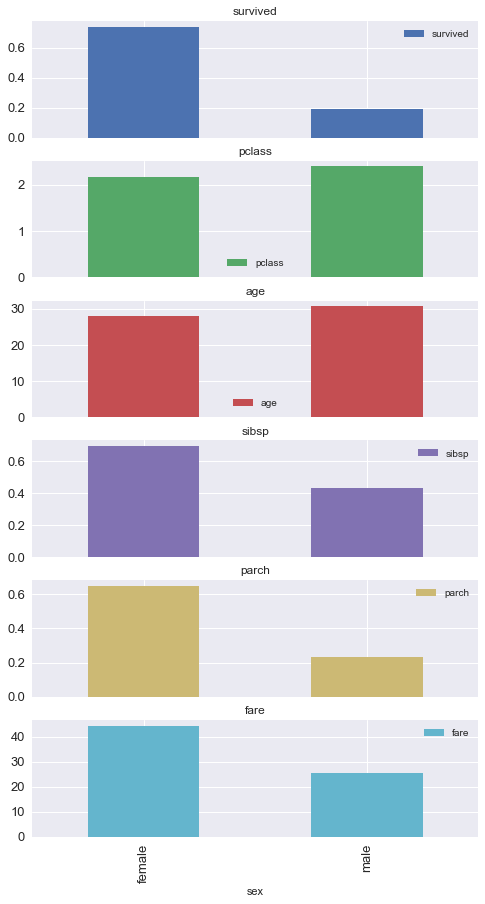
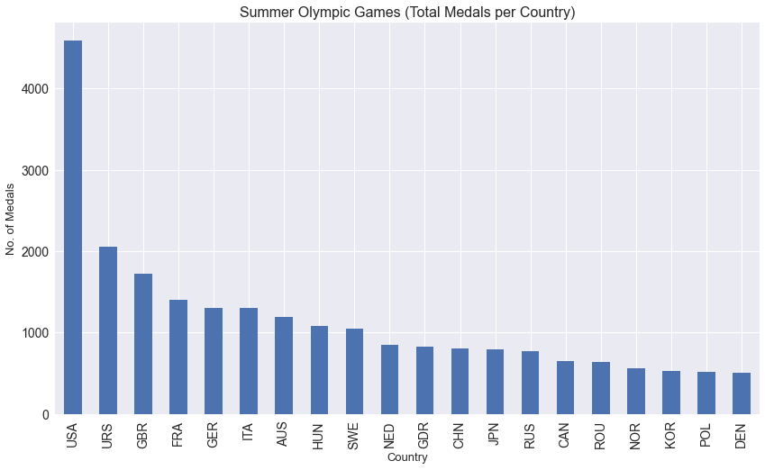
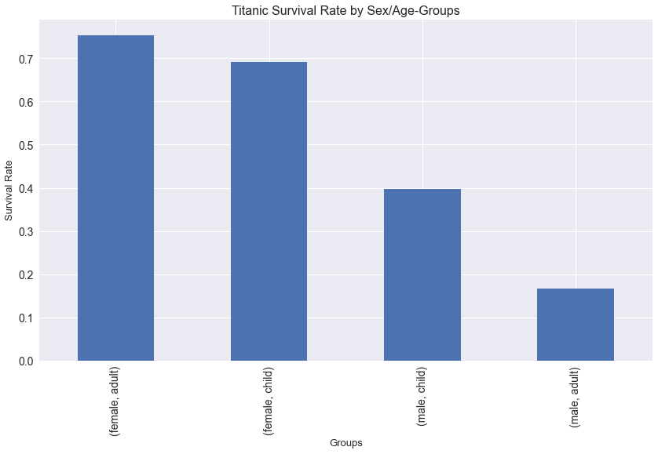
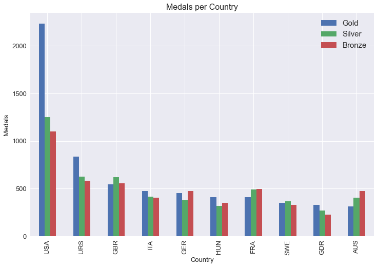

## Pandas GroupBy Operations

### Understanding GroupBy objects


```python
import pandas as pd
```


```python
titanic = pd.read_csv("titanic.csv")
```


```python
titanic.head()
```


<div>
<style scoped>
    .dataframe tbody tr th:only-of-type {
        vertical-align: middle;
    }

    .dataframe tbody tr th {
        vertical-align: top;
    }

    .dataframe thead th {
        text-align: right;
    }
</style>
<table border="1" class="dataframe">
  <thead>
    <tr style="text-align: right;">
      <th></th>
      <th>survived</th>
      <th>pclass</th>
      <th>sex</th>
      <th>age</th>
      <th>sibsp</th>
      <th>parch</th>
      <th>fare</th>
      <th>embarked</th>
      <th>deck</th>
    </tr>
  </thead>
  <tbody>
    <tr>
      <th>0</th>
      <td>0</td>
      <td>3</td>
      <td>male</td>
      <td>22.0</td>
      <td>1</td>
      <td>0</td>
      <td>7.2500</td>
      <td>S</td>
      <td>NaN</td>
    </tr>
    <tr>
      <th>1</th>
      <td>1</td>
      <td>1</td>
      <td>female</td>
      <td>38.0</td>
      <td>1</td>
      <td>0</td>
      <td>71.2833</td>
      <td>C</td>
      <td>C</td>
    </tr>
    <tr>
      <th>2</th>
      <td>1</td>
      <td>3</td>
      <td>female</td>
      <td>26.0</td>
      <td>0</td>
      <td>0</td>
      <td>7.9250</td>
      <td>S</td>
      <td>NaN</td>
    </tr>
    <tr>
      <th>3</th>
      <td>1</td>
      <td>1</td>
      <td>female</td>
      <td>35.0</td>
      <td>1</td>
      <td>0</td>
      <td>53.1000</td>
      <td>S</td>
      <td>C</td>
    </tr>
    <tr>
      <th>4</th>
      <td>0</td>
      <td>3</td>
      <td>male</td>
      <td>35.0</td>
      <td>0</td>
      <td>0</td>
      <td>8.0500</td>
      <td>S</td>
      <td>NaN</td>
    </tr>
  </tbody>
</table>
</div>


```python
titanic.tail()
```


```python
titanic.info()
```

    <class 'pandas.core.frame.DataFrame'>
    RangeIndex: 891 entries, 0 to 890
    Data columns (total 9 columns):
     #   Column    Non-Null Count  Dtype  
    ---  ------    --------------  -----  
     0   survived  891 non-null    int64  
     1   pclass    891 non-null    int64  
     2   sex       891 non-null    object 
     3   age       714 non-null    float64
     4   sibsp     891 non-null    int64  
     5   parch     891 non-null    int64  
     6   fare      891 non-null    float64
     7   embarked  889 non-null    object 
     8   deck      203 non-null    object 
    dtypes: float64(2), int64(4), object(3)
    memory usage: 62.8+ KB
    


```python
titanic_slice = titanic.iloc[:10, [2,3]]
```


```python
titanic_slice
```


<div>
<style scoped>
    .dataframe tbody tr th:only-of-type {
        vertical-align: middle;
    }

    .dataframe tbody tr th {
        vertical-align: top;
    }

    .dataframe thead th {
        text-align: right;
    }
</style>
<table border="1" class="dataframe">
  <thead>
    <tr style="text-align: right;">
      <th></th>
      <th>sex</th>
      <th>age</th>
    </tr>
  </thead>
  <tbody>
    <tr>
      <th>0</th>
      <td>male</td>
      <td>22.0</td>
    </tr>
    <tr>
      <th>1</th>
      <td>female</td>
      <td>38.0</td>
    </tr>
    <tr>
      <th>2</th>
      <td>female</td>
      <td>26.0</td>
    </tr>
    <tr>
      <th>3</th>
      <td>female</td>
      <td>35.0</td>
    </tr>
    <tr>
      <th>4</th>
      <td>male</td>
      <td>35.0</td>
    </tr>
    <tr>
      <th>5</th>
      <td>male</td>
      <td>NaN</td>
    </tr>
    <tr>
      <th>6</th>
      <td>male</td>
      <td>54.0</td>
    </tr>
    <tr>
      <th>7</th>
      <td>male</td>
      <td>2.0</td>
    </tr>
    <tr>
      <th>8</th>
      <td>female</td>
      <td>27.0</td>
    </tr>
    <tr>
      <th>9</th>
      <td>female</td>
      <td>14.0</td>
    </tr>
  </tbody>
</table>
</div>


```python
titanic_slice.groupby("sex")
```


    <pandas.core.groupby.generic.DataFrameGroupBy object at 0x0000027661634B20>


```python
gbo = titanic_slice.groupby("sex")
```


```python
type(gbo)
```


    pandas.core.groupby.generic.DataFrameGroupBy


```python
gbo.groups
```


    {'female': [1, 2, 3, 8, 9], 'male': [0, 4, 5, 6, 7]}


```python
l = list(gbo)
```


```python
l
```


    [('female',
            sex   age
      1  female  38.0
      2  female  26.0
      3  female  35.0
      8  female  27.0
      9  female  14.0),
     ('male',
          sex   age
      0  male  22.0
      4  male  35.0
      5  male   NaN
      6  male  54.0
      7  male   2.0)]


```python
len(l)
```


    2


```python
l[0]
```


    ('female',
           sex   age
     1  female  38.0
     2  female  26.0
     3  female  35.0
     8  female  27.0
     9  female  14.0)


```python
type(l[0])
```


    tuple


```python
l[0][0]
```


    'female'


```python
l[0][1]
```


<div>
<style scoped>
    .dataframe tbody tr th:only-of-type {
        vertical-align: middle;
    }

    .dataframe tbody tr th {
        vertical-align: top;
    }

    .dataframe thead th {
        text-align: right;
    }
</style>
<table border="1" class="dataframe">
  <thead>
    <tr style="text-align: right;">
      <th></th>
      <th>sex</th>
      <th>age</th>
    </tr>
  </thead>
  <tbody>
    <tr>
      <th>1</th>
      <td>female</td>
      <td>38.0</td>
    </tr>
    <tr>
      <th>2</th>
      <td>female</td>
      <td>26.0</td>
    </tr>
    <tr>
      <th>3</th>
      <td>female</td>
      <td>35.0</td>
    </tr>
    <tr>
      <th>8</th>
      <td>female</td>
      <td>27.0</td>
    </tr>
    <tr>
      <th>9</th>
      <td>female</td>
      <td>14.0</td>
    </tr>
  </tbody>
</table>
</div>


```python
type(l[0][1])
```


    pandas.core.frame.DataFrame


```python
l[1]
```


    ('male',
         sex   age
     0  male  22.0
     4  male  35.0
     5  male   NaN
     6  male  54.0
     7  male   2.0)


```python
titanic_slice.loc[titanic_slice.sex == "female"]
```


<div>
<style scoped>
    .dataframe tbody tr th:only-of-type {
        vertical-align: middle;
    }

    .dataframe tbody tr th {
        vertical-align: top;
    }

    .dataframe thead th {
        text-align: right;
    }
</style>
<table border="1" class="dataframe">
  <thead>
    <tr style="text-align: right;">
      <th></th>
      <th>sex</th>
      <th>age</th>
    </tr>
  </thead>
  <tbody>
    <tr>
      <th>1</th>
      <td>female</td>
      <td>38.0</td>
    </tr>
    <tr>
      <th>2</th>
      <td>female</td>
      <td>26.0</td>
    </tr>
    <tr>
      <th>3</th>
      <td>female</td>
      <td>35.0</td>
    </tr>
    <tr>
      <th>8</th>
      <td>female</td>
      <td>27.0</td>
    </tr>
    <tr>
      <th>9</th>
      <td>female</td>
      <td>14.0</td>
    </tr>
  </tbody>
</table>
</div>


```python
titanic_slice_f = titanic_slice.loc[titanic_slice.sex == "female"]
titanic_slice_f
```


<div>
<style scoped>
    .dataframe tbody tr th:only-of-type {
        vertical-align: middle;
    }

    .dataframe tbody tr th {
        vertical-align: top;
    }

    .dataframe thead th {
        text-align: right;
    }
</style>
<table border="1" class="dataframe">
  <thead>
    <tr style="text-align: right;">
      <th></th>
      <th>sex</th>
      <th>age</th>
    </tr>
  </thead>
  <tbody>
    <tr>
      <th>1</th>
      <td>female</td>
      <td>38.0</td>
    </tr>
    <tr>
      <th>2</th>
      <td>female</td>
      <td>26.0</td>
    </tr>
    <tr>
      <th>3</th>
      <td>female</td>
      <td>35.0</td>
    </tr>
    <tr>
      <th>8</th>
      <td>female</td>
      <td>27.0</td>
    </tr>
    <tr>
      <th>9</th>
      <td>female</td>
      <td>14.0</td>
    </tr>
  </tbody>
</table>
</div>


```python
titanic_slice_m = titanic_slice.loc[titanic_slice.sex == "male"]
titanic_slice_m
```


<div>
<style scoped>
    .dataframe tbody tr th:only-of-type {
        vertical-align: middle;
    }

    .dataframe tbody tr th {
        vertical-align: top;
    }

    .dataframe thead th {
        text-align: right;
    }
</style>
<table border="1" class="dataframe">
  <thead>
    <tr style="text-align: right;">
      <th></th>
      <th>sex</th>
      <th>age</th>
    </tr>
  </thead>
  <tbody>
    <tr>
      <th>0</th>
      <td>male</td>
      <td>22.0</td>
    </tr>
    <tr>
      <th>4</th>
      <td>male</td>
      <td>35.0</td>
    </tr>
    <tr>
      <th>5</th>
      <td>male</td>
      <td>NaN</td>
    </tr>
    <tr>
      <th>6</th>
      <td>male</td>
      <td>54.0</td>
    </tr>
    <tr>
      <th>7</th>
      <td>male</td>
      <td>2.0</td>
    </tr>
  </tbody>
</table>
</div>


```python
titanic_slice_f.equals(l[0][1])
```


    True


```python
for element in gbo:
    print(element[1])
```

          sex   age
    1  female  38.0
    2  female  26.0
    3  female  35.0
    8  female  27.0
    9  female  14.0
        sex   age
    0  male  22.0
    4  male  35.0
    5  male   NaN
    6  male  54.0
    7  male   2.0
    


```python

```

### Splitting with many Keys


```python
import pandas as pd
```


```python
summer = pd.read_csv("datasets/summer.csv")
```


```python
summer.head()
```


<div>
<style scoped>
    .dataframe tbody tr th:only-of-type {
        vertical-align: middle;
    }

    .dataframe tbody tr th {
        vertical-align: top;
    }

    .dataframe thead th {
        text-align: right;
    }
</style>
<table border="1" class="dataframe">
  <thead>
    <tr style="text-align: right;">
      <th></th>
      <th>Year</th>
      <th>City</th>
      <th>Sport</th>
      <th>Discipline</th>
      <th>Athlete</th>
      <th>Country</th>
      <th>Gender</th>
      <th>Event</th>
      <th>Medal</th>
    </tr>
  </thead>
  <tbody>
    <tr>
      <th>0</th>
      <td>1896</td>
      <td>Athens</td>
      <td>Aquatics</td>
      <td>Swimming</td>
      <td>HAJOS, Alfred</td>
      <td>HUN</td>
      <td>Men</td>
      <td>100M Freestyle</td>
      <td>Gold</td>
    </tr>
    <tr>
      <th>1</th>
      <td>1896</td>
      <td>Athens</td>
      <td>Aquatics</td>
      <td>Swimming</td>
      <td>HERSCHMANN, Otto</td>
      <td>AUT</td>
      <td>Men</td>
      <td>100M Freestyle</td>
      <td>Silver</td>
    </tr>
    <tr>
      <th>2</th>
      <td>1896</td>
      <td>Athens</td>
      <td>Aquatics</td>
      <td>Swimming</td>
      <td>DRIVAS, Dimitrios</td>
      <td>GRE</td>
      <td>Men</td>
      <td>100M Freestyle For Sailors</td>
      <td>Bronze</td>
    </tr>
    <tr>
      <th>3</th>
      <td>1896</td>
      <td>Athens</td>
      <td>Aquatics</td>
      <td>Swimming</td>
      <td>MALOKINIS, Ioannis</td>
      <td>GRE</td>
      <td>Men</td>
      <td>100M Freestyle For Sailors</td>
      <td>Gold</td>
    </tr>
    <tr>
      <th>4</th>
      <td>1896</td>
      <td>Athens</td>
      <td>Aquatics</td>
      <td>Swimming</td>
      <td>CHASAPIS, Spiridon</td>
      <td>GRE</td>
      <td>Men</td>
      <td>100M Freestyle For Sailors</td>
      <td>Silver</td>
    </tr>
  </tbody>
</table>
</div>


```python
summer.info()
```

    <class 'pandas.core.frame.DataFrame'>
    RangeIndex: 31165 entries, 0 to 31164
    Data columns (total 9 columns):
     #   Column      Non-Null Count  Dtype 
    ---  ------      --------------  ----- 
     0   Year        31165 non-null  int64 
     1   City        31165 non-null  object
     2   Sport       31165 non-null  object
     3   Discipline  31165 non-null  object
     4   Athlete     31165 non-null  object
     5   Country     31161 non-null  object
     6   Gender      31165 non-null  object
     7   Event       31165 non-null  object
     8   Medal       31165 non-null  object
    dtypes: int64(1), object(8)
    memory usage: 2.1+ MB
    


```python
summer.Country.nunique()
```


    147


```python
split1 = summer.groupby("Country")
```


```python
l = list(split1)
l[:2]
```


    [('AFG',
             Year     City      Sport Discipline           Athlete Country Gender  \
      28965  2008  Beijing  Taekwondo  Taekwondo  NIKPAI, Rohullah     AFG    Men   
      30929  2012   London  Taekwondo  Taekwondo  NIKPAI, Rohullah     AFG    Men   
      
                  Event   Medal  
      28965     - 58 KG  Bronze  
      30929  58 - 68 KG  Bronze  ),
     ('AHO',
             Year   City    Sport Discipline          Athlete Country Gender  \
      19323  1988  Seoul  Sailing    Sailing  BOERSMA, Jan D.     AHO    Men   
      
                           Event   Medal  
      19323  Board (Division Ii)  Silver  )]


```python
len(l)
```


    147


```python
l[100][1]
```


<div>
<style scoped>
    .dataframe tbody tr th:only-of-type {
        vertical-align: middle;
    }

    .dataframe tbody tr th {
        vertical-align: top;
    }

    .dataframe thead th {
        text-align: right;
    }
</style>
<table border="1" class="dataframe">
  <thead>
    <tr style="text-align: right;">
      <th></th>
      <th>Year</th>
      <th>City</th>
      <th>Sport</th>
      <th>Discipline</th>
      <th>Athlete</th>
      <th>Country</th>
      <th>Gender</th>
      <th>Event</th>
      <th>Medal</th>
    </tr>
  </thead>
  <tbody>
    <tr>
      <th>5031</th>
      <td>1928</td>
      <td>Amsterdam</td>
      <td>Aquatics</td>
      <td>Swimming</td>
      <td>YLDEFONSO, Teofilo</td>
      <td>PHI</td>
      <td>Men</td>
      <td>200M Breaststroke</td>
      <td>Bronze</td>
    </tr>
    <tr>
      <th>5741</th>
      <td>1932</td>
      <td>Los Angeles</td>
      <td>Aquatics</td>
      <td>Swimming</td>
      <td>YLDEFONSO, Teofilo</td>
      <td>PHI</td>
      <td>Men</td>
      <td>200M Breaststroke</td>
      <td>Bronze</td>
    </tr>
    <tr>
      <th>5889</th>
      <td>1932</td>
      <td>Los Angeles</td>
      <td>Athletics</td>
      <td>Athletics</td>
      <td>TORIBIO, Simeon Galvez</td>
      <td>PHI</td>
      <td>Men</td>
      <td>High Jump</td>
      <td>Bronze</td>
    </tr>
    <tr>
      <th>5922</th>
      <td>1932</td>
      <td>Los Angeles</td>
      <td>Boxing</td>
      <td>Boxing</td>
      <td>VILLANUEVA, Jose</td>
      <td>PHI</td>
      <td>Men</td>
      <td>50.8 - 54KG (Bantamweight)</td>
      <td>Bronze</td>
    </tr>
    <tr>
      <th>6447</th>
      <td>1936</td>
      <td>Berlin</td>
      <td>Athletics</td>
      <td>Athletics</td>
      <td>WHITE, Miguel S.</td>
      <td>PHI</td>
      <td>Men</td>
      <td>400M Hurdles</td>
      <td>Bronze</td>
    </tr>
    <tr>
      <th>11005</th>
      <td>1964</td>
      <td>Tokyo</td>
      <td>Boxing</td>
      <td>Boxing</td>
      <td>VILLANUEVA, Anthony N.</td>
      <td>PHI</td>
      <td>Men</td>
      <td>54 - 57KG (Featherweight)</td>
      <td>Silver</td>
    </tr>
    <tr>
      <th>18513</th>
      <td>1988</td>
      <td>Seoul</td>
      <td>Boxing</td>
      <td>Boxing</td>
      <td>SERANTES, Leopoldo</td>
      <td>PHI</td>
      <td>Men</td>
      <td>- 48KG (Light-Flyweight)</td>
      <td>Bronze</td>
    </tr>
    <tr>
      <th>20184</th>
      <td>1992</td>
      <td>Barcelona</td>
      <td>Boxing</td>
      <td>Boxing</td>
      <td>VELASCO, Roel</td>
      <td>PHI</td>
      <td>Men</td>
      <td>- 48KG (Light-Flyweight)</td>
      <td>Bronze</td>
    </tr>
    <tr>
      <th>21927</th>
      <td>1996</td>
      <td>Atlanta</td>
      <td>Boxing</td>
      <td>Boxing</td>
      <td>VELASCO, Mansueto</td>
      <td>PHI</td>
      <td>Men</td>
      <td>- 48KG (Light-Flyweight)</td>
      <td>Silver</td>
    </tr>
  </tbody>
</table>
</div>


```python
split2 = summer.groupby(by = ["Country", "Gender"])
```


```python
l2 = list(split2)
l2[:2]
```


    [(('AFG', 'Men'),
             Year     City      Sport Discipline           Athlete Country Gender  \
      28965  2008  Beijing  Taekwondo  Taekwondo  NIKPAI, Rohullah     AFG    Men   
      30929  2012   London  Taekwondo  Taekwondo  NIKPAI, Rohullah     AFG    Men   
      
                  Event   Medal  
      28965     - 58 KG  Bronze  
      30929  58 - 68 KG  Bronze  ),
     (('AHO', 'Men'),
             Year   City    Sport Discipline          Athlete Country Gender  \
      19323  1988  Seoul  Sailing    Sailing  BOERSMA, Jan D.     AHO    Men   
      
                           Event   Medal  
      19323  Board (Division Ii)  Silver  )]


```python
len(l2)
```


    236


```python
l2[104]
```


```python
l2[104][0]
```


```python
l2[104][1]
```


```python

```

### split-apply-combine explained


```python
import pandas as pd
```


```python
titanic = pd.read_csv("titanic.csv")
```


```python
titanic_slice = titanic.iloc[:10, [2,3]]
```


```python
titanic_slice
```


<div>
<style scoped>
    .dataframe tbody tr th:only-of-type {
        vertical-align: middle;
    }

    .dataframe tbody tr th {
        vertical-align: top;
    }

    .dataframe thead th {
        text-align: right;
    }
</style>
<table border="1" class="dataframe">
  <thead>
    <tr style="text-align: right;">
      <th></th>
      <th>sex</th>
      <th>age</th>
    </tr>
  </thead>
  <tbody>
    <tr>
      <th>0</th>
      <td>male</td>
      <td>22.0</td>
    </tr>
    <tr>
      <th>1</th>
      <td>female</td>
      <td>38.0</td>
    </tr>
    <tr>
      <th>2</th>
      <td>female</td>
      <td>26.0</td>
    </tr>
    <tr>
      <th>3</th>
      <td>female</td>
      <td>35.0</td>
    </tr>
    <tr>
      <th>4</th>
      <td>male</td>
      <td>35.0</td>
    </tr>
    <tr>
      <th>5</th>
      <td>male</td>
      <td>NaN</td>
    </tr>
    <tr>
      <th>6</th>
      <td>male</td>
      <td>54.0</td>
    </tr>
    <tr>
      <th>7</th>
      <td>male</td>
      <td>2.0</td>
    </tr>
    <tr>
      <th>8</th>
      <td>female</td>
      <td>27.0</td>
    </tr>
    <tr>
      <th>9</th>
      <td>female</td>
      <td>14.0</td>
    </tr>
  </tbody>
</table>
</div>


```python
list(titanic_slice.groupby("sex"))[0][1]
```


<div>
<style scoped>
    .dataframe tbody tr th:only-of-type {
        vertical-align: middle;
    }

    .dataframe tbody tr th {
        vertical-align: top;
    }

    .dataframe thead th {
        text-align: right;
    }
</style>
<table border="1" class="dataframe">
  <thead>
    <tr style="text-align: right;">
      <th></th>
      <th>sex</th>
      <th>age</th>
    </tr>
  </thead>
  <tbody>
    <tr>
      <th>1</th>
      <td>female</td>
      <td>38.0</td>
    </tr>
    <tr>
      <th>2</th>
      <td>female</td>
      <td>26.0</td>
    </tr>
    <tr>
      <th>3</th>
      <td>female</td>
      <td>35.0</td>
    </tr>
    <tr>
      <th>8</th>
      <td>female</td>
      <td>27.0</td>
    </tr>
    <tr>
      <th>9</th>
      <td>female</td>
      <td>14.0</td>
    </tr>
  </tbody>
</table>
</div>


```python
list(titanic_slice.groupby("sex"))[1][1]
```


```python
titanic_slice.groupby("sex").mean()
```


<div>
<style scoped>
    .dataframe tbody tr th:only-of-type {
        vertical-align: middle;
    }

    .dataframe tbody tr th {
        vertical-align: top;
    }

    .dataframe thead th {
        text-align: right;
    }
</style>
<table border="1" class="dataframe">
  <thead>
    <tr style="text-align: right;">
      <th></th>
      <th>age</th>
    </tr>
    <tr>
      <th>sex</th>
      <th></th>
    </tr>
  </thead>
  <tbody>
    <tr>
      <th>female</th>
      <td>28.00</td>
    </tr>
    <tr>
      <th>male</th>
      <td>28.25</td>
    </tr>
  </tbody>
</table>
</div>


```python
titanic.groupby("sex").survived.sum()
```


    sex
    female    233
    male      109
    Name: survived, dtype: int64


```python
titanic.groupby("sex")[["fare", "age"]].max()
```


<div>
<style scoped>
    .dataframe tbody tr th:only-of-type {
        vertical-align: middle;
    }

    .dataframe tbody tr th {
        vertical-align: top;
    }

    .dataframe thead th {
        text-align: right;
    }
</style>
<table border="1" class="dataframe">
  <thead>
    <tr style="text-align: right;">
      <th></th>
      <th>fare</th>
      <th>age</th>
    </tr>
    <tr>
      <th>sex</th>
      <th></th>
      <th></th>
    </tr>
  </thead>
  <tbody>
    <tr>
      <th>female</th>
      <td>512.3292</td>
      <td>63.0</td>
    </tr>
    <tr>
      <th>male</th>
      <td>512.3292</td>
      <td>80.0</td>
    </tr>
  </tbody>
</table>
</div>


```python
new_df = titanic.groupby("sex").mean()
```


```python
new_df
```


<div>
<style scoped>
    .dataframe tbody tr th:only-of-type {
        vertical-align: middle;
    }

    .dataframe tbody tr th {
        vertical-align: top;
    }

    .dataframe thead th {
        text-align: right;
    }
</style>
<table border="1" class="dataframe">
  <thead>
    <tr style="text-align: right;">
      <th></th>
      <th>survived</th>
      <th>pclass</th>
      <th>age</th>
      <th>sibsp</th>
      <th>parch</th>
      <th>fare</th>
    </tr>
    <tr>
      <th>sex</th>
      <th></th>
      <th></th>
      <th></th>
      <th></th>
      <th></th>
      <th></th>
    </tr>
  </thead>
  <tbody>
    <tr>
      <th>female</th>
      <td>0.742038</td>
      <td>2.159236</td>
      <td>27.915709</td>
      <td>0.694268</td>
      <td>0.649682</td>
      <td>44.479818</td>
    </tr>
    <tr>
      <th>male</th>
      <td>0.188908</td>
      <td>2.389948</td>
      <td>30.726645</td>
      <td>0.429809</td>
      <td>0.235702</td>
      <td>25.523893</td>
    </tr>
  </tbody>
</table>
</div>


```python
%matplotlib inline
import matplotlib.pyplot as plt
plt.style.use("seaborn")
```


```python
new_df.plot(kind = "bar", subplots = True, figsize = (8,15), fontsize = 13)
plt.show()
```


    

    


```python

```

### split-apply-combine applied


```python
import pandas as pd
```


```python
summer = pd.read_csv("summer.csv")
```


```python
summer.head()
```


```python
summer.info()
```


```python
medals_per_country = summer.groupby("Country").Medal.count().nlargest(n = 20)
medals_per_country
```


    Country
    USA    4585
    URS    2049
    GBR    1720
    FRA    1396
    GER    1305
    ITA    1296
    AUS    1189
    HUN    1079
    SWE    1044
    NED     851
    GDR     825
    CHN     807
    JPN     788
    RUS     768
    CAN     649
    ROU     640
    NOR     554
    KOR     529
    POL     511
    DEN     507
    Name: Medal, dtype: int64


```python
%matplotlib inline
import matplotlib.pyplot as plt
plt.style.use("seaborn")
```


```python
medals_per_country.plot(kind = "bar", figsize = (14, 8), fontsize = 14)
plt.xlabel("Country", fontsize = 13)
plt.ylabel("No. of Medals", fontsize = 13)
plt.title("Summer Olympic Games (Total Medals per Country)", fontsize = 16)
plt.show()
```


    

    


```python
titanic = pd.read_csv("titanic.csv")
```


```python
titanic.head()
```


```python
titanic.info()
```


```python
titanic.describe()
```


```python
titanic.fare.mean()
```


    32.204207968574636


```python
titanic.groupby("pclass").fare.mean()
```


    pclass
    1    84.154687
    2    20.662183
    3    13.675550
    Name: fare, dtype: float64


```python
titanic.survived.sum()
```


    342


```python
titanic.survived.mean()
```


    0.3838383838383838


```python
titanic.groupby("sex").survived.mean()
```


    sex
    female    0.742038
    male      0.188908
    Name: survived, dtype: float64


```python
titanic.groupby("pclass").survived.mean()
```


    pclass
    1    0.629630
    2    0.472826
    3    0.242363
    Name: survived, dtype: float64


```python
titanic["ad_chi"] = "adult"
```


```python
titanic.loc[titanic.age < 18, "ad_chi"] = "child"
```


```python
titanic.head(20)
```


```python
titanic.ad_chi.value_counts()
```


    adult    778
    child    113
    Name: ad_chi, dtype: int64


```python
titanic.groupby("ad_chi").survived.mean()
```


    ad_chi
    adult    0.361183
    child    0.539823
    Name: survived, dtype: float64


```python
titanic.groupby(["sex", "ad_chi"]).survived.count()
```


    sex     ad_chi
    female  adult     259
            child      55
    male    adult     519
            child      58
    Name: survived, dtype: int64


```python
titanic.groupby(["sex", "ad_chi"]).survived.mean().sort_values(ascending = False)
```


    sex     ad_chi
    female  adult     0.752896
            child     0.690909
    male    child     0.396552
            adult     0.165703
    Name: survived, dtype: float64


```python
w_and_c_first = titanic.groupby(["sex", "ad_chi"]).survived.mean().sort_values(ascending = False)
```


```python
w_and_c_first.plot(kind = "bar", figsize = (14,8), fontsize = 14)
plt.xlabel("Groups", fontsize = 13)
plt.ylabel("Survival Rate", fontsize = 13)
plt.title("Titanic Survival Rate by Sex/Age-Groups", fontsize = 16)
plt.show()
```


    

    


```python

```

### Advanced Aggregation with agg()


```python
import pandas as pd
```


```python
titanic = pd.read_csv("titanic.csv", usecols = ["survived", "pclass", "sex", "age", "fare"])
```


```python
titanic.head()
```


```python
titanic.groupby("sex").mean()
```


<div>
<style scoped>
    .dataframe tbody tr th:only-of-type {
        vertical-align: middle;
    }

    .dataframe tbody tr th {
        vertical-align: top;
    }

    .dataframe thead th {
        text-align: right;
    }
</style>
<table border="1" class="dataframe">
  <thead>
    <tr style="text-align: right;">
      <th></th>
      <th>survived</th>
      <th>pclass</th>
      <th>age</th>
      <th>fare</th>
    </tr>
    <tr>
      <th>sex</th>
      <th></th>
      <th></th>
      <th></th>
      <th></th>
    </tr>
  </thead>
  <tbody>
    <tr>
      <th>female</th>
      <td>0.742038</td>
      <td>2.159236</td>
      <td>27.915709</td>
      <td>44.479818</td>
    </tr>
    <tr>
      <th>male</th>
      <td>0.188908</td>
      <td>2.389948</td>
      <td>30.726645</td>
      <td>25.523893</td>
    </tr>
  </tbody>
</table>
</div>


```python
titanic.groupby("sex").sum()
```


<div>
<style scoped>
    .dataframe tbody tr th:only-of-type {
        vertical-align: middle;
    }

    .dataframe tbody tr th {
        vertical-align: top;
    }

    .dataframe thead th {
        text-align: right;
    }
</style>
<table border="1" class="dataframe">
  <thead>
    <tr style="text-align: right;">
      <th></th>
      <th>survived</th>
      <th>pclass</th>
      <th>age</th>
      <th>fare</th>
    </tr>
    <tr>
      <th>sex</th>
      <th></th>
      <th></th>
      <th></th>
      <th></th>
    </tr>
  </thead>
  <tbody>
    <tr>
      <th>female</th>
      <td>233</td>
      <td>678</td>
      <td>7286.00</td>
      <td>13966.6628</td>
    </tr>
    <tr>
      <th>male</th>
      <td>109</td>
      <td>1379</td>
      <td>13919.17</td>
      <td>14727.2865</td>
    </tr>
  </tbody>
</table>
</div>


```python
titanic.groupby("sex").agg(["mean", "sum", "min", "max"])
```


<div>
<style scoped>
    .dataframe tbody tr th:only-of-type {
        vertical-align: middle;
    }

    .dataframe tbody tr th {
        vertical-align: top;
    }

    .dataframe thead tr th {
        text-align: left;
    }

    .dataframe thead tr:last-of-type th {
        text-align: right;
    }
</style>
<table border="1" class="dataframe">
  <thead>
    <tr>
      <th></th>
      <th colspan="4" halign="left">survived</th>
      <th colspan="4" halign="left">pclass</th>
      <th colspan="4" halign="left">age</th>
      <th colspan="4" halign="left">fare</th>
    </tr>
    <tr>
      <th></th>
      <th>mean</th>
      <th>sum</th>
      <th>min</th>
      <th>max</th>
      <th>mean</th>
      <th>sum</th>
      <th>min</th>
      <th>max</th>
      <th>mean</th>
      <th>sum</th>
      <th>min</th>
      <th>max</th>
      <th>mean</th>
      <th>sum</th>
      <th>min</th>
      <th>max</th>
    </tr>
    <tr>
      <th>sex</th>
      <th></th>
      <th></th>
      <th></th>
      <th></th>
      <th></th>
      <th></th>
      <th></th>
      <th></th>
      <th></th>
      <th></th>
      <th></th>
      <th></th>
      <th></th>
      <th></th>
      <th></th>
      <th></th>
    </tr>
  </thead>
  <tbody>
    <tr>
      <th>female</th>
      <td>0.742038</td>
      <td>233</td>
      <td>0</td>
      <td>1</td>
      <td>2.159236</td>
      <td>678</td>
      <td>1</td>
      <td>3</td>
      <td>27.915709</td>
      <td>7286.00</td>
      <td>0.75</td>
      <td>63.0</td>
      <td>44.479818</td>
      <td>13966.6628</td>
      <td>6.75</td>
      <td>512.3292</td>
    </tr>
    <tr>
      <th>male</th>
      <td>0.188908</td>
      <td>109</td>
      <td>0</td>
      <td>1</td>
      <td>2.389948</td>
      <td>1379</td>
      <td>1</td>
      <td>3</td>
      <td>30.726645</td>
      <td>13919.17</td>
      <td>0.42</td>
      <td>80.0</td>
      <td>25.523893</td>
      <td>14727.2865</td>
      <td>0.00</td>
      <td>512.3292</td>
    </tr>
  </tbody>
</table>
</div>


```python
titanic.groupby("sex").agg({"survived": ["sum", "mean"], "pclass": "mean", "age": ["mean", "median"], "fare": "max"})
```


<div>
<style scoped>
    .dataframe tbody tr th:only-of-type {
        vertical-align: middle;
    }

    .dataframe tbody tr th {
        vertical-align: top;
    }

    .dataframe thead tr th {
        text-align: left;
    }

    .dataframe thead tr:last-of-type th {
        text-align: right;
    }
</style>
<table border="1" class="dataframe">
  <thead>
    <tr>
      <th></th>
      <th colspan="2" halign="left">survived</th>
      <th>pclass</th>
      <th colspan="2" halign="left">age</th>
      <th>fare</th>
    </tr>
    <tr>
      <th></th>
      <th>sum</th>
      <th>mean</th>
      <th>mean</th>
      <th>mean</th>
      <th>median</th>
      <th>max</th>
    </tr>
    <tr>
      <th>sex</th>
      <th></th>
      <th></th>
      <th></th>
      <th></th>
      <th></th>
      <th></th>
    </tr>
  </thead>
  <tbody>
    <tr>
      <th>female</th>
      <td>233</td>
      <td>0.742038</td>
      <td>2.159236</td>
      <td>27.915709</td>
      <td>27.0</td>
      <td>512.3292</td>
    </tr>
    <tr>
      <th>male</th>
      <td>109</td>
      <td>0.188908</td>
      <td>2.389948</td>
      <td>30.726645</td>
      <td>29.0</td>
      <td>512.3292</td>
    </tr>
  </tbody>
</table>
</div>


```python

```

### GroupBy Aggregation with Relabeling (new in Version 0.25)


```python
import pandas as pd
```


```python
titanic = pd.read_csv("titanic.csv", usecols = ["survived", "pclass", "sex", "age", "fare"])
```


```python
titanic.head()
```


```python
titanic.groupby("sex").survived.mean()
```


    sex
    female    0.742038
    male      0.188908
    Name: survived, dtype: float64


```python
titanic.groupby("sex").agg(survival_rate = ("survived", "mean"))
```


<div>
<style scoped>
    .dataframe tbody tr th:only-of-type {
        vertical-align: middle;
    }

    .dataframe tbody tr th {
        vertical-align: top;
    }

    .dataframe thead th {
        text-align: right;
    }
</style>
<table border="1" class="dataframe">
  <thead>
    <tr style="text-align: right;">
      <th></th>
      <th>survival_rate</th>
    </tr>
    <tr>
      <th>sex</th>
      <th></th>
    </tr>
  </thead>
  <tbody>
    <tr>
      <th>female</th>
      <td>0.742038</td>
    </tr>
    <tr>
      <th>male</th>
      <td>0.188908</td>
    </tr>
  </tbody>
</table>
</div>


```python
titanic.groupby("sex").agg({"survived": ["sum", "mean"], "age": ["mean"]})
```


<div>
<style scoped>
    .dataframe tbody tr th:only-of-type {
        vertical-align: middle;
    }

    .dataframe tbody tr th {
        vertical-align: top;
    }

    .dataframe thead tr th {
        text-align: left;
    }

    .dataframe thead tr:last-of-type th {
        text-align: right;
    }
</style>
<table border="1" class="dataframe">
  <thead>
    <tr>
      <th></th>
      <th colspan="2" halign="left">survived</th>
      <th>age</th>
    </tr>
    <tr>
      <th></th>
      <th>sum</th>
      <th>mean</th>
      <th>mean</th>
    </tr>
    <tr>
      <th>sex</th>
      <th></th>
      <th></th>
      <th></th>
    </tr>
  </thead>
  <tbody>
    <tr>
      <th>female</th>
      <td>233</td>
      <td>0.742038</td>
      <td>27.915709</td>
    </tr>
    <tr>
      <th>male</th>
      <td>109</td>
      <td>0.188908</td>
      <td>30.726645</td>
    </tr>
  </tbody>
</table>
</div>


```python
titanic.groupby("sex").agg(survived_total = ("survived", "sum"), 
                           survival_rate = ("survived", "mean"), mean_age = ("age", "mean"))
```


<div>
<style scoped>
    .dataframe tbody tr th:only-of-type {
        vertical-align: middle;
    }

    .dataframe tbody tr th {
        vertical-align: top;
    }

    .dataframe thead th {
        text-align: right;
    }
</style>
<table border="1" class="dataframe">
  <thead>
    <tr style="text-align: right;">
      <th></th>
      <th>survived_total</th>
      <th>survival_rate</th>
      <th>mean_age</th>
    </tr>
    <tr>
      <th>sex</th>
      <th></th>
      <th></th>
      <th></th>
    </tr>
  </thead>
  <tbody>
    <tr>
      <th>female</th>
      <td>233</td>
      <td>0.742038</td>
      <td>27.915709</td>
    </tr>
    <tr>
      <th>male</th>
      <td>109</td>
      <td>0.188908</td>
      <td>30.726645</td>
    </tr>
  </tbody>
</table>
</div>


```python

```

### Transformation with transform()


```python
import pandas as pd
```


```python
titanic = pd.read_csv("titanic.csv")
```


```python
titanic.head()
```


```python
titanic.groupby(["sex", "pclass"]).survived.transform("mean")
```


    0      0.135447
    1      0.968085
    2      0.500000
    3      0.968085
    4      0.135447
             ...   
    886    0.157407
    887    0.968085
    888    0.500000
    889    0.368852
    890    0.135447
    Name: survived, Length: 891, dtype: float64


```python
titanic["group_surv_rate"] = titanic.groupby(["sex", "pclass"]).survived.transform("mean")
```


```python
titanic.head()
```


<div>
<style scoped>
    .dataframe tbody tr th:only-of-type {
        vertical-align: middle;
    }

    .dataframe tbody tr th {
        vertical-align: top;
    }

    .dataframe thead th {
        text-align: right;
    }
</style>
<table border="1" class="dataframe">
  <thead>
    <tr style="text-align: right;">
      <th></th>
      <th>survived</th>
      <th>pclass</th>
      <th>sex</th>
      <th>age</th>
      <th>sibsp</th>
      <th>parch</th>
      <th>fare</th>
      <th>embarked</th>
      <th>deck</th>
      <th>group_surv_rate</th>
    </tr>
  </thead>
  <tbody>
    <tr>
      <th>0</th>
      <td>0</td>
      <td>3</td>
      <td>male</td>
      <td>22.0</td>
      <td>1</td>
      <td>0</td>
      <td>7.2500</td>
      <td>S</td>
      <td>NaN</td>
      <td>0.135447</td>
    </tr>
    <tr>
      <th>1</th>
      <td>1</td>
      <td>1</td>
      <td>female</td>
      <td>38.0</td>
      <td>1</td>
      <td>0</td>
      <td>71.2833</td>
      <td>C</td>
      <td>C</td>
      <td>0.968085</td>
    </tr>
    <tr>
      <th>2</th>
      <td>1</td>
      <td>3</td>
      <td>female</td>
      <td>26.0</td>
      <td>0</td>
      <td>0</td>
      <td>7.9250</td>
      <td>S</td>
      <td>NaN</td>
      <td>0.500000</td>
    </tr>
    <tr>
      <th>3</th>
      <td>1</td>
      <td>1</td>
      <td>female</td>
      <td>35.0</td>
      <td>1</td>
      <td>0</td>
      <td>53.1000</td>
      <td>S</td>
      <td>C</td>
      <td>0.968085</td>
    </tr>
    <tr>
      <th>4</th>
      <td>0</td>
      <td>3</td>
      <td>male</td>
      <td>35.0</td>
      <td>0</td>
      <td>0</td>
      <td>8.0500</td>
      <td>S</td>
      <td>NaN</td>
      <td>0.135447</td>
    </tr>
  </tbody>
</table>
</div>


```python
titanic["outliers"] = abs(titanic.survived-titanic.group_surv_rate)
```


```python
titanic[titanic.outliers > 0.85]
```


```python

```

### Replacing NA Values by group-specific Values


```python
import pandas as pd
```


```python
titanic = pd.read_csv("titanic.csv")
```


```python
titanic.head(20)
```


```python
titanic.info()
```

    <class 'pandas.core.frame.DataFrame'>
    RangeIndex: 891 entries, 0 to 890
    Data columns (total 9 columns):
     #   Column    Non-Null Count  Dtype  
    ---  ------    --------------  -----  
     0   survived  891 non-null    int64  
     1   pclass    891 non-null    int64  
     2   sex       891 non-null    object 
     3   age       714 non-null    float64
     4   sibsp     891 non-null    int64  
     5   parch     891 non-null    int64  
     6   fare      891 non-null    float64
     7   embarked  889 non-null    object 
     8   deck      203 non-null    object 
    dtypes: float64(2), int64(4), object(3)
    memory usage: 62.8+ KB
    


```python
mean_age = titanic.age.mean()
mean_age
```


    29.69911764705882


```python
titanic.age.fillna(mean_age)
```


    0      22.000000
    1      38.000000
    2      26.000000
    3      35.000000
    4      35.000000
             ...    
    886    27.000000
    887    19.000000
    888    29.699118
    889    26.000000
    890    32.000000
    Name: age, Length: 891, dtype: float64


```python
titanic.groupby(["sex", "pclass"]).age.mean()
```


    sex     pclass
    female  1         34.611765
            2         28.722973
            3         21.750000
    male    1         41.281386
            2         30.740707
            3         26.507589
    Name: age, dtype: float64


```python
titanic["group_mean_age"] = titanic.groupby(["sex", "pclass"]).age.transform("mean")
```


```python
titanic.head(20)
```


<div>
<style scoped>
    .dataframe tbody tr th:only-of-type {
        vertical-align: middle;
    }

    .dataframe tbody tr th {
        vertical-align: top;
    }

    .dataframe thead th {
        text-align: right;
    }
</style>
<table border="1" class="dataframe">
  <thead>
    <tr style="text-align: right;">
      <th></th>
      <th>survived</th>
      <th>pclass</th>
      <th>sex</th>
      <th>age</th>
      <th>sibsp</th>
      <th>parch</th>
      <th>fare</th>
      <th>embarked</th>
      <th>deck</th>
      <th>group_mean_age</th>
    </tr>
  </thead>
  <tbody>
    <tr>
      <th>0</th>
      <td>0</td>
      <td>3</td>
      <td>male</td>
      <td>22.0</td>
      <td>1</td>
      <td>0</td>
      <td>7.2500</td>
      <td>S</td>
      <td>NaN</td>
      <td>26.507589</td>
    </tr>
    <tr>
      <th>1</th>
      <td>1</td>
      <td>1</td>
      <td>female</td>
      <td>38.0</td>
      <td>1</td>
      <td>0</td>
      <td>71.2833</td>
      <td>C</td>
      <td>C</td>
      <td>34.611765</td>
    </tr>
    <tr>
      <th>2</th>
      <td>1</td>
      <td>3</td>
      <td>female</td>
      <td>26.0</td>
      <td>0</td>
      <td>0</td>
      <td>7.9250</td>
      <td>S</td>
      <td>NaN</td>
      <td>21.750000</td>
    </tr>
    <tr>
      <th>3</th>
      <td>1</td>
      <td>1</td>
      <td>female</td>
      <td>35.0</td>
      <td>1</td>
      <td>0</td>
      <td>53.1000</td>
      <td>S</td>
      <td>C</td>
      <td>34.611765</td>
    </tr>
    <tr>
      <th>4</th>
      <td>0</td>
      <td>3</td>
      <td>male</td>
      <td>35.0</td>
      <td>0</td>
      <td>0</td>
      <td>8.0500</td>
      <td>S</td>
      <td>NaN</td>
      <td>26.507589</td>
    </tr>
    <tr>
      <th>5</th>
      <td>0</td>
      <td>3</td>
      <td>male</td>
      <td>NaN</td>
      <td>0</td>
      <td>0</td>
      <td>8.4583</td>
      <td>Q</td>
      <td>NaN</td>
      <td>26.507589</td>
    </tr>
    <tr>
      <th>6</th>
      <td>0</td>
      <td>1</td>
      <td>male</td>
      <td>54.0</td>
      <td>0</td>
      <td>0</td>
      <td>51.8625</td>
      <td>S</td>
      <td>E</td>
      <td>41.281386</td>
    </tr>
    <tr>
      <th>7</th>
      <td>0</td>
      <td>3</td>
      <td>male</td>
      <td>2.0</td>
      <td>3</td>
      <td>1</td>
      <td>21.0750</td>
      <td>S</td>
      <td>NaN</td>
      <td>26.507589</td>
    </tr>
    <tr>
      <th>8</th>
      <td>1</td>
      <td>3</td>
      <td>female</td>
      <td>27.0</td>
      <td>0</td>
      <td>2</td>
      <td>11.1333</td>
      <td>S</td>
      <td>NaN</td>
      <td>21.750000</td>
    </tr>
    <tr>
      <th>9</th>
      <td>1</td>
      <td>2</td>
      <td>female</td>
      <td>14.0</td>
      <td>1</td>
      <td>0</td>
      <td>30.0708</td>
      <td>C</td>
      <td>NaN</td>
      <td>28.722973</td>
    </tr>
    <tr>
      <th>10</th>
      <td>1</td>
      <td>3</td>
      <td>female</td>
      <td>4.0</td>
      <td>1</td>
      <td>1</td>
      <td>16.7000</td>
      <td>S</td>
      <td>G</td>
      <td>21.750000</td>
    </tr>
    <tr>
      <th>11</th>
      <td>1</td>
      <td>1</td>
      <td>female</td>
      <td>58.0</td>
      <td>0</td>
      <td>0</td>
      <td>26.5500</td>
      <td>S</td>
      <td>C</td>
      <td>34.611765</td>
    </tr>
    <tr>
      <th>12</th>
      <td>0</td>
      <td>3</td>
      <td>male</td>
      <td>20.0</td>
      <td>0</td>
      <td>0</td>
      <td>8.0500</td>
      <td>S</td>
      <td>NaN</td>
      <td>26.507589</td>
    </tr>
    <tr>
      <th>13</th>
      <td>0</td>
      <td>3</td>
      <td>male</td>
      <td>39.0</td>
      <td>1</td>
      <td>5</td>
      <td>31.2750</td>
      <td>S</td>
      <td>NaN</td>
      <td>26.507589</td>
    </tr>
    <tr>
      <th>14</th>
      <td>0</td>
      <td>3</td>
      <td>female</td>
      <td>14.0</td>
      <td>0</td>
      <td>0</td>
      <td>7.8542</td>
      <td>S</td>
      <td>NaN</td>
      <td>21.750000</td>
    </tr>
    <tr>
      <th>15</th>
      <td>1</td>
      <td>2</td>
      <td>female</td>
      <td>55.0</td>
      <td>0</td>
      <td>0</td>
      <td>16.0000</td>
      <td>S</td>
      <td>NaN</td>
      <td>28.722973</td>
    </tr>
    <tr>
      <th>16</th>
      <td>0</td>
      <td>3</td>
      <td>male</td>
      <td>2.0</td>
      <td>4</td>
      <td>1</td>
      <td>29.1250</td>
      <td>Q</td>
      <td>NaN</td>
      <td>26.507589</td>
    </tr>
    <tr>
      <th>17</th>
      <td>1</td>
      <td>2</td>
      <td>male</td>
      <td>NaN</td>
      <td>0</td>
      <td>0</td>
      <td>13.0000</td>
      <td>S</td>
      <td>NaN</td>
      <td>30.740707</td>
    </tr>
    <tr>
      <th>18</th>
      <td>0</td>
      <td>3</td>
      <td>female</td>
      <td>31.0</td>
      <td>1</td>
      <td>0</td>
      <td>18.0000</td>
      <td>S</td>
      <td>NaN</td>
      <td>21.750000</td>
    </tr>
    <tr>
      <th>19</th>
      <td>1</td>
      <td>3</td>
      <td>female</td>
      <td>NaN</td>
      <td>0</td>
      <td>0</td>
      <td>7.2250</td>
      <td>C</td>
      <td>NaN</td>
      <td>21.750000</td>
    </tr>
  </tbody>
</table>
</div>


```python
titanic.age.fillna(titanic.group_mean_age, inplace = True)
```


```python
titanic.head(20)
```


<div>
<style scoped>
    .dataframe tbody tr th:only-of-type {
        vertical-align: middle;
    }

    .dataframe tbody tr th {
        vertical-align: top;
    }

    .dataframe thead th {
        text-align: right;
    }
</style>
<table border="1" class="dataframe">
  <thead>
    <tr style="text-align: right;">
      <th></th>
      <th>survived</th>
      <th>pclass</th>
      <th>sex</th>
      <th>age</th>
      <th>sibsp</th>
      <th>parch</th>
      <th>fare</th>
      <th>embarked</th>
      <th>deck</th>
      <th>group_mean_age</th>
    </tr>
  </thead>
  <tbody>
    <tr>
      <th>0</th>
      <td>0</td>
      <td>3</td>
      <td>male</td>
      <td>22.000000</td>
      <td>1</td>
      <td>0</td>
      <td>7.2500</td>
      <td>S</td>
      <td>NaN</td>
      <td>26.507589</td>
    </tr>
    <tr>
      <th>1</th>
      <td>1</td>
      <td>1</td>
      <td>female</td>
      <td>38.000000</td>
      <td>1</td>
      <td>0</td>
      <td>71.2833</td>
      <td>C</td>
      <td>C</td>
      <td>34.611765</td>
    </tr>
    <tr>
      <th>2</th>
      <td>1</td>
      <td>3</td>
      <td>female</td>
      <td>26.000000</td>
      <td>0</td>
      <td>0</td>
      <td>7.9250</td>
      <td>S</td>
      <td>NaN</td>
      <td>21.750000</td>
    </tr>
    <tr>
      <th>3</th>
      <td>1</td>
      <td>1</td>
      <td>female</td>
      <td>35.000000</td>
      <td>1</td>
      <td>0</td>
      <td>53.1000</td>
      <td>S</td>
      <td>C</td>
      <td>34.611765</td>
    </tr>
    <tr>
      <th>4</th>
      <td>0</td>
      <td>3</td>
      <td>male</td>
      <td>35.000000</td>
      <td>0</td>
      <td>0</td>
      <td>8.0500</td>
      <td>S</td>
      <td>NaN</td>
      <td>26.507589</td>
    </tr>
    <tr>
      <th>5</th>
      <td>0</td>
      <td>3</td>
      <td>male</td>
      <td>26.507589</td>
      <td>0</td>
      <td>0</td>
      <td>8.4583</td>
      <td>Q</td>
      <td>NaN</td>
      <td>26.507589</td>
    </tr>
    <tr>
      <th>6</th>
      <td>0</td>
      <td>1</td>
      <td>male</td>
      <td>54.000000</td>
      <td>0</td>
      <td>0</td>
      <td>51.8625</td>
      <td>S</td>
      <td>E</td>
      <td>41.281386</td>
    </tr>
    <tr>
      <th>7</th>
      <td>0</td>
      <td>3</td>
      <td>male</td>
      <td>2.000000</td>
      <td>3</td>
      <td>1</td>
      <td>21.0750</td>
      <td>S</td>
      <td>NaN</td>
      <td>26.507589</td>
    </tr>
    <tr>
      <th>8</th>
      <td>1</td>
      <td>3</td>
      <td>female</td>
      <td>27.000000</td>
      <td>0</td>
      <td>2</td>
      <td>11.1333</td>
      <td>S</td>
      <td>NaN</td>
      <td>21.750000</td>
    </tr>
    <tr>
      <th>9</th>
      <td>1</td>
      <td>2</td>
      <td>female</td>
      <td>14.000000</td>
      <td>1</td>
      <td>0</td>
      <td>30.0708</td>
      <td>C</td>
      <td>NaN</td>
      <td>28.722973</td>
    </tr>
    <tr>
      <th>10</th>
      <td>1</td>
      <td>3</td>
      <td>female</td>
      <td>4.000000</td>
      <td>1</td>
      <td>1</td>
      <td>16.7000</td>
      <td>S</td>
      <td>G</td>
      <td>21.750000</td>
    </tr>
    <tr>
      <th>11</th>
      <td>1</td>
      <td>1</td>
      <td>female</td>
      <td>58.000000</td>
      <td>0</td>
      <td>0</td>
      <td>26.5500</td>
      <td>S</td>
      <td>C</td>
      <td>34.611765</td>
    </tr>
    <tr>
      <th>12</th>
      <td>0</td>
      <td>3</td>
      <td>male</td>
      <td>20.000000</td>
      <td>0</td>
      <td>0</td>
      <td>8.0500</td>
      <td>S</td>
      <td>NaN</td>
      <td>26.507589</td>
    </tr>
    <tr>
      <th>13</th>
      <td>0</td>
      <td>3</td>
      <td>male</td>
      <td>39.000000</td>
      <td>1</td>
      <td>5</td>
      <td>31.2750</td>
      <td>S</td>
      <td>NaN</td>
      <td>26.507589</td>
    </tr>
    <tr>
      <th>14</th>
      <td>0</td>
      <td>3</td>
      <td>female</td>
      <td>14.000000</td>
      <td>0</td>
      <td>0</td>
      <td>7.8542</td>
      <td>S</td>
      <td>NaN</td>
      <td>21.750000</td>
    </tr>
    <tr>
      <th>15</th>
      <td>1</td>
      <td>2</td>
      <td>female</td>
      <td>55.000000</td>
      <td>0</td>
      <td>0</td>
      <td>16.0000</td>
      <td>S</td>
      <td>NaN</td>
      <td>28.722973</td>
    </tr>
    <tr>
      <th>16</th>
      <td>0</td>
      <td>3</td>
      <td>male</td>
      <td>2.000000</td>
      <td>4</td>
      <td>1</td>
      <td>29.1250</td>
      <td>Q</td>
      <td>NaN</td>
      <td>26.507589</td>
    </tr>
    <tr>
      <th>17</th>
      <td>1</td>
      <td>2</td>
      <td>male</td>
      <td>30.740707</td>
      <td>0</td>
      <td>0</td>
      <td>13.0000</td>
      <td>S</td>
      <td>NaN</td>
      <td>30.740707</td>
    </tr>
    <tr>
      <th>18</th>
      <td>0</td>
      <td>3</td>
      <td>female</td>
      <td>31.000000</td>
      <td>1</td>
      <td>0</td>
      <td>18.0000</td>
      <td>S</td>
      <td>NaN</td>
      <td>21.750000</td>
    </tr>
    <tr>
      <th>19</th>
      <td>1</td>
      <td>3</td>
      <td>female</td>
      <td>21.750000</td>
      <td>0</td>
      <td>0</td>
      <td>7.2250</td>
      <td>C</td>
      <td>NaN</td>
      <td>21.750000</td>
    </tr>
  </tbody>
</table>
</div>


```python
titanic.info()
```

    <class 'pandas.core.frame.DataFrame'>
    RangeIndex: 891 entries, 0 to 890
    Data columns (total 10 columns):
     #   Column          Non-Null Count  Dtype  
    ---  ------          --------------  -----  
     0   survived        891 non-null    int64  
     1   pclass          891 non-null    int64  
     2   sex             891 non-null    object 
     3   age             891 non-null    float64
     4   sibsp           891 non-null    int64  
     5   parch           891 non-null    int64  
     6   fare            891 non-null    float64
     7   embarked        889 non-null    object 
     8   deck            203 non-null    object 
     9   group_mean_age  891 non-null    float64
    dtypes: float64(3), int64(4), object(3)
    memory usage: 69.7+ KB
    


```python

```

### Generalizing split-apply-combine with apply()


```python
import pandas as pd
```


```python
titanic = pd.read_csv("titanic.csv", usecols = ["survived", "pclass", "sex", "age", "fare"])
```


```python
titanic.head()
```


```python
titanic.groupby("sex").mean()
```


<div>
<style scoped>
    .dataframe tbody tr th:only-of-type {
        vertical-align: middle;
    }

    .dataframe tbody tr th {
        vertical-align: top;
    }

    .dataframe thead th {
        text-align: right;
    }
</style>
<table border="1" class="dataframe">
  <thead>
    <tr style="text-align: right;">
      <th></th>
      <th>survived</th>
      <th>pclass</th>
      <th>age</th>
      <th>fare</th>
    </tr>
    <tr>
      <th>sex</th>
      <th></th>
      <th></th>
      <th></th>
      <th></th>
    </tr>
  </thead>
  <tbody>
    <tr>
      <th>female</th>
      <td>0.742038</td>
      <td>2.159236</td>
      <td>27.915709</td>
      <td>44.479818</td>
    </tr>
    <tr>
      <th>male</th>
      <td>0.188908</td>
      <td>2.389948</td>
      <td>30.726645</td>
      <td>25.523893</td>
    </tr>
  </tbody>
</table>
</div>


```python
female_group = list(titanic.groupby("sex"))[0][1]
female_group
```


<div>
<style scoped>
    .dataframe tbody tr th:only-of-type {
        vertical-align: middle;
    }

    .dataframe tbody tr th {
        vertical-align: top;
    }

    .dataframe thead th {
        text-align: right;
    }
</style>
<table border="1" class="dataframe">
  <thead>
    <tr style="text-align: right;">
      <th></th>
      <th>survived</th>
      <th>pclass</th>
      <th>sex</th>
      <th>age</th>
      <th>fare</th>
    </tr>
  </thead>
  <tbody>
    <tr>
      <th>1</th>
      <td>1</td>
      <td>1</td>
      <td>female</td>
      <td>38.0</td>
      <td>71.2833</td>
    </tr>
    <tr>
      <th>2</th>
      <td>1</td>
      <td>3</td>
      <td>female</td>
      <td>26.0</td>
      <td>7.9250</td>
    </tr>
    <tr>
      <th>3</th>
      <td>1</td>
      <td>1</td>
      <td>female</td>
      <td>35.0</td>
      <td>53.1000</td>
    </tr>
    <tr>
      <th>8</th>
      <td>1</td>
      <td>3</td>
      <td>female</td>
      <td>27.0</td>
      <td>11.1333</td>
    </tr>
    <tr>
      <th>9</th>
      <td>1</td>
      <td>2</td>
      <td>female</td>
      <td>14.0</td>
      <td>30.0708</td>
    </tr>
    <tr>
      <th>...</th>
      <td>...</td>
      <td>...</td>
      <td>...</td>
      <td>...</td>
      <td>...</td>
    </tr>
    <tr>
      <th>880</th>
      <td>1</td>
      <td>2</td>
      <td>female</td>
      <td>25.0</td>
      <td>26.0000</td>
    </tr>
    <tr>
      <th>882</th>
      <td>0</td>
      <td>3</td>
      <td>female</td>
      <td>22.0</td>
      <td>10.5167</td>
    </tr>
    <tr>
      <th>885</th>
      <td>0</td>
      <td>3</td>
      <td>female</td>
      <td>39.0</td>
      <td>29.1250</td>
    </tr>
    <tr>
      <th>887</th>
      <td>1</td>
      <td>1</td>
      <td>female</td>
      <td>19.0</td>
      <td>30.0000</td>
    </tr>
    <tr>
      <th>888</th>
      <td>0</td>
      <td>3</td>
      <td>female</td>
      <td>NaN</td>
      <td>23.4500</td>
    </tr>
  </tbody>
</table>
<p>314 rows × 5 columns</p>
</div>


```python
female_group.mean().astype("float")
```

    C:\Users\LENOVO\AppData\Local\Temp/ipykernel_19564/2434558135.py:1: FutureWarning: Dropping of nuisance columns in DataFrame reductions (with 'numeric_only=None') is deprecated; in a future version this will raise TypeError.  Select only valid columns before calling the reduction.
      female_group.mean().astype("float")
    


    survived     0.742038
    pclass       2.159236
    age         27.915709
    fare        44.479818
    dtype: float64


```python
def group_mean(group):
    return group.mean()
```


```python
group_mean(female_group)
```

    C:\Users\LENOVO\AppData\Local\Temp/ipykernel_19564/359042690.py:2: FutureWarning: Dropping of nuisance columns in DataFrame reductions (with 'numeric_only=None') is deprecated; in a future version this will raise TypeError.  Select only valid columns before calling the reduction.
      return group.mean()
    


    survived     0.742038
    pclass       2.159236
    age         27.915709
    fare        44.479818
    dtype: float64


```python
titanic.groupby("sex").apply(group_mean)
```

    C:\Users\LENOVO\AppData\Local\Temp/ipykernel_19564/359042690.py:2: FutureWarning: Dropping of nuisance columns in DataFrame reductions (with 'numeric_only=None') is deprecated; in a future version this will raise TypeError.  Select only valid columns before calling the reduction.
      return group.mean()
    


<div>
<style scoped>
    .dataframe tbody tr th:only-of-type {
        vertical-align: middle;
    }

    .dataframe tbody tr th {
        vertical-align: top;
    }

    .dataframe thead th {
        text-align: right;
    }
</style>
<table border="1" class="dataframe">
  <thead>
    <tr style="text-align: right;">
      <th></th>
      <th>survived</th>
      <th>pclass</th>
      <th>age</th>
      <th>fare</th>
    </tr>
    <tr>
      <th>sex</th>
      <th></th>
      <th></th>
      <th></th>
      <th></th>
    </tr>
  </thead>
  <tbody>
    <tr>
      <th>female</th>
      <td>0.742038</td>
      <td>2.159236</td>
      <td>27.915709</td>
      <td>44.479818</td>
    </tr>
    <tr>
      <th>male</th>
      <td>0.188908</td>
      <td>2.389948</td>
      <td>30.726645</td>
      <td>25.523893</td>
    </tr>
  </tbody>
</table>
</div>


```python
titanic.nlargest(5, "age")
```


<div>
<style scoped>
    .dataframe tbody tr th:only-of-type {
        vertical-align: middle;
    }

    .dataframe tbody tr th {
        vertical-align: top;
    }

    .dataframe thead th {
        text-align: right;
    }
</style>
<table border="1" class="dataframe">
  <thead>
    <tr style="text-align: right;">
      <th></th>
      <th>survived</th>
      <th>pclass</th>
      <th>sex</th>
      <th>age</th>
      <th>fare</th>
    </tr>
  </thead>
  <tbody>
    <tr>
      <th>630</th>
      <td>1</td>
      <td>1</td>
      <td>male</td>
      <td>80.0</td>
      <td>30.0000</td>
    </tr>
    <tr>
      <th>851</th>
      <td>0</td>
      <td>3</td>
      <td>male</td>
      <td>74.0</td>
      <td>7.7750</td>
    </tr>
    <tr>
      <th>96</th>
      <td>0</td>
      <td>1</td>
      <td>male</td>
      <td>71.0</td>
      <td>34.6542</td>
    </tr>
    <tr>
      <th>493</th>
      <td>0</td>
      <td>1</td>
      <td>male</td>
      <td>71.0</td>
      <td>49.5042</td>
    </tr>
    <tr>
      <th>116</th>
      <td>0</td>
      <td>3</td>
      <td>male</td>
      <td>70.5</td>
      <td>7.7500</td>
    </tr>
  </tbody>
</table>
</div>


```python
def five_oldest_surv(group):
    return group[group.survived == 1].nlargest(5, "age")
```


```python
titanic.groupby("sex").apply(five_oldest_surv)
```


```python

```

### Hierarchical Indexing (MultiIndex) with Groupby


```python
import pandas as pd
```


```python
titanic = pd.read_csv("titanic.csv", usecols = ["survived", "pclass", "sex", "age", "fare"])
```


```python
titanic
```


```python
summary = titanic.groupby(["sex", "pclass"]).mean()
```


```python
summary
```


<div>
<style scoped>
    .dataframe tbody tr th:only-of-type {
        vertical-align: middle;
    }

    .dataframe tbody tr th {
        vertical-align: top;
    }

    .dataframe thead th {
        text-align: right;
    }
</style>
<table border="1" class="dataframe">
  <thead>
    <tr style="text-align: right;">
      <th></th>
      <th></th>
      <th>survived</th>
      <th>age</th>
      <th>fare</th>
    </tr>
    <tr>
      <th>sex</th>
      <th>pclass</th>
      <th></th>
      <th></th>
      <th></th>
    </tr>
  </thead>
  <tbody>
    <tr>
      <th rowspan="3" valign="top">female</th>
      <th>1</th>
      <td>0.968085</td>
      <td>34.611765</td>
      <td>106.125798</td>
    </tr>
    <tr>
      <th>2</th>
      <td>0.921053</td>
      <td>28.722973</td>
      <td>21.970121</td>
    </tr>
    <tr>
      <th>3</th>
      <td>0.500000</td>
      <td>21.750000</td>
      <td>16.118810</td>
    </tr>
    <tr>
      <th rowspan="3" valign="top">male</th>
      <th>1</th>
      <td>0.368852</td>
      <td>41.281386</td>
      <td>67.226127</td>
    </tr>
    <tr>
      <th>2</th>
      <td>0.157407</td>
      <td>30.740707</td>
      <td>19.741782</td>
    </tr>
    <tr>
      <th>3</th>
      <td>0.135447</td>
      <td>26.507589</td>
      <td>12.661633</td>
    </tr>
  </tbody>
</table>
</div>


```python
summary.index
```


    MultiIndex([('female', 1),
                ('female', 2),
                ('female', 3),
                (  'male', 1),
                (  'male', 2),
                (  'male', 3)],
               names=['sex', 'pclass'])


```python
summary.loc[("female", 2), :]
```


    survived     0.921053
    age         28.722973
    fare        21.970121
    Name: (female, 2), dtype: float64


```python
summary.loc[("female", 2), "age"]
```


```python
summary.swaplevel().sort_index()
```


<div>
<style scoped>
    .dataframe tbody tr th:only-of-type {
        vertical-align: middle;
    }

    .dataframe tbody tr th {
        vertical-align: top;
    }

    .dataframe thead th {
        text-align: right;
    }
</style>
<table border="1" class="dataframe">
  <thead>
    <tr style="text-align: right;">
      <th></th>
      <th></th>
      <th>survived</th>
      <th>age</th>
      <th>fare</th>
    </tr>
    <tr>
      <th>pclass</th>
      <th>sex</th>
      <th></th>
      <th></th>
      <th></th>
    </tr>
  </thead>
  <tbody>
    <tr>
      <th rowspan="2" valign="top">1</th>
      <th>female</th>
      <td>0.968085</td>
      <td>34.611765</td>
      <td>106.125798</td>
    </tr>
    <tr>
      <th>male</th>
      <td>0.368852</td>
      <td>41.281386</td>
      <td>67.226127</td>
    </tr>
    <tr>
      <th rowspan="2" valign="top">2</th>
      <th>female</th>
      <td>0.921053</td>
      <td>28.722973</td>
      <td>21.970121</td>
    </tr>
    <tr>
      <th>male</th>
      <td>0.157407</td>
      <td>30.740707</td>
      <td>19.741782</td>
    </tr>
    <tr>
      <th rowspan="2" valign="top">3</th>
      <th>female</th>
      <td>0.500000</td>
      <td>21.750000</td>
      <td>16.118810</td>
    </tr>
    <tr>
      <th>male</th>
      <td>0.135447</td>
      <td>26.507589</td>
      <td>12.661633</td>
    </tr>
  </tbody>
</table>
</div>


```python
summary.reset_index()
```


<div>
<style scoped>
    .dataframe tbody tr th:only-of-type {
        vertical-align: middle;
    }

    .dataframe tbody tr th {
        vertical-align: top;
    }

    .dataframe thead th {
        text-align: right;
    }
</style>
<table border="1" class="dataframe">
  <thead>
    <tr style="text-align: right;">
      <th></th>
      <th>sex</th>
      <th>pclass</th>
      <th>survived</th>
      <th>age</th>
      <th>fare</th>
    </tr>
  </thead>
  <tbody>
    <tr>
      <th>0</th>
      <td>female</td>
      <td>1</td>
      <td>0.968085</td>
      <td>34.611765</td>
      <td>106.125798</td>
    </tr>
    <tr>
      <th>1</th>
      <td>female</td>
      <td>2</td>
      <td>0.921053</td>
      <td>28.722973</td>
      <td>21.970121</td>
    </tr>
    <tr>
      <th>2</th>
      <td>female</td>
      <td>3</td>
      <td>0.500000</td>
      <td>21.750000</td>
      <td>16.118810</td>
    </tr>
    <tr>
      <th>3</th>
      <td>male</td>
      <td>1</td>
      <td>0.368852</td>
      <td>41.281386</td>
      <td>67.226127</td>
    </tr>
    <tr>
      <th>4</th>
      <td>male</td>
      <td>2</td>
      <td>0.157407</td>
      <td>30.740707</td>
      <td>19.741782</td>
    </tr>
    <tr>
      <th>5</th>
      <td>male</td>
      <td>3</td>
      <td>0.135447</td>
      <td>26.507589</td>
      <td>12.661633</td>
    </tr>
  </tbody>
</table>
</div>


```python

```

### stack() and unstack()


```python
import pandas as pd
```


```python
summer = pd.read_csv("summer.csv")
```


```python
summer.head()
```


```python
medals_by_country = summer.groupby(["Country", "Medal"]).Medal.count()
```


```python
medals_by_country
```


    Country  Medal 
    AFG      Bronze     2
    AHO      Silver     1
    ALG      Bronze     8
             Gold       5
             Silver     2
                       ..
    ZIM      Gold      18
             Silver     4
    ZZX      Bronze    10
             Gold      23
             Silver    15
    Name: Medal, Length: 347, dtype: int64


```python
medals_by_country.loc[("USA", "Gold")]
```


    2235


```python
medals_by_country.shape
```


    (347,)


```python
medals_by_country.unstack(level = -1)
```


<div>
<style scoped>
    .dataframe tbody tr th:only-of-type {
        vertical-align: middle;
    }

    .dataframe tbody tr th {
        vertical-align: top;
    }

    .dataframe thead th {
        text-align: right;
    }
</style>
<table border="1" class="dataframe">
  <thead>
    <tr style="text-align: right;">
      <th>Medal</th>
      <th>Bronze</th>
      <th>Gold</th>
      <th>Silver</th>
    </tr>
    <tr>
      <th>Country</th>
      <th></th>
      <th></th>
      <th></th>
    </tr>
  </thead>
  <tbody>
    <tr>
      <th>AFG</th>
      <td>2.0</td>
      <td>NaN</td>
      <td>NaN</td>
    </tr>
    <tr>
      <th>AHO</th>
      <td>NaN</td>
      <td>NaN</td>
      <td>1.0</td>
    </tr>
    <tr>
      <th>ALG</th>
      <td>8.0</td>
      <td>5.0</td>
      <td>2.0</td>
    </tr>
    <tr>
      <th>ANZ</th>
      <td>5.0</td>
      <td>20.0</td>
      <td>4.0</td>
    </tr>
    <tr>
      <th>ARG</th>
      <td>91.0</td>
      <td>69.0</td>
      <td>99.0</td>
    </tr>
    <tr>
      <th>...</th>
      <td>...</td>
      <td>...</td>
      <td>...</td>
    </tr>
    <tr>
      <th>VIE</th>
      <td>NaN</td>
      <td>NaN</td>
      <td>2.0</td>
    </tr>
    <tr>
      <th>YUG</th>
      <td>118.0</td>
      <td>143.0</td>
      <td>174.0</td>
    </tr>
    <tr>
      <th>ZAM</th>
      <td>1.0</td>
      <td>NaN</td>
      <td>1.0</td>
    </tr>
    <tr>
      <th>ZIM</th>
      <td>1.0</td>
      <td>18.0</td>
      <td>4.0</td>
    </tr>
    <tr>
      <th>ZZX</th>
      <td>10.0</td>
      <td>23.0</td>
      <td>15.0</td>
    </tr>
  </tbody>
</table>
<p>147 rows × 3 columns</p>
</div>


```python
medals_by_country = medals_by_country.unstack(level = -1, fill_value= 0)
```


```python
medals_by_country.head()
```


```python
medals_by_country.shape
```


    (147, 3)


```python
medals_by_country = medals_by_country[["Gold", "Silver", "Bronze"]]
```


```python
medals_by_country.sort_values(by = ["Gold", "Silver", "Bronze"], ascending = [False, False, False], inplace = True)
```


```python
medals_by_country.head(10)
```


<div>
<style scoped>
    .dataframe tbody tr th:only-of-type {
        vertical-align: middle;
    }

    .dataframe tbody tr th {
        vertical-align: top;
    }

    .dataframe thead th {
        text-align: right;
    }
</style>
<table border="1" class="dataframe">
  <thead>
    <tr style="text-align: right;">
      <th>Medal</th>
      <th>Gold</th>
      <th>Silver</th>
      <th>Bronze</th>
    </tr>
    <tr>
      <th>Country</th>
      <th></th>
      <th></th>
      <th></th>
    </tr>
  </thead>
  <tbody>
    <tr>
      <th>USA</th>
      <td>2235</td>
      <td>1252</td>
      <td>1098</td>
    </tr>
    <tr>
      <th>URS</th>
      <td>838</td>
      <td>627</td>
      <td>584</td>
    </tr>
    <tr>
      <th>GBR</th>
      <td>546</td>
      <td>621</td>
      <td>553</td>
    </tr>
    <tr>
      <th>ITA</th>
      <td>476</td>
      <td>416</td>
      <td>404</td>
    </tr>
    <tr>
      <th>GER</th>
      <td>452</td>
      <td>378</td>
      <td>475</td>
    </tr>
    <tr>
      <th>HUN</th>
      <td>412</td>
      <td>316</td>
      <td>351</td>
    </tr>
    <tr>
      <th>FRA</th>
      <td>408</td>
      <td>491</td>
      <td>497</td>
    </tr>
    <tr>
      <th>SWE</th>
      <td>349</td>
      <td>367</td>
      <td>328</td>
    </tr>
    <tr>
      <th>GDR</th>
      <td>329</td>
      <td>271</td>
      <td>225</td>
    </tr>
    <tr>
      <th>AUS</th>
      <td>312</td>
      <td>405</td>
      <td>472</td>
    </tr>
  </tbody>
</table>
</div>


```python
import matplotlib.pyplot as plt
plt.style.use("seaborn")
```


```python
medals_by_country.head(10).plot(kind = "bar", figsize = (12,8), fontsize = 13)
plt.xlabel("Country", fontsize = 13)
plt.ylabel("Medals", fontsize = 13)
plt.title("Medals per Country", fontsize = 16)
plt.legend(fontsize = 15)
plt.show()
```


    

    


```python
medals_by_country.stack().unstack()
```


    Country  Medal 
    USA      Gold      2235
             Silver    1252
             Bronze    1098
    URS      Gold       838
             Silver     627
                       ... 
    NIG      Silver       0
             Bronze       1
    TOG      Gold         0
             Silver       0
             Bronze       1
    Length: 441, dtype: int64


```python

```
