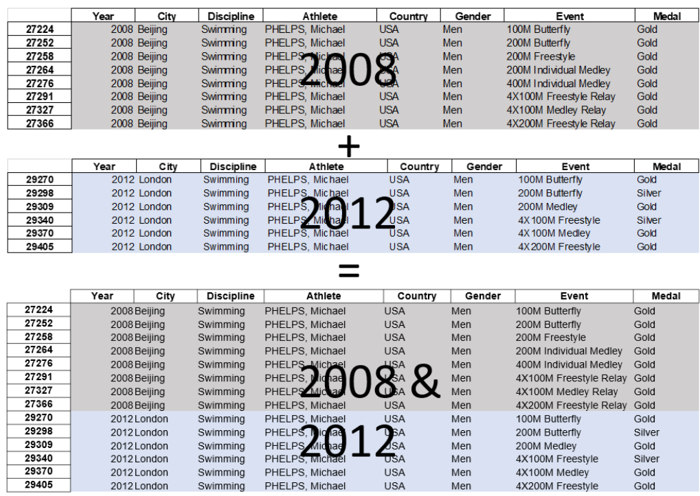
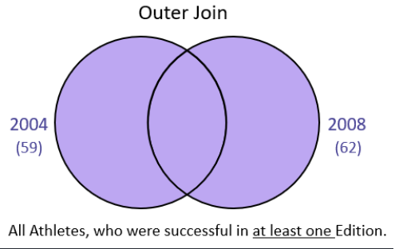
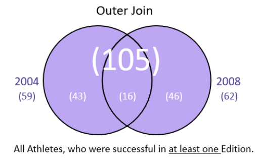
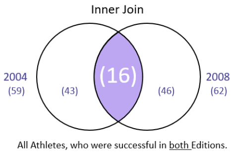
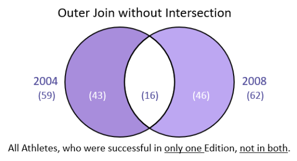
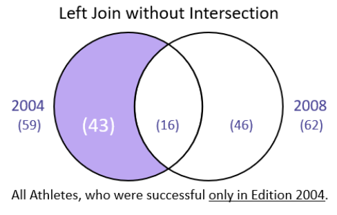
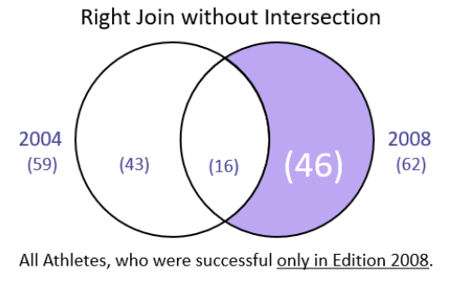
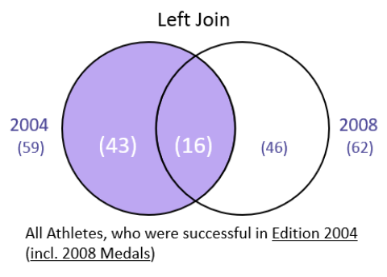

## Merging, Joining and Concatenating DataFrames

### Adding / Concatenating Rows (Part 1)


```python
import pandas as pd
```




```python
men2004 = pd.read_csv("men2004.csv")
```


```python
men2004
```


<div>
<style scoped>
    .dataframe tbody tr th:only-of-type {
        vertical-align: middle;
    }

    .dataframe tbody tr th {
        vertical-align: top;
    }

    .dataframe thead th {
        text-align: right;
    }
</style>
<table border="1" class="dataframe">
  <thead>
    <tr style="text-align: right;">
      <th></th>
      <th>Athlete</th>
      <th>Medals</th>
    </tr>
  </thead>
  <tbody>
    <tr>
      <th>0</th>
      <td>PHELPS, Michael</td>
      <td>8</td>
    </tr>
    <tr>
      <th>1</th>
      <td>THORPE, Ian</td>
      <td>4</td>
    </tr>
    <tr>
      <th>2</th>
      <td>SCHOEMAN, Roland</td>
      <td>3</td>
    </tr>
    <tr>
      <th>3</th>
      <td>PEIRSOL, Aaron</td>
      <td>3</td>
    </tr>
    <tr>
      <th>4</th>
      <td>CROCKER, Ian</td>
      <td>3</td>
    </tr>
    <tr>
      <th>5</th>
      <td>KITAJIMA, Kosuke</td>
      <td>3</td>
    </tr>
    <tr>
      <th>6</th>
      <td>HANSEN, Brendan</td>
      <td>3</td>
    </tr>
    <tr>
      <th>7</th>
      <td>VAN DEN HOOGENBAND, Pieter</td>
      <td>3</td>
    </tr>
    <tr>
      <th>8</th>
      <td>HACKETT, Grant</td>
      <td>3</td>
    </tr>
    <tr>
      <th>9</th>
      <td>MORITA, Tomomi</td>
      <td>2</td>
    </tr>
    <tr>
      <th>10</th>
      <td>LEZAK, Jason</td>
      <td>2</td>
    </tr>
    <tr>
      <th>11</th>
      <td>ROGAN, Markus</td>
      <td>2</td>
    </tr>
    <tr>
      <th>12</th>
      <td>KELLER, Klete</td>
      <td>2</td>
    </tr>
    <tr>
      <th>13</th>
      <td>HALL, Gary Jr.</td>
      <td>2</td>
    </tr>
    <tr>
      <th>14</th>
      <td>LOCHTE, Ryan</td>
      <td>2</td>
    </tr>
    <tr>
      <th>15</th>
      <td>WALKER, Neil</td>
      <td>2</td>
    </tr>
    <tr>
      <th>16</th>
      <td>YAMAMOTO, Takashi</td>
      <td>2</td>
    </tr>
    <tr>
      <th>17</th>
      <td>SPRENGER, Nicholas</td>
      <td>1</td>
    </tr>
    <tr>
      <th>18</th>
      <td>OKUMURA, Yoshihiro</td>
      <td>1</td>
    </tr>
    <tr>
      <th>19</th>
      <td>PARRY, Stephen</td>
      <td>1</td>
    </tr>
    <tr>
      <th>20</th>
      <td>PEARSON, Todd</td>
      <td>1</td>
    </tr>
    <tr>
      <th>21</th>
      <td>ZASTROW, Mitja</td>
      <td>1</td>
    </tr>
    <tr>
      <th>22</th>
      <td>PELLICIARI, Matteo</td>
      <td>1</td>
    </tr>
    <tr>
      <th>23</th>
      <td>WOODWARD, Gabe</td>
      <td>1</td>
    </tr>
    <tr>
      <th>24</th>
      <td>SERDINOV, Andriy</td>
      <td>1</td>
    </tr>
    <tr>
      <th>25</th>
      <td>VENDT, Erik</td>
      <td>1</td>
    </tr>
    <tr>
      <th>26</th>
      <td>ROSOLINO, Massimiliano</td>
      <td>1</td>
    </tr>
    <tr>
      <th>27</th>
      <td>VEENS, Mark Hermanus</td>
      <td>1</td>
    </tr>
    <tr>
      <th>28</th>
      <td>RUPPRATH, Thomas</td>
      <td>1</td>
    </tr>
    <tr>
      <th>29</th>
      <td>VANDERKAAY, Peter</td>
      <td>1</td>
    </tr>
    <tr>
      <th>30</th>
      <td>TOWNSEND, Darian</td>
      <td>1</td>
    </tr>
    <tr>
      <th>31</th>
      <td>STEVENS, Craig</td>
      <td>1</td>
    </tr>
    <tr>
      <th>32</th>
      <td>NEETHLING, Ryk</td>
      <td>1</td>
    </tr>
    <tr>
      <th>33</th>
      <td>BOVELL, George</td>
      <td>1</td>
    </tr>
    <tr>
      <th>34</th>
      <td>MEEUW, Helge</td>
      <td>1</td>
    </tr>
    <tr>
      <th>35</th>
      <td>FLOREA, Razvan Ionut</td>
      <td>1</td>
    </tr>
    <tr>
      <th>36</th>
      <td>CAPPELLAZZO, Federico</td>
      <td>1</td>
    </tr>
    <tr>
      <th>37</th>
      <td>CERCATO, Simone</td>
      <td>1</td>
    </tr>
    <tr>
      <th>38</th>
      <td>CONRAD, Lars</td>
      <td>1</td>
    </tr>
    <tr>
      <th>39</th>
      <td>CSEH, Laszlo</td>
      <td>1</td>
    </tr>
    <tr>
      <th>40</th>
      <td>DAVIES, David</td>
      <td>1</td>
    </tr>
    <tr>
      <th>41</th>
      <td>DRAGANJA, Duje</td>
      <td>1</td>
    </tr>
    <tr>
      <th>42</th>
      <td>DRIESEN, Steffen</td>
      <td>1</td>
    </tr>
    <tr>
      <th>43</th>
      <td>DUBOSCQ, Hugues</td>
      <td>1</td>
    </tr>
    <tr>
      <th>44</th>
      <td>DUSING, Nate</td>
      <td>1</td>
    </tr>
    <tr>
      <th>45</th>
      <td>FERNS, Lyndon</td>
      <td>1</td>
    </tr>
    <tr>
      <th>46</th>
      <td>GANGLOFF, Mark</td>
      <td>1</td>
    </tr>
    <tr>
      <th>47</th>
      <td>MATKOVICH, Antony</td>
      <td>1</td>
    </tr>
    <tr>
      <th>48</th>
      <td>GOLDBLATT, Scott</td>
      <td>1</td>
    </tr>
    <tr>
      <th>49</th>
      <td>GYURTA, Daniel</td>
      <td>1</td>
    </tr>
    <tr>
      <th>50</th>
      <td>JENSEN, Larsen</td>
      <td>1</td>
    </tr>
    <tr>
      <th>51</th>
      <td>KENKHUIS, Johan</td>
      <td>1</td>
    </tr>
    <tr>
      <th>52</th>
      <td>KETCHUM, Dan</td>
      <td>1</td>
    </tr>
    <tr>
      <th>53</th>
      <td>KLIM, Michael</td>
      <td>1</td>
    </tr>
    <tr>
      <th>54</th>
      <td>KRAYZELBURG, Lenny</td>
      <td>1</td>
    </tr>
    <tr>
      <th>55</th>
      <td>KRUPPA, Jens</td>
      <td>1</td>
    </tr>
    <tr>
      <th>56</th>
      <td>BREMBILLA, Emiliano</td>
      <td>1</td>
    </tr>
    <tr>
      <th>57</th>
      <td>MAGNINI, Filippo</td>
      <td>1</td>
    </tr>
    <tr>
      <th>58</th>
      <td>ZWERING, Klaas-Erik</td>
      <td>1</td>
    </tr>
  </tbody>
</table>
</div>


```python
men2008 = pd.read_csv("men2008.csv")
```


```python
men2008
```


```python
men2004.append(men2008, ignore_index= True)
```


```python
men0408 = pd.concat([men2004, men2008], ignore_index=False, keys = [2004, 2008], names = ["Year"])
```


```python
men0408 
```


```python
men0408.reset_index().drop(columns = "level_1")
```


```python

```

### Adding / Concatenating Rows (Part 2)


```python
men2004.head()
```


```python
men2008.head()
```


```python
men2004.columns =["Name", "Medals"]
```


```python
men2004["Success"] = "Yes"
```


```python
men2004
```


```python
pd.concat([men2004, men2008], keys = [2004, 2008], names = ["Year"])
```


```python
men2004.drop(labels = ["Success"], axis = 1, inplace = True)
```


```python
men2004
```


```python
men2008.columns = men2004.columns
```


```python
men2008.head()
```


```python
pd.concat([men2004, men2008], keys = [2004, 2008], names = ["Year"])
```


```python
men2004 = pd.read_csv("men2004.csv", index_col = "Athlete")
men2008 = pd.read_csv("men2008.csv", index_col = "Athlete")
```


```python
men2004.head()
```


```python
men2008.head()
```


```python
pd.concat([men2004, men2008], ignore_index= False, keys = [2004, 2008])
```


```python

```

### Arithmetic between Pandas Objects / Data Alignment


```python
import pandas as pd
```


```python
topfive_2004 = pd.read_csv("topfive_2004.csv", index_col="Athlete")
topfive_2008 = pd.read_csv("topfive_2008.csv", index_col="Athlete")
```


```python
topfive_2004
```


```python
topfive_2008
```


```python
topfive_2004 + topfive_2008
```


```python
topfive_2004.add(topfive_2008, fill_value= 0)
```


```python
topfive_2008.rename(columns = {"bronze":"Bronze"}, inplace = True)
```


```python
topfive_2004.add(topfive_2008, fill_value= 0)
```


```python
topfive_2004.sub(topfive_2008, fill_value= 0)
```


```python

```

### Outer Join


```python
import pandas as pd
```


```python
men2004 = pd.read_csv("men2004.csv")
men2008 = pd.read_csv("men2008.csv")
```


```python
men2004.head()
```


```python
men2004.shape
```


```python
men2008.head()
```


```python
men2008.shape
```




```python
len(men2008) + len(men2004)
```


```python
men2004.merge(men2008, how = "outer", on = "Athlete", suffixes= ("_2004", "_2008"), indicator= True )
```


```python
men0408 = men2004.merge(men2008, how = "outer", on = "Athlete", suffixes= ("_2004", "_2008"), indicator= True )
```


```python
men0408._merge.value_counts()
```




```python

```

### Inner Join


```python
men2004.head()
```


```python
men2008.head()
```




```python
men2004.merge(men2008, how = "inner", on = "Athlete", suffixes= ("_2004", "_2008"), indicator= True )
```


```python

```

### Outer Join without Intersection


```python
men2004.head()
```


```python
men2008.head()
```




```python
men0408= men2004.merge(men2008, how = "outer", on = "Athlete", suffixes= ("_2004", "_2008"), indicator= True )
```


```python
men0408.loc[men0408._merge != "both"]
```


```python

```

### Left Join without Intersection


```python
men2004.head()
```


```python
men2008.head()
```




```python
men0408 = men2004.merge(men2008, how = "outer", on = "Athlete", suffixes= ("_2004", "_2008"), indicator= True )
```


```python
men0408.head()
```


```python
men0408[men0408._merge == "left_only"].shape
```


```python

```

### Right Join without Intersection


```python
men2004.head()
```


```python
men2008.head()
```




```python
men0408 =  men2004.merge(men2008, how = "outer", on = "Athlete", suffixes = ["_2004", "_2008"], indicator = True)
```


```python
men0408[men0408._merge == "right_only"].shape
```


```python

```

### Left Join


```python
men2004.head()
```


```python
men2008.head()
```




```python
men2004.merge(men2008, how = "left", on = "Athlete", suffixes = ["_2004", "_2008"], indicator = True)
```


```python

```

### Right Join


```python
men2004.head()
```


```python
men2008.head()
```


```python
men2004.merge(men2008, how = "right", on = "Athlete", suffixes = ["_2004", "_2008"], indicator = True)
```


```python

```

### Joining on different Column Labels & Indexes


```python
import pandas as pd
```


```python
men2004 = pd.read_csv("men2004.csv")
men2008 = pd.read_csv("men2008.csv")
```


```python
men2004.head()
```


<div>
<style scoped>
    .dataframe tbody tr th:only-of-type {
        vertical-align: middle;
    }

    .dataframe tbody tr th {
        vertical-align: top;
    }

    .dataframe thead th {
        text-align: right;
    }
</style>
<table border="1" class="dataframe">
  <thead>
    <tr style="text-align: right;">
      <th></th>
      <th>Name</th>
      <th>Medals</th>
    </tr>
  </thead>
  <tbody>
    <tr>
      <th>0</th>
      <td>PHELPS, Michael</td>
      <td>8</td>
    </tr>
    <tr>
      <th>1</th>
      <td>THORPE, Ian</td>
      <td>4</td>
    </tr>
    <tr>
      <th>2</th>
      <td>SCHOEMAN, Roland</td>
      <td>3</td>
    </tr>
    <tr>
      <th>3</th>
      <td>PEIRSOL, Aaron</td>
      <td>3</td>
    </tr>
    <tr>
      <th>4</th>
      <td>CROCKER, Ian</td>
      <td>3</td>
    </tr>
  </tbody>
</table>
</div>


```python
men2008.head()
```


<div>
<style scoped>
    .dataframe tbody tr th:only-of-type {
        vertical-align: middle;
    }

    .dataframe tbody tr th {
        vertical-align: top;
    }

    .dataframe thead th {
        text-align: right;
    }
</style>
<table border="1" class="dataframe">
  <thead>
    <tr style="text-align: right;">
      <th></th>
      <th>Athlete</th>
      <th>Medals</th>
    </tr>
  </thead>
  <tbody>
    <tr>
      <th>0</th>
      <td>PHELPS, Michael</td>
      <td>8</td>
    </tr>
    <tr>
      <th>1</th>
      <td>LOCHTE, Ryan</td>
      <td>4</td>
    </tr>
    <tr>
      <th>2</th>
      <td>BERNARD, Alain</td>
      <td>3</td>
    </tr>
    <tr>
      <th>3</th>
      <td>SULLIVAN, Eamon</td>
      <td>3</td>
    </tr>
    <tr>
      <th>4</th>
      <td>LAUTERSTEIN, Andrew</td>
      <td>3</td>
    </tr>
  </tbody>
</table>
</div>


```python
men2004.columns = ["Name", "Medals"]
```


```python
men2004.head()
```


<div>
<style scoped>
    .dataframe tbody tr th:only-of-type {
        vertical-align: middle;
    }

    .dataframe tbody tr th {
        vertical-align: top;
    }

    .dataframe thead th {
        text-align: right;
    }
</style>
<table border="1" class="dataframe">
  <thead>
    <tr style="text-align: right;">
      <th></th>
      <th>Name</th>
      <th>Medals</th>
    </tr>
  </thead>
  <tbody>
    <tr>
      <th>0</th>
      <td>PHELPS, Michael</td>
      <td>8</td>
    </tr>
    <tr>
      <th>1</th>
      <td>THORPE, Ian</td>
      <td>4</td>
    </tr>
    <tr>
      <th>2</th>
      <td>SCHOEMAN, Roland</td>
      <td>3</td>
    </tr>
    <tr>
      <th>3</th>
      <td>PEIRSOL, Aaron</td>
      <td>3</td>
    </tr>
    <tr>
      <th>4</th>
      <td>CROCKER, Ian</td>
      <td>3</td>
    </tr>
  </tbody>
</table>
</div>


```python
men0408 = men2004.merge(men2008, how = "outer", left_on = "Name", right_on = "Athlete",
                      suffixes = ["_2004", "_2008"], indicator = True)
```


```python
men0408
```


<div>
<style scoped>
    .dataframe tbody tr th:only-of-type {
        vertical-align: middle;
    }

    .dataframe tbody tr th {
        vertical-align: top;
    }

    .dataframe thead th {
        text-align: right;
    }
</style>
<table border="1" class="dataframe">
  <thead>
    <tr style="text-align: right;">
      <th></th>
      <th>Name</th>
      <th>Medals_2004</th>
      <th>Medals_2008</th>
    </tr>
  </thead>
  <tbody>
    <tr>
      <th>0</th>
      <td>PHELPS, Michael</td>
      <td>8.0</td>
      <td>8.0</td>
    </tr>
    <tr>
      <th>1</th>
      <td>THORPE, Ian</td>
      <td>4.0</td>
      <td>NaN</td>
    </tr>
    <tr>
      <th>2</th>
      <td>SCHOEMAN, Roland</td>
      <td>3.0</td>
      <td>NaN</td>
    </tr>
    <tr>
      <th>3</th>
      <td>PEIRSOL, Aaron</td>
      <td>3.0</td>
      <td>3.0</td>
    </tr>
    <tr>
      <th>4</th>
      <td>CROCKER, Ian</td>
      <td>3.0</td>
      <td>1.0</td>
    </tr>
    <tr>
      <th>...</th>
      <td>...</td>
      <td>...</td>
      <td>...</td>
    </tr>
    <tr>
      <th>100</th>
      <td>LAGUNOV, Evgeniy</td>
      <td>NaN</td>
      <td>1.0</td>
    </tr>
    <tr>
      <th>101</th>
      <td>BERENS, Ricky</td>
      <td>NaN</td>
      <td>1.0</td>
    </tr>
    <tr>
      <th>102</th>
      <td>LURZ, Thomas</td>
      <td>NaN</td>
      <td>1.0</td>
    </tr>
    <tr>
      <th>103</th>
      <td>MALLET, Gregory</td>
      <td>NaN</td>
      <td>1.0</td>
    </tr>
    <tr>
      <th>104</th>
      <td>ZHANG, Lin</td>
      <td>NaN</td>
      <td>1.0</td>
    </tr>
  </tbody>
</table>
<p>105 rows × 3 columns</p>
</div>


```python
men0408.Name.fillna(men0408.Athlete, inplace = True)
```


```python
men0408.drop(["Athlete", "_merge"], axis = 1, inplace = True)
```


```python
men2004.head()
```


<div>
<style scoped>
    .dataframe tbody tr th:only-of-type {
        vertical-align: middle;
    }

    .dataframe tbody tr th {
        vertical-align: top;
    }

    .dataframe thead th {
        text-align: right;
    }
</style>
<table border="1" class="dataframe">
  <thead>
    <tr style="text-align: right;">
      <th></th>
      <th>Name</th>
      <th>Medals</th>
    </tr>
  </thead>
  <tbody>
    <tr>
      <th>0</th>
      <td>PHELPS, Michael</td>
      <td>8</td>
    </tr>
    <tr>
      <th>1</th>
      <td>THORPE, Ian</td>
      <td>4</td>
    </tr>
    <tr>
      <th>2</th>
      <td>SCHOEMAN, Roland</td>
      <td>3</td>
    </tr>
    <tr>
      <th>3</th>
      <td>PEIRSOL, Aaron</td>
      <td>3</td>
    </tr>
    <tr>
      <th>4</th>
      <td>CROCKER, Ian</td>
      <td>3</td>
    </tr>
  </tbody>
</table>
</div>


```python
men2008.set_index("Athlete", inplace = True)
```


```python
men2008.head()
```


```python
men2004.merge(men2008, how = "outer", left_on= "Name", right_index = True,
              suffixes = ["_2004", "_2008"], indicator = True)
```


<div>
<style scoped>
    .dataframe tbody tr th:only-of-type {
        vertical-align: middle;
    }

    .dataframe tbody tr th {
        vertical-align: top;
    }

    .dataframe thead th {
        text-align: right;
    }
</style>
<table border="1" class="dataframe">
  <thead>
    <tr style="text-align: right;">
      <th></th>
      <th>Name</th>
      <th>Medals_2004</th>
      <th>Medals_2008</th>
      <th>_merge</th>
    </tr>
  </thead>
  <tbody>
    <tr>
      <th>0.0</th>
      <td>PHELPS, Michael</td>
      <td>8.0</td>
      <td>8.0</td>
      <td>both</td>
    </tr>
    <tr>
      <th>1.0</th>
      <td>THORPE, Ian</td>
      <td>4.0</td>
      <td>NaN</td>
      <td>left_only</td>
    </tr>
    <tr>
      <th>2.0</th>
      <td>SCHOEMAN, Roland</td>
      <td>3.0</td>
      <td>NaN</td>
      <td>left_only</td>
    </tr>
    <tr>
      <th>3.0</th>
      <td>PEIRSOL, Aaron</td>
      <td>3.0</td>
      <td>3.0</td>
      <td>both</td>
    </tr>
    <tr>
      <th>4.0</th>
      <td>CROCKER, Ian</td>
      <td>3.0</td>
      <td>1.0</td>
      <td>both</td>
    </tr>
    <tr>
      <th>...</th>
      <td>...</td>
      <td>...</td>
      <td>...</td>
      <td>...</td>
    </tr>
    <tr>
      <th>NaN</th>
      <td>LAGUNOV, Evgeniy</td>
      <td>NaN</td>
      <td>1.0</td>
      <td>right_only</td>
    </tr>
    <tr>
      <th>NaN</th>
      <td>BERENS, Ricky</td>
      <td>NaN</td>
      <td>1.0</td>
      <td>right_only</td>
    </tr>
    <tr>
      <th>NaN</th>
      <td>LURZ, Thomas</td>
      <td>NaN</td>
      <td>1.0</td>
      <td>right_only</td>
    </tr>
    <tr>
      <th>NaN</th>
      <td>MALLET, Gregory</td>
      <td>NaN</td>
      <td>1.0</td>
      <td>right_only</td>
    </tr>
    <tr>
      <th>NaN</th>
      <td>ZHANG, Lin</td>
      <td>NaN</td>
      <td>1.0</td>
      <td>right_only</td>
    </tr>
  </tbody>
</table>
<p>105 rows × 4 columns</p>
</div>


```python

```

### Joining on many Columns


```python
import pandas as pd
```


```python
men2004_det = pd.read_csv("men2004_det.csv")
men2008_det = pd.read_csv("men2008_det.csv")
```


```python
men2004_det.head(10)
```


```python
men2008_det.head(10)
```


```python
men2004_det.loc[men2004_det.Athlete == "PHELPS, Michael"]
```


```python
men2008_det.loc[men2008_det.Athlete == "PHELPS, Michael"]
```


```python
men0408 = men2004_det.merge(men2008_det, how = "inner", on = ["Athlete", "Medal"], suffixes= ("_2004", "_2008"))
```


```python
men0408.loc[men0408.Athlete == "PHELPS, Michael"]
```


```python

```

### pd.merge and join()


```python
import pandas as pd
```


```python
men2004 = pd.read_csv("men2004.csv", index_col = "Athlete")
men2008 = pd.read_csv("men2008.csv", index_col = "Athlete")
```


```python
men2004.head()
```


```python
men2008.head()
```


```python
men2004.merge(men2008, how = "outer", on = "Athlete", suffixes= ("_2004", "_2008"), indicator= True)
```


```python
pd.merge(men2004, men2008, how ="outer", on = "Athlete", suffixes= ("_2004", "_2008"), indicator= True )
```


```python
men2004.join(men2008, how = "outer", lsuffix = "_2004", rsuffix = "_2008")
```


```python

```
