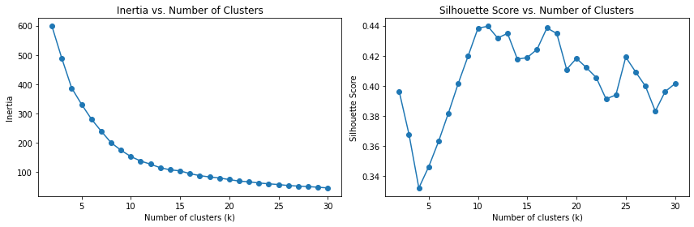
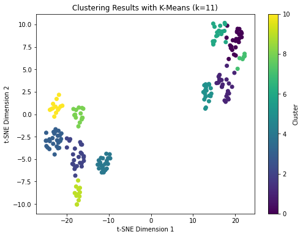
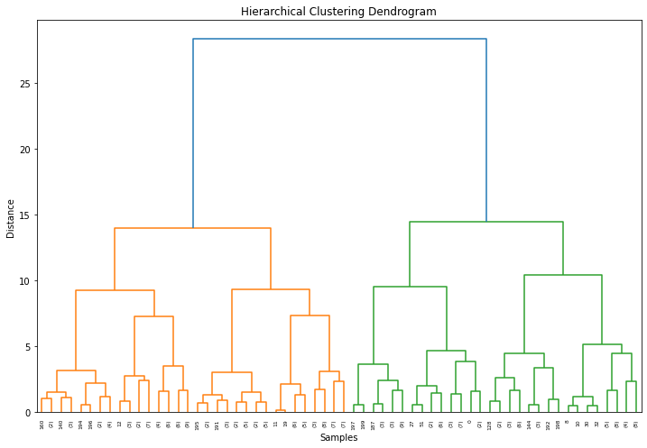
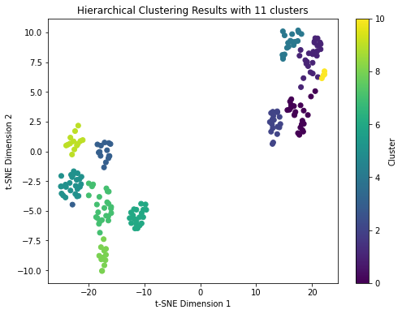
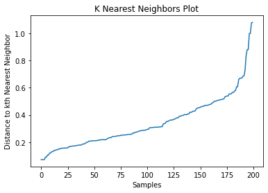
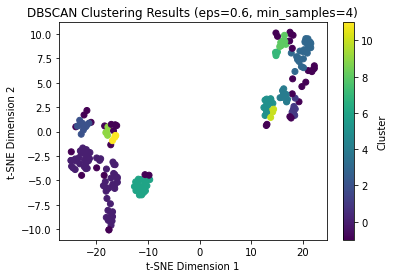

# Clustering

Clustering is an unsupervised machine learning technique that involves grouping similar data points together based on their characteristics or patterns. The goal is to find inherent structures or relationships within the data without any prior knowledge or labels.

We use clustering for various reasons and in different scenarios:

1. Exploratory Data Analysis: Clustering helps in understanding the underlying structure of the data, identifying patterns, and gaining insights into the relationships among data points.

2. Pattern Recognition: Clustering is useful for detecting patterns or groups that may not be easily identifiable through manual inspection. It helps to uncover hidden structures in the data.

3. Data Compression: Clustering can be used to reduce the dimensionality of data by grouping similar points together. It helps in summarizing and representing large datasets in a more compact form.

4. Anomaly Detection: Clustering can identify unusual or abnormal data points that do not conform to the expected patterns. These anomalies may represent outliers or potentially interesting observations.

5. Customer Segmentation: Clustering plays a vital role in market segmentation by dividing customers into distinct groups based on their behavior, preferences, or demographics. This information can be used for targeted marketing strategies and personalized recommendations.

6. Image and Object Recognition: Clustering is employed in computer vision tasks, such as image segmentation and object recognition, where it helps to group similar pixels or objects together.

7. Document Clustering: In text mining and natural language processing, clustering assists in organizing documents into groups based on their topics or similarities. It aids in information retrieval, topic modeling, and document organization.

8. Recommendation Systems: Clustering is used to group similar items or users together in recommendation systems. It helps in suggesting relevant products, services, or content based on user preferences and behavior.

9. Social Network Analysis: Clustering is employed in social network analysis to identify communities or groups of individuals with similar interests or connections.

These are just a few examples of the diverse applications of clustering. The choice to use clustering depends on the specific problem, the nature of the data, and the objectives of the analysis.

As mentioned before, clustering is an unsupervised machine learning technique; but what is unsupervised learning? Supervised and unsupervised learning are two primary categories of machine learning approaches, and their differences can be understood in the context of clustering:

- Goal: In supervised learning, the goal is to learn a mapping function that can predict the output or label of new, unseen data based on a given set of input features. The learning is guided by labeled examples, where the correct outputs are provided. In unsupervised learning, the goal is to discover patterns, structures, or relationships in the data without any explicit guidance or labeled examples.

- Training Data: In supervised learning, the training data consists of input features along with their corresponding labels. The model is trained to minimize the discrepancy between predicted and actual labels. In clustering, which is an unsupervised learning technique, the training data only contains input features without any labels or target variables. The focus is on finding inherent structures or groupings in the data solely based on the input features.

- Output: In supervised learning, the output is a predictive model that can be used to make predictions on new, unseen data. The model aims to generalize the patterns observed in the training data to make accurate predictions on unseen data points. In clustering, the output is the identified clusters or groups of similar data points. The goal is to assign data points to clusters based on their similarities or proximity to each other.

- Evaluation: Supervised learning models are typically evaluated based on metrics such as accuracy, precision, recall, or F1-score, which measure the model's ability to correctly predict the labels of unseen data points. In clustering, evaluation is more challenging because there are no ground truth labels. Instead, clustering algorithms are evaluated using internal measures (e.g., silhouette score, cohesion, separation) or external measures (e.g., Rand index, adjusted mutual information) that assess the quality of the cluster assignments and the coherence within clusters.

- Application: Supervised learning is often used in tasks where the goal is to classify, predict, or estimate a specific target variable. Examples include image classification, sentiment analysis, spam detection, or predicting house prices. Unsupervised learning, specifically clustering, is useful in exploratory data analysis, data summarization, anomaly detection, customer segmentation, and identifying patterns or structures in the absence of labeled data.

In the context of clustering, the main difference between supervised and unsupervised learning lies in the availability of labeled data and the objective of the learning process. Supervised learning focuses on prediction and classification tasks with labeled data, while unsupervised learning, such as clustering, aims to uncover underlying structures or groupings in the data without any explicit guidance or labels.

## K-Means

K-means is a popular clustering algorithm that aims to partition a dataset into K distinct clusters, where each data point belongs to the cluster with the nearest mean or centroid. Here's a detailed explanation of the K-means algorithm:

1. Initialization:
    - Specify the number of clusters K.
    - Initialize K cluster centroids randomly or by using a specific initialization method (e.g., K-means++, random sampling).

2. Assign Data Points to Clusters:
    - Calculate the distance between each data point and the centroids using a distance metric such as Euclidean distance.
    - Assign each data point to the cluster with the nearest centroid.

3. Update Cluster Centroids:
    - Recalculate the centroid of each cluster by taking the mean of all the data points assigned to that cluster.
    - The centroid represents the center of the cluster.

4. Repeat Steps 2 and 3:
    - Iterate Steps 2 and 3 until convergence criteria are met. Convergence can be achieved when there is no significant change in cluster assignments or the centroids.

5. Output:
    - The final output of the K-means algorithm is a set of K cluster centroids and the cluster assignments for each data point.

### Key Points and Considerations:

- Choice of K: The selection of the appropriate number of clusters K is important. It can be determined based on domain knowledge, trial and error, or using techniques such as the elbow method or silhouette analysis to find the optimal K value.
- Initialization: The initial positions of the centroids can influence the final clustering result. Random initialization may lead to different outcomes in each run, so multiple runs with different initializations are often performed.
- Convergence: K-means is an iterative algorithm, and it converges when there is no significant change in cluster assignments or centroids. It does not guarantee global optimization and may converge to local optima.
- Scaling: It is recommended to scale the features before applying K-means to avoid bias towards features with larger scales.
- Handling Outliers: K-means can be sensitive to outliers since it is based on distance calculations. Outliers can significantly affect the centroid positions and the resulting clusters.
- Robustness: K-means is sensitive to the initial configuration and may produce different results for different runs. Using K-means++ initialization can help mitigate this issue.
- Post-Processing: After clustering, it is important to interpret and analyze the clusters. This may involve examining cluster characteristics, evaluating cluster quality using evaluation metrics, visualizing the clusters, and extracting insights from the data.

Overall, K-means is a simple and widely used clustering algorithm that efficiently partitions data into clusters based on similarity. It is computationally efficient and can handle large datasets. However, it has some limitations, such as sensitivity to initialization and the requirement to specify the number of clusters in advance.

### Hands-on
The Mall Customer Segmentation Dataset is a dataset that contains information about customers of a mall. It includes features such as customer ID, age, gender, annual income, and spending score. The spending score is a value assigned to each customer based on their purchasing behavior and is used to evaluate their spending habits.

To find the best value of k for the k-means algorithm, we can plot the inertia and silhouette score for different values of k. The inertia represents the sum of squared distances of samples to their closest cluster center, and a lower inertia indicates better clustering. The silhouette score measures how close each sample in one cluster is to samples in neighboring clusters, with values ranging from -1 to 1. Higher silhouette scores indicate better-defined clusters.

Here's an outline of the steps to perform k-means clustering on the Mall Customer Segmentation Dataset:

1. Load the dataset: Import the necessary libraries and load the Mall Customer Segmentation Dataset.

2. Preprocess the data: Extract the relevant features from the dataset and perform any necessary preprocessing, such as handling missing values or scaling the features.

3. Plot inertia and silhouette score: Iterate over different values of k and compute the inertia and silhouette score for each k. Plot the inertia and silhouette score as functions of k to identify the optimal value.

4. Determine the optimal k: Analyze the inertia and silhouette score plots to select the best value of k that balances compactness and separation of clusters.

5. Perform k-means clustering: Use the optimal k value obtained in the previous step to perform k-means clustering on the dataset.

6. Reduce dimension using t-SNE: Apply t-SNE (t-Distributed Stochastic Neighbor Embedding) to reduce the dimensionality of the dataset to 2 or 3 dimensions. This allows us to visualize the clusters in a plot.

7. Visualize the clusters: Plot the data points in the reduced space, color-coded by their assigned cluster labels. This will provide a visual representation of the clustering results.


```python
import pandas as pd
import numpy as np
import matplotlib.pyplot as plt
from sklearn.cluster import KMeans
from sklearn.preprocessing import StandardScaler
from sklearn.metrics import silhouette_score
from sklearn.manifold import TSNE
import warnings
warnings.filterwarnings("ignore")
```


```python
# Step 1: Load the dataset
data = pd.read_csv('mall_customers.csv')

# Step 2: Preprocess the data
X = data[['Gender', 'Age', 'Annual Income (k$)', 'Spending Score (1-100)']]
# One-hot encode the 'Gender' feature
X_encoded = pd.get_dummies(X, columns=['Gender'])
X_encoded.head()
```


<div>
<style scoped>
    .dataframe tbody tr th:only-of-type {
        vertical-align: middle;
    }

    .dataframe tbody tr th {
        vertical-align: top;
    }

    .dataframe thead th {
        text-align: right;
    }
</style>
<table border="1" class="dataframe">
  <thead>
    <tr style="text-align: right;">
      <th></th>
      <th>Age</th>
      <th>Annual Income (k$)</th>
      <th>Spending Score (1-100)</th>
      <th>Gender_Female</th>
      <th>Gender_Male</th>
    </tr>
  </thead>
  <tbody>
    <tr>
      <th>0</th>
      <td>19</td>
      <td>15</td>
      <td>39</td>
      <td>0</td>
      <td>1</td>
    </tr>
    <tr>
      <th>1</th>
      <td>21</td>
      <td>15</td>
      <td>81</td>
      <td>0</td>
      <td>1</td>
    </tr>
    <tr>
      <th>2</th>
      <td>20</td>
      <td>16</td>
      <td>6</td>
      <td>1</td>
      <td>0</td>
    </tr>
    <tr>
      <th>3</th>
      <td>23</td>
      <td>16</td>
      <td>77</td>
      <td>1</td>
      <td>0</td>
    </tr>
    <tr>
      <th>4</th>
      <td>31</td>
      <td>17</td>
      <td>40</td>
      <td>1</td>
      <td>0</td>
    </tr>
  </tbody>
</table>
</div>


```python
X_scaled = StandardScaler().fit_transform(X_encoded)

# Step 3: Plot inertia and silhouette score
inertia = []
silhouette_scores = []
k_values = range(2, 31)  # Test values of k from 2 to 10

for k in k_values:
    kmeans = KMeans(n_clusters=k, random_state=42)
    kmeans.fit(X_scaled)
    inertia.append(kmeans.inertia_)
    silhouette_scores.append(silhouette_score(X_scaled, kmeans.labels_))

# Plotting inertia and silhouette score
plt.figure(figsize=(12, 4))
plt.subplot(1, 2, 1)
plt.plot(k_values, inertia, marker='o')
plt.xlabel('Number of clusters (k)')
plt.ylabel('Inertia')
plt.title('Inertia vs. Number of Clusters')

plt.subplot(1, 2, 2)
plt.plot(k_values, silhouette_scores, marker='o')
plt.xlabel('Number of clusters (k)')
plt.ylabel('Silhouette Score')
plt.title('Silhouette Score vs. Number of Clusters')

plt.tight_layout()
plt.show()
```


    

    


```python
# Step 4: Determine the optimal k
optimal_k = 11  # Select the value of k based on the plots

# Step 5: Perform k-means clustering
kmeans = KMeans(n_clusters=optimal_k, random_state=42)
kmeans.fit(X_scaled)
```


<style>#sk-container-id-3 {color: black;background-color: white;}#sk-container-id-3 pre{padding: 0;}#sk-container-id-3 div.sk-toggleable {background-color: white;}#sk-container-id-3 label.sk-toggleable__label {cursor: pointer;display: block;width: 100%;margin-bottom: 0;padding: 0.3em;box-sizing: border-box;text-align: center;}#sk-container-id-3 label.sk-toggleable__label-arrow:before {content: "▸";float: left;margin-right: 0.25em;color: #696969;}#sk-container-id-3 label.sk-toggleable__label-arrow:hover:before {color: black;}#sk-container-id-3 div.sk-estimator:hover label.sk-toggleable__label-arrow:before {color: black;}#sk-container-id-3 div.sk-toggleable__content {max-height: 0;max-width: 0;overflow: hidden;text-align: left;background-color: #f0f8ff;}#sk-container-id-3 div.sk-toggleable__content pre {margin: 0.2em;color: black;border-radius: 0.25em;background-color: #f0f8ff;}#sk-container-id-3 input.sk-toggleable__control:checked~div.sk-toggleable__content {max-height: 200px;max-width: 100%;overflow: auto;}#sk-container-id-3 input.sk-toggleable__control:checked~label.sk-toggleable__label-arrow:before {content: "▾";}#sk-container-id-3 div.sk-estimator input.sk-toggleable__control:checked~label.sk-toggleable__label {background-color: #d4ebff;}#sk-container-id-3 div.sk-label input.sk-toggleable__control:checked~label.sk-toggleable__label {background-color: #d4ebff;}#sk-container-id-3 input.sk-hidden--visually {border: 0;clip: rect(1px 1px 1px 1px);clip: rect(1px, 1px, 1px, 1px);height: 1px;margin: -1px;overflow: hidden;padding: 0;position: absolute;width: 1px;}#sk-container-id-3 div.sk-estimator {font-family: monospace;background-color: #f0f8ff;border: 1px dotted black;border-radius: 0.25em;box-sizing: border-box;margin-bottom: 0.5em;}#sk-container-id-3 div.sk-estimator:hover {background-color: #d4ebff;}#sk-container-id-3 div.sk-parallel-item::after {content: "";width: 100%;border-bottom: 1px solid gray;flex-grow: 1;}#sk-container-id-3 div.sk-label:hover label.sk-toggleable__label {background-color: #d4ebff;}#sk-container-id-3 div.sk-serial::before {content: "";position: absolute;border-left: 1px solid gray;box-sizing: border-box;top: 0;bottom: 0;left: 50%;z-index: 0;}#sk-container-id-3 div.sk-serial {display: flex;flex-direction: column;align-items: center;background-color: white;padding-right: 0.2em;padding-left: 0.2em;position: relative;}#sk-container-id-3 div.sk-item {position: relative;z-index: 1;}#sk-container-id-3 div.sk-parallel {display: flex;align-items: stretch;justify-content: center;background-color: white;position: relative;}#sk-container-id-3 div.sk-item::before, #sk-container-id-3 div.sk-parallel-item::before {content: "";position: absolute;border-left: 1px solid gray;box-sizing: border-box;top: 0;bottom: 0;left: 50%;z-index: -1;}#sk-container-id-3 div.sk-parallel-item {display: flex;flex-direction: column;z-index: 1;position: relative;background-color: white;}#sk-container-id-3 div.sk-parallel-item:first-child::after {align-self: flex-end;width: 50%;}#sk-container-id-3 div.sk-parallel-item:last-child::after {align-self: flex-start;width: 50%;}#sk-container-id-3 div.sk-parallel-item:only-child::after {width: 0;}#sk-container-id-3 div.sk-dashed-wrapped {border: 1px dashed gray;margin: 0 0.4em 0.5em 0.4em;box-sizing: border-box;padding-bottom: 0.4em;background-color: white;}#sk-container-id-3 div.sk-label label {font-family: monospace;font-weight: bold;display: inline-block;line-height: 1.2em;}#sk-container-id-3 div.sk-label-container {text-align: center;}#sk-container-id-3 div.sk-container {/* jupyter's `normalize.less` sets `[hidden] { display: none; }` but bootstrap.min.css set `[hidden] { display: none !important; }` so we also need the `!important` here to be able to override the default hidden behavior on the sphinx rendered scikit-learn.org. See: https://github.com/scikit-learn/scikit-learn/issues/21755 */display: inline-block !important;position: relative;}#sk-container-id-3 div.sk-text-repr-fallback {display: none;}</style><div id="sk-container-id-3" class="sk-top-container"><div class="sk-text-repr-fallback"><pre>KMeans(n_clusters=11, random_state=42)</pre><b>In a Jupyter environment, please rerun this cell to show the HTML representation or trust the notebook. <br />On GitHub, the HTML representation is unable to render, please try loading this page with nbviewer.org.</b></div><div class="sk-container" hidden><div class="sk-item"><div class="sk-estimator sk-toggleable"><input class="sk-toggleable__control sk-hidden--visually" id="sk-estimator-id-3" type="checkbox" checked><label for="sk-estimator-id-3" class="sk-toggleable__label sk-toggleable__label-arrow">KMeans</label><div class="sk-toggleable__content"><pre>KMeans(n_clusters=11, random_state=42)</pre></div></div></div></div></div>


```python
# Step 6: Reduce dimension using t-SNE
tsne = TSNE(n_components=2, random_state=42)
X_tsne = tsne.fit_transform(X_scaled)
```


```python
# Step 7: Visualize the clusters
plt.figure(figsize=(8, 6))
plt.scatter(X_tsne[:, 0], X_tsne[:, 1], c=kmeans.labels_, cmap='viridis')
plt.xlabel('t-SNE Dimension 1')
plt.ylabel('t-SNE Dimension 2')
plt.title('Clustering Results with K-Means (k={})'.format(optimal_k))
plt.colorbar(label='Cluster')
plt.show()
```


    

    


## Hierarchical Clustering
Hierarchical clustering is a clustering algorithm that aims to create a hierarchy of clusters. It starts by considering each data point as an individual cluster and gradually merges similar clusters together until a stopping criterion is met. The result is a tree-like structure called a dendrogram, which illustrates the nested relationships between clusters.

There are two main types of hierarchical clustering:

- Agglomerative Clustering: It starts by considering each data point as an individual cluster and then iteratively merges the two closest clusters until a single cluster remains. At each iteration, the algorithm computes a proximity matrix that measures the similarity or dissimilarity between clusters and uses it to decide which clusters to merge. Common proximity measures include Euclidean distance, Manhattan distance, or correlation coefficients. Agglomerative clustering can be visualized using a dendrogram, where the height of each node represents the dissimilarity between the merged clusters.

- Divisive Clustering: It takes the opposite approach of agglomerative clustering. It starts with all data points in a single cluster and recursively divides the clusters into smaller subclusters until each data point is assigned to its own cluster. Divisive clustering is less commonly used than agglomerative clustering due to its computational complexity.

Here's a step-by-step overview of how agglomerative clustering works:

- Calculate the proximity matrix: Compute a proximity matrix that measures the similarity or dissimilarity between each pair of data points. The choice of proximity measure depends on the nature of the data and the problem at hand.

- Create individual clusters: Treat each data point as an individual cluster.

- Merge closest clusters: Identify the two closest clusters based on the proximity matrix and merge them into a single cluster. Update the proximity matrix to reflect the new distances between the merged cluster and the remaining clusters.

- Update proximity matrix: Recompute the proximity matrix to reflect the dissimilarity between the merged cluster and the remaining clusters. There are different linkage criteria that determine how the proximity between clusters is calculated, such as single linkage, complete linkage, or average linkage.

- Repeat steps 3 and 4: Iteratively merge the two closest clusters and update the proximity matrix until a stopping criterion is met. The stopping criterion can be a predetermined number of clusters or a specific threshold for dissimilarity.

- Generate dendrogram: Create a dendrogram to visualize the hierarchy of clusters. The height at which two clusters are merged in the dendrogram represents their dissimilarity.

Hierarchical clustering has several advantages, including its ability to handle different shapes and sizes of clusters, its interpretability through the dendrogram, and its ability to provide a full hierarchy of clusters. However, it can be computationally expensive for large datasets and may be sensitive to noise and outliers.

In practice, hierarchical clustering can be applied to a wide range of domains and applications, including customer segmentation, image analysis, bioinformatics, and social network analysis. It offers a flexible and intuitive approach to cluster analysis, allowing for the exploration of hierarchical relationships within the data.


```python
from sklearn.cluster import AgglomerativeClustering
from scipy.cluster.hierarchy import dendrogram, linkage
import seaborn as sns

# Step 3: Perform hierarchical clustering
n_clusters = 11  # Specify the desired number of clusters
clustering = AgglomerativeClustering(n_clusters=n_clusters)
labels = clustering.fit_predict(X_scaled)


# Step 4: Calculate silhouette score
silhouette = silhouette_score(X_scaled, labels)
print("Silhouette Score:", silhouette)

# Step 5: Calculate linkage matrix and plot dendrogram
linkage_matrix = linkage(X_scaled, method='ward')
plt.figure(figsize=(12, 8))
dendrogram(linkage_matrix, truncate_mode='level', p=5)
plt.title('Hierarchical Clustering Dendrogram')
plt.xlabel('Samples')
plt.ylabel('Distance')
plt.show()
```

    Silhouette Score: 0.4355066737947972
    


    

    


```python
# Step 6: Reduce dimension using t-SNE
tsne = TSNE(n_components=2, random_state=42)
X_tsne = tsne.fit_transform(X_scaled)

# Step 7: Visualize the clustering
plt.figure(figsize=(8, 6))
plt.scatter(X_tsne[:, 0], X_tsne[:, 1], c=labels, cmap='viridis')
plt.xlabel('t-SNE Dimension 1')
plt.ylabel('t-SNE Dimension 2')
plt.title('Hierarchical Clustering Results with {} clusters'.format(n_clusters))
plt.colorbar(label='Cluster')
plt.show()
```


    

    


## DBSCAN
DBSCAN (Density-Based Spatial Clustering of Applications with Noise) is a density-based clustering algorithm commonly used in machine learning and data mining. Unlike k-means or hierarchical clustering, DBSCAN does not require specifying the number of clusters in advance. Instead, it identifies dense regions in the data based on a set of parameters.

Here's how DBSCAN works:

1. Density-Based: DBSCAN groups data points based on their density. It defines a dense region as an area with a sufficient number of nearby data points.

2. Core Points: In DBSCAN, a core point is a data point that has at least a specified minimum number of neighbors within a specified radius (defined by the epsilon parameter). These core points are the starting points for forming clusters.

3.  Directly Density-Reachable: Two points are said to be directly density-reachable if they are within each other's epsilon neighborhood (i.e., distance <= epsilon).

4.  Density-Connected: Two points are said to be density-connected if there exists a chain of directly density-reachable points between them.

The algorithm proceeds as follows:

1.  Select a random unvisited data point.
2.  If the point is a core point, start a new cluster and add all directly density-reachable points to the cluster.
3.  Repeat the process for each newly added point, recursively expanding the cluster until no more density-reachable points are found.
4.  If the point is not a core point but is within the epsilon neighborhood of another cluster, assign it to that cluster.
5.  Repeat steps 1-4 until all data points have been visited.

The main advantages of DBSCAN are:

- Flexibility in handling clusters of arbitrary shape.
- Ability to discover noise points or outliers as they are not assigned to any cluster.
- No need to specify the number of clusters in advance.

However, DBSCAN also has some limitations:

- It can be sensitive to the choice of parameters, especially epsilon and the minimum number of points.
- It may struggle with clusters of significantly different densities.
- Performance can be affected by the dimensionality of the data.

To use DBSCAN, you need to specify two main parameters:

- Epsilon (eps): It defines the maximum distance between two points to be considered neighbors.
- Minimum points (min_samples): It specifies the minimum number of points required to form a dense region.

By adjusting these parameters, you can control the granularity and quality of the clustering results.

Overall, DBSCAN is a powerful algorithm for discovering clusters in dense regions of data, especially when the number of clusters is unknown or when dealing with complex data structures. It is widely used in various fields, including anomaly detection, customer segmentation, image analysis, and more.

Finding the best parameters for epsilon (eps) and minimum points (min_samples) in DBSCAN can be done using the following approaches:

- Domain Knowledge: If you have prior knowledge about the data and the expected characteristics of the clusters, you can make an educated guess for the values of eps and min_samples. For example, if you know that the clusters are relatively dense and compact, you can choose a smaller eps and a larger min_samples value. On the other hand, if the clusters are expected to be more spread out, you can increase eps and decrease min_samples.

- Grid Search: You can perform a grid search over a range of values for eps and min_samples to find the combination that yields the best clustering performance. Define a grid of parameter values, such as a range of epsilon values and a range of minimum points values. Then, evaluate the clustering results using a performance metric like silhouette score or Davies-Bouldin index for each combination of parameters. Select the parameter values that maximize the chosen metric.

- Visual Inspection: Plot the clustering results for different combinations of eps and min_samples values and visually inspect the clusters. This can give you an intuitive understanding of how the clusters are formed and help you identify the parameter values that produce meaningful and well-separated clusters.

- Elbow Method: Use the elbow method to determine a suitable value for eps. Plot the distance to the kth nearest neighbor for each data point, sorted in ascending order. Look for a significant bend or elbow in the plot, which indicates the optimal eps value where the rate of change in distance decreases significantly. The corresponding min_samples value can be determined based on the characteristics of the clusters.

- Silhouette Score: Calculate the silhouette score for different combinations of eps and min_samples values. The silhouette score measures how well each data point fits within its own cluster compared to other clusters. Higher silhouette scores indicate better-defined clusters. Choose the parameter values that maximize the silhouette score.

It's important to note that the optimal parameter values for DBSCAN can vary depending on the dataset and the specific clustering task. It may require some experimentation and evaluation to find the best parameter values for your particular case.


```python
from sklearn.neighbors import NearestNeighbors
from sklearn.cluster import DBSCAN

# Find the optimal value for eps using k nearest neighbors plot
k = 4  # Specify the value of k for nearest neighbors
nn = NearestNeighbors(n_neighbors=k)
nn.fit(X_scaled)
distances, _ = nn.kneighbors(X_scaled)
distances = np.sort(distances, axis=0)
distances = distances[:, 1]  # Consider the distances to the nearest neighbors (excluding the sample itself)
plt.plot(distances)
plt.xlabel('Samples')
plt.ylabel('Distance to kth Nearest Neighbor')
plt.title('K Nearest Neighbors Plot')
plt.show()
```


    

    


```python
eps = 0.6  # Select the value for eps based on the plot
min_samples = 4  # Select the value for min_samples based on the data and problem domain

# Step 5: Perform DBSCAN clustering
clustering = DBSCAN(eps=eps, min_samples=min_samples)
labels = clustering.fit_predict(X_scaled)

# Step 6: Calculate silhouette score
silhouette_avg = silhouette_score(X_scaled, labels)
print("Silhouette Score:", silhouette_avg)
```

    Silhouette Score: 0.1709027485553639
    


```python
# Step 7: Reduce dimension using t-SNE
tsne = TSNE(n_components=2, random_state=42)
X_tsne = tsne.fit_transform(X_scaled)

# Step 8: Visualize the clustering
plt.scatter(X_tsne[:, 0], X_tsne[:, 1], c=labels, cmap='viridis')
plt.xlabel('t-SNE Dimension 1')
plt.ylabel('t-SNE Dimension 2')
plt.title('DBSCAN Clustering Results (eps={}, min_samples={})'.format(eps, min_samples))
plt.colorbar(label='Cluster')
plt.show()
```


    

    


### Other clustering algorithms

- Gaussian Mixture Models (GMM): GMM is a probabilistic model that assumes data points are generated from a mixture of Gaussian distributions. It allows for more flexible cluster shapes and assigns probabilities of data points belonging to each cluster. GMM is useful when dealing with data that may not have well-defined boundaries between clusters.

- OPTICS (Ordering Points To Identify the Clustering Structure): OPTICS is another density-based clustering algorithm that extends DBSCAN. It creates a reachability plot, which represents the density-based connectivity of data points. OPTICS allows for flexible parameter settings, such as the minimum number of points in a cluster and the maximum distance between points.

- Mean Shift: Mean Shift is a non-parametric clustering algorithm that aims to find the modes or peaks of a density estimation function. It starts with a set of initial points and iteratively moves them towards areas of higher density until convergence. Mean Shift can discover clusters of arbitrary shapes and sizes.

- Spectral Clustering: Spectral Clustering is a graph-based clustering algorithm that leverages the eigenvalues and eigenvectors of a similarity matrix to find clusters. It treats the data points as nodes in a graph and uses the graph's Laplacian matrix to partition the data. Spectral Clustering is particularly effective in identifying non-linear structures and can handle data with complex relationships.

### Notes on performing clustering
#### pre-processing and feature scailing
Preprocessing and feature scaling play a crucial role in clustering algorithms. Preprocessing involves preparing the data before applying clustering algorithms, and feature scaling specifically deals with scaling the features to ensure that they are on a similar scale.

Proper preprocessing and feature scaling are essential for several reasons. Firstly, clustering algorithms are sensitive to the scale and distribution of features. If the features have different scales, the clustering algorithm may assign more importance to features with larger values, leading to biased results. By scaling the features, we ensure that each feature contributes equally to the clustering process.

Secondly, preprocessing helps in handling missing values, outliers, and irrelevant features. Missing values can introduce biases in clustering, and preprocessing techniques such as imputation can help address them. Outliers can significantly impact the cluster assignments and clustering boundaries. Preprocessing methods such as outlier detection and removal can improve the robustness of clustering results. Additionally, irrelevant features that do not contribute to the clustering structure can be identified and removed during preprocessing, simplifying the analysis and enhancing clustering performance.

Moreover, preprocessing can involve transforming variables to meet certain assumptions, such as normality, which can benefit certain clustering algorithms. It can also include encoding categorical variables, handling skewed distributions, or reducing dimensionality through techniques like feature selection or extraction. These steps can improve the efficiency and accuracy of clustering algorithms.

#### Dimensionality Reduction
Dimensionality reduction plays a crucial role in clustering by addressing the curse of dimensionality and improving the effectiveness and efficiency of clustering algorithms. The curse of dimensionality refers to the challenges that arise when dealing with high-dimensional data, such as increased computational complexity, sparsity of data, and difficulty in visualizing and interpreting the results. Dimensionality reduction techniques aim to reduce the number of features or variables while retaining the most relevant information.

One important aspect of dimensionality reduction is that it helps to eliminate redundant and irrelevant features. High-dimensional data often contains features that are highly correlated or provide little discriminatory power. These features can lead to noise, overfitting, and reduced clustering performance. By reducing the dimensionality, we focus on the most informative features, which can lead to improved clustering results and better understanding of the underlying data structure.

Furthermore, dimensionality reduction can alleviate computational and storage challenges associated with high-dimensional data. Clustering algorithms operate more efficiently on lower-dimensional spaces, reducing the computational complexity and memory requirements. This enables faster clustering analysis and facilitates the exploration of larger datasets.

Dimensionality reduction also aids in visualizing and interpreting clustering results. By reducing the data to two or three dimensions, it becomes easier to visualize the clusters and gain insights into the relationships and patterns within the data. This visualization can provide a better understanding of the cluster boundaries, separability, and overall structure, enabling more effective decision-making based on the clustering results.

