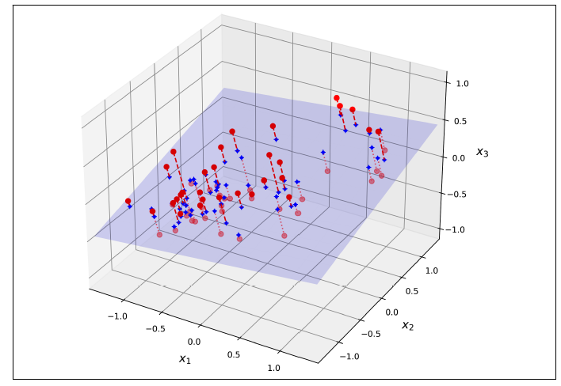
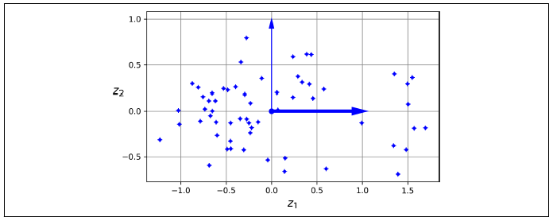
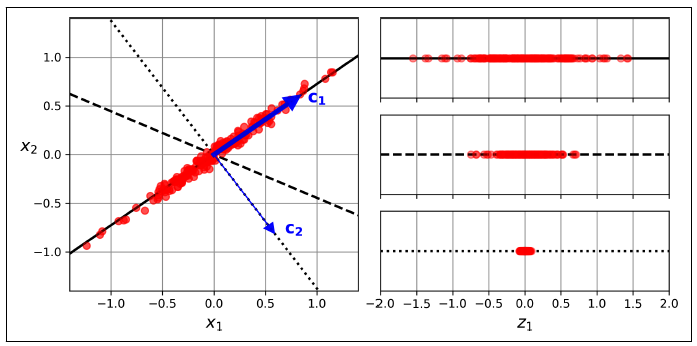

# Dimensionality Reduction

Dimensionality reduction is a fundamental technique in data analysis and machine learning that aims to simplify complex datasets by reducing the number of variables or features while preserving their essential information. By extracting the most meaningful and representative features, dimensionality reduction methods enhance computational efficiency, mitigate the curse of dimensionality, and improve model performance. Through the process of dimensionality reduction, high-dimensional data can be visualized, interpreted, and analyzed more effectively, enabling better insights and decision-making.

## The Curse of Dimensionality

The Curse of Dimensionality refers to the challenges and limitations that arise when working with high-dimensional data. As the number of variables or features increases, the available data becomes increasingly sparse, making it difficult to find meaningful patterns or relationships. In high-dimensional spaces, distances between data points become less informative, and the amount of data required to obtain reliable statistical estimates grows exponentially. This phenomenon leads to increased computational complexity, overfitting, and reduced generalization performance of machine learning models. The Curse of Dimensionality underscores the importance of dimensionality reduction techniques to mitigate these issues and extract meaningful information from high-dimensional data.

## Main Approaches for Dimensionality Reduction

### Projection

In real-world problems, training data is often not evenly distributed across all dimensions. Some features may be nearly constant, while others may be highly correlated. This creates a lower-dimensional subspace within the higher-dimensional space where all training instances are concentrated. To illustrate, imagine a 3D dataset where all instances lie close to a 2D plane, Figure 1. By projecting each instance onto this plane, we can effectively reduce the dataset's dimensionality from 3D to 2D, represented by new features z1 and z2, Figure 2.



Figure 1. A 3D dataset lying close to a 2D subspace



Figure 2. The new 2D dataset after projection

### Manifold Learning

Manifold learning aims to uncover the underlying structure or manifold in high-dimensional data. It assumes that the data lies on or near a lower-dimensional manifold embedded within the higher-dimensional space. By mapping the data from the high-dimensional space to a lower-dimensional space, manifold learning algorithms aim to preserve the essential geometric relationships and structures of the data. This allows for better visualization, interpretation, and analysis of complex datasets. Manifold learning methods, such as t-SNE and Isomap, have proven effective in revealing hidden patterns and clusters in data that are not easily discernible in the original high-dimensional space.

## Principal component analysis (PCA)

PCA is widely regarded as the most popular method for dimensionality reduction. It begins by identifying the hyperplane that is positioned closest to the data and subsequently projects the data onto this hyperplane.

### Preserving the Variance

In order to project the training set onto a lower-dimensional hyperplane, it is crucial to choose the appropriate hyperplane. By considering a 2D dataset and different axes (1D hyperplanes), the projection results demonstrate varying levels of preserved variance, Figure 3. The solid line projection retains the maximum variance, the dotted line projection preserves minimal variance, and the dashed line projection maintains an intermediate amount of variance. Selecting the axis that preserves the highest variance is reasonable, as it minimizes information loss compared to other projections. This choice can also be justified by minimizing the mean squared distance between the original dataset and its projection. This simple concept forms the basis of Principal Component Analysis (PCA).



Figure 3. Selecting the subspace on which to project

### Principal Components

PCA identifies the primary axis that captures the most variance in the training set. It then discovers a second orthogonal axis that explains the largest remaining variance. This process continues for higher-dimensional datasets, where PCA identifies additional axes, known as principal components (PCs). In Figure 3, the solid line represents the first PC, while the dotted line represents the second PC. Each PC corresponds to an axis along which specific vectors (c1, c2) lie.

### How can you find the principal components of a training set?

There is a widely used matrix factorization method called singular value decomposition (SVD) exists, which can break down the training set matrix $$X$$ into the product of three matrices: $$U \Sigma V^T$$. Among these matrices, $$V$$ contains the unit vectors that represent the principal components sought in the analysis.

### Projecting Down to d Dimensions


After identifying the principal components, dimensionality reduction can be achieved by projecting the dataset onto the hyperplane defined by the selected principal components. This projection aims to preserve maximum variance. To obtain a reduced dataset $$X_{d\text{-proj}}$$ of dimensionality $$d$$, the training set matrix $$X$$ is multiplied by the matrix $$W_d$$, which contains the first d columns of $$V$$. This operation is represented as $$X_{d\text{-proj}} = XW_d$$

### PCA Implementation from scratch using numpy


```python
import numpy as np

def PCA(X, n_components):
    # Center the data
    X_centered = X - np.mean(X, axis=0)

    # Perform SVD
    U, Sigma, Vt = np.linalg.svd(X_centered)

    # Select the top k eigenvectors (principal components)
    principal_components = Vt[:n_components].T

    # Project the data onto the principal components
    X_pca = np.dot(X_centered, principal_components)

    # Return the transformed data and the principal components
    return X_pca, principal_components
```

### Using Scikit-Learn


```python
from sklearn.decomposition import PCA
from sklearn.datasets import make_blobs

# Create a random dataset
X, y = make_blobs(n_samples=1000, n_features=10, centers=3, random_state=42)

# Instantiate PCA with desired number of components
n_components = 2
pca = PCA(n_components=n_components)

# Fit and transform the data
X_pca = pca.fit_transform(X)

# Access the explained variance ratio
explained_variance_ratio = pca.explained_variance_ratio_

# Print the results
print(f"Original shape: {X.shape}")
print(f"Reduced shape: {X_pca.shape}")
print(f"Explained variance ratio: {explained_variance_ratio}")
```

    Original shape: (1000, 10)
    Reduced shape: (1000, 2)
    Explained variance ratio: [0.74942445 0.2138575 ]
    

An additional valuable information is the explained variance ratio associated with each principal component, which can be accessed through the variable `explained_variance_ratio_`. This ratio represents the proportion of the dataset's variance captured by each principal component.

Rather than randomly selecting the desired number of dimensions for dimensionality reduction, a simpler approach is to choose the number of dimensions that collectively explain a significant portion of the variance, such as 95%.


```python
pca = PCA(n_components=0.95)
X_reduced = pca.fit_transform(X)
print(f"Number of components: {pca.n_components_}")
```

    Number of components: 2
    

## Variants of PCA

### Randomized PCA


When the `svd_solver` hyperparameter is set to "randomized" in Scikit-Learn, it employs a stochastic algorithm known as randomized PCA. This algorithm efficiently approximates the first d principal components. Its computational complexity is $$O(m × d^2) + O(d^3)$$, which is significantly faster than the full SVD approach with a complexity of $$O(m × n^2) + O(n^3)$$, particularly when d is much smaller than n.


```python
rnd_pca = PCA(n_components=5, svd_solver="randomized", random_state=42)
X_reduced = rnd_pca.fit_transform(X)
```

### Incremental PCA

Incremental PCA (IPCA) is a variant of Principal Component Analysis (PCA) that is designed to handle large datasets that may not fit entirely into memory. It overcomes the memory limitations of standard PCA by processing the data in mini-batches or chunks rather than requiring the entire dataset to be present at once.

The IPCA algorithm performs PCA in an incremental manner by sequentially processing subsets of the dataset. It updates the principal components incrementally as new data batches are introduced, allowing for efficient memory usage. This makes it suitable for online or streaming scenarios where new data arrives continuously.

Scikit-learn provides an implementation of Incremental PCA `sklearn.decomposition.IncrementalPCA` that you can use to apply IPCA to your datasets.

## Other Dimensionality Reduction Techniques

`sklearn.manifold.MDS`

Multidimensional scaling (MDS) reduces dimensionality while trying to preserve the distances between the instances. Random projection does that for highdimensional data, but it doesn’t work well on low-dimensional data.

`sklearn.manifold.Isomap`

Isomap constructs a graph by establishing connections between neighboring instances, and then performs dimensionality reduction while aiming to maintain the geodesic distances between the instances. Geodesic distance refers to the shortest path, in terms of the number of nodes, between two connected nodes in the graph.

`sklearn.manifold.TSNE`


t-SNE, which stands for t-distributed stochastic neighbor embedding, is a dimensionality reduction technique that aims to maintain the proximity of similar instances and separate dissimilar instances. It is commonly employed for data visualization purposes, specifically to visualize clusters of instances within high-dimensional spaces.

`sklearn.discriminant_analysis.LinearDiscriminantAnalysis`

Linear discriminant analysis (LDA) is a linear classification algorithm that identifies the most distinguishing directions between classes during training. These directions are used to define a hyperplane onto which the data can be projected. The advantage of LDA is that the projection maximizes the separation between classes, making it a valuable dimensionality reduction technique prior to applying another classification algorithm (unless LDA alone is suitable).

## References
- Hands-On Machine Learning with Scikit-Learn, Keras, and TensorFlow, 3rd Edition

