# Probability

Probability is a branch of mathematics that deals with the study of random events and the likelihood of their occurrence. Random variables are variables that take on a range of values and their outcomes cannot be determined with certainty. The concept of probability is essential in many areas of science, engineering, and finance, and is widely used in machine learning and data analysis. In this notebook, important formulas and rules related to probability and random variables are listed for the purpose of preparation for an exam. These formulas and rules provide a solid foundation for understanding the underlying concepts and principles in these fields and will be useful for solving problems and making decisions in real-world situations.

**Experiment**: Any process or procedure for which more than one outcome is possible. 

**Sample Space** $$S$$: All the possible outcomes. 

**Probability** $$P(x_i)$$ meet the requirement: $$0\leq p_i\leq 1, i=1, 2, \dots, n$$ and $$p_1 + p_2 + \dots + p_n = 1$$.

**Event** $$A$$: An event is a subset of the sample space. The probability of an event is obtained by the probabilities of the outcomes contained within the event.

$$P(A) = \sum P(x), x\in A$$

**Complements of envents** $$A'$$: Everything in the sample space not contained within event. 

$$P(A)+P(A')=1$$

**Elementary event**: An event only contains one individual outcome. 

**Intersection** $$A\cap B$$: Outcomes within both events $$A$$ and $$B$$.

**Union** $$A\cup B$$: Outcomes within event $$A$$ or event $$B$$.

$$A\cap (B\cap C) = (A\cap B)\cap C$$

$$P(A\cup B) = P(A) + P(B) - P(A\cap B)$$

$$P(A\cup B) = P(A\cap B') + P(A'\cap B) + P(A\cap B)$$

$$(A\cup B)' = A' \cap B'$$

$$(A\cap B)' = A' \cup B'$$

$$(A\cup B\cup C) = A + B + C - (A\cap B) - (B\cap C) - (C\cap A) + (A\cap B\cap C)$$

**Intersection** $$A\cap B$$: Outcomes within both events $$A$$ and $$B$$.

**Union** $$A\cup B$$: Outcomes within event $$A$$ or event $$B$$.

$$A\cap (B\cap C) = (A\cap B)\cap C$$

$$P(A\cup B) = P(A) + P(B) - P(A\cap B)$$

$$P(A\cup B) = P(A\cap B') + P(A'\cap B) + P(A\cap B)$$

$$(A\cup B)' = A' \cap B'$$

$$(A\cap B)' = A' \cup B'$$

$$(A\cup B\cup C) = A + B + C - (A\cap B) - (B\cap C) - (C\cap A) + (A\cap B\cap C)$$

$$P(A|B) = \frac{P(A\cap B)}{P(B)}, P(B)>0$$

$$P(A|B) = \frac{P(A\cap B)}{P(B)} \Longrightarrow P(A\cap B) = P(B)P(A|B)$$

$$P(A|B\cap C) = \frac{P(A\cap B\cap C)}{P(B\cap C)} \Longrightarrow P(A\cap B\cap C) = P(B\cap C)P(A|B\cap C)$$

$$P(A_1 \cap \dots \cap A_n) = P(A_1)P(A_1|A_2)P(A_3|A_1\cap A_2)\dots P(A_n|A_1\cap \dots \cap A_{n-1})$$

**Independent**: One event's occur would not affect another event. 

$$P(A|B) = P(A)$$

$$P(B|A) = P(B)$$

$$P(A\cap B) = P(A)P(B)$$

If an event $$B$$ is contained within a sample space $$A$$, then we have:

$$P(B) = \sum_{i=1}^{n}P(A_i)P(B | A_i)$$

The Bayes' Theorem:

$$P(A_i|B) = \frac{P(A_i)P(B|A_i)}{\sum_{j=1}^{n}P(A_j)P(B|A_j)}$$

# Random Variables

**Random variable** $$X: S\to R$$, from sample spcae to real line (as the domian of probability function).

**Probability functions** $$P(x): R\to [0, 1]$$, from real line to the value of probabiliy. 

Discrete random variables
- Probability Mass Function (**p.m.f.**)
- Cumulative Distribution Function (**c.d.f.**)
- Expectation $$E(X) = \sum_i p_ix_i$$

Continous random variables
- Probability Density Function (p.d.f.)
- Cumulative Distribution Function (c.d.f.)
- Expectation $$E(X) = \int_{-\infty}^{\infty}xf(x)dx$$

Variance of random variables

$$Var(X) = E(X-E(X))^2 = E(X^2) - E(X)^2$$


```python
# Calculate the variance for discrete variables

# Input
x = [1, 2, 3, 4, 5]
p = [0.2, 0.2, 0.2, 0.2, 0.2]

# Cal
exp = 0
exp2 = 0
for i, j in zip(x, p):
    exp += i * j
    exp2 += i * i * j
var = exp2 - exp ** 2

# Output
print('Variance: {:.4f}'.format(var))
print('Standard Variance: {:.4f}'.format(var ** (1/2)))
```

    Variance: 2.0000
    Standard Variance: 1.4142
    

Quantiles of Random Variables
- Upper quartile $$Q_3$$: c.d.f. = 0.75
- Lower quartile $$Q_1$$: c.d.f. = 0.25
- Interquartile range $$IQR$$: $$Q_3 - Q_1$$

$$Cov(X, Y) = E(XY) - E(X)E(Y)$$

$$Corr(X, Y) = \frac{Cov(X, Y)}{\sqrt{Var(X)Var(Y)}}$$


```python
import numpy as np


# Calculate the Covarance for discrete

# Input [X * Y]
value_x = np.array([0, 1, 2, 3])
value_y = np.array([0, 1, 2, 3])
prob_matrix = np.array([[1/16, 1/16, 0, 0], [1/16, 3/16, 2/16, 0], [0, 2/16, 3/16, 1/16], [0, 0, 1/16, 1/16]])

# Cal expectation of x
exp_x =  0
for i in range(len(value_x)):
    exp_x += value_x[i] * np.sum(prob_matrix, axis=1)[i]

# Cal expectation of y
exp_y = 0
for i in range(len(value_y)):
    exp_y += value_y[i] * np.sum(prob_matrix, axis=0)[i]
    
# Cal variance of x
exp_x2 = 0
for i in range(len(value_x)):
    exp_x2 += (value_x[i] ** 2) * np.sum(prob_matrix, axis=1)[i]
var_x = exp_x2 - (exp_x ** 2)

# Cal variance of y
exp_y2 = 0
for i in range(len(value_y)):
    exp_y2 += (value_y[i] ** 2) * np.sum(prob_matrix, axis=0)[i]
var_y = exp_y2 - (exp_y ** 2)

# Cal covarance
exp_xy = 0
for i in range(len(value_x)):
    for j in range(len(value_y)):
        exp_xy += value_x[i] * value_y[j] * prob_matrix[i, j]
cov = exp_xy - exp_x * exp_y

## Cal correlation
corr = cov / ((var_x * var_y) ** (1/2))
        
# Output
print('EXP X\t {:.4f}\nEXP Y\t {:.4f}\nVAR X\t {:.4f}\nVAR Y\t \
{:.4f}\nCOV\t {:.4f}\nCORR\t {:.4f}'.format(exp_x, exp_y, var_x, var_y, cov, corr))
```

    EXP X	 1.5000
    EXP Y	 1.5000
    VAR X	 0.7500
    VAR Y	 0.7500
    COV	 0.5000
    CORR	 0.6667
    

$$E(aX+b) = aE(X) + b$$

$$E(X_1+X_2) = E(X_1) + E(X_2)$$

$$E(\bar{X}) = E(X)$$

$$Var(aX+b) = a^2Var(X)$$

$$Var(X_1+X_2) = Var(X_1) + Var(X_2) + 2Cov(X_1, X_2)$$

$$Var(\bar{X}) = \frac{\sigma^2}{n}$$

# Distributions

Probability distributions are a fundamental concept in statistics and machine learning. They describe the behavior of random variables and the likelihood of different outcomes. Understanding these distributions is important for making informed decisions, drawing inferences, and developing predictive models. There are several commonly used probability distributions, including normal, exponential, Poisson, and beta distributions, among others. It is not necessary to memorize these distributions, but it is helpful to have a basic understanding of their properties and uses. This information can serve as a reference and provide a better understanding of the assumptions and limitations of various models.

## 1. Normal Distribution or Gaussian Distribution:
The normal distribution is a continuous probability distribution that is symmetric about its mean. It is characterized by its mean (μ) and standard deviation (σ). The probability density function of the normal distribution is given by:

$$ 
f(x) = \frac{1}{\sigma \sqrt{2\pi}} e^{-\frac{(x-\mu)^2}{2\sigma^2}}
$$

It is used in many areas of machine learning, such as linear regression, image processing, and natural language processing.


```python
import matplotlib.pyplot as plt
import numpy as np
import scipy.stats as stats

mu = 0
sigma = 1
x = np.linspace(-5, 5, 100)
y = stats.norm.pdf(x, mu, sigma)
plt.plot(x, y)
plt.title("Normal Distribution (μ=0, σ=1)")
plt.show()
```


    
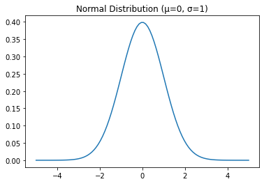
    


```python
import numpy as np
import matplotlib.pyplot as plt

# Define the mean and standard deviation of the distributions
mean1, mean2, mean3 = 0, 1, 2
std1, std2, std3 = 1, 0.5, 1.5

# Generate the x axis data
x = np.linspace(-5, 5, 100)

# Calculate the y axis data for each distribution
y1 = 1 / (std1 * np.sqrt(2 * np.pi)) * np.exp(-(x - mean1)**2 / (2 * std1**2))
y2 = 1 / (std2 * np.sqrt(2 * np.pi)) * np.exp(-(x - mean2)**2 / (2 * std2**2))
y3 = 1 / (std3 * np.sqrt(2 * np.pi)) * np.exp(-(x - mean3)**2 / (2 * std3**2))

# Plot the distributions
plt.plot(x, y1, label=f'Mean={mean1}, Std={std1}')
plt.plot(x, y2, label=f'Mean={mean2}, Std={std2}')
plt.plot(x, y3, label=f'Mean={mean3}, Std={std3}')

# Add a legend and labels
plt.legend()
plt.xlabel('x')
plt.ylabel('Probability Density')

# Show the plot
plt.show()

```


    
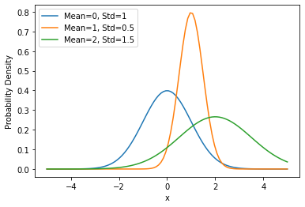
    


```python
import matplotlib.pyplot as plt
import numpy as np
import scipy.stats as stats

# Define the mean and standard deviation of the normal distribution
mean = 0
stddev = 1

# Generate x values for the normal distribution
x = np.linspace(mean - 4*stddev, mean + 4*stddev, 1000)

# Compute the corresponding probabilities for each x value
y = stats.norm.pdf(x, mean, stddev)

# Plot the normal distribution
plt.plot(x, y)

# Define the interval of interest
lower_bound = -1
upper_bound = 1

# Plot the interval of interest
plt.fill_between(x, y, where=(x > lower_bound) & (x < upper_bound), color='red', alpha=0.5)

# Compute the probability of the interval
prob = stats.norm.cdf(upper_bound, mean, stddev) - stats.norm.cdf(lower_bound, mean, stddev)

# Annotate the plot with the interval and its probability
plt.annotate(f"Interval: ({lower_bound}, {upper_bound})", xy=(0.1, 0.9), xycoords='axes fraction', fontsize=12)
plt.annotate(f"Probability: {prob:.2f}", xy=(0.1, 0.8), xycoords='axes fraction', fontsize=12)

# Show the plot
plt.show()

```


    
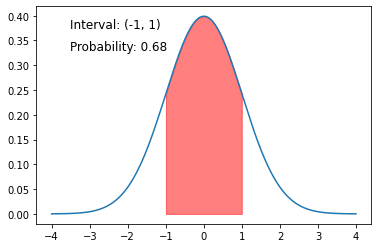
    


## 2. Bernoulli Distribution:
The Bernoulli distribution is a discrete distribution that models binary outcomes, such as success or failure. It is characterized by a single parameter p, which is the probability of success. The probability mass function of the Bernoulli distribution is given by:

$$ 
f(x) = p^x (1-p)^{1-x}
$$

It is used in many areas of machine learning, such as logistic regression, recommendation systems, and deep learning.


```python
import matplotlib.pyplot as plt
import numpy as np
import scipy.stats as stats

p = 0.5
x = [0, 1]
y = [1 - p, p]
plt.bar(x, y)
plt.title("Bernoulli Distribution (p=0.5)")
plt.show()
```


    
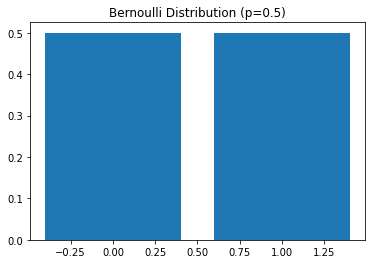
    


## 3. Binomial Distribution:
The Binomial distribution is a discrete distribution that models the number of successes in a fixed number of Bernoulli trials. It is characterized by two parameters: n, the number of trials, and p, the probability of success in each trial. The probability mass function of the Binomial distribution is given by:

$$ 
f(x) = \binom{n}{x} p^x (1-p)^{n-x}
$$

It is used in many areas of machine learning, such as logistic regression, recommendation systems, and deep learning.


```python
import matplotlib.pyplot as plt
import numpy as np
import scipy.stats as stats

n = 10
p = 0.5
x = np.arange(0, n+1)
y = stats.binom.pmf(x, n, p)
plt.bar(x, y)
plt.title("Binomial Distribution (n=10, p=0.5)")
plt.show()

```


    
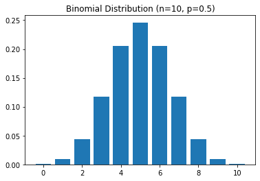
    


## 4. Uniform Distribution:
The uniform distribution is a continuous distribution that models data that is evenly distributed over a range. It is characterized by two parameters: a, the lower bound of the range, and b, the upper bound of the range. The probability density function of the uniform distribution is given by:

$$
f(x) = \begin{cases}
\frac{1}{b-a} & \text{if } a \le x \le b \\
0 & \text{otherwise}
\end{cases}
$$

It is used in many areas of machine learning, such as hypothesis testing and random number generation.


```python
import matplotlib.pyplot as plt
import numpy as np
import scipy.stats as stats

a = 0
b = 1
x = np.linspace(a, b, 100)
y = stats.uniform.pdf(x, a, b-a)
plt.plot(x, y)
plt.title("Uniform Distribution (a=0, b=1)")
plt.show()
```


    
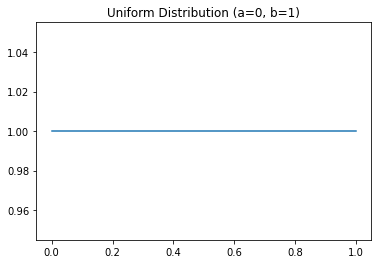
    


## 5. Log-Normal Distribution:
The log-normal distribution is a continuous distribution that models data that is log-normally distributed. It is characterized by two parameters: mean (μ) and standard deviation (σ). The probability density function of the log-normal distribution is given by:

$$
f(x) = \frac{1}{x \sigma \sqrt{2 \pi}} e^{-\frac{(\ln x - \mu)^2}{2 \sigma^2}}
$$

It is used in many areas of machine learning, such as hypothesis testing and modeling data with heavy tails.


```python
import matplotlib.pyplot as plt
import numpy as np
import scipy.stats as stats

mu = 0
sigma = 1
x = np.linspace(0, 5, 100)
y = stats.lognorm.pdf(x, s=sigma, scale=np.exp(mu))
plt.plot(x, y)
plt.title("Log-Normal Distribution (μ=0, σ=1)")
plt.show()

```


    
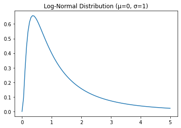
    


## 6. Exponential Distribution:
The exponential distribution is a continuous distribution that models the time between events in a Poisson process. It is characterized by a single parameter λ, which is the rate at which events occur. The probability density function of the exponential distribution is given by:

$$
f(x) = \lambda e^{-\lambda x}
$$

It is used in many areas of machine learning, such as hypothesis testing and survival analysis.


```python
import matplotlib.pyplot as plt
import numpy as np
import scipy.stats as stats

lambd = 1
x = np.linspace(0, 5, 100)
y = stats.expon.pdf(x, scale=1/lambd)
plt.plot(x, y)
plt.title("Exponential Distribution (λ=1)")
plt.show()
```


    
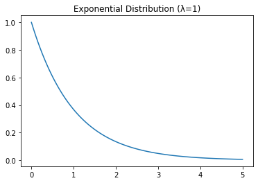
    


## 7. Gamma Distribution:
The gamma distribution is a continuous distribution that models the time between events in a Poisson process with an arrival rate that changes over time. It is characterized by two parameters: shape (α) and scale (β). The probability density function of the gamma distribution is given by:

$$
f(x) = \frac{x^{\alpha - 1} e^{-x/\beta}}{\beta^\alpha \Gamma(\alpha)}
$$

where Γ is the gamma function. It is used in many areas of machine learning, such as hypothesis testing and survival analysis.


```python
import matplotlib.pyplot as plt
import numpy as np
import scipy.stats as stats

alpha = 2
beta = 2
x = np.linspace(0, 10, 100)
y = stats.gamma.pdf(x, alpha, scale=beta)
plt.plot(x, y)
plt.title("Gamma Distribution (α=2, β=2)")
plt.show()
```


    
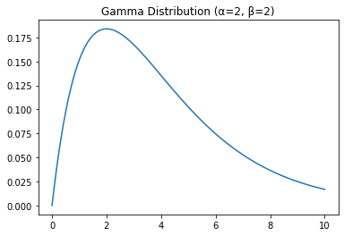
    


## 8. Chi-Squared Distribution:
The chi-squared distribution is a continuous distribution that models the sum of the squares of k independent standard normal random variables. It is characterized by a single parameter: degrees of freedom (k). The probability density function of the chi-squared distribution is given by:

$$
f(x) = \frac{x^{\frac{\nu}{2} - 1} e^{-\frac{x}{2}}} {2^{\frac{\nu}{2}} \Gamma(\frac{\nu}{2})}
$$

where Γ is the gamma function. It is used in many areas of machine learning, such as hypothesis testing and goodness-of-fit testing.


```python
import matplotlib.pyplot as plt
import numpy as np
import scipy.stats as stats

k = 2
x = np.linspace(0, 5, 100)
y = stats.chi2.pdf(x, k)
plt.plot(x, y)
plt.title("Chi-Squared Distribution (k=2)")
plt.show()
```


    
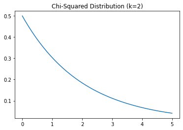
    


## 9. Student's t-Distribution:
The Student's t-distribution is a continuous distribution that models the distribution of the ratio of the mean of a normally distributed random sample and its standard deviation, where the sample size is small. It is characterized by a single parameter: degrees of freedom (k). The probability density function of the Student's t-distribution is given by:

$$
f(x) = \frac{\Gamma(\frac{\nu + 1}{2})} {\sqrt{\nu \pi} \Gamma(\frac{\nu}{2})} \left( 1 + \frac{x^2}{\nu} \right)^{-\frac{\nu + 1}{2}}
$$

It is used in many areas of machine learning, such as hypothesis testing and estimation with small sample sizes.


```python
import matplotlib.pyplot as plt
import numpy as np
import scipy.stats as stats

k = 2
x = np.linspace(-5, 5, 100)
y = stats.t.pdf(x, k)
plt.plot(x, y)
plt.title("Student's t-Distribution (k=2)")
plt.show()

```


    
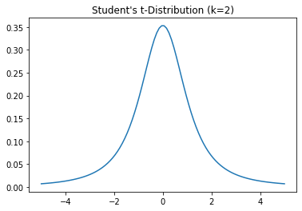
    


## 10. F-Distribution:
The F-distribution is a continuous distribution that models the ratio of two chi-squared distributions. It is characterized by two parameters: degrees of freedom in the numerator (k1) and degrees of freedom in the denominator (k2). The probability density function of the F-distribution is given by:

$$
f(x) = \frac{\left(\frac{v_1}{v_2}\right)^{\frac{v_1}{2}} x^{\frac{v_1}{2} - 1}}{\left( 1 + \frac{v_1}{v_2} x \right)^{\frac{v_1 + v_2}{2}}} \frac{\Gamma\left(\frac{v_1 + v_2}{2}\right)}{\Gamma\left(\frac{v_1}{2}\right) \Gamma\left(\frac{v_2}{2}\right)}
$$

It is used in many areas of machine learning, such as hypothesis testing and goodness-of-fit testing.


```python
import matplotlib.pyplot as plt
import numpy as np
import scipy.stats as stats

k1 = 2
k2 = 5
x = np.linspace(0, 5, 100)
y = stats.f.pdf(x, k1, k2)
plt.plot(x, y)
plt.title("F-Distribution (k1=2, k2=5)")
plt.show()
```


    
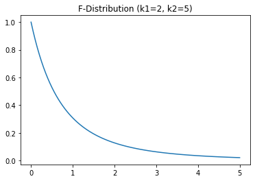
    


## 11. Beta Distribution:
The beta distribution is a continuous distribution that models the probability of a random variable in the interval (0,1). It is characterized by two parameters: shape parameters (α, β). The probability density function of the beta distribution is given by:

$$
f(x) = x^{\alpha - 1} (1 - x)^{\beta - 1} \frac{\Gamma(\alpha + \beta)}{\Gamma(\alpha) \Gamma(\beta)}
$$

where B(α, β) is the beta function. It is used in many areas of machine learning, such as Bayesian inference and modeling of random variables with limited support.


```python
import matplotlib.pyplot as plt
import numpy as np
import scipy.stats as stats

alpha = 2
beta = 5
x = np.linspace(0, 1, 100)
y = stats.beta.pdf(x, alpha, beta)
plt.plot(x, y)
plt.title("Beta Distribution (α=2, β=5)")
plt.show()
```


    
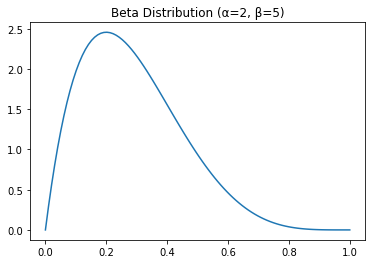
    


## 12. Poisson Distribution:
The Poisson distribution is a discrete distribution that models the number of events in a fixed interval of time or space, where the average number of events is known. It is characterized by a single parameter: the average number of events per interval (λ). The probability mass function of the Poisson distribution is given by:

$$
f(k) = \frac{e^{-\lambda} \lambda^k}{k!}
$$

It is used in many areas of machine learning, such as modeling count data and calculating the probability of a certain number of events occurring.


```python
import matplotlib.pyplot as plt
import numpy as np
import scipy.stats as stats

lambd = 2
k = np.arange(0, 20)
pmf = stats.poisson.pmf(k, lambd)
plt.vlines(k, 0, pmf, colors='r', linewidth=2)
plt.plot(k, pmf, 'ro', markersize=8)
plt.title("Poisson Distribution (λ=2)")
plt.show()
```


    
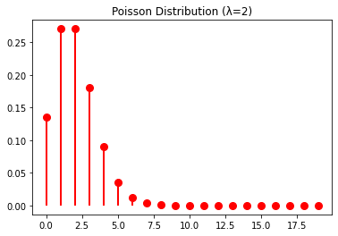
    


# Refrences
- https://github.com/Probability-Statistics-Jupyter-Notebook/probability-statistics-notebook
